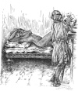
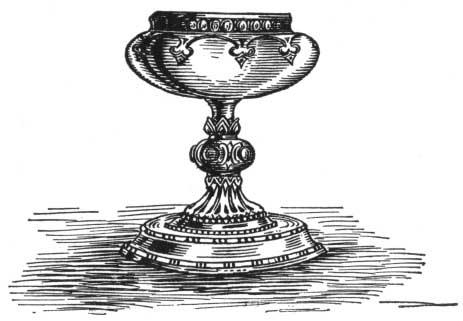

  
[Intangible Textual Heritage](../../index)  [Classics](../index.md) 
[Index](index)  [Previous](aph30)  [Next](aph32.md) 

------------------------------------------------------------------------

[Buy this Book at
Amazon.com](https://www.amazon.com/exec/obidos/ASIN/B000EP89M2/internetsacredte.md)

------------------------------------------------------------------------

  
*Aphrodite*, by Pierre Louys, \[1932\], at Intangible Textual Heritage

------------------------------------------------------------------------

p. 234

### Chapter Three

### CHRYSIS IMMORTAL

WHEN Demetrios found himself alone in his workshop encumbered with red
marbles, with stands and scaffoldings, he desired to set himself at
work.

The chisel in his left hand and the mallet in his right, he took up,
listlessly, an interrupted sketch. It was the neck and shoulders of a
gigantic horse designed for the temple of Poseidon. Beneath the cropped
mane, the skin of the neck, wrinkled by a movement of the head, incurved
geometrically like an undulous hollow of the sea.

Three days before, the detail of this regular development of muscles
concentrated in Demetrios’s spirit all the interest of daily life; but
on the morning of Chrysis’s death the aspect of things seemed changed.
Less calm than he wished to be, Demetrios could not fix his occupied
thought. A sort of veil he could not lift interposed between him and the
marble. He threw aside his mallet and began to walk up and down past the
dusty pedestals.

Suddenly he crossed the court, called a slave and said to him:

"Prepare the basin and the aromatics. Thou wilt perfume me after having
bathed me, thou wilt give me my white vestments and thou wilt light the
round perfume-burners."

When he finished his toilette, he summoned two other slaves.

p. 235

"Go," he said, "to the queen's prison; deliver this lump of clay to the
gaoler and have him carry it into the room where the courtesan Chrysis
lies dead. If the body is not already thrown into the pit, you will say
that they shall abstain from executing anything until I have given the
order. Run quickly. Go."

He put a modeling tool into the fold of his girdle and opened the
principal door upon the deserted avenue of the Drome . . .

Upon the threshold, he stopped suddenly, stupefied by the immense light
of the African noon.

The street should have been white and the houses white also, but the
flame of the meridian sun flooded the dazzling surfaces with such a fury
of reflections that the walls of lime and the paving stones threw back,
simultaneously, prodigious incandescences of shadow blue, of red and of
green, of raw ochre and of hyacinth. Full quivering colors seemed to
displace each other in the air and to cover only through transparence
the waving of the uneven façades of the houses. The lilies themselves
were deformed behind this brilliance; the right wall of the street
rounded into space, floated like a veil, and in certain places became
invisible. A dog lying near a curb was actually crimson.

Enthusiastic with admiration, Demetrios saw in this spectacle the symbol
of his new existence. Long enough he had lived in solitary night, in
silence and in peace. Long enough he had taken for light the moonbeams
and for ideal the nonchalant line of a too delicate movement. His work
was not virile. Over the skin of his statues there was an icy tremor.

During the tragic adventure which had just overthrown his intelligence,
he had felt, for the first time, the full breath of life filling his
breast. If he feared a second test, if, issuing victorious

p. 236

from the struggle, he had sworn to himself, before all things, to expose
himself no more to a departure from his fine attitude taken before
others, at least he had just comprehended that only that is worth the
trouble of being imagined which attains, by means of marble, color or
phrase, one of the profundities of human emotion —and that formal beauty
is but a vague matter, susceptible of being always transfigured through
the expression of sorrow or of joy.

As he finished thus the course of his thoughts he arrived before the
door of the criminal prison.

His two slaves awaited him there.

"We have brought the lump of red clay," they said. "The body is on the
bed. They have not touched it. The gaoler salutes thee and recommends
himself to thee."

The young man entered in silence, followed the long corridor, ascended a
few steps, entered the chamber of the dead, and carefully closed himself
in.

The cadaver was extended, the head low and covered with a veil, the
hands stretched out, the feet together. The fingers were laden with
rings, two silver anklets encircled the pale ankles and the nails of
each toe were still red with powder.

Demetrios put his hand to the veil to lift it; but hardly had he seized
it when a dozen flies escaped quickly from the opening.

He shuddered to his very feet . . . However, he drew aside the tissue of
white wool and folded it around the hair.

Chrysis’s face had become illuminated, little by little, with the
eternal expression which death lends to the eyelids and to the hair of
the dead. Some azure veinlets in the bluish whiteness of the cheeks gave
to the motionless head an appearance of cold marble.

p. 237

  [  
Click to enlarge](img/23700.jpg.md)

p. 238 p. 239

The diaphanous nostrils opened above the fine lips. The fragility of the
ears was almost immaterial. Never, in any light, not even that of his
dreams, had Demetrios seen such more than human beauty and such dazzling
radiance of skin.

And then he recalled the words spoken by Chrysis during their first
meeting: "Thou hast seen only my face. Thou knowest not how beautiful I
am!" An intense emotion suddenly choked him. He wished to know. He could
do so.

Of his three days of passion, he wishes to keep a souvenir which will
last longer than himself—to bare this admirable body, to pose it like a
model in the violent attitude he saw in his dream, and to create, from
the dead body, the statue of Immortal Life.

He detaches the buckle and the knot. He opens the drapery. The body lies
heavy. He raises it. The head falls back. The arms hang down. He draws
off the whole robe and throws it into the middle of the room. The body
falls back heavily.

With his hands under the cool arms, Demetrios slides the corpse to the
head of the couch. He turns the head upon the left cheek, gathers and
spreads the hair splendidly under the recumbent back. Then he raises the
right arm, bends the forearm above the forehead, clenches the still
flexible fingers upon the stuff of a cushion; and completes the pose of
the recumbent Aphrodite.

Next he disposes the limbs, one extended stiffly aside and the other
with raised knee. He rectifies some details, bends the waist to the
left, stretches out the right foot and takes away the bracelets, the
necklaces and the rings, in order not to trouble, by a single
dissonance, the pure and complete harmony.

The model has taken the pose.

p. 240

Demetrios throws upon the table the lump of damp clay which he has had
brought there. He presses it, he kneads it, he draws it out according to
the human form; a sort of barbarous monster is born of his ardent
fingers; he looks.

The motionless corpse holds its impassioned position. But a slender
thread of blood issues from the right nostril, flows over the lip and
falls, drop by drop, under the half opened mouth.

Demetrios continues. The sketch becomes animated, precise, life-like.
The left arm curves over the body as it had done in his dream. The
muscles seem to tense themselves violently. The toes curl back. . . .
When the night ascended from the earth and darkened the low chamber,
Demetrios had finished the statue.

He made four slaves carry the sketch into his work-shop. That very
evening by lamplight, he had a block of Parian marble rough hewn, and, a
year after that day, he was still working upon the marble.

 

------------------------------------------------------------------------

[Next: Chapter Four. Pity](aph32.md)
