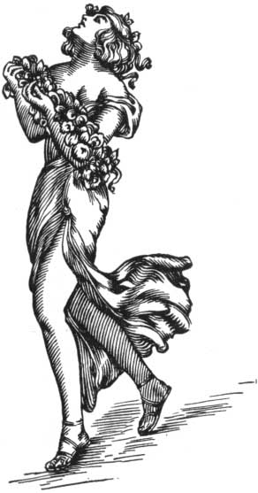

  
[Intangible Textual Heritage](../../index)  [Classics](../index.md) 
[Index](index)  [Previous](aph31)  [Next](aph33.md) 

------------------------------------------------------------------------

[Buy this Book at
Amazon.com](https://www.amazon.com/exec/obidos/ASIN/B000EP89M2/internetsacredte.md)

------------------------------------------------------------------------

  
*Aphrodite*, by Pierre Louys, \[1932\], at Intangible Textual Heritage

------------------------------------------------------------------------

p. 241

### Chapter Four

### PITY

"GAOLER, open to us! Gaoler, open to us!" Rhodis and Myrtocleia were
knocking at the closed door.

The door partly opened. "What do you want?"

"To see our friend," said Myrto. "To see Chrysis, poor Chrysis who died
this morning."

It is not permitted; go away!"

"Oh! let us, let us come in. No one will know it. We will not tell of
it. She was our friend. Let us see her again. We will come out soon. We
will make no noise."

"And if I am caught, my little girls? If I am punished because of you?
It is not you who will pay the penalty."

"Thou wilt not be caught. Thou art alone here. There are no other
condemned. Thou has sent away the soldiers. We know all that. Let us
in."

"Well! Do not stay long. Here is the key. It is the third door. Tell me
when you go. It is late, and I want to go to bed."

The good old man handed them the key of beaten iron which hung at his
girdle and the two little virgins ran at once, on their silent sandals,
through the dark corridors.

Then the gaoler re-entered his office and discontinued his useless
surveillance. The punishment of imprisonment was not applied

p. 242

in Greek Egypt and the little white house which the gentle old man had
the mission to keep served only to lodge those condemned to death. In
the intervals between executions it remained almost abandoned.

At the moment the great key entered the lock, Rhodis arrested her
friend's hand.

"I do not know if I dare see her," she said. "I loved her well, Myrto .
. . I am afraid . . . Enter first, wilt thou?"

Myrtocleia pushed the door; but as soon as she had cast her eyes into
the room she cried:

"Do not come in, Rhodis! Wait for me here."

"Oh! what is it? Thou art afraid also . . . What is on the couch? Is she
not dead?"

"Yes. Wait for me . . . I will tell thee . . . Stay in the corridor and
do not look."

The body had remained in the frantic attitude which Demetrios had
composed to make from it the Statue of Immortal Life. But the transports
of extreme joy border upon the convulsions of extreme anguish, and
Myrtocleia asked herself what atrocious sufferings, what martyrdom, what
rending agonies, had thus writhed the body.

On tiptoe she approached the bed.

The thread of blood continued to flow from the diaphanous nostril. The
skin of the body was perfectly white; not a rosy reflection vivified the
ephemeral declining statue, but some emerald-colored spots which softly
tinted the relaxed body signified that millions of new lives were
springing from the hardly cold flesh and demanding their turn.

Myrtocleia took the dead arm and lowered it along the hip.

p. 243

\[paragraph continues\] She tried also to
stretch out the left leg, but the knee was almost stiff and she was not
able to extend it completely.

"Rhodis," she said in a troubled voice. "Come. Thou canst enter now."

The trembling child entered the room, her features contracted, her eyes
opened.

As soon as they felt themselves together, they burst into long sobs, in
each other's arms.

"Poor Chrysis! Poor Chrysis!" repeated the child.

They kissed each other on the cheek with a desperate tenderness, and the
taste of the tears spread upon their lips all the bitterness of their
numbed little souls.

They wept, they wept, they gazed at each other sorrowfully and sometimes
they spoke both together, in hoarse, rending voices where the words
finished with sobs.

"We loved her so much! She was not a friend to us, she was like a very
young mother, a little mother between us two . . ." Rhodis repeated:
"Like a little mother . . ."

And Myrto, drawing near the dead, said in a low voice: "Kiss her."

They both leaned over and placed their hands upon the bed, and with
fresh sobs touched the icy forehead with their lips.

And Myrto took the head between her hands, which plunged into the hair,
and she spoke to it thus: "Chrysis, my Chrysis, thou wert the fairest
and most adored of women, thou so like the goddess that the people took
thee for her. Where art thou now, what have they done with thee? Thou
didst live to give good joy. There has never been fruit more sweet than
thy kisses, nor light more clear than thine eyes. Thy skin was a
glorious robe which

p. 244

thou shouldst never have veiled; delight floated about thee like a
perpetual fragrance; when thou didst loose thine hair all glory escaped
with it and when thou didst close thy heart men prayed the gods to give
them death."

Crouched on the floor, Rhodis sobbed.

"Chrysis, my Chrysis," continued Myrtocleia, "yesterday thou wert still
living and young, hoping for long days, and now, behold, thou art dead
and nothing in the world can make thee say a word to us. Thou hast
closed thine eyes; we were not by thee. Thou hast suffered and thou hast
not known that we wept for thee behind the walls. With thy dying look
thou .hast sought someone and thine eyes have not met our eyes heavy
with mourning and with pity."

The flute-player still wept. The singer took her by the hand.

"Chrysis, my Chrysis, Rhodis and Myrtocleia are very sad. And sorrow
more than love unites two clasped hands. They who have once wept
together will never part. We will bear thy dear body to earth,
Chrysidion, and we will both cut our hair over thy tomb."

She enveloped the beautiful body in a coverlet of the bed; then said to
Rhodis, "Help me."

They lifted her gently; but the burden was heavy for the little
musicians and they laid it for the first time upon the ground.

"Let us do off our sandals," said Myrto. "Let us walk barefoot in the
corridors. The gaoler must have fallen asleep . . . If we do not waken
him we can pass, but if he sees us he will stop us . . As for tomorrow,
that does not matter; when he sees the bed empty he will say to the
queen's soldiers that he has thrown the

p. 245

body into the pit as the law requires. Fear nothing, Rhodé . . . Put thy
sandals in thy girdle, as I do. And come. Take the body under the knees.
Let the feet pass behind. Walk without sound, slowly, slowly . . ."

 

------------------------------------------------------------------------

[Next: Chapter Five. Piety](aph33.md)
