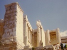

  
[Intangible Textual Heritage](../../index)  [Classics](../index.md) 
[Index](index)  [Previous](app32)  [Next](app34.md) 

------------------------------------------------------------------------

[Buy this Book at
Amazon.com](https://www.amazon.com/exec/obidos/ASIN/0674035011/internetsacredte.md)

------------------------------------------------------------------------

  
*Ancilla to the Pre-Socratic Philosophers*, by Kathleen Freeman,
\[1948\], at Intangible Textual Heritage

------------------------------------------------------------------------

### 38. HIPPÔN OF SAMOS

Hippôn of Samos flourished during the middle of the fifth
century B.C. He published his views in several books; but only one
genuine fragment has survived.

1\. All water that is drunk comes from the sea; for of course

p. 72

the wells from which we drink are not deeper than the sea, for in that
case the water would not be from the sea but from elsewhere. But in fact
the sea is deeper than the water. It follows therefore that all water
that is above the sea comes from the sea.

*Spurious*

2\. (*Elegiac epitaph on himself, claiming apotheosis*).

3\. Nothing is more empty than much learning.

4\. The soul is very different from the body: it is active when the body
is inert, it sees when the body is blind and lives when the body is
dead.

------------------------------------------------------------------------

[Next: 39. Phaleas of Chalcêdôn and Hippodâmus of Milêtus](app34.md)
