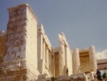

  
[Intangible Textual Heritage](../../index)  [Classics](../index) 
[Index](index)  [Previous](app79)  [Next](app81) 

------------------------------------------------------------------------

[Buy this Book at
Amazon.com](https://www.amazon.com/exec/obidos/ASIN/0674035011/internetsacredte)

------------------------------------------------------------------------

  
*Ancilla to the Pre-Socratic Philosophers*, by Kathleen Freeman,
\[1948\], at Intangible Textual Heritage

------------------------------------------------------------------------

p. 141

### 85. THRASYMACHUS OF CHALCÊDÔN

Thrasymachus of Chalcêdôn was active in the latter half of the
fifth century B.C.

He left a large number of writings: a *Great Text-book*; *Subjects for
Oratory*; *Prooemia*; *Preponderances*; and other works connected with
Rhetoric. One long example of his style is preserved from one of his
'public orations', written as an exercise.

1\. I could wish, men of Athens, to have belonged to that long-past time
when the young were content to remain silent unless events compelled
them to speak, and while the older men were correctly supervising
affairs of State. But since Fate has so far advanced us in time that we
must obey others as rulers but must suffer the consequences ourselves;
and when the worst results are not the work of Heaven or Fate but of our
administrators, then it is necessary to speak. A man either has no
feeling, or has too much patience, if he is willing to go on offering
himself up to whoever wishes as the object of their mistakes, and is
ready to take on himself the blame for the guile and wickedness of
others.

No, the past is enough for us—that we have exchanged peace for war,
reaching the present through dangers, so that we regard the past with
affection and the future with fear; and that we have sacrificed concord
for enmity and internal disturbance. Others are driven to excesses and
civil strife through a surfeit of prosperity; but we behaved soberly in
our prosperity. We were seized with madness at a time of adversity,
which usually makes others act soberly. Why then should anyone delay to
say what he knows, if he happens to feel grief at the present state of
affairs, and to believe that he has a means of bringing this to an end?

First of all, therefore, I shall prove in my speech that those of the
orators and others who are at variance are mutually experiencing
something that is bound to befall those who engage in senseless rivalry:
believing that they are expressing opposite views, they fail to perceive
that their actions are the same, and that the theory of the opposite
party is inherent in their own theory. For consider from the beginning
what each party is seeking.

In the first place, the 'ancestral constitution' is a cause of
dissension between them, though it is easiest to grasp and is

p. 142

the common property of all citizens. Whatever lies outside our knowledge
must necessarily be learnt from earlier generations, but whatever the
elder generation has itself witnessed, we can find out from those who
know.

2\. (*From a speech 'On behalf of the people of Larissa'*): Shall we who
are Greeks be the slaves of Archelaus a barbarian?

3\. (*Title: 'The Great Text-book'*).

4\. (*From the 'Prooemia': Timocreon*, [1](#fn_100) *entertained by the Great King, ate so
much that the King inquired his purpose; Timocreon replied, 'To thrash
innumerable Persians'. Next day, having beaten numbers of them one after
another, he went on to shadowboxing; asked why, he said that these were
the blows left over for any fresh competitor*).

5\. (*Thrasymachus in his 'Appeals to Compassion' wrote on the art of
delivery*).

6\. (Plato, *Phaedrus* 267C:
*Thrasymachus claimed to be able to arouse anger in many, and then allay
their anger with charms and incantations*).

6a. (Plato, *Republic* 338C:
*Thrasymachus speaking*): Justice is nothing other than the advantage of
the stronger.

7\. (*Title: 'Preponderant Arguments'*).

7a. (*Thrasymachus and others mistakenly believed that they possessed
the art of political and public oratory*).

*From unspecified writing*

8\. The gods do not see human affairs; otherwise they would not have
overlooked the greatest of all blessings among mankind, Justice—for we
see mankind not using this virtue.

------------------------------------------------------------------------

### Footnotes

[142:1](app80.htm#fr_107) Lyric poet of Rhodes,
sixth-fifth centuries B.C., famous for large appetite, great strength,
and invective.

------------------------------------------------------------------------

[Next: 86. Hippias of Êlis](app81)
