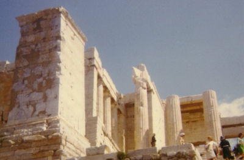

  
[Intangible Textual Heritage](../../index)  [Classics](../index) 

------------------------------------------------------------------------

[Buy this Book at
Amazon.com](https://www.amazon.com/exec/obidos/ASIN/0674035011/internetsacredte)

------------------------------------------------------------------------

<table width="75%">
<colgroup>
<col style="width: 50%" />
<col style="width: 50%" />
</colgroup>
<tbody>
<tr class="odd">
<td width="50%" data-valign="TOP"> 
Acropolis, photo by J.B. Hare, © 2008, All Rights Reserved</td>
<td width="50%" data-valign="CENTER"><h1 id="ancilla-to-the-pre-socratic-philosophers" data-align="CENTER">Ancilla to the Pre-Socratic Philosophers</h1>
<h2 id="by-kathleen-freeman" data-align="CENTER">by Kathleen Freeman</h2>
<h4 id="section" data-align="CENTER">[1948]</h4></td>
</tr>
</tbody>
</table>

------------------------------------------------------------------------

[Contents](#contents)    [Start Reading](app00)    [Page
Index](pageidx)    [Text \[Zipped\]](apptxt.zip)

------------------------------------------------------------------------

|                                                                                                                           |
|---------------------------------------------------------------------------------------------------------------------------|
|  |

*As our soul, being air, holds us together, so do
breath and air surround the whole universe*.--*Anaximenes of Miletus*,
only surviving fragment (p. 19)

This is a translation of nearly every scrap of the writings of the Greek
Pre-Socratic Philosophers, from the nearly legendary Orpheus, through
Thales, Pythagoras, Heracleitus, Zeno, and Democritus. Included are
translations of all known quotations from each writer, names of lost
books they wrote, what other authors said about their beliefs, as well
as spurious and dubious quotes. Some of the entries, indeed most, are
very short, as we only know the names and a bit of biography for some of
these figures. This book is a great reference for this topic, and makes
fascinating reading.

------------------------------------------------------------------------

 [Title Page](app00)  
[Contents](app01)  
[Foreword](app02)  
[1. Orpheus](app03)  
[2. Musaeus](app04)  
[3. Epimenides of Crete](app05)  
[4. Hêsiod of Ascra](app06)  
[5. Phôcus of Samos](app07)  
[6. Cleostratus of Tenedos](app08)  
[7. Pherecŷdes of Syros](app09)  
[8. Theagenes of Rhêgium](app10)  
[9. Acusilâus of Argos](app11)  
[10. The Seven Sages](app12)  
[11. Thales of Milêtus](app13)  
[12. Anaximander of Milêtus](app14)  
[13. Anaximenes of Milêtus](app15)  
[14. Pythagoras of Samos](app16)  
[15-20. Older Pythagoreans](app17)  
[21. Xenophanes of Colophôn](app18)  
[22. Hêracleitus of Ephesus](app19)  
[23. Epicharmus of Syracuse](app20)  
[24. Alcmaeôn of Crotôn](app21)  
[25-27. Iccus, Parôn, Ameinias](app22)  
[28. Parmenides of Elea](app23)  
[29. Zênô of Elea](app24)  
[30. Melissus of Samos](app25)  
[31. Empedocles of Acragas](app26)  
[32. Menestôr of Sybaris](app27)  
[33. Xuthus](app28)  
[34. Boïdas](app29)  
[35. Thrasyalces of Thasos](app30)  
[26. Iôn of Chios](app31)  
[37. Damôn of Athens](app32)  
[38. Hippôn of Samos](app33)  
[39. Phaleas of Chalcêdôn and Hippodâmus of Milêtus](app34)  
[40. Polycleitus of Argos](app35)  
[41. Oenopides of Chios](app36)  
[42. Hippocrates of Chios](app37)  
[43. Theodôrus of Cyrênê](app38)  
[44. Philolaus of Tarentum](app39)  
[45. Eurytus of Southern Italy](app40)  
[46. Archippus and Lŷsis of Tarentum; Opsimus of Rhêgium](app41)  
[47. Archŷtas of Tarentum](app42)  
[48. Occelus (or Ocellus) of Lucania](app43)  
[49. Tîmaeus of Italian Locri](app44)  
[50. Hicetas of Syracuse](app45)  
[51. Ecphantus of Syracuse](app46)  
[52. Xenophilus of Chalcidicê](app47)  
[53. Diocles, Echecrates, Polymnastus, Phantôn, Arîôn of
Phliûs](app48)  
[54. Prôrus of Cyrene, Amŷclas, Cleinias of Tarentum](app49)  
[55. Damôn and Phintias of Syracuse](app50)  
[56. Sîmus of Poseidônia; Myônides and Euphranôr](app51)  
[57. Lycôn (or Lycus) of Tarentum](app52)  
[58. Pythagorean School](app53)  
[59. Anaxagoras of Clazomenae](app54)  
[60. Archelâus of Athens](app55)  
[61. Mêtrodôrus of Lampsacus](app56)  
[62. Cleidêmus](app57)  
[63. Îdaeus of Hîmera](app58)  
[64. Diogenes of Apollônia](app59)  
[65. Cratylus of Athens](app60)  
[66. Antisthenes of Ephesus](app61)  
[67. Leucippus of Abdêra](app62)  
[68. Dêmocritus of Abdêra](app63)  
[69. Nessas of Chios](app64)  
[70. Mêtrodôrus of Chios](app65)  
[71. Diogenes of Smyrna](app66)  
[72. Anaxarchus of Abdêra](app67)  
[73. Hecataeus of Abdêra](app68)  
[74. Apollodôrus of Cyzicus](app69)  
[75. Nausiphanes of Teos](app70)  
[76. Diotîmus of Tyre](app71)  
[77. Biôn of Abdêra](app72)  
[78. Bôlus of Mendê](app73)  
[79. The Older Sophists: Name and Concept](app74)  
[80. Prôtagoras of Abdêra](app75)  
[81. Xeniades of Corinth](app76)  
[82. Gorgias of Leontîni](app77)  
[83. Lycophrôn 'The Sophist'](app78)  
[84. Prodicus of Ceos](app79)  
[85. Thrasymachus of Chalcêdôn](app80)  
[86. Hippias of Êlis](app81)  
[87. Antiphôn the Sophist](app82)  
[88. Critias of Athens](app83)  
[89. The Anonymous Writer Quoted by Iamblichus](app84)  
[90. Twofold Arguments (Debates)](app85)  
