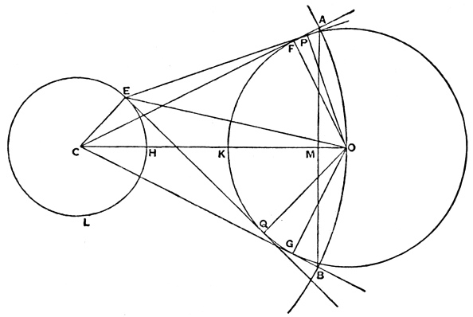
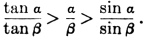

  
[Intangible Textual Heritage](../../../index)  [Classics](../../index.md) 
[Archimedes](../index)  [Index](index.md) 

------------------------------------------------------------------------

*The Sand-Reckoner of Archimedes*, tr. by Thomas L. Heath, \[1897\], at
Intangible Textual Heritage

------------------------------------------------------------------------

### THE SAND-RECKONER

#### Of Archimedes

##### Translated by Thomas L. Heath (Original publication: Cambridge University Press, 1897).

Scanned, Proofed, and Formatted by John Bruno Hare at Intangible Textual
Heritage. This text is in the public domain in the United States because
it was published prior to 1923. I have altered the formatting of the
mathematical proof areas slightly due to the limitations of HTML.

p. 520

"THERE are some, King Gelon, who think that the number of the sand is
infinite in multitude; and I mean by the sand not only that which exists
about Syracuse and the rest of Sicily but also that which is found in
every region whether inhabited or uninhabited. Again there are some who,
without regarding it as infinite, yet think that no number has been
named which is great enough to exceed its multitude. And it is clear
that they who hold this view, if they imagined a mass made up of sand in
other respects as large as the mass of the earth, including in it all
the seas and the hollows of the earth filled up to a height equal to
that of the highest of the mountains, would be many times further still
from recognising that any number could be expressed which exceeded the
multitude of the sand so taken. But I will try to show you by means of
geometrical proofs, which you will be able to follow, that, of the
numbers named by me and given in the work which I sent to Zeuxippus,
some exceed not only the number of the mass of sand equal in magnitude
to the earth filled up in the way described, but also that of a mass
equal in magnitude to the universe. Now you are aware that 'universe' is
the name given by most astronomers to the sphere whose centre is the
centre of the earth and whose radius is equal to the straight line
between the centre of the sun and the centre of the earth. This is the
common account (τὰ γραφόμενα), as you have heard from astronomers. But
Aristarchus of Samos brought out a book consisting of some hypotheses,
in which the premisses lead to the result that the universe is many
times greater than that now so called. His hypotheses are that the fixed
stars and the sun remain unmoved, that the earth revolves about the sun
in the circumference of a circle, the sun lying in the middle of the
orbit, and that the sphere of the fixed stars, situated about the same
centre as the sun, is so great that the circle in which he supposes the
earth to revolve bears such a proportion to the distance of the fixed
stars as the centre of the sphere bears to its surface. Now it is easy
to see that this is impossible; for, since the centre of the sphere has
no magnitude, we cannot conceive it to bear any ratio whatever to the
surface of the sphere. We must however take Aristarchus to mean this:
since we conceive the earth to be, as it were, the centre of the
universe, the ratio which the earth bears to what we describe as the
'universe' is the same as the ratio which the sphere containing the
circle in which he supposes the earth to revolve bears to the sphere of
the fixed stars. For he adapts the proofs of his results to a hypothesis
of this kind, and in particular he appears to suppose the magnitude of
the sphere in which he represents the earth as moving to be equal to
what we call the 'universe.'

"I say then that, even if a sphere were made up of the sand, as great as
Aristarchus supposes the sphere of the fixed stars to be, I shall still
prove that,

p. 521

of the numbers named in the *Principles*, [1](#fn_0.md) some exceed in multitude the number of the
sand which is equal in magnitude to the sphere referred to, provided
that the following assumptions be made."

1\. "*The perimeter of the earth is about* 3,000,000 *stadia and not
greater*.

"It is true that some have tried, as you are of course aware, to prove
that the said perimeter is about 300,000 stadia. But I go further and,
putting the magnitude of the earth at ten times the size that my
predecessors thought it, I suppose its perimeter to be about 3,000,000
stadia and not greater."

2\. "*The diameter of the earth is greater than the diameter of the
moon, and the diameter of the sun is greater than the diameter of the
earth*.

"In this assumption I follow most of the earlier astronomers."

3\. "*The diameter of the sun is about 30 times the diameter of the moon
and not greater*.

"It is true that, of the earlier astronomers, Eudoxus declared it to be
about nine times as great, and Pheidias my father twelve times, while
Aristarchus tried to prove that the diameter of the sun is greater than
18 times but less than 20 times the diameter of the moon. But I go even
further than Aristarchus, in order that the truth of my proposition may
be established beyond dispute, and I suppose the diameter of the sun to
be about 30 times that of the moon and not greater."

4\. "*The diameter of the sun is greater than the side of the chiliagon
inscribed in the greatest circle in the (sphere of the) universe*.

"I make this assumption because Aristarchus discovered that the sun
appeared to be about - nth part of the circle of the zodiac, and I
myself tried, by a method which I will now describe, to find
experimentally (ὀργανικῶς) the angle subtended by the sun and having its
vertex at the eye."

\[Up to this point the treatise has been literally translated because of
the historical interest attaching to the *ipsissima* *verba* of
Archimedes on such a subject. The rest of the work can now be more
freely reproduced, and, before proceeding to the mathematical contents
of it, it is only necessary to remark that Archimedes next describes how
he arrived at a higher and a lower limit for the angle subtended by the
sun. This he did by taking a long rod or ruler, fastening on the end of
it a small cylinder or disc, pointing the rod in the direction of the
sun just after its rising (so that it was possible to look directly at
it), then putting the cylinder at such a distance that it just
concealed, and just failed to conceal, the sun, and lastly measuring the
angles subtended by the cylinder. He explains also the correction which
he thought it necessary to make because "the eye does not see from one
point but from a certain area."\]

The result of the experiment was to show that the angle subtended by the
diameter of the sun was less than 1/164th part, and greater
than 1/200th part, of a right angle.

*To prove that* (*on this assumption*) *the diameter of the sun is
greater than the side of a chiliagon, or figure with* 1000 *equal sides,
inscribed in a great circle of the* "*universe*."

Suppose the plane of the paper to be the plane passing through the
centre of the sun, the centre of the earth and the eye, at the time when
the sun has

p. 522

just risen above the horizon. Let the plane cut the earth in the circle
*EHL* and the sun in the circle *FKG*, the centres of the earth and sun
being *C*, *O* respectively, and *E* being the position of the eye.

Further, let the plane cut the sphere of the "universe" (i.e. the sphere
whose centre is *C* and radius *CO*) in the great circle *AOB*.

Draw from *E* two tangents to the circle *FKG* touching it at *P*, *Q*,
and from *C* draw two other tangents to the same circle touching it in
*F*, *G* respectively.

Let *CO* meet the sections of the earth and sun in *H*, *K*
respectively; and let *CF*, *CG* produced meet the great circle *AOB* in
*A*, *B*.

Join *EO*, *OF*, *OG*, *OP*, *OQ*, *AB*, and let *AB* meet *CO* in *M*.

Now *CO* &gt; *EO*, since the sun is just above the horizon.

Therefore ∠ *PEQ* &gt; ∠ *FCG*.

And ∠ *PEQ* &gt; 1/200 *R* but &lt; 1/164 *R*, where *R* represents a
right angle.

 

Thus ∠ *FCG* &lt; *R*, *a fortiori*,

and the chord *AB* subtends an arc of the great circle which is less
than 1/656th of the circumference of that circle, i.e.

*AB* &lt; (side of 656-sided polygon inscribed in the circle).

Now the perimeter of any polygon inscribed in the great circle is less
than 44/7 *CO*. \[Cf. *Measurement of a circle*, Prop. 3.\]

Therefore *AB* : *CO* &lt; 11 : 1148,

and, a fortiori, *AB* &lt; 1/100 *CO*. (α)

Again, since *CA* = *CO*, and *AM* is perpendicular to *CO*, while *OF*
is perpendicular to *CA*,

*AM* = *OF*.

Therefore *AB* = 2 *AM* = (diameter of sun).

Thus (diameter of sun) &lt; 1/100 *CO*, by (α),

and, *a fortiori*, (diameter of earth) &lt; 1/100 *CO*. \[Assumption 2\]

Hence *CH* + *OK* &lt; 1/100 *CO*,

so that *HK* &gt; 99/100 *CO*,

p. 523

or *CO* : *HK* &lt; *100* : *99*.

And *CO* &gt; *CF*, while *HK* &lt; *EQ*.

Therefore *CF* : *EQ* &lt; 100 : 99. (β)

Now in the right-angled triangles *CFO*, *EQO*, of the sides about the
right angles,

*OF* = *OQ*, but *EQ* &lt; *CF* (since *EO* &lt; *CO*).

Therefore ∠ *OEQ* : ∠ *OCF* &gt; *CO* : *EO*,  
but &lt; *CF* : *EQ*. [1](#fn_1.md)

Doubling the angles,

∠ *PEQ* : ∠ *ACB* &lt; *CF* : *EQ*  
&lt; 100 : 99, by (β) above.

But ∠ *PEQ* &gt; 1/200 *R*, by hypothesis.

Therefore ∠ *ACB* &gt; 99/20000 *R*  
&gt; 1/203 *R*.

It follows that the arc *AB* is greater than 1/812th of the
circumference of the great circle *AOB*.

Hence, *a fortiori*, *AB* &gt; (side of chiliagon inscribed in great
circle), and *AB* is equal to the diameter of the sun, as proved above.

*The following results can now be proved:*

(*diameter of* "*universe*") &lt; 10,000 (*diameter of earth*),

*and* (*diameter of* "*universe*") &lt;10,000,000,000 *stadia*.

\(1\) Suppose, for brevity, that *du* represents the diameter
of the "universe," *ds* that of the sun, *de* that
of the earth, and *dm* that of the moon.

By hypothesis, *ds* ≯ 30 *dm*, \[Assumption 3\]

and *de* &gt; *dm*; \[Assumption 2\]

therefore *ds* &lt; 30 *de*.

Now, by the last proposition,

*ds* &gt; (side of chiliagon inscribed in great circle),

so that (perimeter of chiliagon) &lt; 1000 *de*. &lt; 30,000
*de*.

But the perimeter of any regular polygon with more sides than 6
inscribed in a circle is greater than that of the inscribed regular
hexagon, and therefore greater than three times the diameter. Hence

(perimeter of chiliagon) &gt; 3 *du*.

It follows that *du* &lt; 10,000 *de*.

\(2\) (Perimeter of earth) ≯ 3,000,000 stadia. \[Assumption 1\]

and (perimeter of earth) &gt; 3 *de*.

Therefore *de* &lt; 1,000,000 stadia,

whence *du* &lt; 10,000,000,000 stadia.

*Assumption* 5

Suppose a quantity of sand taken not greater than a poppy-seed, and
suppose that it contains not more than 10,000 grains.

p. 524

Next suppose the diameter of the poppy-seed to be not less than
1/40th of a finger-breadth.

#### ORDERS AND PERIODS OF NUMBERS

I. We have traditional names for numbers up to a myriad (10,000); we can
therefore express numbers up to a myriad myriads (100,000,000). Let
these numbers be called numbers of the *first order*.

Suppose the 100,000,000 to be the unit of the *second order*, and let
the *second order* consist of the numbers from that unit up to
(100,000,000)2.

Let this again be the unit of the *third order* of numbers ending with
(100,000,000)3; and so on, until we reach the
100,000,000*th* *order* of numbers ending with
(100,000,000)100,000,000, which we will call *P*.

II\. Suppose the numbers from 1 to *P* just described to form the *first
period*.

Let *P* be the unit of the *first order of the second period*, and let
this consist of the numbers from *P* up to 100,000,000 *P*.

Let the last number be the unit of the *second order of the second
period*, and let this end with (100,000,000)2 *P*.

We can go on in this way till we reach the 100,000,000*th*
*order of the second period* ending with
(100,000,000)100,000,000 *P*, or *P*2.

III\. Taking *P*2 as the unit of the *first order of the
third period*, we proceed in the same way till we reach the
100,000,000*th* *order of the third period* ending with
*P*3.

IV\. Taking *P*3 as the unit of the first order of the fourth
period, we continue the same process until we arrive at the
100,000,000*th* *order of the* 100,000,000*th*
*period* ending with *P*100,000,000. This last number is
expressed by Archimedes as "a myriad-myriad units of the
myriad-myriad-th order of the myriad-myriad-th
period (αἱ μυριακισμυριοστᾶσ περιόδου μυριακισμυριοστῶν ἀριθμῶν μυρίαι
μυριάδες)," which is easily seen to be 100,000,000 times the product of
(100,000,000)99,999,999 and *P*99,999,999 i.e.
*P*100,000,000.

#### OCTADS

Consider the series of terms in continued proportion of which the first
is 1 and the second 10 \[i.e. the geometrical progression 1,
101, 102, 103, . . .\]. The *first
octad* of these terms \[i.e. 1, 101, 102, . . .
107\] fall accordingly under the *first order of the first
period* above described, the *second octad* \[i.e. 108,
109, . . . 1015\] under the *second order of the
first period*, the first term of the octad being the unit of the
corresponding order in each case. Similarly for the *third octad*, and
so on. We can, in the same way, place any number of octads.

#### THEOREM

*If there be any number of terms of a series in continued proportion*,
say *A*1, *A*2, *A*3, . . .
*Am*, . . *An*, . .
*Am*+*n*-l, . . . of which *A*l =1,
*A*2 =10 \[so that the series forms the geometrical
progression 1, 101, 102, . .
.10*m*-1, . . .10*n*-1, . .
.10*m*+*n*-2, . . .\], *and if any two terms as*
*Am*, *An* *be taken and multiplied, the product* *A*m ·
*A*n *will be a term in the same series and will be as many
terms distant from* *A*n, *as* *A*m *is distant
from* *A*1; *also it will be distant from* *A*l
*by a number of terms less by one than the sum of the numbers of terms
by which* *A*m *and* *A*n, *respectively are
distant from* *A*1.

Take the term which is distant from *An*, by the same number
of terms as *Am* 

p. 525

is distant from *A*1. This number of terms is *m* (the first
and last being both counted). Thus the term to be taken is *m* terms
distant from *An*, and is therefore the term
*Am*+*n*-1.

We have therefore to prove that

*Am* · *An* = *Am*+*n*-1.

Now terms equally distant from other terms in the continued proportion
are proportional.

Thus *Am* / *A*1 =
A*m*+*n*-1 / *An*.

But *Am*= *Am* · *A*1, since
*A*1 = 1.

Therefore *Am*+*n*-1 = *Am* ·
*An*. (1)

The second result is now obvious, since *Am* is *m* terms
distant from *A*1, *A*n is *n* terms distant from
A1, and *Am*+*n*-1 is (*m*+*n*-1) terms
distant from A1.

#### APPLICATION TO THE NUMBER OF THE SAND

By Assumption 5 \[[p. 523](#page_523.md)\],

(diam. of poppy-seed) ≮ (finger-breadth);

and, since spheres are to one another in the triplicate ratio of their
diameters, it follows that

|                                    |       |                        |        |
|------------------------------------|-------|------------------------|--------|
| (sphere of diam. 1 finger-breadth) | ≯     | 64,000 poppy-seeds     |        |
|                                    | ≯     | 64,000 × 10,000        |        |
|                                    | ≯     | 640,000,000            |        |
|                                    | ≯     | 6 units of *second*    | grains |
|                                    |       | *order* + 40,000,000   | of     |
|                                    |       | units of *first order* | sand.  |
| (*a fortiori*)                     | &lt;  | 10 units of *second*   |        |
|                                    |       | *order* of numbers.    |        |

We now gradually increase the diameter of the supposed sphere,
multiplying it by 100 each time. Thus, remembering that the sphere is
thereby multiplied by 1003 or 1,000,000, the number of grains
of sand which would be contained in a sphere with each successive
diameter may be arrived at as follows.

|                                   |                                                                         |                          |
|-----------------------------------|-------------------------------------------------------------------------|--------------------------|
| *Diameter of sphere*.             | *Corresponding number of grains of sand*.                               | * *                      |
| \(1\) 100 finger-breadths         | &lt; 1,000,000 × 10 units of *second order*                             |                          |
|                                   | &lt; (7th term of series) × (10th term of series) |                          |
|                                   | &lt; 16th term of series                                     | \[i.e. 1015\] |
|                                   | &lt; \[107 or\] 10,000,000 units of the *second order*.      |                          |
| \(2\) 10,000 finger-breadths      | &lt; 1,000,000 × (last number)                                          |                          |
|                                   | &lt; (7th term of series) × (16th term)           |                          |
|                                   | &lt; 22nd term of series                                     | \[i.e. 1021\] |
|                                   | &lt; \[105 or\] 100,000 units of *third order*.              |                          |
| \(3\) 1 stadium                   | &lt; 100,000 units of *third order*.                                    |                          |
|     (&lt; 10,000 finger-breadths) |                                                                         |                          |
| \(4\) 100 stadia                  | &lt; 1,000,000 × (last number)                                          |                          |
|                                   | &lt; (7th term of series) × (22nd term)           |                          |
|                                   | &lt; 28th term of series                                     | \[1027\]      |
|                                   | &lt; \[103 or\] 1,000 units of *fourth order*.               |                          |
| \(5\) 10,000 stadia               | &lt; 1,000,000 × (last number)                                          |                          |
|                                   | &lt; (7th term of series) × (28th term)           |                          |
|                                   | &lt; 34th term of series                                     | \[1033\]      |
|                                   | &lt; 10 units of *fifth order*.                                         |                          |
| p. 526 |                                                                         |                          |
| \(6\) 1,000,000 stadia            | &lt; (7th term of series) × (34th term)           |                          |
|                                   | &lt; 40th term                                               | \[1039\]      |
|                                   | &lt; \[107 or\] 10,000,000 units of *fifth order*.           |                          |
| \(7\) 100,000,000 stadia          | &lt; (7th term of series) × (40th term)           |                          |
|                                   | &lt; 46th term \[1045\]                           |                          |
|                                   | &lt; \[105 or\] 100,000 units of *sixth order*.              |                          |
| \(8\) 10,000,000,000 stadia       | &lt; (7th term of series) × (46th term)           |                          |
|                                   | &lt; 52nd term of series                                     | \[1051\]      |
|                                   | &lt; \[103 or\] 1,000 units of *seventh order*.              |                          |

But, by the proposition above \[[p. 523](#page_523.md)\],

(diameter of "universe") &lt; 10,000,000,000 stadia.

Hence the *number of grains of sand which could be contained in a sphere
of the size of our* "*universe*" *is less than* 1,000 *units of the
seventh order of numbers* \[or 1051\].

From this we can prove further that *a sphere of the size attributed by
Aristarchus to the sphere of the fixed stars would contain a number of
grains of sand less than* 10,000,000 *units of the eighth order of
numbers* \[or 1056+7= 1063\].

For, by hypothesis,

(earth) : ("universe") = ("universe") : (sphere of fixed stars).

And \[[p. 523](#page_523.md)\]

(diameter of "universe") &lt; 10,000 (diam. of earth);

whence

(diam. of sphere of fixed stars) &lt; 10,000 (diam. of "universe").

Therefore

(sphere of fixed stars) &lt; (10,000)3 · ("universe").

It follows that the number of grains of sand which would be contained in
a sphere equal to the sphere of the fixed stars

|                            |                                                                           |                          |
|----------------------------|---------------------------------------------------------------------------|--------------------------|
|                            | &lt; (10,000)3 × 1,000 units of *seventh order*                |                          |
|                            | &lt; (13th term of series) × (52nd term of series)  |                          |
|                            | &lt; 64th term of series                                       | \[i.e. 1063\] |
|                            | &lt; \[107 or\] 10,000,000 units of *eighth order* of numbers. |                          |

#### CONCLUSION.

"I conceive that these things, King Gelon, will appear incredible to the
great majority of people who have not studied mathematics, but that to
those who are conversant therewith and have given thought to the
question of the distances and sizes of the earth, the sun and moon and
the whole universe, the proof will carry conviction. And it was for this
reason that I thought the subject would be not inappropriate for your
consideration."

 

------------------------------------------------------------------------

### Footnotes

[521:1](#fr_0.md) A lost work of Archimedes.

[523:1](#fr_1.md) The proposition here assumed is of
course equivalent to the trigonometrical formula which states that, if
α, β are the circular measures of two angles, each less than a right
angle, of which α is the greater, then

 

 
