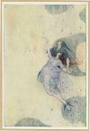

[Intangible Textual Heritage](../../index)  [Classics](../index.md) 
[Index](index)  [Next](cap01.md) 

------------------------------------------------------------------------

### THE MOST PLEASANT AND DELECTABLE TALE OF THE MARRIAGE OF CUPID AND PSYCHE

#### By Apuleius.

#### Translated by William Adlington.

#### Introductory Note by W. H. D. Rouse

#### Illustrations by Dorothy Mullock

#### Published by Chatto and Windus, London

#### \[1914\]

###### Scanned and Redacted by Phillip Brown. Additional formatting and proofing at Intangible Textual Heritage, June 2003, by John B. Hare. This text is in the public domain. These files may be used for any non-commercial use, provided this statement of attribution is left intact.

 [  
Click to enlarge](img/02.jpg.md)  
Psyche Carried to Heaven

------------------------------------------------------------------------

[Next: Introductory Note](cap01.md)
