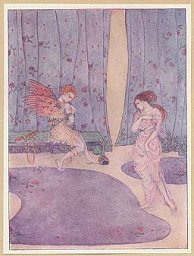

[Intangible Textual Heritage](../../index)  [Classics](../index.md) 

------------------------------------------------------------------------

### THE MOST PLEASANT AND DELECTABLE TALE OF THE MARRIAGE OF CUPID AND PSYCHE

#### By Apuleius.

#### Translated by William Adlington.

#### Illustrations by Dorothy Mullock

#### \[1914\]

------------------------------------------------------------------------

[Title Page](cap00.md)  
[Introductory Note](cap01.md)  

### Cupid and Psyche

[Part I](cap02.md)  
[Part II](cap03.md)  
[Part III](cap04.md)  
[Part IV](cap05.md)  
[Part V](cap06.md)  
[Part VI](cap07.md)  
[Part VII](cap08.md)  
[Part VIII](cap09.md)  
