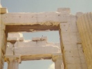

  
[Intangible Textual Heritage](../../index)  [Classics](../index) 
[Index](index)  [Previous](dep102) 

------------------------------------------------------------------------

[Buy this Book at
Amazon.com](https://www.amazon.com/exec/obidos/ASIN/B002D48Q7A/internetsacredte)

------------------------------------------------------------------------

  
*The Discourses of Epictetus*, tr. by P.E Matheson, \[1916\], at
Intangible Textual Heritage

------------------------------------------------------------------------

p. 611

### SUBJECT INDEX TO THE DISCOURSES OF EPICTETUS

(*The numbers refer to pages*)

Admiration, desire for, [261](dep021.htm#page_261)

Adultery, [256](dep019.htm#page_256), [287](dep036.htm#page_287)

Affection, family, [243](dep011.htm#page_243) ff.; limits of,
[397](dep083.htm#page_397)

Anger, two kinds of, [462](dep101.htm#page_462)

Another, i.e., God, [267](dep026.htm#page_267),
[350](dep062.htm#page_350), [415](dep087.htm#page_415)

Anxiety, [305](dep044.htm#page_305) ff.

Appropriate acts, [357](dep066.htm#page_357), [476](dep102.htm#page_476)

Assent, [272](dep028.htm#page_272), [364](dep071.htm#page_364),
[466](dep101.htm#page_466)

Attachment to places, [396](dep083.htm#page_396),
[428](dep090.htm#page_428)

Attention, [453](dep097.htm#page_453) ff.

Authority, [266](dep025.htm#page_266), [275](dep029.htm#page_275),
[439](dep093.htm#page_439)-[440](dep093.htm#page_440); of the Cynic,
[385](dep081.htm#page_385)

 

Babbling, [455](dep098.htm#page_455)

Bazaar, the, of life,
[309](dep046.htm#page_309)-[310](dep046.htm#page_310)

Beauty, the fulfilment of one's nature, [343](dep060.htm#page_343)

Body, a beast of burden, [413](dep087.htm#page_413); needs care,
[451](dep097.htm#page_451); body and mind, [229](dep003.htm#page_229),
[380](dep081.htm#page_380), [465](dep101.htm#page_465)

Books and life, [270](dep027.htm#page_270), [318](dep049.htm#page_318)

 

Caesar's court, [292](dep038.htm#page_292); fortune,
[407](dep087.htm#page_407); friends, [409](dep087.htm#page_409)

Character, to be true to one's, [226](dep002.htm#page_226) ff.

Children, [277](dep030.htm#page_277), [366](dep072.htm#page_366),
[439](dep093.htm#page_439)

Citadel, the inner and the outer, [414](dep087.htm#page_414)

City, the great, [377](dep081.htm#page_377), [393](dep083.htm#page_393);
the small, [290](dep037.htm#page_290)

Cleanliness, inward and outward, [450](dep096.htm#page_450) ff.

Community, the, its claims on all, [259](dep020.htm#page_259)

Conceit, [316](dep048.htm#page_316), [367](dep072.htm#page_367)

Confidence, based on skill, [307](dep045.htm#page_307); confidence and
caution, [281](dep033.htm#page_281) ff.

Conflict, [262](dep023.htm#page_262)

Consideration, need for, [368](dep073.htm#page_368) ff.

Constancy, [275](dep029.htm#page_275) ff.

Contention, [429](dep090.htm#page_429) ff.

Contentment, [247](dep013.htm#page_247) ff.

Conversation, [478](dep102.htm#page_478), [479](dep102.htm#page_479)

Craftsman, the, in nature, [233](dep006.htm#page_233)

Crisis, the, shows the value of study, [277](dep030.htm#page_277); what
it demands, [280](dep030.htm#page_280)

Cynic, the, the ideal teacher, [376](dep080.htm#page_376) ff.,
[444](dep094.htm#page_444)

 

Death, [270](dep027.htm#page_270)-[271](dep028.htm#page_271),
[281](dep033.htm#page_281)-[282](dep033.htm#page_282),
[291](dep038.htm#page_291), [296](dep040.htm#page_296),
[405](dep085.htm#page_405),
[447](dep096.htm#page_447)-[448](dep096.htm#page_448)

Departments of study, [347](dep060.htm#page_347)

Destiny, [337](dep055.htm#page_337), [385](dep081.htm#page_385),
[418](dep087.htm#page_418), [483](dep102.htm#page_483)

Difficulties try men, [264](dep024.htm#page_264)

Diffidence, [367](dep072.htm#page_367)

Discontent, [248](dep013.htm#page_248), [458](dep101.htm#page_458)

Discussion, its true nature, [303](dep044.htm#page_303)

Display to be shunned, [367](dep072.htm#page_367),
[386](dep081.htm#page_386)

Diviners, [293](dep039.htm#page_293)

Doctrine and life, [297](dep041.htm#page_297),
[322](dep051.htm#page_322),
[323](dep051.htm#page_323)-[324](dep051.htm#page_324)

Door, the open, [241](dep010.htm#page_241), [266](dep025.htm#page_266),
[267](dep026.htm#page_267), [282](dep033.htm#page_282),
[358](dep066.htm#page_358)

 

Educated, the, and the uneducated, [279](dep030.htm#page_279)

Education (see also Teacher), [227](dep003.htm#page_227),
[262](dep023.htm#page_262), [318](dep049.htm#page_318)

Enfranchisement not freedom, [408](dep087.htm#page_408),
[417](dep087.htm#page_417)

Equality of character, [456](dep099.htm#page_456)

Error, [255](dep018.htm#page_255)-[256](dep019.htm#page_256),
[342](dep058.htm#page_342)-[342](dep058.htm#page_342),
[454](dep098.htm#page_454)-[455](dep098.htm#page_455)

Evil means loss, [299](dep042.htm#page_299)

Examples, great (Socrates and others),
[320](dep050.htm#page_320)-[321](dep050.htm#page_321),
[395](dep083.htm#page_395)-[396](dep083.htm#page_396),
[420](dep087.htm#page_420)-[421](dep087.htm#page_421)

Expression and eloquence, [334](dep054.htm#page_334) ff.

 

Facing both ways, [423](dep087.htm#page_423)

Faculties maintained by exercise, [297](dep041.htm#page_297)

Fear, [266](dep025.htm#page_266), [305](dep044.htm#page_305),
[437](dep092.htm#page_437)

Festival, life a, [416](dep087.htm#page_416)

Flattery, [394](dep083.htm#page_394), [395](dep083.htm#page_395)

Flesh, the, [356](dep066.htm#page_356) ff.

Forlorn, [365](dep071.htm#page_365) ff.

Freedom, [247](dep013.htm#page_247),
[396](dep083.htm#page_396)-[397](dep083.htm#page_397),
[406](dep087.htm#page_406) ff., [410](dep087.htm#page_410),
[417](dep087.htm#page_417), [436](dep092.htm#page_436),
[438](dep093.htm#page_438)

Friendship, [330](dep053.htm#page_330) ff.; limits of,
[382](dep081.htm#page_382)

 

Game, how to play the,
[288](dep036.htm#page_288)-[289](dep037.htm#page_289)

Games (public), [234](dep007.htm#page_234), [368](dep073.htm#page_368),
[395](dep083.htm#page_395), [478](dep102.htm#page_478)

p. 612

Genius, man's guardian, [251](dep015.htm#page_251)

Given, what is, [226](dep002.htm#page_226)

Gladiators, [277](dep030.htm#page_277)

God, the Father of men, [229](dep003.htm#page_229),
[239](dep009.htm#page_239)-[240](dep010.htm#page_240),
[241](dep010.htm#page_241), [249](dep013.htm#page_249); beholds all,
[250](dep014.htm#page_250)-[251](dep015.htm#page_251); worthy of praise,
[253](dep017.htm#page_253)

God's will, [415](dep087.htm#page_415), [426](dep090.htm#page_426),
[448](dep096.htm#page_448)

Good, conception of, [317](dep049.htm#page_317); nature of,
[294](dep039.htm#page_294) ff.,
[379](dep081.htm#page_379)-[380](dep081.htm#page_380); from outward
things, [373](dep079.htm#page_373); in the region of the will,
[263](dep023.htm#page_263), [275](dep029.htm#page_275),
[349](dep061.htm#page_349)

Governing Principle, [252](dep016.htm#page_252),
[260](dep021.htm#page_260), [270](dep027.htm#page_270),
[284](dep033.htm#page_284),

[352](dep063.htm#page_352), [354](dep064.htm#page_354),
[360](dep068.htm#page_360), [362](dep069.htm#page_362),
[429](dep090.htm#page_429)

Greatness, [274](dep029.htm#page_274)

Growth, gradual and unseen, [252](dep016.htm#page_252),
[444](dep094.htm#page_444)

 

Habit, to be conquered by habit, [270](dep027.htm#page_270); confirmed
by exercise, [329](dep053.htm#page_329), [401](dep084.htm#page_401)

Happiness, [400](dep083.htm#page_400)

Helmsman, the, [470](dep102.htm#page_470)

Hymn to God, [253](dep017.htm#page_253)

 

Impressions, [224](dep002.htm#page_224), [270](dep027.htm#page_270),
[272](dep028.htm#page_272)-[273](dep029.htm#page_273); apprehensive
impressions, [349](dep061.htm#page_349), [358](dep066.htm#page_358),
[426](dep090.htm#page_426)

Indifferent things, [280](dep030.htm#page_280),
[290](dep037.htm#page_290) ff., [323](dep051.htm#page_323)

Introductions, [315](dep048.htm#page_315), [319](dep049.htm#page_319)

Inward and outward, [285](dep034.htm#page_285)

 

Judgements, importance of, [243](dep011.htm#page_243) ff.,
[255](dep018.htm#page_255), [258](dep020.htm#page_258),
[314](dep048.htm#page_314), [348](dep061.htm#page_348),
[361](dep068.htm#page_361), [387](dep082.htm#page_387),
[429](dep090.htm#page_429), [431](dep091.htm#page_431) ff.,
[469](dep102.htm#page_469); stubbornness in, [310](dep046.htm#page_310)

 

Law of life, the, [269](dep027.htm#page_269) ff.

Lecture-room, the,
[329](dep053.htm#page_329)-[330](dep053.htm#page_330),
[352](dep063.htm#page_352), [374](dep079.htm#page_374),
[399](dep083.htm#page_399), [419](dep087.htm#page_419)

Letters of introduction, [241](dep010.htm#page_241),
[286](dep034.htm#page_286)

'Liar,' the, argument, [318](dep049.htm#page_318),
[320](dep050.htm#page_320), [330](dep053.htm#page_330)

Life, a spectacle, [234](dep007.htm#page_234); a soldier's service,
[393](dep083.htm#page_393); a festival, [416](dep087.htm#page_416); a
preparation, [285](dep034.htm#page_285); a banquet,
[471](dep102.htm#page_471); a play, [472](dep102.htm#page_472); a
bazaar, [309](dep046.htm#page_309)

Listening requires skill, [339](dep056.htm#page_339)

Logical studies, value of, [236](dep007.htm#page_236) ff.,
[253](dep017.htm#page_253) ff.; for whom suited,
[348](dep061.htm#page_348)

Loss and gain, [404](dep085.htm#page_404)

Lower animals, lessons from, [264](dep024.htm#page_264)

 

Man, takes cognizance of himself, [234](dep007.htm#page_234); a portion
of God's being, [250](dep014.htm#page_250), [295](dep040.htm#page_295);
part of a larger whole, [290](dep037.htm#page_290),
[438](dep093.htm#page_438); not a beast or a sheep,
[298](dep041.htm#page_298)

Manumission, [283](dep033.htm#page_283)

Marriage, [382](dep081.htm#page_382); in Plato's *Republic*, Frag. 15,
[463](dep101.htm#page_463)

'Master,' the, argument, [321](dep050.htm#page_321)

Masters, [279](dep030.htm#page_279), [306](dep045.htm#page_306),
[411](dep087.htm#page_411)

Mastery, [417](dep087.htm#page_417)

Material things, wrongly valued, [256](dep019.htm#page_256),
[288](dep036.htm#page_288)

Messenger, the, within, [382](dep081.htm#page_382)

Moral judgements need training, [270](dep027.htm#page_270)

Mysteries, [375](dep080.htm#page_375), [416](dep087.htm#page_416)

 

Names suggest conduct, [298](dep041.htm#page_298) ff.

Natural, [289](dep037.htm#page_289)-[290](dep037.htm#page_290)

Nature, harmony with, [234](dep007.htm#page_234); to understand,
[254](dep018.htm#page_254); God's will, [225](dep002.htm#page_225); the
will of Nature, [474](dep102.htm#page_474)

 

Obedience, limits of, [266](dep025.htm#page_266); obedience to God,
[398](dep083.htm#page_398), [399](dep083.htm#page_399)

Obstinacy, a sign of weakness, [311](dep047.htm#page_311)

Office wrongly valued, [259](dep020.htm#page_259)

Official career, [448](dep096.htm#page_448)

Officials, Roman, [351](dep062.htm#page_351),
[355](dep066.htm#page_355); local, [346](dep060.htm#page_346)

One's own and not one's own, [256](dep019.htm#page_256),
[274](dep029.htm#page_274), [390](dep082.htm#page_390),
[413](dep087.htm#page_413), [424](dep088.htm#page_424),
[468](dep102.htm#page_468)

Oracles, [477](dep102.htm#page_477)

Outside, the, no test,
[441](dep093.htm#page_441)-[442](dep094.htm#page_442)

 

Pancratiast, [343](dep060.htm#page_343)

Passion, [320](dep050.htm#page_320); tyranny of,
[407](dep087.htm#page_407)

Patron of Cnossus, [359](dep068.htm#page_359)

Peace of mind, [282](dep033.htm#page_282), [366](dep072.htm#page_366),
[409](dep087.htm#page_409), [425](dep090.htm#page_425); Diogenes,
[264](dep024.htm#page_264); Socrates, [268](dep026.htm#page_268)

Pentathlon, [343](dep060.htm#page_343), [386](dep081.htm#page_386),
[476](dep102.htm#page_476)

Philosopher, the, depends on himself, [240](dep010.htm#page_240); may
learn from worldlings, [242](dep010.htm#page_242); must assert man's
freedom, [255](dep018.htm#page_255); trains men,
[270](dep027.htm#page_270); profession of, [296](dep040.htm#page_296);
differs from the layman, [279](dep030.htm#page_279),
[372](dep077.htm#page_372); how to be a, [473](dep102.htm#page_473); a
hard task, [476](dep102.htm#page_476); should act on his principles,
[481](dep102.htm#page_481); sham philosophers,
[442](dep094.htm#page_442)

Philosophy, what it professes,
[251](dep015.htm#page_251)-[252](dep016.htm#page_252); beginning of,
[300](dep042.htm#page_300); a slow process, [308](dep046.htm#page_308);
needs care, [369](dep074.htm#page_369); philosophy and principles,
[403](dep085.htm#page_403)

Piety, [476](dep102.htm#page_476)-[477](dep102.htm#page_477)

Pity, [433](dep091.htm#page_433)

Pleasure, [463](dep101.htm#page_463)

Power, responsibility and, [249](dep013.htm#page_249); things in our,
[468](dep102.htm#page_468)

Practice, value of, [257](dep019.htm#page_257),
[312](dep047.htm#page_312)

p. 613

Primary conceptions, [261](dep021.htm#page_261) ff.; how to apply,
[316](dep048.htm#page_316) ff.

Progress, [230](dep005.htm#page_230) ff., [300](dep042.htm#page_300),
[354](dep064.htm#page_354), [471](dep102.htm#page_471),
[482](dep102.htm#page_482)

Providence, [233](dep006.htm#page_233) ff.,
[252](dep016.htm#page_252)-[253](dep017.htm#page_253),
[370](dep075.htm#page_370)-[371](dep076.htm#page_371)

Purple, the purple thread, [227](dep003.htm#page_227),
[345](dep060.htm#page_345)

 

Rank, [367](dep072.htm#page_367)-[368](dep073.htm#page_368)

Reading no substitute for character, [231](dep005.htm#page_231)

Reason, [224](dep002.htm#page_224); man's 'good,'
[249](dep013.htm#page_249); takes cognizance of itself,
[260](dep021.htm#page_260)-[261](dep021.htm#page_261)

Relations, [350](dep062.htm#page_350)

Rhetorical arguments, their danger, [238](dep008.htm#page_238); their
value secondary, [239](dep009.htm#page_239)

 

School, life a, [235](dep007.htm#page_235)

Self-advancement, [242](dep010.htm#page_242)-[243](dep011.htm#page_243)

Self-control, [249](dep013.htm#page_249)

Self-respect, [445](dep094.htm#page_445)-[446](dep095.htm#page_446),
[473](dep102.htm#page_473)-[474](dep102.htm#page_474)

Self-sufficiency, [365](dep071.htm#page_365)

Shows and spectacles, [227](dep003.htm#page_227)

Signal, the, to retire, [241](dep010.htm#page_241),
[366](dep072.htm#page_366), [398](dep083.htm#page_398),
[404](dep085.htm#page_404)

Simple life, [403](dep085.htm#page_403), [481](dep102.htm#page_481)

Slavery, [406](dep087.htm#page_406) ff., [420](dep087.htm#page_420)

Social life, rules for,
[478](dep102.htm#page_478)-[479](dep102.htm#page_479)

Society, influence of,
[369](dep074.htm#page_369)-[370](dep075.htm#page_370)

Sorrow, [392](dep083.htm#page_392)

Standards, [227](dep003.htm#page_227); necessary,
[244](dep012.htm#page_244); and freedom, [248](dep013.htm#page_248); in
conduct, [274](dep029.htm#page_274); found by philosophy,
[301](dep043.htm#page_301); of Nature, [326](dep052.htm#page_326)

Strength of mind, false,
[232](dep005.htm#page_232)-[233](dep006.htm#page_233)

Student, the, [362](dep069.htm#page_362)

Study, necessity of, [246](dep012.htm#page_246),
[260](dep021.htm#page_260)-[261](dep021.htm#page_261),
[360](dep068.htm#page_360), [403](dep085.htm#page_403); true and false,
[269](dep027.htm#page_269); its limits,
[271](dep028.htm#page_271)-[272](dep028.htm#page_272); relation of study
to life, [313](dep048.htm#page_313)-[314](dep048.htm#page_314),
[362](dep069.htm#page_362),
[374](dep079.htm#page_374)-[375](dep080.htm#page_375),
[426](dep090.htm#page_426), [482](dep102.htm#page_482).

Suicide, warning against hasty, [241](dep010.htm#page_241); allowed (the
open door), [266](dep025.htm#page_266); (God's signal),
[399](dep083.htm#page_399)

Sun and stars, [315](dep048.htm#page_315)

Superiority, [367](dep072.htm#page_367)-[368](dep073.htm#page_368),
[481](dep102.htm#page_481)

Sympathy, [472](dep102.htm#page_472)

 

Teacher and pupil, deadness of, [241](dep010.htm#page_241); influence
each other, [243](dep011.htm#page_243), [324](dep051.htm#page_324),
[339](dep056.htm#page_339); the true spirit of the teacher,
[329](dep053.htm#page_329); his duty, [344](dep060.htm#page_344); his
attraction, [388](dep082.htm#page_388); a benefactor,
[232](dep005.htm#page_232); must be trained,
[374](dep079.htm#page_374)[375](dep080.htm#page_375); the Ideal Teacher,
[376](dep080.htm#page_376)

Theatre, excitement in,
[351](dep062.htm#page_351)-[352](dep063.htm#page_352)

Things, tyranny of, [411](dep087.htm#page_411)

Tragedy, due to false values, [231](dep005.htm#page_231),
[274](dep029.htm#page_274)

Training, [226](dep002.htm#page_226), [363](dep070.htm#page_363) ff.,
[463](dep101.htm#page_463)

Traveller, the, in life, [415](dep087.htm#page_415)

Troubles, their origin, [271](dep028.htm#page_271)

Truth, [467](dep101.htm#page_467)

Tyrants, have limited power, [257](dep019.htm#page_257),
[275](dep029.htm#page_275); tragic figures,
[265](dep025.htm#page_265)-[266](dep025.htm#page_266); within us,
[414](dep087.htm#page_414)

 

Uneducated, the, [372](dep077.htm#page_372)

Unhappiness, men's fault, [390](dep082.htm#page_390)

Universe, the, composition of, [458](dep101.htm#page_458); conflagration
of, [365](dep071.htm#page_365); all things obey,
[458](dep101.htm#page_458)-[459](dep101.htm#page_459); the process of,
[460](dep101.htm#page_460); full of friends, [391](dep083.htm#page_391)

 

Values, true, [422](dep087.htm#page_422)-[423](dep087.htm#page_423),
[424](dep088.htm#page_424), [435](dep092.htm#page_435)

 

Wand, the, of Hermes, [374](dep079.htm#page_374)

War, origin of, [332](dep054.htm#page_332)-[333](dep054.htm#page_333)

Will, training of the, [226](dep002.htm#page_226),
[358](dep066.htm#page_358), [415](dep087.htm#page_415); not to be sold
cheap, [228](dep003.htm#page_228)

Witness to God, [278](dep030.htm#page_278),
[399](dep083.htm#page_399)-[400](dep083.htm#page_400)

World, the tumult of the,
[427](dep090.htm#page_427)-[428](dep090.htm#page_428)

 

Zeus sees all, [363](dep070.htm#page_363)

 
