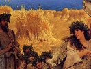

  
[Intangible Textual Heritage](../../index)  [Classics](../index.md) 
[Index](index)  [Previous](ebm01)  [Next](ebm03.md) 

------------------------------------------------------------------------

  
*The Eleusinian and Bacchic Mysteries*, by Thomas Taylor, \[1891\], at
Intangible Textual Heritage

------------------------------------------------------------------------

p. 7

 

#### CONTENTS.

|                                                                        |                           |
|------------------------------------------------------------------------|---------------------------|
| Fable is Love’s World, Poem by Schiller | [9](ebm03.htm#page_9.md)     |
| Introduction                            | [11](ebm04.htm#page_11.md)   |
| Section I., Eleusinian Mysteries        | [31](ebm05.htm#page_31.md)   |
| Section II., Bacchic Mysteries          | [187](ebm06.htm#page_187.md) |
| Hymn to Minerva                         | [224](ebm06.htm#page_224.md) |
| Appendix                                | [229](ebm08.htm#page_229.md) |
| Orphic Hymns                            | [238](ebm09.htm#page_238.md) |
| Hymn of Cleanthes                       | [239](ebm09.htm#page_239.md) |
| Glossary                                | [241](ebm11.htm#page_241.md) |
| List of Illustrations                   | [248](ebm12.htm#page_248.md) |

------------------------------------------------------------------------

[Next: Fable is Love’s World, Poem by Schiller](ebm03.md)
