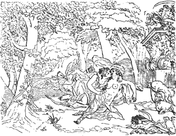
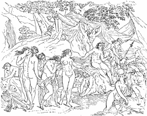
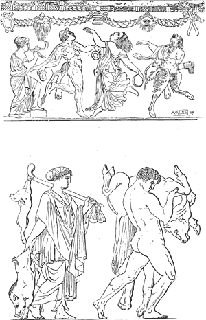
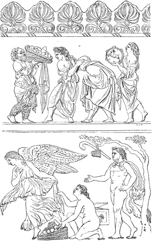
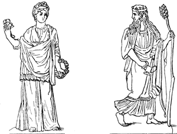
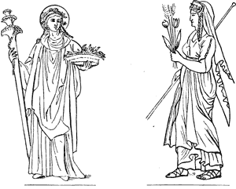
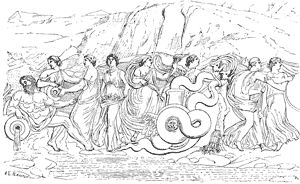

  
[Intangible Textual Heritage](../../index)  [Classics](../index) 
[Index](index)  [Previous](ebm04)  [Next](ebm06) 

------------------------------------------------------------------------

  
*The Eleusinian and Bacchic Mysteries*, by Thomas Taylor, \[1891\], at
Intangible Textual Heritage

------------------------------------------------------------------------

p. 31

## THE ELEUSINIAN AND BACCHIC

   
Dionysus as God of the Sun.

### ❦ SECTION I. ❦

Dr. Warburton, in his Divine Legation of
Moses, has ingeniously proved, that the sixth book of Virgil’s Æneid
represents some of the dramatic exhibitions of the Eleusinian Mysteries;
but, at the same time, has utterly failed in attempting to unfold their
latent meaning, and obscure though important end. By the assistance,
however, of the Platonic philosophy, I have been enabled to correct his
errors, and to vindicate the wisdom [\*](#fn_9)
of antiquity from his aspersions

p. 32

by a genuine account of this sublime institution; of which the following
observations are designed as a comprehensive view.

In the first place, then, I shall present the reader with two superior
authorities, who perfectly demonstrate that a part of the shows (or
dramas) consisted in a representation of the infernal regions;
authorities which, though of the last consequence, were unknown to Dr.
Warburton himself. The first of these is no less a person than the
immortal Pindar, in a fragment preserved by Clemens Alexandrinus: “Ἀλλα
και Πινδαρος περι των εν Ελευσινι μυστηριων λεγων επιφερει. Ολβιος,
οστις ιδων εκεινα, κοινα εις ὑποχϑονια, οιδεν μεν βιον τελευταν, οιδεν
δε διος δοτον αρχαν.” [\*](#fn_10) *i. e.* “But
Pindar, speaking of the Eleusinian Mysteries, says: Blessed is he who,
having

p. 33

seen those *common concerns* in the underworld, knows both the end of
life and its divine origin from Jupiter.” The other of these is from
Proclus in his Commentary on Plato’s *Politicus*, who, speaking
concerning the sacerdotal and symbolical mythology, observes, that from
this mythology Plato himself establishes many of his own peculiar
doctrines, “since in the *Phædo* he venerates, with a becoming silence,
the assertion delivered in the arcane discourses, that men are placed in
the body as in a prison, secured by a guard, *and testifies, according
to the mystic ceremonies, the different allotments of purified and
unpurified souls in Hades, their severed conditions, and the
three-forked path from the peculiar places where they were; and this was
shown according to traditionary institutions; every part of which is
full of a symbolical representation, as in a dream, and of a description
which treated of the ascending and descending ways, of the tragedies of
Dionysus (Bacchus or Zagreus), the crimes of the Titans, the three ways
in Hades, and*

p. 34

*the wandering of everything of a similar kind*.”—“Δηλοι δε εν Φαιδωνι
τον τε εν απρῥοητοις λεγομενον, ὡς εντινι φρουρᾳ εσμεν ὁι ανϑρωποι, σιγῃ
τῃ τρεπουση σεβων, και τας τελετας (lege και κατα τας τελετα)
μαρτυρομενος των διαφορων ληξεων της ψυχης κεκαϑαρμενης τε και ακαϑαρτου
εις ᾁδου απιουσης, και τας τε σχεσεις αυ, και τας τριοδους απο των
ουσιων και των (lege καί κατα των), πατρικων ϑεσμων τεκμαιρομενος. α δη
της συμβολικης ἁπαντα ϑεωριας εστι μεστα, και των παρα τοις ποιηταις
ϑρυλλουμενων ανοδων τε και καϑοδων, των τε διονυσιακων συνϑηματων, και
των τιτανικων ἁμαρτηματων λεγομενων, και των εν ᾁδου τριοδων, και της
πλανης, και των τοιουτων ἁπαντων.” [\*](#fn_11)

Having premised thus much, I now proceed to prove that the dramatic
spectacles of the Lesser Mysteries [†](#fn_12)
were designed by the ancient theologists, their founders, to signify
occultly the condition of the unpurified soul

p. 35

invested with an earthly body, and enveloped in a material and physical
nature; or, in other words, to signify that such a soul in the present
life might be said to die, as far as it is possible for a soul to die,
and that on the dissolution of the present body, while in this state of
impurity, it would experience a death still more permanent and profound.
That the soul, indeed, till purified by philosophy, [\*](#fn_13) suffers death through its union with the
body was obvious to the philologist Macrobius, who, not penetrating the
secret meaning of the ancients, concluded from hence that they signified
nothing more than the present body, by their descriptions of the
infernal abodes. But this is manifestly absurd; since it is universally
agreed, that all the ancient theological poets and philosophers
inculcated the doctrine of a future state of rewards and punishments in
the most full and decisive terms; at the same time occultly intimating
that *the death of the soul was nothing more than a profound union with
the ruinous bonds of the body.*

p. 36

\[paragraph continues\] Indeed, if these
wise men believed in a future state of retribution, and at the same time
considered a connection with the body as death of the soul, it
necessarily follows, that the soul’s punishment and existence hereafter
are nothing more than a continuation of its state at present, and a
transmigration, as it were, from sleep to sleep, and from dream to
dream. But let us attend to the assertions of these divine men
concerning the soul’s union with a material nature. And to begin with
the obscure and profound Heracleitus, speaking of souls unembodied: “We
live their death, and we die their life.” Ζωμεν τον εκεινων ϑανατον,
τεϑνηκαμεν δε τον εκεινων βιον. And Empedocles, deprecating the
condition termed “generation,” beautifully says of her:

> The aspect changing with destruction dread,  
> She makes the *living* pass into the *dead*.

> Εκ μεν γαρ ζωων ετιϑει νεκρα ειδε αμειβων.

And again, lamenting his connection with this corporeal world, he
pathetically exclaims:

p. 37

> For this I weep, for this indulge my woe,  
> That e’er my soul such novel realms should know.

> Κλαυσα τε και κωκυσα, ῶων ασυνηϑεα χωρον.

Plato, too, it is well known, considered the body as the sepulchre of
the soul, and in the *Cratylus* concurs with the doctrine of Orpheus,
that the soul is punished through its union with body. This was likewise
the opinion of the celebrated Pythagorean, Philolaus, as is evident from
the following remarkable passage in the Doric dialect, preserved by
Clemens Alexandrinus in *Stromat*. book iii. “Μαρτυρεοντα δε και οι
παλαιοι ϑεολογοι τε και μαντιες, ὡς δια τινας τιμωριας, ἁ ψυχα τῳ σωματι
συνεζευκται, και καϑαπερ εν σωματι τομτῳ τεϑαπται.” *i. e*. “The ancient
theologists and priests [\*](#fn_14) also
testify that the soul is united with the body as if for the sake of
punishment; [†](#fn_15) and so is buried in body
as in a sepulchre.” And, lastly, Pythagoras

p. 38

himself confirms the above sentiments, when he beautifully observes,
according to Clemens in the same book, “that *whatever we see when awake
is death; and when asleep, a dream*.” θανατος εστιν, οκοσα εγερϑεντες
ορεομεν· οκοσα δε ευδοντες, ὑπνος.

But that the mysteries occultly signified this sublime truth, that the
soul by being merged in matter resides among the dead both here and
hereafter, though it follows by a necessary sequence from the preceding
observations, yet it is indisputably confirmed, by the testimony of the
great and truly divine Plotinus, in *Ennead* I., book viii. “When the
soul,” says he, “has descended into generation (from its first divine
condition) she partakes of evil, and is carried a great way into a state
the opposite of her first purity and integrity, *to be entirely merged
in which, is nothing more than to fall into dark mire*.” And again, soon
after: “The soul therefore *dies* as much as it is possible for the soul
to die: *and the death to her is while baptized or immersed in the
present*

p. 39

*body, to descend into matter, [\*](#fn_16) and
be wholly subjected by it; and after departing thence to lie there till
it shall arise and turn its face away from the abhorrent filth. This is
what is meant by the falling asleep in Hades, of those who have come
there*.” [†](#fn_17)

p. 40

\[paragraph continues\] Γινομενῳ δε ἡ
μεταληψις αυτου. Γιψνεται γαρ πανταπασιν εν τῳ της ανομοιοτητος τοπῳ,
ενϑα δυς εις αυτην εις βορβορον σκοτεινον εσται πεσων.—Αποϑνησκει ουν,
ως ψυχη αν ϑανοι· και ὁ ϑανατος αυτῃ, και ετι εν τω σωματι βεβαπτισμενη,
εν ὑλῃ εστι καταδυναι, και πλησϑηναι αυτης. Και εξελϑουσης εκει κεισϑαι,
εως αναδραμῃ και αφελῃ πως την οψιν εκ του βορβορου. Και τουτο εστι το
εν ᾁδου ελϑοντα επικατα δαρϑειν. Here the

p. 41 p. 42

   
Narcissus.                    Herse and Mercury.

p. 43

reader may observe that the obscure doctrine of the Mysteries mentioned
by Plato in the *Phædo*, that the unpurified soul in a future state lies
immerged in mire, is beautifully explained; at the same time that our
assertion concerning their secret meaning is not less substantially
confirmed. [\*](#fn_18) In a similar manner the
same divine philosopher, in his book on the Beautiful, *Ennead*, I.,
book vi., explains the fable of Narcissus as an emblem of one who rushes
to the contemplation of sensible (phenomenal) forms as if they were
perfect realities, when at the same time they are nothing more than like
beautiful images appearing in water, fallacious and vain. “Hence,” says
he, “as Narcissus, by catching at the shadow, plunged himself in the
stream and disappeared, so he who is captivated by beautiful bodies, and
does not depart from their embrace, is precipitated, not with his body,
but with

p. 44

his soul, into a darkness profound and repugnant to intellect (the
higher soul), [\*](#fn_19) through which,
remaining blind both here and in Hades, he associates with shadows.” Τον
αυτον δη τροπον ὁ εχομενος των καλων σωμα των, και μη αφιεις, ου τῳ
σωματι, τῃ δε ψυχῃ καταδυσεται, εις σκοτεινα και ατερπη τῳ νῳ βαϑη, ενϑα
τυφλος εν ᾁδου μενων, και ενταυϑα κᾳκει σκιαις συνεστι. And what still
farther confirms our exposition is that matter was considered by the
Egyptians as a certain mire or mud. “The Egyptians,” says Simplicius,
“called matter, which they symbolically denominated water, the dregs or
sediment of the first life; matter being, as it were, a certain mire or
mud. [†](#fn_20) Διο και Αιγυπτιοι την της
πρωτης ζωης, ἡν ὑδωρ συμβολικως εκαλουν, ὑποσταϑμην την ὑλην ελεγον,
ὁιον ιλον τινα ουσαν. So that from all

p. 45

that has been said we may safely conclude with Ficinus, whose words are
as express to our purpose as possible. “Lastly,” says he, “that I may
comprehend the opinion of the ancient theologists, on the state of the
soul after death, in a few words: *they considered*, as we have
elsewhere asserted, *things divine as the only realities, and that all
others were only the images and shadows of truth*. Hence they asserted
that prudent men, who earnestly employed themselves in divine concerns,
were above all others in a vigilant state. But that imprudent \[*i. e*.
without foresight\] men, who pursued objects of a different nature,
being laid asleep, as it were, were only engaged in the delusions of
dreams; and that if they happened to die in this sleep, before they were
roused, they would be afflicted with similar and still more dazzling
visions in a future state. And that as he who in this life pursued
realities, would, after death, enjoy the highest truth, so he who
pursued deceptions would hereafter be tormented with fallacies and
delusions in the extreme: as the one

p. 46

would be delighted with true objects of enjoyment, so the other would be
tormented with delusive semblances of reality.”—Denique ut priscorum
theologorum sententiam de statu animæ post mortem paucis comprehendam:
sola divina (ut alias diximus) arbitrantur res veras existere, reliqua
esse rerum verarum imagines atque umbras. Ideo prudentes homines, qui
divinis incumbunt, præ ceteris vigilare. Imprudentes autem, qui
sectantur alia, insomniis omnino quasi dormientes illudi, ac si in hoc
somno priusquam expergefacti fuerint moriantur similibus post discessum
et acrioribus visionibus angi. Et sicut eum qui in vita veris incubuit,
post mortem summa veritate potiri, sic eum qui falsa sectatus est,
fallacia extrema torqueri, ut ille rebus veris oblectetur, hic falsis
vexetur simulachris.” [\*](#fn_21)

But notwithstanding this important truth was obscurely hinted by the
Lesser Mysteries, we must not suppose that it was generally

p. 47

known even to the initiated persons themselves: for as individuals of
almost all descriptions were admitted to these rites, it would have been
a ridiculous prostitution to disclose to the multitude a theory so
abstracted and sublime. [\*](#fn_22) It was
sufficient to instruct these in the doctrine of a future state of
rewards and punishments, and in the means of returning to the principles
from which they originally fell: for this

p. 48

last piece of information was, according to Plato in the *Phædo*, the
ultimate design of the Mysteries; and the former is necessarily inferred
from the present discourse. Hence the reason why it was obvious to none
but the Pythagorean and Platonic philosophers, who derived their
theology from Orpheus himself, [\*](#fn_23) the
original founder of these sacred institutions; and why we meet with no
information in this particular in any writer prior to Plotinus; as he
was the first who, having penetrated the profound interior wisdom of
antiquity, delivered it to posterity without the concealments of mystic
symbols and fabulous narratives.

##### VIRGIL NOT A PLATONIST.

Hence too, I think, we may infer, with the greatest probability, that
this recondite meaning of the Mysteries was not known

p. 49

even to Virgil himself, who has so elegantly described their external
form; for notwithstanding the traces of Platonism which are to be found
in the *Æneid*, nothing of any great depth occurs throughout the whole,
except what a superficial reading of Plato and the dramas of the
Mysteries might easily afford. But this is not perceived by modern
readers, who, entirely unskilled themselves in Platonism, and fascinated
by the charms of his poetry, imagine him to be deeply knowing in a
subject with which he was most likely but slightly acquainted. This
opinion is still farther strengthened by considering that the doctrine
delivered in his *Eclogues* is perfectly Epicurean, which was the
fashionable philosophy of the Augustan age; and that there is no trace
of Platonism in any other part of his works but the present book, which,
containing a representation of the Mysteries, was necessarily obliged to
display some of the principal tenets of this philosophy, so far as they
illustrated and made a part of these mystic exhibitions. However, on the
supposition that this book presents us with

p. 50

a faithful view of some part of these sacred rites, and this accompanied
with the utmost elegance, harmony, and purity of versification, it ought
to be considered as an invaluable relic of antiquity, and a precious
monument of venerable mysticism, recondite wisdom, and theological
information. [\*](#fn_24) This will be
sufficiently evident from what has been already delivered, by
considering some of the beautiful descriptions of this book in their
natural order; at the same time that the descriptions themselves will
corroborate the present elucidations.

In the first place, then, when he says,

> ─────facilis descensus Averno.  
> Noctes atque dies patet atra janua ditis:  
> Sed revocare gradum, superasque evadere ad auras,  
> Hoc opus, hic labor est. Pauci quos æquus amavit  
> Jupiter, aut ardens evexit ad æthera virtus,  
> Dis geniti potuere. Tenent media omnia silvæ,  
> Cocytusque sinu labens, circumvenit atro────†

> † *Davidson’s Translation*.—“Easy is the path that
> leads down to hell; grim Pluto’s gate stands open night and day: but
> to retrace one’s steps, and escape to the upper regions, this is a
> work, this is a task. Some few, whom favoring Jove loved, or
> illustrious virtue p. 51 advanced to heaven,
> the sons of the gods, have effected it. Woods cover all the
> intervening space, and Cocytus, gliding with his black, winding flood,
> surrounds it.”

p. 51

is it not obvious, from the preceding explanation, that by Avernus, in
this place, and the dark gates of Pluto, we must understand a corporeal
or external nature, the descent into which is, indeed, at all times
obvious and easy, but to recall our steps, and ascend into the upper
regions, or, in other words, to separate the soul from the body by the
purifying discipline, is indeed a mighty work, and a laborious task? For
a few only, the favorites of heaven, that is, born with the true
philosophic genius, [\*](#fn_25) and whom ardent
virtue has elevated to a disposition and capacity for divine
contemplation, have been enabled to accomplish the arduous design. But
when he says that all the middle regions are covered with woods, this
likewise plainly intimates a material nature; the word *silva*, as is
well known, being used by ancient writers to signify matter, and implies
nothing more than that the passage leading to the

p. 52

*barathrum* \[abyss\] of body, *i. e*. into profound darkness and
oblivion, is through the medium of a material nature; and this medium is
surrounded by the black bosom of Cocytus, [\*](#fn_26) that is, by bitter weeping and
lamentations, the necessary consequence of the soul’s union with a
nature entirely foreign to her own. So that the poet in this particular
perfectly corresponds with Empedocles in the line we have cited above,
where he exclaims, alluding to this union,

> For this I *weep*, for this *indulge my woe*,  
> That e’er my soul such novel realms should know.

In the next place, he thus describes the cave, through which Æneas
descended to the infernal regions:

> Spelunca alta fuit, vastoque immanis hiatu,  
> Scrupea, tuta lacu nigro, memorumque tenebris:  
> Quam super hand ullæ poterant impune volantes  
> Tendere iter pennis: talis sese halitus atris  
> Faucicus effundens supera ad convexa ferebat:  
> Unde locum Graii dixerunt nomine Aornum──†

> † *Davidson’s Translation*.—“There was a cave
> profound and hideous, with wide yawning mouth, stony, fenced by a
> black lake, p. 53 and the gloom of woods;
> over which none of the flying kind were able to wing their way unhurt;
> such exhalations issuing from its grim jaws ascended to the vaulted
> skies; for which reason the Greeks called the place by the name of
> *Aornos*” (without birds). [†](#fn_27)

p. 53

Does it not afford a beautiful representation of a corporeal nature, of
which a cave, defended with a black lake, and dark woods, is an obvious
emblem? For it occultly reminds us of the ever-flowing and obscure
condition of such a nature, which may be said

> To roll incessant with impetuous speed,  
> Like some dark river, into Matter’s sea.

Nor is it with less propriety denominated *Aornus*, *i. e*. destitute of
birds, or a winged nature; for on account of its native sluggishness and
inactivity, and its merged condition,

p. 54

being situated in the outmost extremity of things, it is perfectly
debile and languid, incapable of ascending into the regions of reality,
and exchanging its obscure and degraded station for one every way
splendid and divine. The propriety too of sacrificing, previous to his
entrance, to Night and Earth, is obvious, as both these are emblems of a
corporeal nature.

In the verses which immediately follow,—

> Ecce autem, primi sub limina solis et ortus,  
> Sub pedibus mugire solum, et juga cæpta movere  
> Silvarum, visaque canes ululare per umbram,  
> Adventante dea──\*

> \* “So, now, at the first beams and rising of the
> sun, the earth under the feet begins to rumble, the wooded hills to
> quake, and dogs were seen howling through the shade, as the goddess
> came hither──”

we may perceive an evident allusion to the earthquakes, etc., attending
the descent of the soul into body, mentioned by Plato in the tenth book
of his *Republic;* [†](#fn_28) since the

p. 55

lapse of the soul, as we shall see more fully hereafter, was one of the
important truths which these Mysteries were intended to reveal. And the
howling dogs are symbols of material [\*](#fn_29) demons, who are thus denominated by the
*Magian Oracles* of Zoroaster, on account of their ferocious and
malevolent dispositions, ever baneful to the felicity of the human soul.
And hence Matter herself is represented by Synesius in his first *Hymn*,
with great propriety and beauty, as barking at the soul with devouring
rage: for thus he sings, addressing himself to the Deity:

> Μακαρ ὁς τις βορον ὑλας  
> Προφυγων ὑλαγμα, και γας  
> Αναδυς, ἁλματι κουφῳ  
> Ιχνος ες ϑεον τιταινει.

Which may be thus paraphrased:

> Blessed! thrice blessed! who, with wingéd speed,  
> From Hylé’s [†](#fn_30) dread voracious
> barking flies,

p. 56

> And, leaving Earth’s obscurity behind,  
> By a light leap, directs his steps to thee.

And that material demons actually appeared to the initiated previous to
the lucid visions of the gods themselves, is evident from the following
passage of Proclus in his manuscript *Commentary on the first
Alcibiades:* εν ταις ἁγιοταταις των τελετων τρο της θεου παρουσιας
δαιμονων χϑονιων εκβολαι προφαινονται, και απο των αχραντων αγαϑων εις
την ὑλην προκαλουμεναι. *I. e*. “In the most interior sanctities of the
Mysteries, before the presence of the god, the rushing forms of earthly
demons appear, and call the attention from the immaculate good to
matter.” And Pletho (*on the Oracles*), expressly asserts, that these
spectres appeared in the shape of dogs.

After this, Æneas is described as proceeding to the infernal regions,
through profound night and darkness:

> Ibant obscuri sola sub nocte per umbram.  
> Perque domos Ditis vacuas, et inania regna.

p. 57

> Quale per incertam lunam sub luce maligna  
> Est iter in silvis: ubi cælum condidit umbra  
> Jupiter, et rebus nox abstulit atra colorem.\*

> \* “They went along, amid the gloom under the
> solitary night, through the shade, and through the desolate halls, and
> empty realms of Dis \[Pluto or Hades\]. Such is a journey in the woods
> beneath the unsteady moon with her niggard light, when Jupiter has
> enveloped the sky in shade, and the black Night has taken from all
> objects their color.”

And this with the greatest propriety; for the Mysteries, as is well
known, were celebrated by night; and in the Republic of Plato, as cited
above, souls are described as falling into the estate of generation at
midnight; this period being peculiarly accommodated to the darkness and
oblivion of a corporeal nature; and to this circumstance the nocturnal
celebration of the Mysteries doubtless alluded.

In the next place, the following vivid description presents itself to
our view:

> Vestibulum ante ipsum, primisque in faucibus
> Orci  
> Luctus, et ultrices posuere cubilia Curæ:  
> Pallentesque habitant morbi, tristisque senectus,  
> Et Metus, et mala suada Fames, ac turpis egestas;

p. 58

> Terribiles visu formæ; Lethumque Laborque;  
> Tum consanguineus Lethi Sopor et mala mentis  
> Gaudia, mortiferumque adverso in limine bellum  
> Ferreique Eumenidum thalami et Discordia demens,  
> Vipereum crinem vittis innexa cruentis.  
> In medio ramos annosaque brachia pandit  
> Ulmus opaca ingens: quam sedem somnia vulgo  
> Vana tenere ferunt, foliisque sub omnibus hærent.  
> Multaque præterea variarum monstra ferarum:  
> Centauri in foribus stabulant, Scyllæque biformes,  
> Et centumgeminus Briareus, ac bellua Lernæ,  
> Horrendum stridens, flammisque armata Chimæra,  
> Gorgones Harpyiæque, et formo tricorporis umbræ.\*

> \* “Before the entrance itself, and in the first
> jaws of Hell, Grief and vengeful Cares have placed their couches; pale
> Diseases inhabit there, and sad Old Age, and Fear, and Want, evil
> goddess of persuasion, and unsightly Poverty—forms terrible to
> contemplate! and there, too, are Death and Toil; then Sleep, akin to
> Death, and evil Delights of mind; and upon the opposite threshold are
> seen death-bringing War, and the iron marriage-couches of the Furies,
> and raving Discord, with her viper-hair bound with gory wreaths. In
> the midst, an Elm dark and huge expands its boughs and aged limbs;
> making an abode which vain Dreams are said to haunt, and under whose
> every leaf they dwell. Besides all these, are many monstrous
> apparitions of various wild beasts. The Centaurs harbor at the gates,
> and double-formed Scyllas, the hundred-fold Briareus, the Snake of
> Lerna, hissing dreadfully, and Chimæra armed with flames, the Gorgons
> and the Harpies, and the shades of three-bodied form.”

And surely it is impossible to draw a more lively picture of the
maladies with which a

p. 59

material nature is connected; of the soul’s dormant condition through
its union with body; and of the various mental diseases to which,
through such a conjunction, it becomes unavoidably subject; for this
description contains a threefold division; representing, in the first
place, the external evil with which this material region is replete; in
the second place, intimating that the life of the soul when merged in
the body is nothing but a dream; and, in the third place, under the
disguise of multiform and terrific monsters, exhibiting the various
vices of our irrational and sensuous part. Hence Empedocles, in perfect
conformity with the first part of this description, calls this material
abode, or the realms of generation,—ατερπεα χωρον, [\*](#fn_31) a “*joyless region*.”

> “Where slaughter, rage, and countless ills
> reside;

> Ενϑα φονος τε κοτος τε και αλλων εθνεα
> κηρων—

and into which those who fall,

p. 60

> “Through Até’s meads and dreadful darkness
> stray.”

> ──────Ατης  
> ──ανα λειμωνα τε και σκοτος ηλασκουσιν.

And hence he justly says to such a soul, that

> “She flies from deity and heav’nly light,  
> To serve *mad Discord* in the realms of night.”

> ────φυγας ϑεοϑεν, και αλητης,  
> Νεικεϊ μαινομενῳ πισυνος.───

Where too we may observe that the *Discordia demens* of Virgil is an
exact translation of the Νεικεϊ μαινομενῳ of Empedocles.

In the lines, too, which immediately succeed, the sorrows and mournful
miseries attending the soul’s union with a material nature, are
beautifully described.

> Hinc via, Tartarei quæ fert Acherontis ad undas;  
> Turbidus hic cæno vastaque voragine gurges  
> Æstuat, atque omnem Cocyto eructat arenam.\*

> \* “Here is the way which leads to the surging
> billows of Hell \[Acheron\]; here an abyss turbid boils up with
> loathsome mud and vast whirlpools; and vomits all its quicksand into
> Cocytus.”

And when Charon calls out to Æneas to

p. 61 p. 62

   
Jupiter and Calisto.

   
Diana and Calisto.

p. 63

desist from entering any farther, and tells him,

> “Here to reside delusive shades delight;  
> “For nought dwells here but sleep and drowsy night.”

> Umbrarum hic locus est, Somni Noctisque
> soporæ—

nothing can more aptly express the condition of the dark regions of
body, into which the soul, when descending, meets with nothing but
shadows and drowsy night: and by persisting in her course, is at length
lulled into profound sleep, and becomes a true inhabitant of the
phantom-abodes of the dead.

Æneas having now passed over the Stygian lake, meets with the
three-headed monster Cerberus, [\*](#fn_32) the
guardian of these infernal abodes:

> Tandem trans fluvium incolumis vatemque virumque  
> Informi limo glaucaque exponit in ulva.

p. 64

. . .

> Cerberus hæc ingens latratu regna trifauci  
> Personat, adverso recubans immanis in antro.\*

> \* “At length across the river safe, the
> prophetess and the man, he lands upon the slimy strand, upon the blue
> sedge. Huge Cerberus makes these realms \[of death\] resound with
> barking from his threefold throat, as he lies stretched at prodigious
> length in the opposite cave.”

By Cerberus we must understand the discriminative part of the soul, of
which a dog, on account of its sagacity, is an emblem; and the three
heads signify the triple distinction of this part, into the intellective
\[or intuitional\], cogitative \[or rational\], and opinionative
powers.—With respect [†](#fn_33) to the three
kinds of persons described as situated on the borders of the infernal
realms, the poet doubtless intended by this enumeration to represent to
us the three most remarkable

p. 65

characters, who, though not apparently deserving of punishment, are yet
each of them similarly immerged in matter, and consequently require a
similar degree of purification. The persons described are, as is well
known, first, the souls of infants snatched away by untimely ends;
secondly, such as are condemned to death unjustly; and, thirdly, those
who, weary of their lives, become guilty of suicide. And with respect to
the first of these, or infants, their connection with a material nature
is obvious. The second sort, too, who are condemned to death unjustly,
must be supposed to represent the souls of men who, though innocent of
one crime for which they were wrongfully punished, have,
notwithstanding, been guilty of many crimes, for which they are
receiving proper chastisement in Hades, *i. e.* through a profound union
with a material nature. [\*](#fn_34) And the
third sort, or suicides, though

p. 66

apparently separated from the body, have only exchanged one place for
another of similar nature; since conduct of this kind, according to the
arcana of divine philosophy, instead of separating the soul from its
body, only restores it to a condition perfectly correspondent to its
former inclinations and habits, lamentations and woes. But if we examine
this affair more profoundly, we shall find that these three characters
are justly placed in the same situation, because the reason of
punishment is in each equally obscure. For is it not a just matter of
doubt why the souls of infants should be punished? And is it not equally
dubious and wonderful why those who have been unjustly condemned to
death in one period of existence should be punished in another? And as
to suicides, Plato in his *Phædo* says that the prohibition of this
crime in the απορῥητα (*aporrheta*) [\*](#fn_35)
is a profound doctrine, and not easy to be

p. 67

understood. [\*](#fn_36) Indeed, the true cause
why the two first of these characters are in Hades, can only be
ascertained from the fact of a prior state of existence, in surveying
which, the latent justice of punishment will be manifestly revealed; the
apparent inconsistencies in the administration of Providence fully
reconciled; and the doubts concerning the wisdom of its proceedings
entirely dissolved. And as to the last of these, or suicides, since the
reason of their punishment, and why an action of this kind is in general
highly atrocious, is extremely mystical and obscure, the following
solution of this difficulty will, no doubt, be gratefully received by
the Platonic reader, as the whole of it is no where else to be found but
in manuscript.

p. 68

\[paragraph continues\] Olympiodorus,
then, a most learned and excellent commentator on Plato, in his
commentary on that part of the *Phædo* where Plato speaks of the
prohibition of suicide in the *aporrheta*, observes as follows: “The
argument which Plato employs in this place against suicide is derived
from the Orphic mythology, in which four kingdoms are celebrated; the
first of Uranus \[Ouranos\] (Heaven), whom Kronos or Saturn assaulted,
cutting off the genitals of his father. [\*](#fn_37) But after Saturn, Zeus or Jupiter
succeeded to the government of the world, having hurled his father into
Tartarus. And after Jupiter, Dionysus or Bacchus rose to light, who,
according to report, was, through the insidious treachery of Hera or
Juno, torn in pieces by the Titans, by whom he was surrounded, and who
afterwards tasted his flesh: but Jupiter, enraged at the deed, hurled
his thunder at the guilty offenders and consumed them to ashes. Hence a
certain matter

p. 69

being formed from the ashes or sooty vapor of the smoke ascending from
their burning bodies, out of this mankind were produced. It is unlawful,
therefore, to destroy ourselves, not as the words of Plato seem to
import, because we are in the body, as in prison, secured by a guard
(for this is evident, and Plato would not have called such an assertion
arcane), but because our body is Dionysiacal, [\*](#fn_38) or of the nature of Bacchus: for we are a
part of him, since we are composed from the ashes, or sooty vapor of the
Titans who tasted his flesh. Socrates, therefore, as if fearful of
disclosing the arcane part of this narration, relates nothing more of
the fable than that we are placed as in a prison secured by a guard: but
the interpreters relate the fable openly.” Και εςτι το μυϑικον
επιχειρημα τοιουτον. Παρα τῳ Ορφει τεσσαρες βασιλειαι παραδιδονται.
Πρωτη μεν, ἡ του Ουρανου, ἡν ὁ Κρονος διεδεξατο, εκτεμων τα αιδοια του
πατρος. Μετα δη τον Κρονον, ὁ

p. 70

\[paragraph continues\] Ζευς εβασιλευσεν
καταταρταρώσας τὸν πατερα. Ειτα τον Δια διεδεξατο ὁ Διονυσος, ὁν φασι
κατ’ επιβουλην της Ἥρας τους περι αυτου Τιτανας σπαραττειν, και των
σαρκων αυτου απογευεσϑαι. Και τουτους οργισϑεις ὁ Ζευς εκεραυνωσε, και
εκ της αιϑαλης των ατμων των αναδοϑεντων εξ αυτων, ὑλης γενομενης
γενεσϑαι τους ανϑρωπους. Ου δει ουν εξαγαγειν ἡμας εαυτους, ουχ οτι ως
δοκει λεγειν ἡ λεξις, διοτι εν τινι δεςμῳ εσμεν τῳ σωματι· τουτο γαρ
δηλον εςτι, και ουκ αν τουτο απορῥμτον ελεγε, αλλ’ οτι ου δει εξαγαγειν
ἡμας ἑαυτους ως του σωματος ἡμων διονυσιακου οντος· μερος γαρ αυτου
εσμεν, ειγε εκ της αιϑαλης των Τιτανων συγκειμεϑα γευσαμενων των σαρκων
τουτου. Ὁ μεν ουν Σωκρατης εργῳ το απορῥητον δεικνος, του μυϑου ουδεν
πλεον προστιϑμσι του ως εν τινι φρουρα εσμεν. Ὁι δε εξηγηται τον μυϑον
προστιϑεασιν εξωϑεν. After this he beautifully observes, “That these
four governments signify the different gradations of virtues, according
to which our soul contains the symbols of all the qualities, both
contemplative and purifying, social and ethical; for it either

p. 71

operates according to the theoretic or contemplative virtues, the model
of which is the government of Uranus or *Heaven*, that we may begin from
on high; and on this account Uranus (*Heaven*) is so called παρα του τα
ανω ὁρᾳν, from beholding the things above: Or it lives purely, the
exemplar of which is the Kronian or Saturnian kingdom; and on this
account Kronos is named as Koro-nous, one who perceives through himself.
Hence he is said to devour his own offspring, signifying the conversion
of himself into his own substance:—or it operates according to the
social virtues, the symbol of which is the government of Jupiter. Hence,
Jupiter is styled the *Demiurgus*, as operating about secondary
things:—or it operates according to both the ethical and physical
virtues, the symbol of which is the kingdom of Bacchus; and on this
account is fabled to be torn in pieces by the Titans, because the
virtues are not cut off by each other.” Αινυττονται (lege αινιττονται)
δε τους διαφερους βαϑμους των αρετων καϑ’ ας ἡ ἡμετερα ψυχη συμβολα
εχουσα

p. 72

πασων των αρετων, των τε ϑεωρητικων, και καϑαρτικων, και πολιτικων, και
ηϑικων. Ἡ γαρ κατα τας ϑεωρητικας ενεργει ὡν παρα δειγμα ἡ του ουρανου
βασιλεια, ινα ανωϑεν αρξαμεϑα, διο και ουρανος ειρηται παρα του τα ανω
ορᾳν. Ἡ καϑαρτικως ζη, ἡς παρα δειγμα ἡ Κρονεια βασιλεια, διο και Κρονος
ειρηται οιον ὁ κορονους τις ων δια το εαυτον ὁραν. Διο και καταπινειν τα
οικεια γεννηματα λεγεται, ως αυτος προς εαυτον επιστεφων. Ἡ κατα τας
πολιτικας ὡν συμβολον, ἡ του Διος βασιλεια, διο και δημιουργος ὁ Ζευς,
ως περι τα δευτερα ενεργων. Ἡ κατα τας ηϑικας και φυσικας αρετας, ὡν
συνβολον, ἡ του Διονυσου βασιλεια, διο και σπαραττεται, διοτι ουκ
αντακολουϑουσιν αλληλαις αἱ αρεται. And thus far Olympiodorus; in which
passages it is necessary to observe, that as the Titans are the
artificers of things, and stand next in order to their creations, men
are said to be composed from their fragments, because the human soul has
a partial life capable of proceeding to the most extreme division united
with its proper nature. And while the soul is in a state of servitude to

p. 73 p. 74

   
Eleusinian Mysteries.

p. 75

the body, she lives confined, as it were, in bonds, through the dominion
of this *Titanical life*. We may observe farther concerning these
dramatic shows of the Lesser Mysteries, that as they were intended to
represent the condition of the soul while subservient to the body, we
shall find that a liberation from this servitude, through the purifying
disciplines, potencies that separate from evil, was what the wisdom of
the ancients intended to signify by the descent of Hercules, Ulysses,
etc., into Hades, and their speedy return from its dark abodes. “Hence,”
says Proclus, “Hercules being purified by *sacred initiations*, obtained
at length a perfect establishment among the gods:” [\*](#fn_39) that is, well knowing the dreadful
condition of his soul while in captivity to a corporeal nature, and
purifying himself by practice of the cleansing virtues, of which certain
purifications in the mystic ceremonies were symbolical, he at length was
freed from the bondage of matter, and ascended beyond her

p. 76

reach. On this account, it is said of him, that

> “He dragg’d the three-mouth’d dog to upper
> day;”

intimating that by temperance, continence, and the other virtues, he
drew upwards the intuitional, rational, and opinionative part of the
soul. And as to Theseus, who is represented as suffering eternal
punishment in Hades, we must consider him too as an allegorical
character, of which Proclus, in the above-cited admirable work, gives
the following beautiful explanation: “Theseus and Pirithous,” says he,
“are fabled to have abducted Helen, and descended to the infernal
regions, *i. e*. they were lovers both of mental and visible beauty.
Afterward one of these (Theseus), on account of his magnanimity, was
liberated by Hercules from Hades; but the other (Pirithous) remained
there, because he could not attain the difficult height of divine
contemplation.” This account, indeed, of Theseus can by no means be
reconciled with Virgil’s:

> ── sedet, æternumque sedebit,  
> Infelix Theseus.\*

> \* “There sits, and forever shall sit, the unhappy
> Theseus.”

p. 77

Nor do I see how Virgil can be reconciled with himself, who, a little
before this, represents him as liberated from Hades. The conjecture,
therefore, of Hyginus is most probable, that Virgil in this particular
committed an oversight, which, had he lived, he would doubtless have
detected, and amended. This is at least much more probable than the
opinion of Dr. Warburton, that Theseus was a living character, who once
entered into the Eleusinian Mysteries by force, for which he was
imprisoned upon earth, and afterward punished in the infernal realms.
For if this was the case, why is not Hercules also represented as in
punishment? and this with much greater reason, since he actually dragged
Cerberus from Hades; whereas the fabulous descent of Theseus was
attended with no real, but only intentional, mischief. Not to mention
that Virgil appears to be the only writer of antiquity who condemns this
hero to an eternity of pain.

Nor is the secret meaning of the fables concerning the punishment of
impure souls

p. 78

less impressive and profound, as the following extract from the
manuscript commentary of Olympiodorus on the *Gorgias* of Plato will
abundantly affirm:—“Ulysses,” says he, “descending into Hades, saw,
among others, Sisyphus, and Tityus, and Tantalus. Tityus he saw lying on
the earth, and a vulture devouring his liver; the liver signifying that
he lived solely according to the principle of cupidity in his nature,
and through this was indeed internally prudent; but the earth signifies
that his disposition was sordid. But Sisyphus, living under the dominion
of ambition and anger, was employed in continually rolling a stone up an
eminence, because it perpetually descended again; its descent implying
the vicious government of himself; and his rolling the stone, the hard,
refractory, and, as it were, rebounding condition of his life. And,
lastly, he saw Tantalus extended by the side of a lake, and that there
was a tree before him, with abundance of fruit on its branches, which he
desired to gather, but it vanished from his view; and this indeed
indicates, that he lived under the dominion

p. 79

of phantasy; but his hanging over the lake, and in vain attempting to
drink, implies the elusive, humid, and rapidly-gliding condition of such
a life.” Ὁ Οδυσσευς κατελϑων εις ᾁδου, οιδε τον Σισυψον, και τον Τιτυον,
και τον Τανταλον. Και τον μεν Τιτυον, επι της γης ειδε κειμενον, και οτι
το ἡπαρ αυτου ἡσϑιεν γυψ. Το μεν ουν ἡπαρ σημαινει οτι κατα το
επιϑυμητικον μερος εζησε, και δια τουτο εσω φροντιζετο. Ἡ δε γη σημαινει
το χϑονιον αυτου φρονημα. Ο δε Σισυφος, κατα το φιλοτιμον, και ϑυμοειδες
ζησας εκυλιε τον λιϑον, και παλιν κατεφερεν, επειδε περι αυτα καταρῥει,
ο κακως πολιτευομενος. Αιϑον δε εκυλιε, δια το σκληρον, και αντιτυπον
της αυτου ζωης. Τον δε Τανταλον ειδεν εν λιμν (lege λιμνῃ) και οτι εν
δενδροις ησαν οπωραι, και ηϑελε τρυγαν, και αφανεις εγινοντο αἱ οπωραι.
Τουτο δε σημαινει την κατα φαντασιαν ζωην. Αυτη δε σημανει το ολισϑηρον
και διυργον, και ϑαττονα ποπαυομενον. So that according to the wisdom of
the ancients, and the most sublime philosophy, the misery which a soul
endures in the present life, when giving itself up to the dominion of
the irrational

p. 80

part, is nothing more than the commencement, as it were, of that torment
which it win experience hereafter: a torment the same in kind though
different in degree, as it will be much more dreadful, vehement, and
extended. And by the above specimen, the reader may perceive how
infinitely superior the explanation which the Platonic philosophy
affords of these fables is to the frigid and trifling interpretations of
Bacon and other modern mythologists; who are able indeed to point out
their correspondence to something in the natural or moral world, because
such is the wonderful connection of things, that all things sympathize
with all, but are at the same time ignorant that these fables were
composed by men divinely wise, who framed them after the model of the
highest originals, from the contemplation of *real and permanent being*,
and not from regarding the delusive and fluctuating objects of sense.
This, indeed, will be evident to every ingenuous mind, from reflecting
that these wise men universally considered Hell or death as commencing
in the present life

p. 81

(as we have already abundantly proved), and that, consequently, sense is
nothing more than the energy of the dormant soul, and a perception, as
it were, of the delusions of dreams. In consequence of this, it is
absurd in the highest degree to imagine that such men would compose
fables from the contemplation of shadows only, without regarding the
splendid originals from which these dark phantoms were produced:—not to
mention that their harmonizing so much more perfectly with intellectual
explications is an indisputable proof that they were derived from an
intellectual \[noetic\] source.

And thus much for the dramatic shows of the Lesser Mysteries, or the
first part of these sacred institutions, which was properly denominated
τελετη \[*telete*, the closing up\] and μυησις *muesis* \[the
initiation\], as containing certain perfective rites, symbolical
exhibitions and the imparting and reception of sacred doctrines,
previous to the beholding of the most splendid visions, or εποπτεια
\[*epopteia*, seership\]. For thus the gradation of

p. 82

the Mysteries is disposed by Proclus in *Theology of Plato*, book iv.
“The perfective rite \[τελετη, *telete*\],” says he, “precedes in order
the *initiation* \[μυησις, *muesis*\], and *initiation*, the final
apocalypse, *epopteia*.” Προηγειται γαρ, ἡ μεν τελετη της μυσεως, αυτη
δε της εποπτειας. [\*](#fn_40) At the same time
it is proper to observe that the whole business of initiation was
distributed into five parts, as we are informed by Theon of Smyrna, in
*Mathematica*, who thus elegantly compares philosophy to these mystic
rites: “Again,” says he, “philosophy may be called the initiation into
true sacred ceremonies, and the instruction in genuine Mysteries; for
there are five parts of initiation: the first of which is the previous
purification; for neither are the Mysteries communicated to all who are
willing to receive them; but there are certain persons who are prevented
by the voice of the crier \[κηρυξ, *kerux*\], such as those who possess
impure hands and an inarticulate voice; since it is necessary that such
as are not expelled from the Mysteries

p. 83 p. 84

   
Torch-bearer as Apollo.                    Faun and Bacchante.

p. 85

should first be refined by certain purifications: but after
purification, the reception of the sacred rites succeeds. The third part
is denominated *epopteia*, or reception. [\*](#fn_41) And the fourth, which is the end and
design of the revelation, is \[the investiture\] the binding of the head
and fixing of the crowns. The initiated person is, by this means,
authorized to communicate to others the sacred rites in which he has
been instructed; whether after this he becomes a torch-bearer, or an
hierophant of the Mysteries, or sustains some other part of the
sacerdotal office. But the fifth, which is produced from all these, is
*friendship and interior communion with God*, and the enjoyment of that
felicity which arises from intimate converse with divine beings. Similar
to this is the communication of political instruction; for, in the first
place, a certain purification precedes,

p. 86

or else an exercise in proper mathematical discipline from early youth.
For thus Empedocles asserts, that it is necessary to be purified from
sordid concerns, by drawing from five fountains, with a vessel of
indissoluble brass: but Plato, that purification is to be derived from
the five mathematical disciplines, namely from arithmetic, geometry,
stereometry, music, and astronomy; but the philosophical instruction in
theorems, logical, political, and physical, is similar to initiation.
But he (that is, Plato) denominates εποπτεια \[or the revealing\], a
contemplation of things which are apprehended intuitively, absolute
truths, and ideas. But he considers the binding of the head, and
coronation, as analogous to the authority which any one receives from
his instructors, of leading others to the same contemplation. And the
fifth gradation is, the most perfect felicity arising from hence, and,
according to Plato, *an assimilation to divinity*, as far as is possible
to mankind.” But though εποπτεια, or the rendition of the arcane ideas,
principally characterized the Greater Mysteries, yet

p. 87

this was likewise accompanied with the μυησις, or initiation, as will be
evident in the course of this inquiry.

But let us now proceed to the doctrine of the Greater Mysteries: and
here I shall endeavor to prove that as the dramatic shows of the Lesser
Mysteries occultly signified the miseries of the soul while in
subjection to body, so those of the Greater obscurely intimated, by
mystic and splendid visions, the felicity of the soul both here and
hereafter, when purified from the defilements of a material nature, and
constantly elevated to the realities of intellectual \[spiritual\]
vision. Hence, as the ultimate design of the Mysteries, according to
Plato, was to lead us back to the principles from which we descended,
that is, to a perfect enjoyment of intellectual \[spiritual\] good, the
imparting of these principles was doubtless one part of the doctrine
contained in the απορῥητα, *aporrheta,* or secret discourses; [\*](#fn_42) and the different

p. 88

purifications exhibited in these rites, in conjunction with initiation
and the *epopteia* were symbols of the gradation of virtues requisite to
this reascent of the soul. And hence, too, if this be the case, a
representation of the descent of the soul \[from its former heavenly
estate\] must certainly form no inconsiderable part of these mystic
shows; all which the following observations will, I do not doubt,
abundantly evince.

In the first place, then, that the shows of the Greater Mysteries
occultly signified the felicity of the soul both here and hereafter,
when separated from the contact and influence of the body, is evident
from what has been demonstrated in the former part of this discourse:
for if *he who in the present life is in subjection to his irrational
part is truly in Hades, he who is superior to its dominion is likewise
an inhabitant of a place totally different from Hades*. [\*](#fn_43) If Hades therefore

p. 89

is the region or condition of punishment and misery, the purified soul
must reside in the regions of bliss; in a life and condition of purity
and contemplation in the present life, and entheastically, [\*](#fn_44) animated by the divine

p. 90

energy, in the next. This being admitted, let us proceed to consider the
description which Virgil gives us of these fortunate abodes, and the
latent signification which it contains. Æneas and his guide, then,
having passed through Hades, and seen at a distance Tartarus, or the
utmost profundity of a material nature, they next advance to the Elysian
fields:

> Devenere locus lætos, et amæna vireta  
> Fortunatorum nemorum, sedesque beatas.  
> Largior hic campos æther et lumine vestit  
> Purpureo; solemque suum, sua sidera norunt.\*

> \* “They came to the blissful regions, and
> delightful green retreats, and happy abodes in the fortunate groves. A
> freer and purer sky here clothes the fields with a purple light; they
> recognize their own sun, their own stars.”

Now the secret meaning of these joyful places is thus beautifully
unfolded by Olympiodorus in his manuscript Commentary on the *Gorgias*
of Plato. “It is necessary to know,” says he, “that the *fortunate
islands* are said to be raised above the sea; and

p. 91

hence a condition of being, which transcends this corporeal life and
generated existence, is denominated the islands of the blessed; but
these are the same with the Elysian fields. And on this account Hercules
is said to have accomplished his last labor in the Hesperian regions;
signifying by this, that having vanquished a dark and earthly life he
afterward lived in day, that is, in truth and light.” Δει δε ειδεναι ὁτι
αἱ νησοι ὑπερκυπτουσιν της ϑαλασσης ανωτερω ουσαι. Την ουν πολιτειαν την
ὑπερκυψασαν του βιου και της γενησεῳς, μακαρων νησους καλουσι. Ταυτον δε
εστι και το ηλυσιον πεδιον. Δια τοι τουτο και ὁ Ἡρακλης τελευταιον αϑλον
εν τοις εσπεριοις μερεσιν εποιησατο, αντι κατηγωνισατο τον σκοτεινον και
χϑονιον βιον, και λοιπον εν ἡμερᾳ, ὁστιν εν αληϑειᾳ και φωτι εζη. So
that he who in the present state vanquishes as much as possible a
corporeal life, through the practice of the purifying virtues, passes in
reality into the Fortunate Islands of the soul, and lives surrounded
with the bright splendors of truth and wisdom proceeding from the sun of
good.

p. 92

The poet, in describing the employments of the blessed, says:

> Pars in gramineis exercent membra palæstris:  
> Contendunt ludo, et fulva luctantur arena:  
> Pars pedibus plaudunt choreas, et carmina dicunt.  
> Nec non Threicius longa cum veste sacerdos  
> Obloquitur numeris septem discrimina vocum:  
> Iamque eadem digitis, jam pectine pulsat eburno.  
> Hic genus antiquum Teueri, pulcherrima proles,  
> Magnanimi heroes, nati melioribus annis,  
> Illusque, Assaracusque, et Trojæ Dardanus auctor.  
> Arma procul, currusque virum miratur inanis.  
> Stant terra defixæ hastæ, passimque soluti  
> Per campum pascuntur equi. Quæ gratia curruum  
> Armorumque fuit vivis, quæ cura nitentis  
> Pascere equos, eadem sequitur tellure repostos.  
> Conspicit, ecce alios, dextra lævaque per herbam  
> Vescentis, lætumque choro Pæana canentis,  
> Inter odoratum lauri nemus: unde superne  
> Plurimus Eridani per silvam volvitur amnis.\*

> \* “Some exercise their limbs upon the grassy field, contend in play
> and wrestle on the yellow sand; some dance on the ground and utter
> songs. The priestly Thracian, likewise, in his long robe \[Orpheus\]
> responds in melodious numbers to the seven distinguished notes; and
> now strikes them with his fingers, now with the ivory quill. Here are
> also the ancient race of Teucer, a most illustrious progeny, noble
> heroes, born in happier years,—Il, Assarac, and Dardan, the founder of
> Troy. Æneas looking from afar, admires the arms and empty war-cars of
> the heroes. There stood spears fixed in the ground, and scattered over
> the plain horses are feeding. The same taste which when alive  id="page_95">p. 95 these men had for chariots and arms, the
> same passion for rearing glossy steeds, follow them reposing beneath
> the earth. Lo! also he views others, on the right and left, feasting
> on the grass, and singing in chorus the joyful pæon, amid a fragrant
> grove of laurel; whence from above the greatest river Eridanus rolls
> through the woods.”
>
> A pæon was chanted to Apollo at Delphi every seventh day.

p. 93 p. 94

   
Eleusinian Mysteries.

p. 95

This must not be understood as if the soul in the regions of felicity
retained any affection for material concerns, or was engaged in the
trifling pursuits of the everyday corporeal life; but that when
separated from generation, and the world’s life, she is constantly
engaged in employments proper to the higher spiritual nature; either in
divine contests of the most exalted wisdom; in forming the responsive
dance of refined imaginations; in tuning the sacred lyre of mystic piety
to strains of divine fury and ineffable delight; in giving free scope to
the splendid and winged powers of the soul; or in nourishing the higher
intellect with the substantial banquets of intelligible \[spiritual\]
food. Nor is it without reason that the river Eridanus is represented as
flowing through these delightful abodes; and is at

p. 96

the same time denominated *plurimus* (greatest), because a great part of
it was absorbed in the earth without emerging from thence: for a river
is the symbol of life, and consequently signifies in this place the
*intellectual or spiritual life, proceeding from on high*, that is, from
divinity itself, and gliding with prolific energy through the hidden and
profound recesses of the soul.

In the following lines he says:

> Nulli certa domus. Lucis habitamus opacis,  
> Riparumque toros, et prata recentia rivis  
> Incolimus.\*

> \* “No one of us has a fixed abode. We inhabit the
> dark groves, and occupy couches on the river-banks, and meadows fresh
> with little rivulets.”

By the blessed not being confined to a particular habitation, is implied
that they are perfectly free in all things; being entirely free from all
material restraint, and purified from all inclination incident to the
dark and cold tenement of the body. The shady groves are symbols of the
retiring of the

p. 97

soul to the depth of her essence, and there, by energy solely divine,
establishing herself in the ineffable principle of things. [\*](#fn_45) And the meadows are symbols of that
prolific power of the gods through which all the variety of reasons,
animals, and forms was produced, and which is here the refreshing
pasture and retreat of the liberated soul.

But that the communication of the knowledge of the principles from which
the soul descended formed a part of the sacred Mysteries is evident from
Virgil; and that this was accompanied with a vision of these principles
or gods, is no less certain, from the testimony of Plato, Apuleius, and
Proclus. The first part of this assertion is evinced by the following
beautiful lines:

p. 98

> Principio cælum ac terras, camposque liquentes  
> Lucentemque globum lunæ, Titaniaque astra  
> Spiritus intus alit, totumque infusa per artus  
> Mens agitat molem, et magno se corpore miscet.  
> Inde hominum pecudumque genus, vitæque volantum,  
> Et quæ marmoreo fert monstra sub æquore pontus.  
> Igneus est ollis vigor, et cælestis origo  
> Seminibus, quantum non noxia corpora tardant,  
> Terrenique hebetant artus, moribundaque membra.  
> Hinc metuunt cupiuntque: dolent, gaudentque: neque auras  
> Despiciunt clausa tenebris et carcere cæco.\*

> \* “First of all the interior spirit sustains the
> heaven and earth and watery plains, the illuminated orb of the moon,
> and the Titanian stars; and the Mind, diffused through all the
> members, gives energy to the whole frame, and mingles with the vast
> body \[of the universe\]. Thence proceed the race of men and beasts,
> the vital souls of birds and the brutes which the Ocean breeds beneath
> its smooth surface. In them all is a potency like fire, and a
> celestial origin as to the rudimentary principles, so far as they are
> not clogged by noxious bodies. They are deadened by earthly forms and
> members subject to death; hence they fear and desire, grieve and
> rejoice; nor do they, thus enclosed in darkness and the gloomy prison,
> behold the heavenly air.”

For the sources of the soul’s existence are also the principles from
which it fell; and these, as we may learn from the *Timæus* of Plato,
are the Demiurgus, the mundane soul, and the junior or mundane
gods. [†](#fn_46) Now, of

p. 99

these, the mundane intellect, which, according to the ancient theology,
is represented by Bacchus, is principally celebrated by the poet, and
this because the soul is particularly distributed into generation, after
the manner of Dionysus or Bacchus, as is evident from the preceding
extracts from Olympiodorus: and is still more abundantly confirmed by
the following curious passage from the same author, in his comment on
the *Phædo* of Plato. “The soul,” says he, “descends Corically \[or
after the manner of Proserpine\] into generation, [\*](#fn_47) but is distributed into generation
Dionysiacally, [†](#fn_48) and she is bound in
body Prometheiacally [‡](#fn_49) and
Titanically: she frees herself therefore from its bonds by exercising
the strength of Hercules; but she

p. 100

is collected into one through the assistance of Apollo and the savior
Minerva, by philosophical discipline of mind and heart purifying the
nature.” Ὁτι κορικως μεν εις γενεσιν κατεισιν ἡ ψυχη· Διονυσιανως δε
μεριζεται ὑπο της γενεσεως· Προμηϑειως δε, και Τιτανικως, εγκαταδειται
τῳ σωματι· Αυει μεν ουν εαυτην Ἡρακλειως ισχυσασα· Συναιρει δε δι
Απολλωνος και της σωτηρας Αϑηνας, παϑαρτικως τω οντι φιλοσοφουσα. The
poet, however, intimates the other causes of the soul’s existence, when
he says,

> Igneus est ollis vigor, *et cælestis origo*  
> Seminibus───\*

> \* “There is then a certain fiery potency, and a
> celestial origin as to the rudimentary principles.” *I. e*. Restored
> to wholeness and divine life.

which evidently alludes to the *sowing* of souls into generation, [†](#fn_50) mentioned in the *Timæus*. And from hence
the reader will

p. 101

easily perceive the extreme ridiculousness of Dr. Warburton’s system,
that the grand secret of the Mysteries consisted in exposing the errors
of Polytheism, and in teaching the doctrine of the unity, or the
existence of one deity alone. For he might as well have said, that the
great secret consisted in teaching a man how, by writing notes on the
works of a poet, he might become a *bishop!* But it is by no means
wonderful that men who have not the smallest conception of the true
nature of the gods; who have persuaded themselves that they were only
dead men deified; and who measure the understandings of the ancients by
their own, should be led to fabricate a system so improbable and absurd.

But that this instruction was accompanied with a vision of the source
from which the soul proceeded, is evident from the express testimony, in
the first place, of Apuleius, who thus describes his initiation into the
Mysteries. “Accessi confinium mortis; et calcato Proserpinæ limine, per
omnia vectus elementa remeavi. Nocte media vidi solem

p. 102

candido coruscantem lumine, *deos inferos, et deos superos*. Accessi
coram, et adoravi de proximo.” [\*](#fn_51) That
is, “I approached the confines of death: and having trodden on the
threshold of Proserpina returned, having been carried through all the
elements. In the depths of midnight I saw the sun glittering with a
splendid light, *together with the infernal and supernal gods:* and to
these divinities approaching near, I paid the tribute of devout
adoration.” And this is no less evidently implied by Plato, who thus
describes the felicity of the holy soul prior to its descent, in a
beautiful allusion to the arcane visions of the Mysteries. Καλλος δε
τοτε ην ιδειν λαμπρον, ὁτε συν ευδαιμονι χορῳ μακαριαν οψιν τε και ϑεαν
επομενοι μετα μεν Διος ἡμεις, αλλοι δε μετ’ αλλου ϑεων, ειδον τε και
ετελουντο τελετων ἡν ϑεμις λεγειν μακαριωτατην· ην οργιαζομεν ολοκληροι
μεν αυτοι οντες, και απαϑεις κακων ὁσα ἡμας εν ὑστερῳ χρονῳ ὑπεμενεν.
Ὁλοκληρα δε και ἁπλα και ατρεμη και ευδαιμονα φασματα μυουμενοι τε και
εποπτευοντες εν αυγῃ καϑαρᾳ, καϑαροι

p. 103

οντες και ασημαντοι τουτου ὁ νυν δη σωμα περιφεροντες ονομαζομεν οστρεου
τροπον δε δεσμευμενοι. That is, “But it was then lawful to survey the
most splendid beauty, when we obtained, together with that blessed
choir, this happy vision and contemplation. And we indeed enjoyed this
blessed spectacle together with Jupiter; but others in conjunction with
some other god; at the same time being *initiated* in those *Mysteries*,
which it is lawful to call the most blessed of all Mysteries. And these
divine *Orgies* [\*](#fn_52) were celebrated by
us, while we possessed the proper integrity of our nature, we were freed
from the molestations of evil which otherwise await us in a future
period of time. Likewise, in consequence of this divine *initiation*, we
became *spectators* of entire, simple, immovable, and *blessed visions*,
resident in a pure light; and were ourselves pure and immaculate, being
liberated from this surrounding vestment, which we denominate body, and
to which we are now bound

p. 104

like an oyster to its shell.” [\*](#fn_53) Upon
this beautiful passage Proclus observes, “That the *initiation* and
*epopteia* \[the vailing and the revealing\] are symbols of ineffable
silence, and of union with mystical natures, through intelligible
visions. [†](#fn_54) Και γαρ ἡ μυησις, και η

p. 105 p. 106

   
Eleusinian Mysteries.          Etruscan.

p. 107

εποπτεια, της αρῥητου σιγης εστι συμβολον, και της προς τα μυστικα διὰ
των νοητων φασματων ενωσεως. Now, from all this, it may be inferred,
that the most sublime part of the εποπτιεια \[*epopteia*\] or final
revealing, consisted in beholding the gods themselves invested with a
resplendent light; [\*](#fn_55) and that this
was symbolical of those transporting visions, which the virtuous soul
will constantly enjoy in a future state; and of which it is able to gain
some ravishing glimpses, even while connected with the cumbrous vestment
of the body. [†](#fn_56)

p. 108

But that this was actually the case, is evident from the following
unequivocal testimony of Proclus: Εν απασι ταις τελεταις και τοις
μυστηριοις, οἱ ϑεοι πολλας μεν εαυτων προτεινουσι μορφας, πολλα δε
σχηματα εξαλαττοντες φαινονται· και τοτε μεν ατυπωτον αυτων προβεβληται
φως, τοτε δε εις ανϑρωπειον μορφην εσχηματισμενον, τοτε δε εις ἁλλοιον
τυπον προεληλυϑως. *I. e.* “In all the initiations and Mysteries, the
gods exhibit many forms of themselves, and appear in a variety of
shapes: and sometimes, indeed, a formless light [\*](#fn_57) of themselves is held forth to the view;
sometimes this light is according to a human form, and sometimes it
proceeds into a different shape.” [†](#fn_58)
This assertion of divine visions in the Mysteries,

p. 109 p. 110

   
Satyr, Cupid, and Venus.

   
Cupids, Satyr, and statue of Priapus.

p. 111

is clearly confirmed by Plotinus. [\*](#fn_59)
And, in short, that magical evocation formed a part of the sacerdotal
office in the Mysteries, and that this was universally believed by all
antiquity, long before the era of the latter Platonists, [†](#fn_60) is plain from the testimony of
Hippocrates, or at least Democritus, in his Treatise *de Morbo
Sacro*. [‡](#fn_61) For speaking of those who
attempt to cure this disease by magic, he observes: ει γαρ σεληνην τε
καϑαιρειν, και ἡλιον αφανιζειν, χειμωνα τε και ευδιην ποιειν, και
ομβρους και αυχμους, και ϑαλασσαν αφορον και γην, και τ’αλλα τα
τοιουτοτροπα παντα επιδεχονται επιστασϑαι, ειτε και εκ ΤΕΛΕΤΩΝ, ειτε και
εξ αλλης τινος γνωμης μελετης φασιν οιοι τε ειναι οι ταυτα επιτηδευοντες
δυσεβεειν εμοι γε δοκεουσι. κ. λ. *I. e.* “For if they profess
themselves able to draw down the moon, to obscure the sun, to produce
stormy and pleasant weather, as likewise showers of rain, and heats, and
to render the sea and earth barren, and to accomplish

p. 112

every thing else of this kind; whether they derive this knowledge from
*the Mysteries*, or from some other mental effort or meditation, they
appear to me to be impious, from the study of such concerns.” From all
which is easy to see, how egregiously Dr. Warburton was mistaken, when,
in page 231 of his *Divine Legation*, he asserts, “that the light beheld
in the Mysteries, was nothing more than an illuminated image which the
priests had thoroughly purified.”

But he is likewise no less mistaken, in transferring the injunction
given in one of the *Magic Oracles* of Zoroaster, to the business of the
Eleusinian Mysteries, and in perverting the meaning of the Oracle’s
admonition. For thus the Oracle speaks:

> Μη φυσεως καλεσης αυτοπτον αγαλμα,  
> Ου γαρ χρη κεινους σε βλεπειν πριν σωμα τελεσϑη.

That is, “Invoke not the *self-revealing image of Nature*, for you must
not behold these things before your body has received the initiation.”
Upon which he observes, “*that*

p. 113

*the self-revealing image was only a diffusive shining light, as the
name partly declares*.” [\*](#fn_62) But this is
a piece of gross ignorance, from which he might have been freed by an
attentive perusal of Proclus on the *Timæus* of Plato: for in these
truly divine Commentaries we learn, “that the moon [†](#fn_63) is the cause of nature to mortals, *and
the self-revealing image of the fountain of nature*.” Σεληνη μεν αιτια
τοις ϑνητοις της φυσεως, το αυτοπτον αγαλμα ουσα της πηγαιας φυσεως. If
the reader is desirous of knowing what we are to understand by the
fountain of nature of which the moon is the image, let him attend to the
following information, derived from a long and deep study of the ancient
theology: for from hence I have learned, that there are many divine
fountains contained in the essence of the demiurgus of the world; and
that among these there are three of a very distinguished rank, namely,
the fountain of souls, or Juno,—the fountain of virtues, or Minerva—and

p. 114

the fountain of nature, or Diana. This last fountain too immediately
depends on the vivifying goddess Rhea; and was assumed by the Demiurgus
among the rest, as necessary to the prolific reproduction of himself.
And this information will enable us besides to explain the meaning of
the following passages in Apuleius, which, from not being understood,
have induced the moderns to believe that Apuleius acknowledged but one
deity alone. The first of these passages is in the beginning of the
eleventh book of his *Metamorphoses*, in which the divinity of the moon
is represented as addressing him in this sublime manner: “En adsum tuis
commota, Luci, precibus, rerum Natura parens, elementorum omnium domina,
seculorum progenies initialis, summa numinum, regina Manium, prima
cælitum, Deorum Dearumque facies uniformis: quæ cæli luminosa culmina,
maris salubria flamina, inferorum de plorata silentia nutibus meis
dispenso: cujus numen unicum, multiformi specie, ritu vario, nomine
multijugo totus veneratur orbis. Me primigenii Phryges Pessinunticam
nominant

p. 115

\[paragraph continues\] Deûm matrem. Hinc
Autochthones Attici Cecropiam Minervam; illinc fluctuantes Cyprii
Paphiam Venerem: Cretes sagittiferi Dictynnam Dianam; Siculi trilingues
Stygiam Proserpinam; Eleusinii vetustam Deam Cererem: Junonem alii, alii
Bellonam, alii Hecaten, Rhamnusiam alii. Et qui nascentis dei Solis
inchoantibus radiis illustrantur, Æthiopes, Ariique, priscaque doctrina
pollentes Ægyptii cærimoniis me prorsus propriis percolentes appellant
vero nomine reginam Isidem.” That is, “Behold, Lucius, moved with thy
supplications, I am present; I, who am *Nature*, the parent of things,
mistress of all the elements, initial progeny of the ages, the highest
of the divinities, queen of departed spirits, the first of the
celestials, of gods and goddesses the sole likeness of all: who rule by
my nod the luminous heights of the heavens, the salubrious breezes of
the sea, and the woful silences of the infernal regions, and whose
divinity, in itself but one, is venerated by all the earth, in many
characters, various rites, and different appellations. Hence the
primitive Phrygians

p. 116

call me Pessinuntica, the mother of the gods; the Attic Autochthons,
Cecropian Minerva; the wave-surrounded Cyprians, Paphian Venus; the
arrow-bearing Cretans, Dictynnian Diana; the three-tongued Sicilians,
Stygian Proserpina; and the inhabitants of Eleusis, the ancient goddess
Ceres. Some, again, have invoked me as Juno, others as Bellona, others
as Hecaté, and others as Rhamnusia; and those who are enlightened by the
emerging rays of the rising sun, the Æthiopians, and Aryans, and
likewise the Ægyptians powerful in ancient learning, who reverence my
divinity with ceremonies perfectly proper, call me by my true
appellation Queen Isis.” And, again, in another place of the same book,
he says of the moon: “Te Superi colunt, observant Inferi: tu rotas
orbem, luminas Solem, regis mundum, calcas Tartarum. Tibi respondent
sidera, gaudent numina, redeunt tempora, serviunt elementa, etc.” That
is, “The supernal gods reverence thee, and those in the realms beneath
attentively do homage to thy divinity. Thou dost make the universe
revolve, illuminate

p. 117 p. 118

   
Diana and Endymion.                    Apollo and Daphne.

p. 119

the sun, govern the world, and tread on Tartarus. The stars answer thee,
the gods rejoice, the hours and seasons return by thy appointment, and
the elements serve thee.” For all this easily follows, if we consider it
as addressed to the fountain-deity of nature, subsisting in the
Demiurgus, and which is the exemplar of that nature which flourishes in
the lunar orb, and throughout the material world, and from which the
deity itself of the moon originally proceeds. Hence, as this fountain
immediately depends on the life-giving goddess Rhea, the reason is
obvious, why it was formerly worshiped as the mother of the gods: and as
all the mundane are contained in the super-mundane gods, the other
appellations are to be considered as names of the several mundane
divinities produced by this fountain, and in whose essence they are
likewise contained.

But to proceed with our inquiry, I shall, in the next place, prove that
the different purifications exhibited in these rites, in conjunction
with initiation and the epopteia were symbols of the gradation of
disciplines

p. 120

requisite to the reascent of the soul. [\*](#fn_64) And the first part, indeed, of this
proposition respecting the purifications, immediately follows from the
testimony of Plato in the passage already adduced, in which he asserts
that the ultimate design of the Mysteries was to lead us back to the
principles from which we originally fell. For if the Mysteries were
symbolical, as is universally acknowledged, this must likewise be true
of the purifications as a part of the Mysteries; and as inward purity,
of which the external is symbolical, can only be obtained by the
exercise of the virtues, it evidently follows that the purifications
were symbols of the purifying moral virtues. And the latter part of the
proposition may be easily inferred, from the passage already cited from
the *Phædrus* of Plato, in which he compares *initiation* and the
*epopteia* to the blessed vision of the higher intelligible natures; an
employment which can alone belong to the exercise of contemplation. But
the whole of this is rendered indisputable by the following

p. 121

remarkable testimony of Olympiodorus, in his excellent manuscript
Commentary on the *Phædo* of Plato. [\*](#fn_65)
“In the sacred rites,” says he, “popular purifications are in the first
place brought forth, and after these such as are more arcane. But, in
the third place, collections of various things into one are received;
after which follows inspection. The ethical and political virtues
therefore are analogous to the apparent purifications; the cathartic
virtues which banish all external impressions, correspond to the more
arcane purifications. The theoretical energies about intelligibles, are
analogous to the collections; and the contraction of these energies into
an

p. 122

indivisible nature, corresponds to initiation. And the simple
self-inspection of simple forms, is analogous to epoptic vision.” Ὁτι εν
τοις ἱεροις ἡγουντο μεν αἱ πανδημοι καϑαρσεις. Ειτα επι ταυταις
απορῥητοτεραι· μετα δε ταυτας συστασεις παρελαμβανοντο, και επι ταυταις
μυησεις· εν τελει δε εποπτειαι. Αναλογουσι τοινυν αἱ μεν ηϑικαι και
πολιτικαι αρεται, τοις εμφανεσι καϑαρμοις. Αἱ δε καϑαρτικαι ὁσαι
αποσκευαζονται παντα τα ἑκτος τοις απορῥητοτεροις. Αἱ δε περι τα νοητα
ϑεωρητικαι τε ενεργειαι ταις συστασεσιν. Αἱ δε τουτων συναιρεσεις εις το
αμεριστον ταις μυησεσιν. Αἱ δε ἁπλαι των ἁπλων ειδων αυτοψιαι ταις
εποπτειαις. And here I can not refrain from noticing, with indignation
mingled with pity, the ignorance and arrogance of modern critics, who
pretend that this distribution of the virtues is entirely the invention
of the latter Platonists, and without any foundation in the writings of
Plato. [\*](#fn_66) And among the supporters of
such ignorance, I am sorry to find

p. 123

\[paragraph continues\] Fabricius, in his
*prolegomena* to the life of Proclus. For nothing can be more obvious to
every reader of Plato than that in his *Laws* he treats of the social
and political virtues; in his *Phædo*, and seventh book of the
*Republic*, of the purifying; and in his *Thæatetus*, of the
contemplative and sublimer virtues. This observation is, indeed, so
obvious, in the *Phædo*, with respect to the purifying virtues, that no
one but a verbal critic could read this dialogue and be insensible to
its truth: for Socrates in the very beginning expressly asserts that it
is the business of philosophers to study to die, and to be themselves
dead, [\*](#fn_67) and yet at the same time
reprobates suicide. What then can such

p. 124

a death mean but symbolical or philosophical death? And what is this but
the true exercise of the virtues which purify? But these poor men read
only superficially, or for the sake of displaying some critical *acumen*
in verbal emendations; and yet with such despicable preparations for
philosophical discussion, they have the impudence to oppose their
puerile conceptions to the decisions of men of elevated genius and
profound investigation, who, happily freed from the danger and drudgery
of learning any foreign language, [\*](#fn_68)
directed all their attention without restraint to the acquisition of the
most exalted truth.

It only now remains that we prove, in the last place, that a
representation of the descent of the soul formed no inconsiderable part
of these mystic shows. This, indeed, is

p. 125

doubtless occultly intimated by Virgil, when speaking of the souls of
the blessed in Elysium, he adds,

> Has omnes, ubi mille rotam volvere per annos,  
> Lethaeum ad fluvium deus evocat agmine magno:  
> Scilicet immemores supera ut convexa revisant,  
> Rursus et incipiant in corpore velle reverti.\*

> \* “All these, after they have passed away a
> thousand years, are summoned by the divine one in great array, to the
> Lethæan river. In this way they become forgetful of their former
> earth-life, and revisit the vaulted realms of the world, willing again
> to return into bodies.”

But openly by Apuleius in the following prayer which Psyché addresses to
Ceres: Per ego te frugiferam tuam dextram istam deprecor, per lætificas
messium cærimonias, per tacita sacra cistarum, et per famulorum tuorum
draconum pinnata curricula, et glebæ. Siculæ fulcamina, et currum
rapacem, et terram tenacem, et illuminarum Proserpinæ nuptiarum
demeacula, et cætera quæ silentio tegit Eleusis, Atticæ sacrarium;
miserandæ Psyches animæ, supplicis tuæ, subsiste. [†](#fn_69) That is, “I beseech thee, by thy
fruit-bearing right

p. 126

hand, by the joyful ceremonies of harvest, by the occult sacred rites of
thy cistæ, [\*](#fn_70) and by the winged car of
thy attending dragons, and the furrows of the Sicilian soil, and the
rapacious chariot (or car of the ravisher), *and the dark descending
ceremonies attending the marriage of Proserpina, and the ascending rites
which accompanied the lighted return of thy daughter, and by other
arcana which Eleusis the Attic sanctuary conceals in profound silence*,
relieve the sorrows of thy wretched suppliant Psyché.” For the abduction
of Proserpina signifies the descent of the soul, as is evident from the
passage previously adduced from Olympiodorus, in which he says the soul
descends Corically; [†](#fn_71) and this is
confirmed by the authority of the philosopher Sallust, who observes,
“That the abduction of Proserpina is fabled to have taken place about
the opposite equinoctial; and by this the descent of souls \[into
earth-life\]

p. 127 p. 128

   
Ceres lends her ear to Triptolemus.

   
Proserpina and Pluto. Jupiter angry.

p. 129

is implied.” Περι γουν την εναντιαν ισημεριαν ἡ της Κορης ἁρπαγη
μυϑολογειται γενεσϑαι, ὁ δη καϑοδος εστι των ψυχων. [\*](#fn_72) And as the abduction of Proserpina was
exhibited in the dramatic representations of the Mysteries, as is clear
from Apuleius, it indisputably follows, that this represented the
descent of the soul, and its union with the dark tenement of the body.
Indeed, if the ascent and descent of the soul, and its condition while
connected with a material nature, were represented in the dramatic shows
of the Mysteries, it is evident that this was implied by the rape of
Proserpina. And the former part of this assertion is manifest from
Apuleius, when describing his initiation, he says, in the passage
already adduced: “I approached the confines of death, and having trodden
on the threshold of Proserpina, *I returned, having been carried through
all the elements*.” And as to the latter part, it has been amply proved,
from the highest authority, in the first division of this discourse.

p. 130

Nor must the reader be disturbed on finding that, according to Porphyry,
as cited by Eusebius, [\*](#fn_73) the fable of
Proserpina alludes to seed placed in the ground; for this is likewise
true of the fable, considered according to its material explanation. But
it will be proper on this occasion to rise a little higher, and consider
the various species of fables, according to their philosophical
arrangement; since by this means the present subject will receive an
additional elucidation, and the wisdom of the ancient authors of fables
will be vindicated from the unjust aspersions of ignorant declaimers. I
shall present the reader, therefore, with the following interesting
division of fables, from the elegant book of the Platonic philosopher
Sallust, on the gods and the universe. “Of fables,” says he, “some are
theological, others physical, others animastic (or relating to soul),
others material, and lastly, others mixed from these. Fables are
theological which relate to nothing corporeal, but contemplate the very
essences of the gods; such as

p. 131

the fable which asserts that Saturn devoured his children: for it
insinuates nothing more than the nature of an intellectual (or
intuitional) god; since every such intellect returns into itself. We
regard fables physically when we speak concerning the operations of the
gods about the world; as when considering Saturn the same as Time, and
calling the parts of time the children of the universe, we assert that
the children are devoured by their parent. But we utter fables in a
spiritual mode, when we contemplate the operations of the soul; because
the intellections of our souls, though by a discursive energy they go
forth into other things, yet abide in their parents. Lastly, fables are
material, such as the Egyptians ignorantly employ, considering and
calling corporeal natures divinities: such as Isis, earth, Osiris,
humidity, Typhon, heat · or, again, denominating Saturn water, Adonis,
fruits, and Bacchus, wine. And, indeed, to assert that these are
dedicated to the gods, in the same manner as herbs, stones, and animals,
is the part of wise men; but to call them gods is alone the province of
fools and

p. 132

madmen; unless we speak in the same manner as when, from established
custom, we call the orb of the sun and its rays the sun itself. But we
may perceive the mixed kind of fables, as well in many other
particulars, as when they relate that Discord, at a banquet of the gods,
threw a golden apple, and that a dispute about it arising among the
goddesses, they were sent by Jupiter to take the judgment of Paris, who,
charmed with the beauty of Venus, gave her the apple in preference to
the rest. For in this fable the banquet denotes the super-mundane powers
of the gods; and on this account they subsist in conjunction with each
other: but the golden apple denotes the world, which, on account of its
composition from contrary natures, is not improperly said to be thrown
by Discord, or strife. But again, since different gifts are imparted to
the world by different gods, they appear to contest with each other for
the apple. And a soul living according to sense (for this is Paris), not
perceiving other powers in the universe, asserts that the apple is alone
the beauty of Venus.

p. 133

\[paragraph continues\] But of these
species of fables, such as are theological belong to philosophers; the
physical and spiritual to poets; *but the mixed to the first of the
initiatory rites* (τελεταῖς); *since the intention of all mystic
ceremonies is to conjoin us with the world and the gods*.”

Thus far the excellent Sallust: from whence it is evident, that the
fable of Proserpina, as belonging to the Mysteries, is properly of a
mixed nature, or composed from all the four species of fables, the
theological \[spiritual or psychical\], and material. But in order to
understand this divine fable, it is requisite to know, that according to
the arcana of the ancient theology, the Coric [\*](#fn_74) order (or the order belonging to
Proserpina) is twofold, one part of which is super-mundane, subsisting
with Jupiter, or the Demiurgus, and thus associated with him
establishing one artificer of divisible natures; but the other is
mundane, in which Proserpina

p. 134

is said to be ravished by Pluto, and to animate the extremities of the
universe. “Hence,” says Proclus, “according to the statement of
theologists, who delivered to us the most holy Mysteries, she
\[Proserpina\] abides on high in those dwellings of her mother which she
prepared for her in inaccessible places, exempt from the sensible world.
But she likewise dwells beneath with Pluto, administering terrestrial
concerns, governing the recesses of the earth, supplying life to the
extremities of the universe, and imparting soul to beings which are
rendered by her inanimate and dead.” Και γαρ ἡ των ϑεολογων φημη, των
τας ἁγιωτατας ἡμιν εν Ελευσινι τελετας παραδεδωκοτων, ανω, μεν αυτην εν
τοις μητρος οικοις μενειν φησιν, ους ἡ μητηρ αυτη κατεσκευαζεν εν
αβατοις εξηρημενους του παντος. Κατω δε μετα Πλουτωνος των χϑονιων
επαρχειν, και τους της γης μυχους επιτροπευειν, και ζωην επορεγειν τοις
εχατοις του παντος, και ψυχης μεταδιδοναι τοις παῤ εαυτων αψυχοις και
νεχροις. [\*](#fn_75) Hence we may easily
perceive that

p. 135

this fable is of the mixed kind, one part of which relates to the
super-mundane establishment of the secondary cause of life, [\*](#fn_76) and the other to the procession or
outgoing of life and soul to the farthest extremity of things. Let us
therefore more attentively consider the fable, in that part of it which
is symbolical of the descent of souls; in order to which, it will be
requisite to premise an abridgment of the arcane discourse, respecting
the wanderings of Ceres, as preserved by Minutius Felix. “Proserpina,”
says he, “the daughter of Ceres by Jupiter, as she was gathering tender
flowers, in the new spring, was ravished from her delightful abodes by
Pluto; and being carried from thence through thick woods, and over a
length of sea, was brought by Pluto into a cavern, the residence of
departed spirits, over whom she afterward ruled with absolute sway. But

p. 136

\[paragraph continues\] Ceres, upon
discovering the loss of her daughter, with lighted torches, and begirt
with a serpent, wandered over the whole earth for the purpose of finding
her till she came to Eleusis; there she found her daughter, and also
taught to the Eleusinians the cultivation of corn.” Now in this fable
*Ceres* represents the evolution of that intuitional part of our nature
which we properly denominate *intellect* [\*](#fn_77) (or the unfolding of the intuitional
faculty of the mind from its quiet and collected condition in the world
of thought); and *Proserpina* that living, self-moving, and animating
part which we call *soul*. But lest this comparing of unfolded intellect
to Ceres should seem ridiculous to the reader, unacquainted with the
Orphic theology, it is necessary to inform him that this goddess, from
her intimate union with Rhea, in conjunction with whom she produced
Jupiter, is

p. 137 p. 138

  
Proserpina.—Greek.                    Bacchus.—India.

  
Ceres.—Roman.                    Demeter.—Etruscan.

p. 139

evidently of a Saturnian and zoogonic, or intellectual and vivific rank;
and hence, as we are informed by the philosopher Sallust, among the
mundane divinities she is the deity of the planet Saturn. [\*](#fn_78) So that in consequence of this, our
intellect (or intuitive faculty) in a descending state must aptly
symbolize with the divinity of Ceres. But Pluto signifies the whole of a
material nature; since the empire of this god, according to Pythagoras,
commences downward from the Galaxy or milky way. And the cavern
signifies the entrance, as it were, into the profundities of such a
nature, which is accomplished by the soul’s union with this terrestrial
body. But in order to understand perfectly the secret meaning of the
other parts of this fable, it will be necessary to give a more explicit
detail of the particulars attending the abduction, from the beautiful
poem of Claudian on this subject. From

p. 140

this elegant production we learn that Ceres, who was afraid lest some
violence should be offered to Proserpina, on account of her inimitable
beauty, conveyed her privately to Sicily, and concealed her in a house
built on purpose by the Cyclopes, while she herself directs her course
to the temple of Cybelé, the mother of the gods. Here, then, we see the
first cause of the soul’s descent, namely, the abandoning of a life
wholly according to the higher intellect, which is occultly signified
by, the separation of Proserpina from Ceres. Afterward, we are told that
Jupiter instructs Venus to go to this abode, and betray Proserpina from
her retirement, that Pluto may be enabled to carry her away; and to
prevent any suspicion in the virgin’s mind, he commands Diana and Pallas
to go in company. The three goddesses arriving, find Proserpina at work
on a scarf for her mother; in which she had embroidered the primitive
chaos, and the formation of the world. Now by Venus in this part of the
narration we must understand *desire*, which even in the celestial
regions (for such is the

p. 141 p. 142

   
Venus, Diana, and Pallas visit Proserpina.

p. 143

residence of Proserpina till she is ravished by Pluto), begins silently
and stealthily to creep into the recesses of the soul. By Minerva we
must conceive *the rational power of the soul*, and by Diana, *nature*,
or the merely natural and vegetable part of our composition; both which
are now ensnared through the allurements of desire. And lastly, the web
in which Proserpina had displayed all the fair variety of the material
world, beautifully represents the commencement of the illusive
operations through which the soul becomes ensnared with the beauty of
imaginative forms. But let us for a while attend to the poet’s elegant
description of her employment and abode:

> Devenere locum, Cereris quo tecta nitebant  
> Cyclopum firmata manu. Stant ardua ferro  
> Mænia; ferrati postes: immensaque nectit  
> Claustra chalybs. Nullum tanto sudore Pyracmon,  
> Nec Steropes, construxit opus: non talibus umquam  
> Spiravere Notis animæ nec flumine tanto  
> Incoctum maduit lassa cervice metallum.  
> Atria cingit ebur: trabibus solidatur aenis  
> Culmen et in celsas surgunt electra columnas.  
> Ipsa domum tenero mulcens Proserpina cantu  
> Irrita texebat redituræ munera matri.  
> Hic elementorum seriem sedesque paternas

p. 144

> Insignibat acu: veterem qua lege tumultum  
> Discrevit Natura parens et semina justis  
> Discessere locis: quidquid leve, fertur in altum,  
> In medium graviora cadunt, incanduit æther:  
> Egit flamma polum: fluxit mare: terra pependit  
> Nec color unus inest. Stellas accendit in auro,  
> Ostro fundit aquos, attollit litora gemmis,  
> Filaque mentitos jam jam cælantia fluctus  
> Arte tument. Credas inlidi cautibus algam,  
> Et raucum bibulis inserpere murmur arenis.  
> Addit quinque plagas: mediam subtemine rubro  
> Obsessam fervore notat: squalebat adustus  
> Limes et assiduo sitiebant stamina sole.  
> Vitales utrimque duas; quas mitis oberrat  
> Temperies habitanda viris. Tum fine supremo  
> Torpentes traxit geminas, brumaque perenni  
> Fædat, et æterno contristat frigore telas.  
> Nec non et patrui pingit sacraria Ditis,  
> Fatalesque sibi manes. Nec defuit omen.  
> Præscia nam subitis maduerunt fletibus ora.

After this, Proserpina, forgetful of her parent’s commands, is
represented as venturing from her retreat, through the treacherous
persuasions of Venus:

> Impulit Jonios præmisso lumine fluctus  
> Nondum pura dies: tremulis vibravit in undis  
> Ardor, et errantes ludunt per cærula flammæ.  
> Jamque audax animi, fidæque oblita parentis,  
> Fraude Dionæa riguos Proserpina saltus  
> (Sic Parcæ voluere) petit.────

p. 145

And this with the greatest propriety: for oblivion necessarily follows a
remission of intellectual action, and is as necessarily attended with
the allurements of desire. [\*](#fn_79) Nor is
her dress less symbolical of the acting of

p. 146

the soul in such a state, principally according to the energies and
promptings of imagination and nature. For thus her garments are
beautifully described by the poet:

> Quas inter Cereris proles, nunc gloria matris,  
> Mox dolor, æquali tendit per gramina passu,  
> Nec membris nec honore minor; potuitque  
> Pallas, si clipeum, si ferret spicula, Phœbe.  
> Collectæ tereti nodantur jaspide vestes.  
> Pectinis ingenio nunquam felicior arti  
> Contigit eventus. Nullæ sic consona telæ  
> Fila, nec in tantum veri duxere figuram.  
> Hic Hyperionis Solem de semine nasci  
> Fecerat, et pariter, sed forma dispare lunam,  
> Auroræ noctisque duces. Cunabula Tethys  
> Præbet, et infantes gremio solatur anhelos,  
> Cæruleusque sinus roseis radiatur alumnis.  
> Invalidum dextro portat Titana lacerto  
> Nondum luce gravem, nec pubescentibus alte  
> Cristatum radiis: primo clementior ævo  
> Fingitur, et tenerum vagitu despuit ignem.  
> Læva parte soror vitrei libamina potat  
> Uberis, et parvo signatur tempora cornu.

In which description the sun represents the phantasy, and the moon,
nature, as is well known to every tyro in the Platonic philosophy. They
are likewise, with great propriety, described in their infantine state:
for

p. 147

these energies do not arrive to perfection previous to the sinking of
the soul into the dark receptacle of matter. After this we behold her
issuing on the plain with Minerva and Diana, and attended by a beauteous
train of nymphs, who are evident symbols of world of generation, [\*](#fn_80) and are, therefore, the proper companions
of the soul about to fall into its fluctuating realms.

But the design of Proserpina, in venturing from her retreat, is
beautifully significant of her approaching descent: for she rambles from
home for the purpose of gathering flowers; and this in a lawn replete
with the most enchanting variety, and exhaling the most delicious odors.
This is a manifest image of the soul operating principally according to
the natural and external life, and so becoming effeminated and ensnared
through the delusive attractions of sensible form. Minerva (the rational
faculty in this case), likewise gives herself wholly to the

p. 148

dangerous employment, and abandons the proper characteristics of her
nature for the destructive revels of desire.

All which is thus described with the utmost elegance by the poet:

> Forma loci superat flores: curvata tumore  
> Parvo planities, et mollibus edita clivis  
> Creverat in collem. Vivo de pumice fontes  
> Roscida mobilibus lambebant gramina rivis.  
> Silvaque torrentes ramorum frigore soles  
> Temperat, et medio brumam sibi vindicat æstu.  
> Apta fretis abies, bellis accommoda cornus,  
> Quercus amica Jovi, tumulos tectura cupressus,  
> Ilex plena favis, venturi prœscia laurus.  
> Fluctuat hic denso crispata cacumine buxus,  
> Hic ederæ serpunt, hic pampinus induit ulmos.  
> Haud procul inde lacus (Pergum dixere Sicani)  
> Panditur, et nemorum frondoso margine cinctus  
> Vicinis pallescit aquis: admittit in altum  
> Cernentes oculos, et late pervius humor  
> Ducit inoffensus liquido sub gurgite visus,  
> Imaque perspicui prodit secreta profundi.

> Huc elapsa cohors gaudet per florida rura.  
> Hortatur Cytherea, legant. Nunc ite, sorores,  
> Dum matutinis præsudat solibus aer:  
> Dum meus humectat flaventes Lucifer agros,  
> Rotanti prævectus equo. Sic fata, doloris  
> Carpit signa sui. Varios tum cætera saltus  
> Invasere cohors. Credas examina fundi  
> Hyblæum raptura thymum, cum cerea reges

p. 149

> Castra movent, fagique cava dimissus ab alvo  
> Mellifer electis exercitus obstrepit herbis.  
> Pratorum spoliatur honos. Hac lilia fuscis  
> Intexit violis: hanc mollis amaracus ornat:  
> Hæc graditur stellata rosis; haec alba ligustris.  
> Te quoque, flebilibus mærens, Hyacinthe, figuris,  
> Narcissumque metunt, nunc inclita germina veris,  
> Prœstantes olim pueros. Tu natus Amyclis:  
> Hunc Helicon genuit. Te disci perculit error:  
> Hunc fontis decepit amor. Te fronte retusa  
> Delius, hunc fracta Cephissus arundine luget.  
> Æstuat ante alias avido fervore legendi  
> Frugiferæ spes una Deæ. Nunc vimine texto  
> Ridentes calathos spoliis agrestibus implet:  
> Nunc sociat flores seseque ignara coronat.  
> Augurium fatale tori. Quin ipsa tubarum  
> Armorumque potens, dextram, qua fortia turbat  
> Agmina, qua stabiles portas et mænia vellit,  
> Jam levibus laxat studiis hastamque reponit,  
> Insuetisque docet galeam mitescere sertis.  
> Ferratus lascivit apex horrorque recessit  
> Martius et cristæ pacato fulgure vernant.  
> Nec quæ Parthenium canibus scrutatur odorem,  
> Aspernata choros, libertatemque comarum  
> Injecta tantum voluit frenare corona.

But there is a circumstance relative to the narcissus which must not be
passed over in silence: I mean its being, according to Ovid, the
metamorphosis of a youth who fell a victim to the love of his own
corporeal form; the secret meaning of which most

p. 150

admirably accords with the rape of Proserpina, which, according to
Homer, was the immediate consequence of gathering this wonderful
flower. [\*](#fn_81) For by Narcissus falling in
love with his shadow in the limpid stream we may behold an exquisitely
apt representation of a soul vehemently gazing on the flowing condition
of a material body, and in consequence of this, becoming enamored with a
corporeal life, which is nothing more than the delusive image of the
true man, or the rational and immortal soul. Hence, by an immoderate
attachment to this unsubstantial mockery and gliding semblance of the
real soul, such an one becomes, at length, wholly changed, as far as is
possible to his nature, into a vegetive condition of being, into a
beautiful but transient flower, that is, into a corporeal life, or a
life totally consisting

p. 151 p. 152

   
Proserpina gathering Flowers.

   
Pluto carrying off Proserpina.

p. 153

in the mere operations of nature. Proserpina, therefore, or the soul, at
the very instant of her descent into matter, is, with the utmost
propriety, represented as eagerly engaged in picking this fatal flower;
for her faculties at this period are entirely occupied with a life
divided about the fluctuating condition of body.

After this, Pluto, forcing his passage through the earth, seizes on
Proserpina, and carries her away with him, notwithstanding the
resistance of Minerva and Diana. They, indeed, are forbid by Jupiter,
who in this place signifies Fate, to attempt her deliverance. By this
resistance of Minerva and Diana no more is signified than that the lapse
of the soul into a material nature is contrary to the genuine wish and
proper condition, as well of the corporeal life depending on her
essence, as of her true and rational nature. Well, therefore, may the
soul, in such a situation, pathetically exclaim with Proserpina:

p. 154

> O male dilecti flores, despectaque matris  
> Consilia: O Veneris deprensæ serius artes!\*

> \* Oh flowers fatally dear, and the mother’s
> cautions despised: Oh cruel arts of cunning Venus!

But, according to Minutius Felix, Proserpina was carried by Pluto
through thick woods, and over a length of sea, and brought into a
cavern, the residence of the dead: where by *woods* a material nature is
plainly implied, as we have already observed in the first part of this
discourse; and where the reader may likewise observe the agreement of
the description in this particular with that of Virgil in the descent of
his hero:

>               Tenent media omnia *silvæ*  
> Cocytusque sinuque labens, circumvenit atro.†

> † “Woods cover all the middle space and Cocytus
> gliding on, surrounds it with his dusky bosom.”

In these words the woods are expressly mentioned; and the ocean has an
evident agreement with Cocytus, signifying the outflowing condition of a
material nature, and the sorrows and sufferings attending its connection
with the soul.

p. 155 p. 156

   
Proserpina brought before Pluto in Hades.

p. 157

Pluto hurries Proserpina into the infernal regions: in other words, the
soul is sunk into the profound depth and darkness of a material nature.
A description of her marriage next succeeds, her union with the dark
tenement of the body:

> Jam suus inferno processerat Hesperus orbi  
> Ducitur in thalamum virgo. Stat pronuba juxta  
> Stellantes Nox pieta sinus, tangensque cubile  
> Omina perpetuo genitalia federe sancit.

Night is with great beauty and propriety introduced as standing by the
nuptial couch, and confirming the oblivious league. For the soul through
her union with a material body becomes an inhabitant of darkness, and
subject to the empire of night; in consequence of which she dwells
wholly with delusive phantoms, and till she breaks her fetters is
deprived of the intuitive perception of that which is real and true.

In the next place, we are presented with the following beautiful and
pathetic description of Proserpina appearing in a dream to

p. 158

\[paragraph continues\] Ceres, and
bewailing her captive and miserable condition:

> Sed tunc ipsa sui jam non ambagibus ullis  
> Nuntia, materna facies ingesta sopori.  
> Namque videbatur tenebroso obtecta recessu  
> Carceris, et sævis Proserpina vincta catenis,  
> Non qualem roseis nuper convallibus Ætnæ  
> Suspexere Deæ. Squalebat pulchrior auro  
> Cæsaries, et nox oculorum infecerat ignes.  
> Exhaustusque gelu pallet rubor. Ille superbi  
> Flammeus oris honos, et non cessura pruinis  
> Membra colorantur picei caligine regni.  
> Ergo hanc ut dubio vix tandem agnoscere visu  
> Evaluit: cujus tot pænæ criminis? inquit.  
> Unde hæc informis macies? Cui tanta facultas  
> In me sævitiæ est? Rigidi cur vincula ferri  
> Vix aptanda feris molles meruere lacerti?  
> Tu, mea tu proles?  
> An vana fallimur umbra?

Such, indeed, is the wretched situation of the soul when profoundly
merged in a corporeal nature. She not only becomes captive and fettered,
but loses all her original splendor; she is defiled with the impurity of
matter; and the sharpness of her rational sight is blunted and dimmed
through the thick darkness of a material night. The reader may observe
how Proserpina, being represented as confined in the dark recess of a

p. 159

prison, and bound with fetters, confirms the explanation of the fable
here given as symbolical of the descent of the soul; for such, as we
have already largely proved, is the condition of the soul from its union
with the body, according to the uniform testimony of the most ancient
philosophers and priests. [\*](#fn_82)

After this, the wanderings of Ceres for the discovery of Proserpina
commence. She is described, by Minutius Felix, as begirt with a serpent,
and bearing two lighted torches in her hands; but by Claudian, instead
of being girt with a serpent, she commences her search by night in a car
drawn by dragons. But the meaning of the allegory is the same in each;
for both a serpent and a dragon are emblems of a divisible life subject
to transitions and changes, with which, in this case, our intellectual
(and diviner) part becomes connected: since as these animals put off
their skins, and become young again, so

p. 160

the divisible life of the soul, falling into generation, is rejuvenized
in its subsequent career. But what emblem can more beautifully represent
the evolutions and outgoings of an intellectual nature into the regions
of sense than the wanderings of Ceres by the light of torches through
the darkness of night, and continuing the pursuit until she proceeds
into the depths of Hades itself? For the intellectual part of the
soul, [\*](#fn_83) when it verges towards body,
enkindles, indeed, a light in its dark receptacle, but becomes itself
situated in obscurity: and, as Proclus somewhere divinely observes, the
mortal nature by this means participates of the divine intellect, but
the intellectual part is drawn down to death. The tears and lamentations
too, of Ceres, in her course, are symbolical both of the providential
operations of

p. 161 p. 162

   
Ceres before Pluto.

p. 163

intellect about a mortal nature, and the miseries with which such
operations are (with respect to imperfect souls like ours) attended. Nor
is it without reason that Iacchus, or Bacchus, is celebrated by Orpheus
as the companion of her search: for Bacchus is the evident symbol of the
imperfect energies of intellect, and its scattering into the obscure and
lamentable dominions of sense.

But our explanation will receive additional strength from considering
that these sacred rites occupied the space of nine days in their
celebration; and this, doubtless, because, according to Homer, [\*](#fn_84) this goddess did not discover the
residence of her daughter till the expiration of that period. For the
soul, in falling from her original and divine abode in the heavens,
passed through eight spheres,

p. 164

namely, the fixed or inerratic sphere, and the seven planets, assuming a
different body, and employing different faculties in each; and becomes
connected with the sublunary world and a terrene body, as the ninth, and
most abject gradation of her descent. Hence the first day of initiation
into these mystic rites was called *agurmos, i. e.* according to
Hesychius, *ekklesia* et παν το αγειρομενον, *an assembly, and all
collecting together:* and this with the greatest propriety; for,
according to Pythagoras, “the people of dreams are souls collected
together in the Galaxy. [\*](#fn_85) Δημος δε
ονειρων κατα Πυϑαγοραν αἱ ψυχαι, ἁς συναγεσϑαι φησιν εις τον
γαλαξιαν. [†](#fn_86) And from this part of the
heavens souls first begin to descend. After this, the soul falls from
the tropic of Cancer into the planet Saturn; and to this the second day
of initiation was consecrated, which they called Αλαδε μυσται, \[“to the
sea, ye initiated ones!”\] because, says Meursius, on that

p. 165

day the crier was accustomed to admonish the mystæ to betake themselves
to the sea. Now the meaning of this will be easily understood, by
considering that, according to the arcana of the ancient theology, as
may be learned from Proclus, [\*](#fn_87) the
whole planetary system is under the dominion of Neptune; and this too is
confirmed by Martianus Capella, who describes the several planets as so
many streams. Hence when the soul falls into the planet Saturn, which
Capella compares to a river voluminous, sluggish, and cold, she then
first merges herself into fluctuating matter, though purer than that of
a sublunary nature, and of which water is an ancient and significant
symbol. Besides, the sea is an emblem of purity, as is evident from the
Orphic hymn to Ocean, in which that deity is called ϑεων αγνισμα
μεγιστον, *theon agnisma megiston,* i. e. *the greatest purifier of the
gods:* and Saturn, as we have already observed, is *pure* \[intuitive\]
*intellect*. And what still more confirms this observation is, that
Pythagoras, as we are informed by Porphyry,

p. 166

in his life of that philosopher, symbolically called the sea *a tear of
Saturn*. But the eighth day of initiation, which is symbolical of the
falling of the soul into the lunar orb, [\*](#fn_88) was celebrated by the candidates by a
*repeated initiation and second sacred rites;* because the soul in this
situation is about to bid adieu to every thing of a celestial nature; to
sink into a perfect oblivion of her divine origin and pristine felicity;
and to rush profoundly into the region of dissimilitude, [†](#fn_89) ignorance, and error. And lastly, on the
ninth day, when the soul falls into the sublunary world and becomes
united with a terrestrial body, a libation was performed, such as is
usual in sacred rites. Here the initiates, filling two earthen vessels
of broad and spacious bottoms, which were called πλημοχοαι,
*plemokhoai*, and κοτυλυσκοι, *kotuluskoi*, the former of these words
denoting vessels of a conical shape, and the latter small bowls or

p. 167 p. 168

   
Bacchus and Faun.                    Tragic Actor.

   
Group of Greek Divinities.

   
Goddess Night.                    Three Graces.

p. 169

cups sacred to Bacchus, they placed one towards the east, and the other
towards the west. And the first of these was doubtless, according to the
interpretation of Proclus, sacred to the earth, and symbolical of the
soul proceeding from an orbicular figure, or divine form, into a conical
defluxion and terrene situation: [\*](#fn_90)
but the other was sacred to the soul, and symbolical of its celestial
origin; since our intellect is the legitimate progeny of Bacchus. And
this too was occultly signified by the position of the earthen vessels;
for, according to a mundane distribution of the divinities, the eastern
center of the universe, which is analogous to fire, belongs to Jupiter,
who likewise governs the fixed and inerratic sphere; and the western to
Pluto, who governs the earth, because the west is allied to earth on
account of its dark and nocturnal nature. [†](#fn_91)

Again, according to Clemens Alexandrinus, the following confession was
made by

p. 170

the new initiate in these sacred rites, in answer to the interrogations
of the Hierophant: “I have fasted; I have drank the Cyceon; [\*](#fn_92) I have taken out of the Cista, and placed
what I have taken out into the Calathus; and alternately I have taken
out of the Calathus and put into the Cista.” Κᾳστι το συνϑημα Ελευσινιων
μυστηριων. Ενηστωσα· επιον τον κυκεωνα· ελαβον εκ κιστης,
εργασαμενοςαπεϑεμην εις καλαϑον, και εκ καλαϑου εις κιστην. But as this
pertains to a circumstance attending the wanderings of Ceres, which
formed the most mystic and emblematical part of the ceremonies, it is
necessary to adduce the following arcane narration, summarily collected
from the writings of Arnobius: “The goddess Ceres, when searching
through the earth for her daughter, in the course of her wanderings
arrived at the boundaries of Eleusis, in the Attic region, a place which
was then inhabited by a people called *Autochthones*, or descended from
the

p. 171

earth, whose names were as follows: Baubo and Triptolemus; Dysaules, a
goatherd; Eubulus, a keeper of swine; and Eumolpus, a shepherd, from
whom the race of the Eumolpidæ descended, and the illustrious name of
Cecropidæ was derived; and who afterward flourished as bearers of the
caduceus, hierophants, and criers belonging to the sacred rites. Baubo,
therefore, who was of the female sex, received Ceres, wearied with
complicated evils, as her guest, and endeavored to soothe her sorrows by
obsequious and flattering attendance. For this purpose she entreated her
to pay attention to the refreshment of her body, and placed before her
*a mixed potion* to assuage the vehemence of her thirst. But the
sorrowful goddess was averse from her solicitations, and rejected the
friendly officiousness of the hospitable dame. The matron, however, who
was not easily repulsed, still continued her entreaties, which were as
obstinately resisted by Ceres, who persevered in her refusal with
unshaken persistency and invincible firmness. But when Baubo had thus
often exerted her endeavors

p. 172

to appease the sorrows of Ceres, but without any effect, she, at length,
changed her arts, and determined to try if she could not exhilarate, by
prodigies (or out-of-the-way expedients), a mind which she was not able
to allure by earnest endeavors. For this purpose she uncovered that part
of her body by which the female sex produces children and derives the
appellation of woman. [\*](#fn_93) This she
caused to assume a purer appearance, and a smoothness such as is found
in the private parts of a stripling child. She then returns to the
afflicted goddess, and, in the midst of those attempts which are usually
employed to alleviate distress, she uncovers herself, and exhibits her
secret parts; upon which the goddess fixed her eyes, and was diverted
with the novel method of mitigating the anguish of sorrow; and
afterward, becoming more cheerful through laughter, she assuages her
thirst with the mingled potion which she had before despised.” Thus far
Arnobius; and the same narration is epitomized by Clemens Alexandrinus,
who is very indignant

p. 173 p. 174

   
Cupid and Venus. Satyr and Goat. Baubo, Ceres, and Nymphs.

p. 175

at the indecency as he conceives, in the story, and because it composed
the arcana of the Eleusinian rites. Indeed as the simple father, with
the usual ignorance [\*](#fn_94) of a Christian
priest, considered the fable literally, and as designed to promote
indecency and lust, we can not wonder at his ill-timed abuse. But the
fact is, this narration belonged to the απορῥητα, *aporrheta*, or arcane
discourses, on account of its mystical meaning, and to prevent it from
becoming the object of ignorant declamation, licentious perversion, and
impious contempt. For the purity and excellence of these institutions is
perpetually acknowledged even by Dr. Warburton himself, who, in this
instance, has dispersed, for a moment, the mists of delusion and
intolerant zeal. [†](#fn_95) Besides, as
Iamblichus beautifully observes, [‡](#fn_96)
“exhibitions of this kind in the Mysteries were designed to free us from
licentious

p. 176

passions, by gratifying the sight, and at the same time vanquishing
desire, through the awful sanctity with which these rites were
accompanied: for,” says he, “the proper way of freeing ourselves from
the passions is, first, to indulge them with moderation, by which means
they become satisfied; listen, as it were, to persuasion, and may thus
be entirely removed.” [\*](#fn_97) This doctrine
is indeed so rational, that it can never be objected to by any but
quacks in philosophy and religion. For as he is nothing more than a
quack in medicine who endeavors to remove a latent bodily disease before
he has called it forth externally, and by this means diminished its
fury; so he is nothing more than a pretender in philosophy who attempts
to remove the passions by violent repression, instead of moderate
compliance and gentle persuasion.

But to return from this disgression, the following appears to be the
secret meaning of this mystic discourse: The matron Baubo may be
considered as a symbol of that passive,

p. 177

womanish, and corporeal life through which the soul becomes united with
this earthly body, and through which, being at first ensnared, it
descended, and, as it were, was born into the world of generation,
passing, by this means, from mature perfection, splendor and reality,
into infancy, darkness, and error. Ceres, therefore, or the intellectual
soul, in the course of her wanderings, that is, of her evolutions and
goings-forth into matter, is at length captivated with the arts of
Baubo, or a corporeal life, and forgets her sorrows, that is, imbibes
oblivion of her wretched state in the mingled potion which she prepares:
the mingled liquor being an obvious symbol of such a life, mixed and
impure, and, on this account, liable to corruption and death; since
every thing pure and unmixed is incorruptible and divine. And here it is
necessary to caution the reader from imagining, that because, according
to the fable, the wanderings of Ceres commence after the rape of
Proserpina, hence the intuitive intellect descends subsequently to the
soul, and separate from it.

p. 178

\[paragraph continues\] Nothing more is
meant by this circumstance than that the diviner intellect, from the
superior excellence of its nature, has in cause, though not in time, a
priority to soul, and that on this account a defection and revolt (and
descent earthward from the heavenly condition) commences, from the soul,
and afterward takes place in the intellect, yet so that the former
descends with the latter in inseparable attendance.

From this explanation, then, of the fable, we may easily perceive the
meaning of the mystic confession, *I have fasted; I have drank a mingled
potion,* etc.; for by the former part of the assertion, no more is meant
than that the higher intellect, previous to imbibing of oblivion through
the deceptive arts of a corporeal life, abstains from all material
concerns, and does not mingle itself (as far as its nature is capable of
such abasement) with even the necessary delights of the body. And as to
the latter part, it doubtless alludes to the descent of Proserpina to
Hades, and her re-ascent to the

p. 179

abodes of her mother Ceres: that is, to the outgoing and return of the
soul, alternately falling into generation, and ascending thence into the
intelligible world, and becoming perfectly restored to her divine and
intellectual nature. For *the Cista* contained the most arcane symbols
of the Mysteries, into which it was unlawful for the profane to look:
and whatever were its contents, [\*](#fn_98) we
learn from the hymn of Callimachus to Ceres, that they were formed from
gold, which, from its incorruptibility, is an evident symbol of an
immaterial nature. And as to the Calathus, or basket, this, as we are
told by Claudian, was filled with *spoliis agrestibus, the spoils or
fruits of the field*, which are manifest symbols of a life corporeal and
earthly. So that the candidate, by confessing that he had taken from the
Cista, and placed what he had taken into the Calathus,

p. 180

and the contrary, occultly acknowledged the descent of his soul from a
condition of being super-material and immortal, into one material and
mortal; and that, on the contrary, by living according to the purity
which the Mysteries inculcated, he should re-ascend to that perfection
of his nature, from which he had unhappily fallen. [\*](#fn_99)

p. 181

It only now remains that we consider the last part of this fabulous
narration, or arcane discourse. It is said, that after the goddess
Ceres, on arriving at Eleusis, had discovered her daughter, she
instructed the Eleusinians in the planting of corn: or, according to
Claudian, the search of Ceres for her daughter, through the goddess,
instructing in the art of tillage as she went, proved the occasion of a
universal benefit to mankind. Now the secret meaning of this will be
obvious, by considering that the descent of the superior intellect into
the realms of generated existence becomes, indeed, the greatest benefit
and ornament which a material nature is capable of receiving: for
without this participation of intellect in the lowest department of
corporeal life, nothing but the irrational soul [\*](#fn_100) and a brutal life would subsist in its
dark and fluctuating abode, the body. As the art of tillage, therefore,
and particularly the growing of corn, becomes the greatest possible

p. 182

benefit to our sensible life, no symbol can more aptly represent the
unparalleled advantages arising from the evolution and procession of
intellect with its divine nature into a corporeal life, than the good
resulting from agriculture and corn: for whatever of horrid and dismal
can be conceived in night, supposing it to be perpetually destitute of
the friendly illuminations of the moon and stars, such, and infinitely
more dreadful, would be the condition of an earthly nature, if deprived
of the beneficent irradiations \[προοδοι\] and supervening benefits of
the diviner life.

And this much for an explanation of the Eleusinian Mysteries, or the
history of Ceres and Proserpina; in which it must be remembered that as
this fable, according to the excellent observation of Sallust already
adduced, is of the mixed kind, though the descent of the soul was
doubtless principally alluded to by these sacred rites, yet they
likewise occultly signified, agreeable to the nature of the fable, the
descending of divinity

p. 183

into the sublunary world. But when we view the fable in this part of its
meaning, *we must be careful not to confound the nature of a partial
intellect like ours with the one universal and divine*. As everything
subsisting about the gods is divine, therefore intellect in the highest
degree, and next to this soul, and hence wanderings and abductions,
lamentations and tears, can here only signify the participations and
providential operations of these in inferior natures; and this in such a
manner as not to derogate from the dignity, or impair the perfection, of
the divine principle thus imparted. I only add, that the preceding
exposition will enable us to perceive the meaning and beauty of the
following representation of the rape of Proserpina, from the Heliacan
tables of Hieronymus Aleander. [\*](#fn_101)
Here, first of all, we behold Ceres in a car drawn by two dragons, and
afterwards, Diana and Minerva, with an inverted calathus at their feet,
and pointing out to Ceres her daughter Proserpina, who is hurried away
by Pluto in his

p. 184

car, and is in the attitude of one struggling to be free. Hercules is
likewise represented with his club, in the attitude of opposing the
violence of Pluto: and last of all, Jupiter is represented extending his
hand, as if willing to assist Proserpina in escaping from the embraces
of Pluto. I shall therefore conclude this section with the following
remarkable passage from Plutarch, which will not only confirm, but be
itself corroborated by the preceding exposition. Ὁτι μεν ουν ἡ παλαια
φυσιολογια, και παρ Ελλησι και Βαρβαροις, λογος ἡν φυςικος
ελκεκαλυμμενος μυϑοις, τα πολλα δι’ αινιγματων και ὑπονοιων επικρυφος,
και μυστηριωδης θεολογια. Τα τε λαλουμενα των σιγωμενων σαφεστερα τοις
πολλοις εχοντα. Και τα σιγωμενα των λαλουμενων ὑποπτοτερα. Δηλον εστι,
pergit, εν τοις Ορφικοις επεσι, και τοις Αιγυπτιακοις και Φρυγιοις
λογοις. Μαλιστα δε οἱ περι τας τελετας οργιασμοι, και τα δρωμενα
συμβολικως εν ταις ἱερουργιαις, την των παλαιων εμφαιναι διανοιαν. [\*](#fn_102) *i. e*. “The ancient physiology, [†](#fn_103) both

p. 185

of the Greeks and the *Barbarians*, was nothing else than a discourse on
natural subjects, involved or veiled in fables, concealing many things
through enigmas and under-meanings, and also a theology taught, in
which, after the manner of the Mysteries, [\*](#fn_104) the things spoken were clearer to the
multitude than those delivered in silence, and the things delivered in
silence were more subject to investigation than what was spoken. This is
manifest from the *Orphic verses*, and the Egyptian and Phrygian
discourses. *But the orgies of initiations, and the symbolical
ceremonies of sacred rites especially, exhibit the understanding had of
them by the ancients*.”

------------------------------------------------------------------------

### Footnotes

[31:\*](ebm05.htm#fr_9) The profounder esoteric
doctrines of the ancients were denominated *wisdom*, and afterward
*philosophy*, and also the *gnosis* or knowledge. They related to the
human soul, its divine parentage, p. 32 its
supposed degradation from its high estate by becoming connected with
“generation” or the physical world, its onward progress and restoration
to God by regenerations, popularly supposed to be transmigrations,
etc.—A. W.

[32:\*](ebm05.htm#fr_10) *Stromata*, book iii.

[34:\*](ebm05.htm#fr_11) *Commentary on the
Statesman of Plato*, page 374.

[34:†](ebm05.htm#fr_12) The Lesser Mysteries
were celebrated at Agræ; and the persons there initiated were
denominated *Mystæ*: Only such could be received at the sacred rites at
Eleusis.

[35:\*](ebm05.htm#fr_13) Philosophy here relates
to discipline of the life.

[37:\*](ebm05.htm#fr_14) Greek μαντεις
*manteis*—more properly prophets, those filled by the prophetic mania or
eutheasm.

[37:†](ebm05.htm#fr_15) More correctly—“The soul
is yoked to the body as if by way of punishment,” as culprits were
fastened to others or even to corpses. See *Paul’s Epistle to the
Romans*, vii, 25.

[39:\*](ebm05.htm#fr_16) Greek ὑλη, matter
supposed to contain all the principles the negative of life, order, and
goodness.

[39:†](ebm05.htm#fr_17) This passage doubtless
alludes to the ancient and beautiful story of Cupid and Psyché, in which
Psyché is said to fall asleep in Hades; and this through rashly
attempting to behold corporeal beauty: and the observation of Plotinus
will enable the profound and contemplative reader to unfold the greater
part of the mysteries contained in this elegant fable. But, prior to
Plotinus, Plato, in the seventh book of his *Republic*, asserts that
such as are unable in the present life to apprehend *the idea of the
good*, will descend to Hades after death, and fall asleep in its dark
abodes. Ὁς αν μη εχῃ διορισασϑαι τῳ λογῳ, απο των αλλων παντων αφελων
την του αγαϑου ιδεαν, και ωσπερ εν μαχῃ δια παντων ελεγχων διεξιων, με
κατα δοξαν αλλα κατ’ ουσιαν προϑυμουμενος ελεγχειν, εν πασι τουτοις
απτωτι τῳ λογῳ διαπορευηται, ουτε αυτο το αγαϑον ουδεν φησεις ειδεναι
τον ουτως εχοντα, ουτε αλλο αγαϑον ουδεν; αλλ’ ει πη ειδωλου τινος
εφαπτεται, δοξῃ ουκ επιστημῃ εφαπτεσϑαι; και τον νυν βιον
ονειροπολουντα, και ὑπνωτοντα, πριν ενϑαδ’ εξεργεσϑαι; εις ᾁδου προτερον
αφικομενον τελεως επικαταδαρϑανειν; *i. e*. “He who is not able, by the
exercise of his reason, *to define the idea of the good*, separating it
from all other objects, and piercing, as in a battle, through every kind
of argument; endeavoring to confute, not according to opinion, but
according to essence, and proceeding through all these dialectical
energies with an unshaken reason;—he who can not p.
40 accomplish this, would you not say, that he neither knows the
good itself, nor anything which is properly denominated good? And would
you not assert that such a one, when he apprehends any certain image of
reality, apprehends it rather through the medium of opinion than of
science; that in the present life he is sunk in sleep, and conversant
with the delusion of dreams; and that before he is roused to a vigilant
state he will descend to Hades, and be overwhelmed with a sleep
perfectly profound.”

Henry Davis translates this passage more critically: “Is not the ease
the same with reference to the good? Whoever can not logically define
it, abstracting the idea of *the good* from all others, and taking, as
in a fight, one opposing argument after another, and can not proceed
with unfailing proofs, eager to rest his ease, not on the ground of
opinion, but of true being,—such a one knows nothing of *the good
itself*, nor of any good whatever; and should he have attained to any
knowledge of *the good*, we must say that he has attained it by opinion,
not by science (επιστημῃ); that he is sleeping and dreaming away his
present life; and before he is roused will descend to Hades, and there
be profoundly and perfectly laid asleep.” vii. 14.

[43:\*](ebm05.htm#fr_18) *Phædo*, 38. “Those who
instituted the Mysteries for us appear to have intimated that whoever
shall arrive in Hades unpurified and not initiated shall lie in mud; but
he who arrives there purified and initiated shall dwell with the gods.
For there are many bearers of the wand or thyrsus, but few who are
inspired.”

[44:\*](ebm05.htm#fr_19) *Intellect*, Greek
νους, *nous*, is the higher faculty of the mind. It is substantially the
same as the *pneuma*, or spirit, treated of in the New Testament; and
hence the term “*intellectual*,” as used in Mr. Taylor’s translation of
the Platonic writers, may be pretty safely read as spiritual, by those
familiar with the Christian cultus.

A. W.

[44:†](ebm05.htm#fr_20) *Physics of Aristotle*.

[46:\*](ebm05.htm#fr_21) Ficinus: *De Immortal. Anim*. book xviii.

[47:\*](ebm05.htm#fr_22) We observe in the *New
Testament* a like disposition on the part of Jesus and Paul to classify
their doctrines as esoteric and exoteric, “the Mysteries of the kingdom
of God” for the apostles, and “parables” for the multitude. “We speak
wisdom,” says Paul, “among them that are perfect” (or initiated), etc. 1
*Corinthians*, ii. Also Jesus declares: “It is given to you to know the
Mysteries of the kingdom of heaven, but to them it is not given;
therefore I speak to them in parables: because they seeing, see not, and
hearing, they hear not, neither do they understand.”—*Matthew* xiii.,
11-13. He also justified the withholding of the higher and interior
knowledge from the untaught and ill-disposed, in the memorable *Sermon
on the Mount.—Matthew* vii.:

> “Give ye not that which is sacred to the dogs,  
> Neither cast ye your pearls to the swine;  
> For the swine will tread them under their feet  
> And the dogs will turn and rend you.”

This same division of the Christians into neophytes and perfect, appears
to have been kept up for centuries; and Godfrey Higgins asserts that it
is maintained in the Roman Church.—A. W.

[48:\*](ebm05.htm#fr_23) Herodotus, ii. 51, 81.

“What Orpheus delivered in hidden allegories Pythagoras learned when he
was initiated into the Orphic Mysteries; and Plato next received a
knowledge of them from the Orphic and Pythagorean writings.”

[50:\*](ebm05.htm#fr_24) *Ancient
Symbol-Worship, page* 11*, note*.

[51:\*](ebm05.htm#fr_25) *I. e*., a disposition
to investigate for the purpose of eliciting truth, and reducing it to
practice.

[52:\*](ebm05.htm#fr_26) Cocytus, lamentation, a
river in the Underworld.

[52:†](ebm05.htm#fr_27) Jacob Bryant says: “All
fountains were esteemed sacred, but especially those which had any
preternatural quality and abounded with exhalations. It was an universal
notion that a divine energy proceeded from these effluvia; and that the
persons who resided in their vicinity were gifted with a prophetic
quality. . . . The Ammonians styled such fountains *Ain Omphé*, or
fountains of the oracle; ομφη, *omphé*, signifying ‘the voice of God.’
These terms the Greeks contracted to Νυμφη, *numphe*, a nymph.”—*Ancient
Mythology*, vol. i. p. 276.

The Delphic oracle was above a fissure, *gounous* or *bocca inferiore*,
of the earth, and the pythoness inhaled the vapors.—A. W.

[54:†](ebm05.htm#fr_28) *Republic*. x, 16.
“After they were laid asleep, and midnight was approaching, there was
thunder and earthquake; and they were thence on a sudden carried upward,
some one way, and some another, approaching to the region of generation
like stars.”

[55:\*](ebm05.htm#fr_29) *Material* demons are a
lower grade of spiritual essences that are capable of assuming forms
which make them perceptible by the physical senses.—A. W.

[55:†](ebm05.htm#fr_30) *Hyle* or Matter. All
evil incident to human life, as is here shown, was supposed to originate
from the connection of the soul to material substance, the latter being
regarded as the receptacle p. 56 of everything
evil. But why the soul is thus immerged and punished is nowhere
explained.—A. W.

[59:\*](ebm05.htm#fr_31) This and the other
citations from Empedocles are to be found in the book of Hierocles on
*The Golden Verses* of Pythagoras.

[63:\*](ebm05.htm#fr_32) The presence of
Cerberus in Grecian and Roman descriptions of the Underworld shows that
the ideas of the poets and mythologists were derived, not only from
Egypt, but from the Brahmans of the far East. Yama, the lord of the
Underworld, is attended by his dog *Karbaru*, the spotted, styled also
*Trikasa*, the three-headed.

[64:†](ebm05.htm#fr_33) In the second edition
these terms are changed to *dianoietic* and *doxastic*, words which we
cannot adopt, as they are not accepted English terms. The *nous*,
intellect or spirit, pertains to the higher or intuitional part of the
mind; the *dianoia* or understanding to the reasoning faculty, and the
*doxa*, or opinion-forming power, to the faculty of
investigation.—Plotinus, accepting this theory of mind, says: “Knowledge
has three degrees—opinion, science, and illumination. The means or
instrument of the first is reception; of the second, dialectic; of the
third, intuition.”—A. W.

[65:\*](ebm05.htm#fr_34) Hades, the Underworld,
supposed by classical students to be the region or estate of departed
souls, it will have been noticed, is regarded by Mr. Taylor and other
Platonists, as the human body, which they consider to be the grave and
place of punishment of the soul.—A. W.

[66:\*](ebm05.htm#fr_35) *Aporrheta*, the arcane
or confidential disclosures made to the candidate undergoing initiation.
In the Eleusinia, these were made by the Hierophant, and enforced by him
from the Book of Interpretation, said to have consisted of two tablets
of stone. This was the *petroma*, a name usually derived from *petra*, a
rock, p. 67 or possibly from פתר, *peter*, an
interpreter. See *II. Corinthians*, xii. 6-8.—A. W.

[67:\*](ebm05.htm#fr_36) *Phædo*, 16. “The
instruction in the doctrine given in the Mysteries, that we human beings
are in a kind of prison, and that we ought not to free ourselves from it
or seek to escape, appears to me difficult to be understood, and not
easy to apprehend. The gods take care of us, and we are theirs.”

Plotinus, it will be remembered, perceived by the interior faculty that
Porphyry contemplated suicide, and admonished him accordingly.—A. W.

[68:\*](ebm05.htm#fr_37) In the Hindu mythology,
from which this symbolism is evidently derived, a deity deprived thus of
the lingam or phallus, parted with his divine authority.

[69:\*](ebm05.htm#fr_38) From Dionysus, the
Greek name of Bacchus, and usually so translated.

[75:\*](ebm05.htm#fr_39) *Commentary on the
Statesman of Plato, p.* 382.

[82:\*](ebm05.htm#fr_40) *Theology of Plato*,
book iv. p. 220.

[85:\*](ebm05.htm#fr_41) Theon appears to regard
the final apocalypse or epopteia, like E. Pococke to whose views
allusion is made elsewhere. This writer says: “The initiated were styled
ebaptoi,” and adds in a foot-note—“*Avaptoi*, literally obtaining or
getting.” According to this the *epopteia* would imply the final
reception of the interior doctrines.—A. W.

[87:\*](ebm05.htm#fr_42) The apostle Paul
apparently alludes to the disclosing of the Mystical doctrines to the
epopts or seers, in his *Second Epistle to the Corinthians*, xii. 3, 4:
“I knew a certain man,—whether in p. 88 body
or outside of body, I know not: God knoweth,—who was rapt into paradise,
and heard αρρητα ρηματα, things ineffable, which it is not lawful for a
man to repeat.”

[88:\*](ebm05.htm#fr_43) Paul, *Epistle to the Philippians*, iii, 20:
“Our citizenship is in the heavens.”

[89:\*](ebm05.htm#fr_44) *Medical and Surgical
Reporter*, vol. xxxii. p. 195. “Those who have professed to teach their
fellow-mortals new truths concerning immortality, have based their
authority on direct divine inspiration. Numa, Zoroaster, Mohammed,
Swedenborg, all claimed communication with higher spirits; they were
what the Greeks called *entheast*—‘immersed in God’—a striking word
which Byron introduced into our tongue.” Carpenter describes the
condition as an automatic action of the brain. The inspired ideas arise
in the mind suddenly, spontaneously, but very vividly, at some time when
*thinking of some other topic*. Francis Galton defines genius as “the
automatic activity of the mind, as distinguished from the effort of the
will,—the ideas coming by inspiration.” This action, says the editor of
the *Reporter*, is largely favored by a condition approaching mental
disorder—at least by one remote from the ordinary working day habits of
thought. Fasting, prolonged intense mental action, great and unusual
commotion of mind, will produce it; and, indeed, these extraordinary
displays seem to have been so preceded. Jesus, Buddha, Mohammed, all
began their careers by fasting, and visions of devils followed by
angels. The candidates in the Eleusinian Mysteries also saw visions and
apparitions, while engaged in the mystic orgies. We do not, however,
accept the materialistic view of this subject. The cases are
*entheastic;* and although hysteria and other disorders of the
sympathetic system sometimes imitate the phenomena, we believe with
Plato and Plotinus, that the higher faculty, intellect or intuition as
we prefer to call it, the noetic part of our nature, is the faculty
actually at work. “By reflection, p. 90
self-knowledge, and intellectual discipline, the soul can be raised to
the vision of eternal truth, goodness, and beauty—that is, to the vision
of God.” This is the epopteia.—A. W.

[97:\*](ebm05.htm#fr_45) Plato: *Republic*, vi. 5. “He who possesses the
love of true knowledge is naturally carried in his aspirations to the
real principle of being; and his love knows no repose till it shall have
been united with the essence of each object through that part of the
soul, which is akin to the Permanent and Essential; and so, the divine
conjunction having evolved interior knowledge and truth, the knowledge
of being is won.”

[98:†](ebm05.htm#fr_46) *Timæus*. xliv. “The
Deity (Demiurgus) himself formed the *divine*; and then delivered over
to his celestial offspring \[the p. 99
subordinate or generated gods\], the task of creating the *mortal*.
These subordinate deities, copying the example of their parent, and
receiving from his hands the *immortal principles* of the human soul,
fashioned after this the mortal body, which they consigned to the soul
as a vehicle, and in which they placed also another kind of a soul,
which is mortal, and is the seat of violent and fatal passions.”

[99:\*](ebm05.htm#fr_47) That is to say, as if
dying. Koré was a name of Proserpina.

[99:†](ebm05.htm#fr_48) *I. e.* as if divided
into pieces.

[99:‡](ebm05.htm#fr_49) *I. e.* Chained fast.

[100:†](ebm05.htm#fr_50) l *Corinthians*, xv.
42-44. “So also is the *anastasis* of the dead. It is sown in corruption
\[the material body\]; it is raised in incorruption: it is sown in
dishonor; it is raised in glory: it is sown in weakness; it is raised in
power: it is sown a psychical body; it is raised a spiritual body.”

[102:\*](ebm05.htm#fr_51) *The Golden Ass*. xi.
p. 239 (*Bohn*).

[103:\*](ebm05.htm#fr_52) The peculiar rites of
the Mysteries were indifferently termed Orgies or Labors, *teletai* or
finishings, and initiations.

[104:\*](ebm05.htm#fr_53) *Phædrus*, 64.

[104:†](ebm05.htm#fr_54) Proclus: *Theology of Plato*, book iv. The
following reading is suggested: “The initiation and final disclosing are
a symbol of the Ineffable Silence, and of the *enosis*, or being at one
and *en rapport* with the mystical verities through manifestations
intuitively comprehended.”

The μυησις, *muesis*, or initiation is defined by E. Pococke as relating
to the “well-known Buddhist Moksha, final and eternal happiness, the
liberation of the soul from the body and its exemption from further
transmigration.” For all *mystæ* therefore there was a certain welcome
to the abodes of the blessed. The term εποπτεια, *epopteia*, applied to
the last scene of initiation, he derives from the Sanscrit, *evaptoi*,
an obtaining; the epopt being regarded as having secured for himself or
herself divine bliss.

It is more usual, however, to treat these terms as pure Greek; and to
render the *muesis* as initiation and to derive *epopteia* from
εποπτομαι. According to this etymology an epopt is a *seer* or
*clairvoyant*, one who knows the interior wisdom. The terms inspector
and superintendent do not, to me, at all express the idea, and I am
inclined, in fact, to suppose with Mr. Pococke, that the Mysteries came
from the East, and from that to deduce that the technical words and
expressions are other than Greek.

Plotinus, speaking of this *enosis* or oneness, lays down a spiritual
discipline analogous to that of the Mystic Orgies: “Purify your soul
from all undue hope and fear about earthly things; mortify p. 107 the body, deny self,—affections as well as
appetites,—and the inner eye will begin to exercise its clear and solemn
vision.” “In the reduction of your soul to its simplest principles, the
divine germ, you attain this oneness. We stand then in the immediate
presence of God, who shines out from the profound depths of the
soul.”—A. W.

[107:\*](ebm05.htm#fr_55) Apuleius: *The Golden Ass*. xi. The candidate
was instructed by the hierophant, and permitted to look within the
*cista* or chest, which contained the mystic serpent, the phallus, egg,
and grains sacred to Demeter. As the epopt was reverent, or otherwise,
he now “knew himself” by the sentiments aroused. Plato and Alcibiades
gazed with emotions wide apart.—A. W.

[107:†](ebm05.htm#fr_56) Plotinus: *Letter to Flaccus*. “It is only now
and then that we can enjoy the elevation made possible for us, above the
limits of the body and the world. I myself have realized it but three
times as yet, and Porphyry hitherto not once.”

p. 108

Porphyry afterward declared that he witnessed four times, when near him,
the soul or “intellect “of Plotinus thus raised up to the First and
Sovereign Good; also that he himself was only once so elevated to the
*enosis* or union with God, so as to have glimpses of the eternal world.
This did not occur till he was sixty-eight years of age.—A. W.

[108:\*](ebm05.htm#fr_57) *I. e*. a luminous
appearance without any defined form or shape of an object.

[108:†](ebm05.htm#fr_58) *Commentary upon the
Republic of Plato*, page 380.

[111:\*](ebm05.htm#fr_59) *Ennead*, i. book 6;
and ix. book 9.

[111:†](ebm05.htm#fr_60) Plotinus, Porphyry,
Iamblichus, Proclus, Longinus, and their associates.

[111:‡](ebm05.htm#fr_61) *Epilepsy*.

[113:\*](ebm05.htm#fr_62) *Divine Legation*, p.
231.

[113:†](ebm05.htm#fr_63) *I. e*. The
Mother-Goddess, Isis or Demeter, symbolized as Selene or the Moon.

[120:\*](ebm05.htm#fr_64) *I. e*. to its former
divine condition.

[121:\*](ebm05.htm#fr_65) We have taken the
liberty to present the following version of this passage, as more
correctly expressing the sense of the original: “At the holy places are
first the public purifications. With these the more arcane exercises
follow; and after those the obligations (συστασεις) are taken, and the
initiations follow, ending with the *epoptic* disclosures. So, as will
be seen, the moral and social (political) virtues are analogous to the
public purifications; the purifying virtues in their turn, which take
the place of all external matters, correspond to the more arcane
disciplines; the contemplative exercises concerning things to be known
intuitively to the taking of the obligations; the including of them as
an undivided whole, to the initiations; and the simple ocular view of
simple objects to the epoptic revelations.”

[122:\*](ebm05.htm#fr_66) The writings of
Augustin handed Neo-Platonism down to posterity as the original and
esoteric doctrine of the first followers of Plato. He enumerates the
causes which led, in his opinion, to the negative position assumed by
the Academics, and to the concealment of their real opinions. He
describes Plotinus as a resuscitated Plato.—*Against the Academics*,
iii. 17-20.

[123:\*](ebm05.htm#fr_67) *Phædo*, 21.
Κινδυνευουσι γαρ ὁσοι τυγχανουσιν ορϑως απτομενοι φιλοσοφιας λεληϑεναι
τας αλλους, ὁτι ουδεν αλλο αὑτοι επιτηδευουσιν ἡ αποϑνησκειν τε και
τεϑναναι. *I. e.* For as many as rightly apply themselves to philosophy
seem to have left others ignorant, that they themselves aim at nothing
else than to die and to be dead.

Elsewhere (31) Socrates says: “While we live, we shall approach nearest
to intuitive knowledge, if we hold no communion with the body, except,
what absolute necessity requires, nor suffer ourselves to be pervaded by
its nature, but purify ourselves from it until God himself shall release
us.”

[124:\*](ebm05.htm#fr_68) It is to be regretted,
nevertheless, that our author had not risked the “danger and drudgery”
of learning Greek, so as to have rendered fuller justice to his subject,
and been of greater service to his readers. We are conscious that those
who are too learned in verbal criticism are prone to overlook the real
purport of the text.—A. W.

[125:†](ebm05.htm#fr_69) Apuleius: *The Golden Ass. (Story of Cupid and
Psyche)*, book vi.

[126:\*](ebm05.htm#fr_70) Chests or baskets,
made of osiers, in which were enclosed the mystical images and utensils
which the uninitiated were not permitted to behold.

[126:†](ebm05.htm#fr_71) *I. e.* as to death;
analogously to the descent of Koré-Persephoné to the Underworld.

[129:\*](ebm05.htm#fr_72) *De Diis et Mundo*, p.
251.

[130:\*](ebm05.htm#fr_73) *Evang. Præpar*. book
iii. chap. 2.

[133:\*](ebm05.htm#fr_74) Coric from Κορη,
*Koré*, a name of Proserpina. The name is derived by E. Pococke from the
Sanscrit *Gourè*.

[134:\*](ebm05.htm#fr_75) Proclus: *Theology of Plato*, p. 371.

[135:\*](ebm05.htm#fr_76) Plotinus taught the
existence of three hypostases in the Divine Nature. There was the
Demiurge, the God of Creation and Providence; the Second, the
Intelligible, self-contained and immutable Source of life; and above
all, the One, who like the *Zervané Akerené* of the Persians, is above
all Being, a pure will, an Absolute Love—“Intellect.”—A. W.

[136:\*](ebm05.htm#fr_77) Also denominated by
Kant, *Pure reason*, and by Prof. Cocker, *Intuitive reason*. It was
considered by Plato, as “not amenable to the conditions of time and
space, but in a particular sense, as dwelling in eternity: and therefore
capable of beholding eternal realities, and coming into communion with
absolute beauty, and goodness, and truth—that is, with God, the Absolute
Being.”

[139:\*](ebm05.htm#fr_78) Hence we may perceive
the reason why Ceres as well as Saturn was denominated a *legislative*
deity; and why illuminations were used in the celebration of the
Saturnalia, as well as in the Eleusinian Mysteries.

[145:\*](ebm05.htm#fr_79) When the person turns
the back upon his higher faculties, and disregards the communications
which he receives through them from the world of unseen realities, an
oblivion ensues of their existence, and the person is next brought
within the province and operation of lower and worldly ambitions, such
as a love of power, passion for riches, sensual pleasure, etc. This is a
descent, fall, or apostasy of the soul,—a separation from the sources of
divine life and ravishment into the region of moral death.

In the *Phædrus*, in the allegory of the Chariot and Winged Steeds,
Plato represents the lower or inferior part of man’s nature as dragging
the soul down to the earth, and subjecting it to the slavery of
corporeal conditions. Out of these conditions there arise numerous
evils, that disorder the mind and becloud the reason, for evil is
inherent to the condition of finite and multiform being into which we
have “fallen by our own fault.” The present earthly life is a fall and a
punishment. The soul is now dwelling in “the grave which we call the
body.” In its incorporate state, and previous to the discipline of
education, the rational element is “asleep.” “Life is more of a dream
than a reality.” Men are utterly the slaves of sense, the sport of
phantoms and illusions. We now resemble those “captives chained in a
subterraneous cave,” so poetically described in the seventh book of *The
Republic;* their backs are turned to the light, and consequently they
see but the shadows of the objects which pass behind them, and “they
attribute to these shadows a perfect reality.” Their sojourn upon earth
is thus a dark imprisonment in the body, a dreamy exile from their
proper home.”—*Cocker’s Greek Philosophy*.

[147:\*](ebm05.htm#fr_80) Porphyry: *Cave of the Nymphs*. In the later
Greek, νυμφη signified a bride.

[150:\*](ebm05.htm#fr_81) Homer: *Hymn to Ceres*. “We were plucking the
pleasant flowers, the beauteous crocus, and the Iris, and hyacinth, and
the narcissus, which, like the crocus, the wide earth produced. I was
plucking them with joy, when the earth yawned beneath, and out leaped
the Strong King, the Many-Receiver, and went bearing me, grieving much,
beneath the earth in his golden chariot, and I cried aloud.”

[159:\*](ebm05.htm#fr_82) *Manteis*, μαντεις,
not ἱερεις. The term is more commonly translated prophets, and actually
signifies persons gifted with divine insight, through being in an
entheastic condition, called also *mania* or divine fury.

[160:\*](ebm05.htm#fr_83) “The soul is a
composite nature, is on one side linked to the eternal world, its
essence being generated of that ineffable element which constitutes the
real, the immutable, and the permanent. It is a beam of the eternal Sun,
a spark of the Divinity, an emanation from God. On the other hand, it is
linked to the phenomenal or sensible world, its emotive part being
formed of that which is relative and phenomenal.”—*Cocker*.

[163:\*](ebm05.htm#fr_84) *Hymn to Ceres*. “For
nine days did holy Demeter perambulate the earth . . and when the ninth
shining morn had come, Hecate met her, bringing news.”

Apuleius also explains that at the initiation into the Mysteries of Isis
the candidate was enjoined to abstain from luxurious food for ten days,
from the flesh of animals, and from wine.—*Golden Ass*, book xi. p. 239
(*Bohn*).

[164:\*](ebm05.htm#fr_85) Only persons taking a
view solely external will suppose the galaxy to be literally the milky
belt of stars in the sky.

[164:†](ebm05.htm#fr_86) *Cave of the Nymphs*.

[165:\*](ebm05.htm#fr_87) *Theology of Plato*,
book vi.

[166:\*](ebm05.htm#fr_88) The Moon typified the
mother of gods and men. The soul descending into the lunar orb thus came
near the scenes of earthly existence, where the life which is
transmitted by generation has opportunity to involve it about.

[166:†](ebm05.htm#fr_89) The condition most
unlike the former divine estate.

[169:\*](ebm05.htm#fr_90) An orbicular figure
symbolized the maternal, and a cone the masculine divine Energy.

[169:†](ebm05.htm#fr_91) Proclus: *Theology of Plato*, book vi. c. 10.

[170:\*](ebm05.htm#fr_92) Homer: *Hymn to Ceres*. “To her Metaneira gave
a cup of sweet wine, but she refused it; but bade her to mix wheat and
water with pounded pennyroyal. Having made the mixture, she gave it to
the goddess.”

[172:\*](ebm05.htm#fr_93) Γυνη, *gune*, woman,
from γουνος, *gounos*, Latin *cunnus*.

[175:\*](ebm05.htm#fr_94) Uncandidness was more
probably the fault of which Clement was guilty.

[175:†](ebm05.htm#fr_95) *Divine Legation of
Moses*, book ii.

[175:‡](ebm05.htm#fr_96) “The wisest and best
men in the Pagan world are unanimous in this, that the Mysteries were
instituted pure, and proposed the noblest ends by the worthiest means.

[176:\*](ebm05.htm#fr_97) *Mysteries of the
Egyptians, Chaldeans, and Assyrians*.

[179:\*](ebm05.htm#fr_98) A golden serpent, an
egg, and the phallus. The epopt looking upon these, was rapt with awe as
contemplating in the symbols the deeper mysteries of all life, or being
of a grosser temper, took a lascivious impression. Thus as a *seer*, he
beheld with the eyes of sense or sentiment; and the real apocalypse was
therefore that made to himself of his own moral life and character.—A.
W.

[180:\*](ebm05.htm#fr_99) “Exiled from the true
home of the spirit, imprisoned in the body, disordered by passion, and
beclouded by sense, the soul has yet longings after that state of
perfect knowledge, and purity, and bliss, in which it was first created.
Its affinities are still on high. It yearns for a higher and nobler form
of life. It essays to rise, but its eye is darkened by sense, its wings
are besmeared by passion and lust; it is ‘borne downward until it falls
upon and attaches itself to that which is material and sensual,’ and it
flounders and grovels still amid the objects of sense. And now, Plato
asks: How may the soul be delivered from the illusions of sense, the
distempering influence of the body, and the disturbances of passion,
which becloud its vision of the real, the good, and the true?”

“Plato believed and hoped that this could be accomplished by
*philosophy*. This he regarded as a grand intellectual discipline for
the purification of the soul. By this it was to be disenthralled from
the bondage of sense, and raised into the empyrean of pure thought,
‘where truth and reality shine forth.’ All souls have the faculty of
knowing, but it is only by reflection and self-knowledge, and
intellectual discipline, that the soul can be raised to the vision of
eternal truth, goodness, and beauty—that is, to the vision of
God.”—Cocker: *Christianity and Greek
Philosophy*, x. pp. 351-2.

[181:\*](ebm05.htm#fr_100) “It is linked to the
phenomenal or sensible world, its emotive part (επιθυμητικον) being
formed of what is relative and phenomenal.”

[183:\*](ebm05.htm#fr_101) Kircher: *Obeliscus Pamphilius*, page 227.

[184:\*](ebm05.htm#fr_102) Plutarch: *Euseb*.

[184:†](ebm05.htm#fr_103) *I. e.* Exposition of
the laws and operations of Nature.

[185:\*](ebm05.htm#fr_104) Μυστηριωδης,
mystery-like.

------------------------------------------------------------------------

[Next: Section II., Bacchic Mysteries](ebm06)
