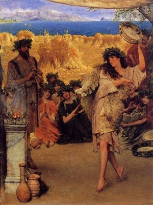

  
[Intangible Textual Heritage](../../index)  [Classics](../index.md) 

------------------------------------------------------------------------

<table width="75%">
<colgroup>
<col style="width: 50%" />
<col style="width: 50%" />
</colgroup>
<tbody>
<tr class="odd">
<td width="50%" data-valign="TOP"></td>
<td width="50%" data-valign="CENTER"><h1 id="the-eleusinian-and-bacchic-mysteries" data-align="CENTER">The Eleusinian and Bacchic Mysteries</h1>
<h2 id="by-thomas-taylor" data-align="CENTER">by Thomas Taylor</h2>
<h4 id="section" data-align="CENTER">[1891]</h4></td>
</tr>
</tbody>
</table>

------------------------------------------------------------------------

[Contents](#contents)    [Start Reading](ebm00.md)    [Page
Index](pageidx)    [Text \[Zipped\]](ebm.txt.gz.md)

------------------------------------------------------------------------

This is Thomas Taylor's essay on the ancient initiation rituals of
Eleusis and Bacchus. Taylor (1758-1835) was an English Neoplatonist who
was the first to translate Aristotle and Plato into English. His
translation of the [Orphic Hymns](../hoo/index.md) is also available at
this site, among other works. The inner teachings of these ancient
Mediterranean mystery religions have been lost for two millennia, but
Taylor believed that he had found the skeleton key in classical
mythology and Plato's philosophy. This influential essay outlines his
theory.

------------------------------------------------------------------------

 [Title Page](ebm00.md)  
[Dedication](ebm01.md)  
[Contents](ebm02.md)  
[Fable is Love’s World, Poem by Schiller](ebm03.md)  
[Introduction](ebm04.md)  
[Section I., Eleusinian Mysteries](ebm05.md)  
[Section II., Bacchic Mysteries](ebm06.md)  
[Hymn to Minerva](ebm07.md)  
[Appendix](ebm08.md)  
[Orphic Hymns](ebm09.md)  
[Hymn of Cleanthes](ebm10.md)  
[Glossary](ebm11.md)  
[List of Illustrations](ebm12.md)  
