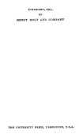

  
[Intangible Textual Heritage](../../../index)  [Classics](../../index) 
[Euripides](../index)  [Index](index)  [Next](eaha01) 

------------------------------------------------------------------------

  
*Euripides and His Age*, by Gilbert Murray, \[1913\], at Intangible
Textual Heritage

------------------------------------------------------------------------

p. i p. ii

# HOME UNIVERSITY LIBRARY OF MODERN KNOWLEDGE

##### No. 73

<table data-border="0">
<colgroup>
<col style="width: 100%" />
</colgroup>
<tbody>
<tr class="odd">
<td data-valign="top"><em>Editors:</em>

HERBERT FISHER, M.A., F.B.A. 
Prof. GILBERT MURRAY, Litt.D., LL.D., F.B.A. 
Prof. J. ARTHUR THOMSON, M.A. 
Prof. WILLIAM T. BREWSTER, M.A.
</td>
</tr>
</tbody>
</table>

p. iii

THE HOME UNIVERSITY LIBRARY OF MODERN KNOWLEDGE

16mo cloth, 50 cents net, postpaid

*LITERATURE AND ART*

*Already Published*

SHAKESPEARE By JOHN MASEFIELD  
ENGLISH LITERATURE—MODERN By G. H. MAIE  
ENGLISH LITERATURE—MEDIEVAL By W. P. KER  
LANDMARKS IN FRENCH  
LITERATURE By G. L. STRACHEY  
ARCHITECTURE By W. R. LETHABY  
THE ENGLISH LANGUAGE . By L. PEARSALL SMITH  
WRITING ENGLISH PROSE . By W. T. BREWSTER  
GREAT AMERICAN WRITERS . By W. P. TRENT and JOHN ERSKINE  
DR. JOHNSON AND HIS CIRCLE By JOHN BAILEY  
THE VICTORIAN AGE IN LITERATURE By G. K. CHESTERTON  
THE LITERATURE OF GERMANY By J. G. ROBERTSON  
PAINTERS AND PAINTING . By FREDERICK WEDMORE  
SHELLY, GODWIN, AND THEIR CIRCLE By H. N. BRAILSFORD  
ANCIENT ART AND RITUAL By MISS JANE HARRISON  
EURIPIDES By GILBERT MURRAY  
CHAUCER AND HIS TIMES BY MISS G. E. HADOW  
WILLIAM MORRIS: HIS WORK AND INFLUENCE By A. C. BROCK

*Future Issues*

ITALIAN ART OF THE RENAISSANCE By ROGER E. FRY  
SCANDINAVIAN HISTORY AND LITERATURE By T. C. SNOW  
SIR THOMAS MORE AND HIS CIRCLE By R. W. CHAMBERS  
HISTORY AND LITERATURE OF SPAIN By J. FITZMAURICE-KELLY  
LATIN LITERATURE By J. S. PHILLIMORE  
LITERARY TASTE By THOMAS SECCOMBE  
GREAT WRITERS OF RUSSIA By C. T. HAGEERG WRIGHT  
THE RENAISSANCE By EDITH SICHEL  
MILTON By JOHN BAILEY

p. iv

# EURIPIDES AND HIS AGE

###### BY

## GILBERT MURRAY

##### LL.D., D. LITT., F.B.A.

###### REGIUS PROFESSOR OF GREEK IN THE UNIVERSITY OF OXFORD

#### NEW YORK

#### HENRY HOLT AND COMPANY

#### LONDON

#### WILLIAMS AND NORGATE

#### \[1913\]

THE UNIVERSITY PRESS, CAMBRIDGE, U.S.A.

Scanned, proofed and formatted at Intangible Textual Heritage by John
Bruno Hare, 2009. This text is in the public domain because it was
published prior to 1922.

  [  
Click to enlarge](img/cover.jpg)  
Front Cover and Spine  

  [  
Click to enlarge](img/title.jpg)  
Title Page  

 
[  
Click to enlarge](img/verso.jpg)  
Verso  

------------------------------------------------------------------------

[Next: Contents](eaha01)
