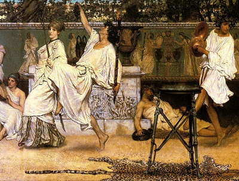

  
[Intangible Textual Heritage](../../../index)  [Classics](../../index) 
[Euripides](../index) 

------------------------------------------------------------------------

<table width="75%">
<colgroup>
<col style="width: 50%" />
<col style="width: 50%" />
</colgroup>
<tbody>
<tr class="odd">
<td width="50%" data-valign="TOP"></td>
<td width="50%" data-valign="CENTER"><h1 id="euripides-and-his-age" data-align="CENTER">Euripides and His Age</h1>
<h2 id="by-gilbert-murray" data-align="CENTER">by Gilbert Murray</h2>
<h4 id="section" data-align="CENTER">[1913]</h4></td>
</tr>
</tbody>
</table>

------------------------------------------------------------------------

[Contents](#contents)    [Start Reading](eaha00)    [Page
Index](pageidx)    [Text \[Zipped\]](eaha.txt.gz)

------------------------------------------------------------------------

This is a complete survey of the drama of Euripides, along with the
historical, social and religious context in which he wrote. It includes
synopses of all of the plays, including mentions of fragmentary and lost
plays, and also serves as an introduction to the mechanics of Greek
drama, including 'the messenger,' the 'deus ex machina,' and the
'Chorus.' Gilbert Murray (1886-1957) was a British classicist at Oxford,
who translated much of the body of Greek drama during the early 20th
century. His translation of [The Trojan Women](../trojan) is also
available at this site. Murray was associated with Jane Harrison, and
contributed to her Prolegomena to the Study of Greek Religion and
Themis.

------------------------------------------------------------------------

 [Title Page and Front Matter](eaha00)  
[Contents](eaha01)  
[Chapter I. Introductory](eaha02)  
[Chapter II](eaha03)  
[Chapter III](eaha04)  
[Chapter IV](eaha05)  
[Chapter V](eaha06)  
[Chapter VI](eaha07)  
[Chapter VII](eaha08)  
[Chapter VIII](eaha09)  
[Chapter IX](eaha10)  
[Bibliography](eaha11)  
[Pronunciation of Greek Names](eaha12)  
[Index](eaha13)  
