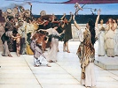

  
[Intangible Textual Heritage](../../index)  [Classics](../index.md) 
[Index](index)  [Previous](fsgr00)  [Next](fsgr02.md) 

------------------------------------------------------------------------

  
*Five Stages of Greek Religion*, by Gilbert Murray, \[1925\], at
Intangible Textual Heritage

------------------------------------------------------------------------

------------------------------------------------------------------------

p. v

## PREFACE TO THE THIRD EDITION

Anyone who has been in Greece at Easter time, especially among the more
remote peasants, must have been struck by the emotion of suspense and
excitement with which they wait for the announcement "*Christos
anestê*," "Christ is risen!" and the response "*Alêthôs anestê*," "He
has really risen!" I have referred elsewhere to Mr. Lawson's old peasant
woman, who explained her anxiety: "If Christ does not rise tomorrow we
shall have no harvest this year" (*Modern Greek Folklore*, p. 573). We
are evidently in the presence of an emotion and a fear which, beneath
its Christian colouring and, so to speak, transfiguration, is in its
essence, like most of man's deepest emotions, a relic from a very remote
pre-Christian past. Every spring was to primitive man a time of terrible
anxiety. His store of food was near its end. Would the dead world
revive, or would it not? The Old Year was dead; would the New Year, the
Young King, born afresh of Sky and Earth, come in the Old King's place
and bring with him the new growth and the hope of life?

I hardly realized, when writing the earlier editions of this book, how
central, how omnipresent, this complex of ideas was in ancient Greek
religion. Attis, Adonis, Osiris, Dionysus, and the rest of the "Year
Gods" were not eccentric divagations in a religion whose proper worship
was given to the immortal Olympians; they are different names given
p. vi in different circumstances to this one
being who dies and is born again each year, dies old and polluted with
past deaths and sins, and is reborn young and purified. I have tried to
trace this line of tradition in an article for the *Journal of Hellenic
Studies* for June 1951, and to show, incidentally, how many of the
elements in the Christian tradition it has provided, especially those
elements which are utterly alien from Hebrew monotheism and must,
indeed, have shocked every orthodox Jew.

The best starting point is the conception of the series of Old Kings,
each, when the due time comes, dethroned and replaced by his son, the
Young King, with the help of the Queen Mother; for Gaia or Earth, the
eternal Wife and Mother of each in turn, is always ready to renew
herself. The new vegetation God each year is born from the union of the
Sky-God and the Earth-Mother; or, as in myth and legend the figures
become personified, he is the Son of a God and a mortal princess.

We all know the sequence of Kings in Hesiod: First Uranus (Sky), King of
the World, and his wife Gaia (Earth); Uranus reigns till he is dethroned
by his son Cronos with the help of Gaia; then Cronos and Rhea (Earth)
reign till Cronos is dethroned by his son Zeus, with the help of Rhea;
then Zeus reigns till . . . but here the series stops, since, according
to the orthodox Olympian system, Zeus is the eternal King. But there was
another system, underlying the Olympian, and it is to that other system
that the Year-Kings belong. The Olympians are definite persons. They are
immortal; they do not die and revive; they are not beings who come and
p. vii go, in succession to one another. In
the other series are the Attis-Adonis-Osiris type of gods, and
especially Dionysus, whose name has been shown by Kretschmer to be
simply the Thracian *Deos* or *Dios nysos*, "Zeus-Young" or
"Zeus-the-son." And in the Orphic tradition it is laid down that Zeus
yields up his power to Dionysus and bids all the gods of the Cosmos obey
him. The mother of Dionysus was Semelê, a name which, like Gaia and
Rhea, means "Earth." The series is not only continuous but infinite; for
on one side Uranus (Sky) was himself the son of Gaia the eternal, and on
the other, every year a Zeus was succeeded by a "Young Zeus."

The Young King, bearer of spring and the new summer, is the Saviour of
the Earth, made cold and lifeless by winter and doomed to barrenness by
all the pollutions of the past; the Saviour also of mankind from all
kinds of evils, and bringer of a new *Aion*, or Age, to the world.
Innumerable different figures in Greek mythology are personifications of
him, from Dionysus and Heracles to the Dioscuri and many heroes of myth.
He bears certain distinguishing marks. He is always the son of a God and
a mortal princess. The mother is always persecuted, a *mater dolorosa*,
and rescued by her son. The Son is always a Saviour; very often a
champion who saves his people from enemies or monsters; but sometimes a
Healer of the Sick, like Asclepius; sometimes, like Dionysus, a priest
or hierophant with a *thiasos*, or band of worshippers; sometimes a
King's Son who is sacrificed to save his people, and mystically
identified with some sacrificial animal, a lamb, a young bull, a horse
or a fawn, whose blood has p. viii
supernatural power. Sometimes again he is a divine or miraculous Babe,
for whose birth the whole world has been waiting, who will bring his own
Age or Kingdom and "make all things new." His life is almost always
threatened by a cruel king, like Herod, but he always escapes. The
popularity of the Divine Babe is probably due to the very widespread
worship of the Egyptian Child-God, Harpocrates. Egyptian also is the
Virgin-Mother, impregnated by the holy *Pneuma* or *Spiritus* of the
god, or sometimes by the laying on of his hand.

Besides the ordinary death and rebirth of the vegetation year god, the
general conclusion to which these considerations point has many
parallels elsewhere. Our own religious ideas are subject to the same
tendencies as those of other civilizations. Men and women, when
converted to a new religion or instructed in some new and unaccustomed
knowledge, are extremely unwilling, and sometimes absolutely unable, to
give up their old magical or religious practices and habits of thought.
When African negroes are converted to Christianity and forbidden to
practise their tribal magic, they are apt to steal away into the depths
of the forest and do secretly what they have always considered necessary
to ensure a good harvest. Not to do so would be too great a risk. When
Goths were "converted by battalions" the change must have been more in
names than in substance. When Greeks of the Mediterranean were forbidden
to say prayers to a figure of Helios, the Sun, it was not difficult to
call him the prophet Elias and go on with the same prayers and hopes.
Not difficult to continue your prayers to p.
ix the age-old Mother Goddess of all Mediterranean peoples, while
calling her Mary, the Mother of Christ. Eusebius studied the subject,
somewhat superficially, in his *Praeparatio Evangelica*, in which he
argued that much old pagan belief was to be explained as an imperfect
preparation for the full light of the Gospel. And it is certainly
striking how the Anatolian peoples, among whom the seed of the early
Church was chiefly sown, could never, in spite of Jewish monotheism,
give up the beloved Mother Goddess for whom mankind craves, or the
divine "Faithful Son" who will by his own sacrifice save his people.
Where scientific knowledge fails man cannot but be guided by his felt
needs and longings and aspirations.

The elements in Christianity which derive from what Jews called "*the
Gôyim*" or "nations" beyond the pale, seem to be far deeper and more
numerous than those which come unchanged from Judaism. Even the Sabbath
had to be changed, and the birthday of Jesus conformed to that of the
Sun. Judaism contributed a strong, though not quite successful,
resistance to polytheism, and a purification of sexual morality. It
provided perhaps a general antiseptic, which was often needed by the
passionate gropings of Hellenistic religion, in the stage which I call
the Failure of Nerve.

G. M.

*September 1951.*

p. x

------------------------------------------------------------------------

[Next: Preface to the Second Edition](fsgr02.md)

