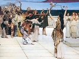

  
[Intangible Textual Heritage](../../index)  [Classics](../index) 
[Index](index)  [Previous](fsgr11) 

------------------------------------------------------------------------

  
*Five Stages of Greek Religion*, by Gilbert Murray, \[1925\], at
Intangible Textual Heritage

------------------------------------------------------------------------

------------------------------------------------------------------------

## Transcriber's Notes

Pages x and 226 are blank in the original.

Ellipses match the original.

The following corrections have been made to the text.

Page 99: if\[original has is\] he a governor, it is his function

Page 139: some more full-blooded and less critical element\[original has
critica lelement\]

Page 166: ('holy' and '\[opening quote missing in original\]sacred', or
perhaps more exactly 'lawful' and '*tabu*')

Page 184: proceeds straight to the traditional\[original has
traditiona\]

Page 227: Antigonus Gonatas\[original has Gonatus\], \[152:1\]

Page 228: Chaldaeans\[original has Chaldeans\], 144, 151

Page 230: Kronos, 45\[original has \[43:2\]\]

Page 231: Mommsen, August, \[14:1\], \[17:1\],\[comma missing in
original\] \[18:1\]

Page 232: Pausanias, \[27:3\], \[54:2\], *passim*\[original has
extraneous period\]

Page 233: Plutarch, \[27:3\], \[32:1\], \[34:2\], \[54:2\],
*passim*\[original has extraneous period\]

Page 234: *Urdummheit*,\[comma missing in original\] 2, 44, 72

Footnote \[16:2\] A. B. Cook, *J. H. S.* xiv,\[comma missing in
original\] pp. 153-4

Footnote \[28:1\] \[smooth breathing mark missing in
original\]<u>Ἱκταῖος</u> are common

Footnote \[33:2\] Rom. vi.\[period missing in original\] generally, 3-11

Footnote \[53:1\] <u>Αθηναία</u>\[original has <u>Ἁθηναία</u>\] is of
course simply 'Athenian'

Footnote \[53:1\] <u>ἁ ϝ</u>\[original has capital digamma—source
document has small digamma\]<u>άνασσα</u>;—<u>ἁ θιὸς ἁ Γολγία</u>

Footnote \[90:1\] see *Life* in Diog.\[original has Diorg.\] Laert.

Footnote \[95:1\] Diog.\[original has Diorg.\] Laert. vi. 96 ff.

Footnote \[113:3\] <u>φεῦγε τὸ ἀκάτιον</u>\[original has
<u>κἀάτιον</u>\]

Footnote \[152:2\] Ferguson's *Hellenistic Athens*, e. g.\[period
missing in original\] p. 108 f.

Footnote \[164:3\] Gal. iv.\[period missing in original\] 9

Footnote \[197:1\] Mullach, *Fragmenta Philosophorum*, iii.\[period
missing in original\] 7

