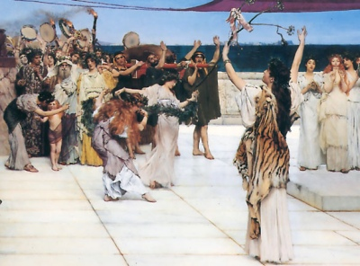

  
[Intangible Textual Heritage](../../index)  [Classics](../index.md) 

------------------------------------------------------------------------

<table width="75%">
<colgroup>
<col style="width: 50%" />
<col style="width: 50%" />
</colgroup>
<tbody>
<tr class="odd">
<td width="50%" data-valign="TOP"></td>
<td width="50%" data-valign="CENTER"><h1 id="five-stages-of-greek-religion" data-align="CENTER">Five Stages of Greek Religion</h1>
<h2 id="by-gilbert-murray" data-align="CENTER">by Gilbert Murray</h2>
<h4 id="section" data-align="CENTER">[1925]</h4></td>
</tr>
</tbody>
</table>

------------------------------------------------------------------------

[Contents](#contents)    [Start Reading](fsgr00.md)    [Page
Index](pageidx)    [Text \[Zipped\]](fsgr.txt.gz.md)

------------------------------------------------------------------------

In this book the eminent classical scholar Gilbert Murray details the
evolution of Greek religion, from a cycle of festivals devoted to the
principal Olympian Gods, through the Homeric hymns, Hellenistic
philosophy including Platonism and Gnosticism. Murray traces elements
through centuries of Greek spirituality which culminated in
Christianity. He includes a translation of the Treatise of Sallustius,
which is a credo of later Greek pagan beliefs and philosophy. This book
is essential reading for classicists and anyone interested in the
evolution of ancient Greek religion.

------------------------------------------------------------------------

 [Title Page](fsgr00.md)  
[Preface to the Third Edition](fsgr01.md)  
[Preface to the Second Edition](fsgr02.md)  
[Preface to the First Edition](fsgr03.md)  
[Contents](fsgr04.md)  
[I. Saturnia Regna](fsgr05.md)  
[II. The Olympian Conquest](fsgr06.md)  
[III. The Great Schools](fsgr07.md)  
[IV. The Failure of Nerve](fsgr08.md)  
[V. The Last Protest](fsgr09.md)  
[Appendix: Translation of the Treatise of Sallustius](fsgr10.md)  
[Index](fsgr11.md)  
[Transcriber's Notes](fsgr12.md)  
