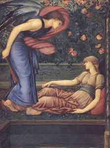

[Intangible Textual Heritage](../../index)  [Classics](../index) 

------------------------------------------------------------------------

[  
\[click to enlarge\]](img/cupidpsy.jpg)

# The Golden Asse

## by Lucius Apuleius "Africanus"

## Translated by William Adlington

#### \[1566\]

------------------------------------------------------------------------

[Title Page](ga00)  
[Dedication](ga01)  
[The Life Of Lucius Apuleius Briefly Described](ga02)  
[The Preface Of The Author To His Sonne, Faustinus And Unto The Readers
of this Book](ga03)  

### The First Booke

[The First Chapter](ga04)  
[The Second Chapter](ga05)  
[The Third Chapter](ga06)  
[The Fourth Chapter](ga07)  
[The Fifth Chapter](ga08)  
[The Sixth Chapter](ga09)  
[The Seventh Chapter](ga10)  

### The Second Booke

[The Eighth Chapter](ga11)  
[The Ninth Chapter](ga12)  
[The Tenth Chapter](ga13)  
[The Eleventh Chapter](ga14)  

### The Third Booke

[The Twelfth Chapter](ga15)  
[The Thirteenth Chapter](ga16)  
[The Fourteenth Chapter](ga17)  
[The Fifteenth Chapter](ga18)  
[The Sixteenth Chapter](ga19)  
[The Seventeenth Chapter](ga20)  

### The Fourth Booke

[The Eighteenth Chapter](ga21)  
[The Nineteenth Chapter](ga22)  
[The Twentieth Chapter](ga23)  
[The Twenty-first Chapter](ga24)  

### The Marriage Of Cupid And Psyches

[The Twenty-second Chapter](ga25)  

### The Sixth Booke

[The Twenty-third Chapter](ga26)  

### The Seventh Booke

[The Twenty-fourth Chapter](ga27)  
[The Twenty-fifth Chapter](ga28)  
[The Twenty-seventh Chapter](ga29)  
[The Twenty-eighth Chapter](ga30)  
[The Twenty-ninth Chapter](ga31)  
[The Thirtieth Chapter](ga32)  
[The Thirty-first Chapter](ga33)  

### The Eighth Booke

[The Thirty-second Chapter](ga34)  
[The Thirty-third Chapter](ga35)  
[The Thirty-fourth Chapter](ga36)  
[The Thirty-fifth Chapter](ga37)  
[The Thirty-sixth Chapter](ga38)  

### The Ninth Booke

[The Thirty-seventh Chapter](ga39)  
[The Thirty-eighth Chapter](ga40)  
[The Fortieth Chapter](ga41)  
[The Forty-first Chapter](ga42)  
[The Forty-second Chapter](ga43)  
[The Forty-third Chapter](ga44)  

### The Tenth Booke

[The Forty-fourth Chapter](ga45)  
[The Forty-fifth Chapter](ga46)  
[The Forty-sixth Chapter](ga47)  

### The Eleventh Booke

[The Forty-seventh Chapter](ga48)  
[The Forty-eighth Chapter](ga49)  
