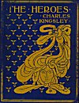
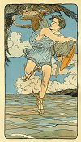

  
[Intangible Textual Heritage](../../index)  [Classics](../index.md) 
[Index](index)  [Next](gft01.md) 

------------------------------------------------------------------------

# THE HEROES

# Or, Greek Fairy Tales

# FOR MY CHILDREN

## *By* Charles Kingsley

#### WITH SIXTY DRAWINGS

#### By M. H. SQUIRE & E. MARS

#### NEW YORK: R. H. RUSSELL, PUBLISHER

#### \[1901\]

###### Scanned at Intangible Textual Heritage, July, 2004. John Bruno Hare, redactor. This text is in the public domain. These files may be used for any non-commercial purpose, provided this notice of attribution is left intact.

 

<table data-border="0" width="100%">
<colgroup>
<col style="width: 33%" />
<col style="width: 33%" />
<col style="width: 33%" />
</colgroup>
<tbody>
<tr class="odd">
<td width="197">

<a href="img/fcover.jpg"> 
Click to enlarge</a> 
Front Cover 

</td>
<td width="197">

<a href="img/front.jpg"> 
Click to enlarge</a> 
Frontispiece: On they rushed, sweeping and flapping, like eagles after a hare. 

</td>
<td width="197">

<a href="img/title.jpg"> 
Click to enlarge</a> 
Title Page 

</td>
</tr>
</tbody>
</table>

 

------------------------------------------------------------------------

[Next: Contents](gft01.md)
