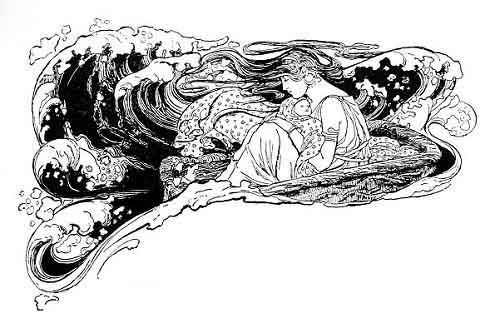
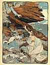

  
[Intangible Textual Heritage](../../index)  [Classics](../index) 
[Index](index)  [Previous](gft03)  [Next](gft05) 

------------------------------------------------------------------------

p. 1

 

# THE HEROES

## The First Story--Perseus

### PART ONE

### How Perseus and His Mother Came to Seriphos

ONCE upon a time there were two princes who were twins. Their names were
Acrisius and Prœtus, and they lived in the pleasant vale of Argos, far
away in Hellas. They had fruitful meadows and vineyards, sheep and oxen,
great herds of horses feeding down in Lerna Fen, and all that men could
need to make them blest; and yet they were wretched, because they were
jealous of each other. From the moment they were born they began to
quarrel; and when they grew up, each tried to take away the other's
share of the kingdom, and keep all for himself. So first Acrisius drove
out Prœtus; and he went across the seas, and brought home a foreign

p. 2

princess for his wife, and foreign warriors to help him, who were called
Cyclopes; and drove out Acrisius in his turn; and then they fought a
long while up and down the land, till the quarrel was settled; and
Acrisius took Argos and one half the land, and Prœtus took Tiryns and
the other half. And Prœtus and his Cyclopes built around Tiryns great
walls of unhewn stone, which are standing to this day.

But there came a prophet to that hard-hearted Acrisius and prophesied
against him, and said: "Because you have risen up against your own
blood, your own blood shall rise up against you; because you have sinned
against your kindred, by your kindred you shall be punished. Your
daughter Danae shall bear a son, and by that son's hands you shall die.
So the gods have ordained, and it will surely come to pass."

And at that, Acrisius was very much afraid; but he did not mend his
ways. He had been cruel to his own family; and, instead of repenting and
being kind to them, he went on to be more cruel than ever; for he shut
up his fair daughter Danae in a cavern underground, lined with brass,
that no one might come near her. So he fancied himself more cunning than
the gods: but you will see presently whether he was able to escape them.

Now it came to pass that in time Danae bore a son; so beautiful a babe
that any but king Acrisius would have had pity on it. But he had no
pity. For he took Danae and her babe down to the sea-shore, and put them
into a great chest and thrust them out to sea, for the winds and the
waves to carry them whithersoever they would.

p. 3

The north-west wind blew freshly out of the blue mountains, and down the
pleasant vale of Argos, and away and out to sea. And away and out to sea
before it, floated the mother and her babe, while all who watched them
wept, save that cruel father, king Acrisius.

So they floated on and on, and the chest danced up and down upon the
billows, and the baby slept upon its mother's breast; but the poor
mother could not sleep, but watched and wept, and she sang to her baby
as they floated; and the song which she sang you shall learn yourselves
some day.

And now they are past the last blue headland, and in the open sea; and
there is nothing round them but the waves, and the sky, and the wind.
But the waves are gentle, and the sky is clear, and the breeze is tender
and low; for these are the days when Halcyone and Ceyx build their
nests, and no storms ever ruffle the pleasant summer sea.

And who were Halcyone and Ceyx? You shall hear while the chest floats
on. Halcyone was a fairy maiden, the daughter of the beach and of the
wind. And she loved a sailor boy, and married him; and none on earth
were so happy as they. But at last Ceyx was wrecked; and before he could
swim to the shore, the billows swallowed him up. And Halcyone saw him
drowning, and leapt into the sea to him; but in vain. Then the Immortals
took pity on them both, and changed them into two fair sea-birds; and
now they build a floating nest every year, and sail up and down happily
forever, upon the pleasant seas of Greece.

p. 4

So a night passed, and a day, and a long day it was for Danae; and
another night and day beside, till Danae was faint with hunger and
weeping, and yet no land appeared. And all the while the babe slept
quietly; and at last poor Danae dropped her head and fell asleep
likewise, with her cheek against her babe's.

After a while she was awakened suddenly; for the chest was jarring and
grinding, and the air was full of sound. She looked up, and over her
head were mighty cliffs, all red in the setting sun, and around her
rocks and breakers, and flying flakes of foam. She clasped her hands
together, and shrieked aloud for help. And when she cried, help met her;
for now there came over the rocks a tall and stately man, and looked
down wondering upon poor Danae tossing about in the chest among the
waves.

He wore a rough cloak of frieze, and on his head a broad hat to shade
his face; in his hand he carried a trident for spearing fish, and over
his shoulder was a casting-net; but Danae could see that he was no
common man by his stature, and his walk, and his flowing golden hair and
beard; and by the two servants who came behind him, carrying baskets for
his fish. But she had hardly time to look at him, before he had laid
aside his trident, and leapt down the rocks, and thrown his casting-net
so surely over Danae and the chest, that he drew it, and her, and the
baby, safe upon a ledge of rock.

Then the fisherman took Danae by the hand, and lifted her out of the
chest, and said:--

 

[  
Click to enlarge](img/00400.jpg)  
When she cried, help met her  

 

p. 5

"O beautiful damsel, what strange chance has brought you to this island
in so frail a ship? Who are you, and whence? Surely you are some king's
daughter; and this boy has somewhat more than mortal."

And as he spoke he pointed to the babe; for its face shone like the
morning star.

But Danae only held down her head, and sobbed out:--

"Tell me to what land I have come, unhappy that I am; and among what men
I have fallen?"

And he said: "This isle is called Seriphos, and I am a Hellen, and dwell
in it. I am the brother of Polydectes the king; and men call me Dictys
the netter, because I catch the fish of the shore."

Then Danae fell down at his feet, and embraced his knees, and cried:--

"Oh, Sir, have pity upon a stranger, whom a cruel doom has driven to
your land; and let me live in your house as a servant; but treat me
honourably, for I was once a king's daughter, and this my boy (as you
have truly said) is of no common race. I will not be a charge to you, or
eat the bread of idleness; for I am more skilful in weaving and
embroidery than all the maidens of my land."

And she was going on; but Dictys stopped her, and raised her up, and
said,--

"My daughter, I am old, and my hairs are growing gray; while I have no
children to make my home cheerful. Come with me then, and you shall be a
daughter to me and to my wife, and this

p. 6

babe shall be our grandchild. For I fear the gods, and show hospitality
to all strangers; knowing that good deeds, like evil ones, always return
to those who do them."

So Danae was comforted, and went home with Dictys the good fisherman,
and was a daughter to him and to his wife, till fifteen years were past.

------------------------------------------------------------------------

[Next: Part Two: How Perseus Vowed a Rash Vow](gft05)
