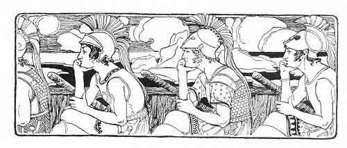
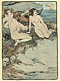
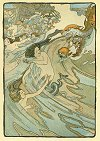
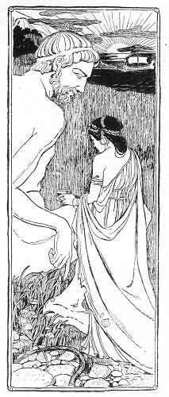

  
[Intangible Textual Heritage](../../index)  [Classics](../index.md) 
[Index](index)  [Previous](gft12)  [Next](gft14.md) 

------------------------------------------------------------------------

p. 106

 

### PART FIVE

### How the Argonauts Were Driven into the Unknown Sea

SO they fled away in haste to the westward: but Aietes manned his fleet
and followed them. And Lynceus the quick-eyed saw him coming, while he
was still many a mile away, and cried, "I see a hundred ships, like a
flock of white swans, far in the east." And at that they rowed hard,
like heroes; but the ships came nearer every hour.

Then Medeia, the dark witch-maiden, laid a cruel and a cunning plot; for
she killed Absyrtus her young brother, and cast him into the sea, and
said, "Ere my father can take up his corpse and bury it, he must wait
long, and be left far behind."

And all the heroes shuddered, and looked one at the other for shame; yet
they did not punish that dark witch-woman, because she had won for them
the golden fleece.

And when Aietes came to the place, he saw the floating corpse; and he
stopped a long while, and bewailed his son, and took him up, and went
home. But he sent on his sailors toward the westward, and bound them by
a mighty curse--"Bring back

p. 107

to me that dark witch-woman, that she may die a dreadful death. But if
you return without her, you shall die by the same death yourselves."

So the Argonauts escaped for that time: but Father Zeus saw that foul
crime; and out of the heavens he sent a storm, and swept the ship far
from her course. Day after day the storm drove her, amid foam and
blinding mist, till they knew no longer where they were, for the sun was
blotted from the skies. And at last the ship struck on a shoal, amid low
isles of mud and sand, and the waves rolled over her and through her,
and the heroes lost all hope of life.

Then Jason cried to Hera: "Fair queen, who hast befriended us till now,
why hast thou left us in our misery, to die here among unknown seas? It
is hard to lose the honour which we have won with such toil and danger,
and hard never to see Hellas again, and the pleasant bay of Pagasai."

Then out and spoke the magic bough which stood upon the *Argo's* beak:
"Because Father Zeus is angry, all this has fallen on you; for a cruel
crime has been done on board, and the sacred ship is foul with blood."

At that some of the heroes cried: "Medeia is the murderess. Let the
witch-woman bear her sin, and die!" And they seized Medeia, to hurl her
into the sea and atone for the young boy's death: but the magic bough
spoke again: "Let her live till her crimes are full. Vengeance waits for
her, slow and sure; but she must live, for you need her still. She must
show you the way to her sister Circe, who lives among the islands of the
West. To

p. 108

her you must sail, a weary way, and she shall cleanse you from your
guilt."

Then all the heroes wept aloud when they heard the sentence of the oak;
for they knew that a dark journey lay before them, and years of bitter
toil. And some upbraided the dark witch-woman, and some said, "Nay, we
are her debtors still; without her we should never have won the fleece."
But most of them bit their lips in silence, for they feared the witch's
spells.

And now the sea grew calmer, and the sun shone out once more, and the
heroes thrust the ship off the sand-bank, and rowed forward on their
weary course under the guiding of the dark witch-maiden, into the wastes
of the unknown sea.

Whither they went I cannot tell, nor how they came to Circe's isle. Some
say that they went to the westward, and up the Ister [1](#fn_1.md) stream, and so came into the Adriatic,
dragging their ship over the snowy Alps. And others say that they went
southward, into the Red Indian Sea, and past the sunny lands where
spices grow, round Æthiopia toward the West; and that at last they came
to Libya, and dragged their ship across the burning sands, and over the
hills into the Syrtes, where the flats and quicksands spread for many a
mile, between rich Cyrene and the Lotus-eaters' shore. But all these are
but dreams and fables, and dim hints of unknown lands.

But all say that they came to a place where they had to drag their ship
across the land nine days with ropes and rollers, till they came into an
unknown sea. And the best of all the old

p. 109

songs tells us how they went away toward the North, till they came to
the slope of Caucasus, where it sinks into the sea; and to the narrow
Cimmerian Bosphorus [1](#fn_2.md), where the Titan
swam across upon the bull; and thence into the lazy waters of the still
Mæotid lake. [2](#fn_3.md) And thence they went
northward ever, up the Tanais, which we call Don, past the Geloni and
Sauromatai, and many a wandering shepherd-tribe, and the one-eyed
Arimaspi, of whom old Greek poets tell, who steal the gold from the
Griffins, in the cold Rhiphaian hills. [3](#fn_4.md)

And they passed the Scythian archers, and the Tauri who eat men, and the
wandering Hyperboreai, who feed their flocks beneath the pole-star,
until they came into the northern ocean, the dull dead Cronian
Sea. [4](#fn_5.md) And there *Argo* would move on no
longer; and each man clasped his elbow, and leaned his head upon his
hand, heart-broken with toil and hunger, and gave himself up to death.
But brave Ancaios the helmsman cheered up their hearts once more, and
bade them leap on land, and haul the ship with ropes and rollers for
many a weary day, whether over land, or mud, or ice, I know not, for the
song is mixed and broken like a dream. And it says next, how they came
to the rich nation of the famous long-lived men; and to the coast of the
Cimmerians, who never saw the sun, buried deep in the glens of the snow
mountains; and to the fair land of Hermione, where dwelt the most
righteous of all nations; and to the gates of the world below, and to
the dwelling-place of dreams.

p. 110

And at last Ancaios shouted: "Endure a little while, brave friends, the
worst is surely past; for I can see the pure west wind ruffle the water,
and hear the roar of ocean on the sands. So raise up the mast, and set
the sail, and face what comes like men."

Then out spoke the magic bough: "Ah, would that I had perished long ago,
and been whelmed by the dread blue rocks, beneath the fierce swell of
the Euxine? Better so, than to wander for ever, disgraced by the guilt
of my princes; for the blood of Absyrtus still tracks me, and woe
follows hard upon woe. And now some dark horror will clutch me, if I
come near the Isle of Ierne. [1](#fn_6.md) Unless
you will cling to the land, and sail southward and southward forever, I
shall wander beyond the Atlantic, to the ocean which has no shore."

Then they blest the magic bough, and sailed southward along the land.
But ere they could pass Ierne, the land of mists and storms, the wild
wind came down, dark and roaring, and caught the sail, and strained the
ropes. And away they drove twelve nights, on the wide wild western sea,
through the foam, and over the rollers, while they saw neither sun nor
stars. And they cried again, "We shall perish, for we know not where we
are. We are lost in the dreary damp darkness, and cannot tell north from
south."

But Lynceus the long-sighted called gaily from the bows, "Take heart
again, brave sailors; for I see a pine-clad isle, and the halls of the
kind Earth-mother, with a crown of clouds around them."

p. 111

But Orpheus said, "Turn from them, for no living man can land there:
there is no harbour on the coast, but steep-walled cliffs all round."

So Ancaios turned the ship away; and for three days more they sailed on,
till they came to Aiaia, Circe's home, and the fairy island of the
West. [1](#fn_7.md)

And there Jason bid them land, and seek about for any sign of living
man. And as they went inland, Circe met them, coming down toward the
ship; and they trembled when they saw her; for her hair, and face, and
robes shone like flame.

And she came and looked at Medeia; and Medeia hid her face beneath her
veil.

And Circe cried: "Ah, wretched girl, have you forgotten all your sins,
that you come hither to my island, where the flowers bloom all the year
round? Where is your aged father, and the brother whom you killed?
Little do I expect you to return in safety with these strangers whom you
love. I will send you food and wine: but your ship must not stay here,
for it is foul with sin, and foul with sin its crew."

And the heroes prayed her, but in vain, and cried, "Cleanse us from our
guilt!" But she sent them away, and said, "Go on to Malea, and there you
may be cleansed, and return home."

Then a fair wind rose, and they sailed eastward, by Tartessus on the
Iberian shore, till they came to the Pillars of Hercules, and the
Mediterranean Sea. And thence they sailed on through the deeps of
Sardinia, and past the Ausonian islands, and the capes

p. 112

of the Tyrrhenian shore, till they came to a flowery island, upon a
still bright summer's eve. And as they neared it, slowly and wearily,
they heard sweet songs upon the shore. But when Medeia heard it, she
started, and cried, "Beware, all heroes, for these are the rocks of the
Sirens. You must pass close by them, for there is no other channel; but
those who listen to that song are lost."

Then Orpheus spoke, the king of all minstrels: "Let them match their
song against mine. I have charmed stones, and trees, and dragons, how
much more the hearts of men!" So he caught up his lyre, and stood upon
the poop, and began his magic song.

And now they could see the Sirens, on Anthemousa, the flowery isle;
three fair maidens sitting on the beach, beneath a red rock in the
setting sun, among beds of crimson poppies and golden asphodel. Slowly
they sung and sleepily, with silver voices, mild and clear, which stole
over the golden waters, and into the hearts of all the heroes, in spite
of Orpheus' song.

And all things stayed around and listened; the gulls sat in white lines
along the rocks; on the beach great seals lay basking, and kept time
with lazy heads; while silver shoals of fish came up to hearken, and
whispered as they broke the shining calm. The Wind overhead hushed his
whistling, as he shepherded his clouds toward the west; and the clouds
stood in mid blue, and listened dreaming, like a flock of golden sheep.

And as the heroes listened, the oars fell from their hands, and their
heads drooped on their breasts, and they closed their heavy eyes; and
they dreamed of bright still gardens, and of slumbers

 

[  
Click to enlarge](img/11200.jpg.md)  
Slowly they sung and sleepily, with silver voices  

 

p. 113

under murmuring pines, till all their toil seemed foolishness, and they
thought of their renown no more.

Then one lifted his head suddenly, and cried, "What use in wandering for
ever? Let us stay here and rest awhile." And another, "Let us row to the
shore, and hear the words they sing." And another, "I care not for the
words, but for the music. They shall sing me to sleep, that I may rest."

And Butes, the son of Pandion, the fairest of all mortal men, leapt out
and swam toward the shore, crying, "I come, I come, fair maidens, to
live and die here, listening to your song."

Then Medeia clapped her hands together, and cried, "Sing louder,
Orpheus, sing a bolder strain; wake up these hapless sluggards, or none
of them will see the land of Hellas more."

Then Orpheus lifted his harp, and crashed his cunning hand across the
strings; and his music and his voice rose like a trumpet through the
still evening air; into the air it rushed like thunder, till the rocks
rang and the sea; and into their souls it rushed like wine, till all
hearts beat fast within their breasts.

And he sung the song of Perseus, how the Gods led him over land and sea,
and how he slew the loathly Gorgon, and won himself a peerless bride;
and how he sits now with the Gods upon Olympus, a shining star in the
sky, immortal with his immortal bride, and honoured by all men below.

So Orpheus sang, and the Sirens, answering each other across the golden
sea, till Orpheus' voice drowned the Sirens, and the heroes caught their
oars again.

And they cried: "We will be men like Perseus, and we will

p. 114

dare and suffer to the last. Sing us his song again, brave Orpheus, that
we may forget the Sirens and their spell."

And as Orpheus sang, they dashed their oars into the sea, and kept time
to his music, as they fled fast away; and the Sirens' voices died behind
them, in the hissing of the foam along their wake.

But Butes swam to the shore, and knelt down before the Sirens, and
cried, "Sing on! sing on!" But he could say no more, for a charmed sleep
came over him, and a pleasant humming in his ears; and he sank all along
upon the pebbles, and forgot all heaven and earth, and never looked at
that sad beach around him, all strewn with the bones of men.

Then slowly rose up those three fair sisters, with a cruel smile upon
their lips; and slowly they crept down towards him, like leopards who
creep upon their prey; and their hands were like the talons of eagles,
as they stept across the bones of their victims to enjoy their cruel
feast.

But fairest Aphrodite saw him from the highest Idalian peak, and she
pitied his youth and his beauty, and leapt up from her golden throne;
and like a falling star she cleft the sky, and left a trail of
glittering light, till she stooped to the Isle of the Sirens, and
snatched their prey from their claws. And she lifted Butes as he lay
sleeping, and wrapt him in golden mist; and she bore him to the peak of
Lilybæum, and he slept there many a pleasant year.

But when the Sirens saw that they were conquered, they shrieked for envy
and rage, and leapt from the beach into the sea, and were changed into
rocks until this day.

p. 115

Then they came to the straits by Lilybæum, and saw Sicily, the
three-cornered island, under which Enceladus the giant lies groaning day
and night, and when he turns the earth quakes, and his breath bursts out
in roaring flames from the highest cone of Ætna, above the chestnut
woods. And there Charybdis caught them in its fearful coils of wave, and
rolled mast-high about them, and spun them round and round; and they
could go neither back nor forward, while the whirlpool sucked them in.

And while they struggled they saw near them, on the other side the
strait, a rock stand in the water, with its peak wrapt round in
clouds--a rock which no man could climb, though he had twenty hands and
feet, for the stone was smooth and slippery, as if polished by man's
hand; and halfway up a misty cave looked out toward the west.

And when Orpheus saw it, he groaned, and struck his hands together. And
"Little will it help us," he cried, "to escape the jaws of the
whirlpool; for in that cave lives Scylla, the sea-hag with a young
whelp's voice; my mother warned me of her ere we sailed away from
Hellas; she has six heads, and six long necks, and hides in that dark
cleft. And from her cave she fishes for all things which pass by,--for
sharks, and seals, and dolphins, and all the herds of Amphitrite. And
never ship's crew boasted that they came safe by her rock; for she bends
her long necks down to them, and every mouth takes up a man. And who
will help us now? For Hera and Zeus hate us, and our ship is foul with
guilt; so we must die, whatever befalls."

p. 116

Then out of the depths came Thetis, Peleus' silver-footed bride, for
love of her gallant husband, and all her nymphs around her; and they
played like snow-white dolphins, diving on from wave to wave, before the
ship, and in her wake, and beside her, as dolphins play. And they caught
the ship, and guided her, and passed her on from hand to hand, and
tossed her through the billows, as maidens toss the ball. And when
Scylla stooped to seize her, they struck back her ravening heads, and
foul Scylla whined, as a whelp whines, at the touch of their gentle
hands. But she shrank into her cave affrighted--for all bad things
shrink from good--and *Argo* leapt safe past her, while a fair breeze
rose behind. Then Thetis and her nymphs sank down to their coral caves
beneath the sea, and their gardens of green and purple, where live
flowers bloom all the year round; while the heroes went on rejoicing,
yet dreading what might come next.

After that they rowed on steadily for many a weary day, till they saw a
long high island, and beyond it a mountain land. And they searched till
they found a harbour, and there rowed boldly in. But after awhile they
stopped, and wondered; for there stood a great city on the shore, and
temples and walls and gardens, and castles high in air upon the cliffs.
And on either side they saw a harbour, with a narrow mouth, but wide
within; and black ships without number, high and dry upon the shore.

Then Ancaios, the wise helmsman, spoke, "What new wonder is this? I know
all isles, and harbours, and the windings of all seas; and this should
be Cordyra, where a few wild goat herds

 

[  
Click to enlarge](img/11600.jpg.md)  
The Argonauts and the sea nymphs.  

 

p. 117

dwell. But whence come these new harbours and vast works of polished
stone?"

But Jason said, "They can be no savage people. We will go in and take
our chance."

So they rowed into the harbour, among a thousand black-beaked ships,
each larger far than *Argo*, toward a quay of polished stone. And they
wondered at that mighty city, with its roofs of burnished brass, and
long and lofty walls of marble, with strong palisades above. And the
quays were full of people, merchants, and mariners, and slaves, going to
and fro with merchandise among the crowd of ships. And the heroes'
hearts were humbled, and they looked at each other and said, "We thought
ourselves a gallant crew when we sailed from Iolcos by the sea: but how
small we look before this city, like an ant before a hive of bees."

Then the sailors hailed them roughly from the quay, "What men are
you?--we want no strangers here, nor pirates. We keep our business to
ourselves."

But Jason answered gently, with many a flattering word, and praised
their city and their harbour, and their fleet of gallant ships. "Surely
you are the children of Poseidon, and the masters of the sea; and we are
but poor wandering mariners, worn out with thirst and toil. Give us but
food and water, and we will go on our voyage in peace."

Then the sailors laughed, and answered, "Stranger, you are no fool; you
talk like an honest man, and you shall find us honest too. We are the
children of Poseidon, and the masters

p. 118

of the sea; but come ashore to us, and you shall have the best that we
can give."

So they limped ashore, all stiff and weary, with long ragged beards and
sunburnt cheeks, and garments torn and weather-stained, and weapons
rusted with the spray, while the sailors laughed at them (for they were
rough-tongued, though their hearts were frank and kind.) And one said,
"These fellows are but raw sailors; they look as if they had been
sea-sick all the day." And another, "Their legs have grown crooked with
much rowing, till they waddle in their walk like ducks."

At that Idas the rash would have struck them; but Jason held him back,
till one of the merchant kings spoke to them, a tall and stately man.

"Do not be angry, strangers; the sailor boys must have their jest. But
we will treat you justly and kindly, for strangers and poor men come
from God; and you seem no common sailors by your strength, and height,
and weapons. Come up with me to the palace of Alcinous, the rich
sea-going king, and we will feast you well and heartily; and after that
you shall tell us your name."

But Medeia hung back, and trembled, and whispered in Jason's ear, "We
are betrayed, and are going to our ruin, for I see my countrymen among
the crowd; dark-eyed Colchi in steel mail-shirts, such as they wear in
my father's land."

"It is too late to turn," said Jason. And he spoke to the merchant king,
"What country is this, good sir; and what is this new-built town?"

p. 119

"This is the land of the Phæaces, beloved by all the Immortals; for they
come hither and feast like friends with us, and sit by our side in the
hall. Hither we came from Liburnia to escape the unrighteous Cyclopes;
for they robbed us, peaceful merchants, of our hard-earned wares and
wealth. So Nausithous, the son of Poseidon, brought us hither, and died
in peace; and now his son Alcinous rules us, and Arete the wisest of
queens."

So they went up across the square, and wondered still more as they went;
for along the quays lay in order great cables, and yards, and masts,
before the fair temple of Poseidon, the blue-haired king of the seas.
And round the square worked the ship-wrights, as many in number as ants,
twining ropes, and hewing timber, and smoothing long yards and oars. And
the Minuai went on in silence through clean white marble streets, till
they came to the hall of Alcinous, and they wondered then still more.
For the lofty palace shone aloft in the sun, with walls of plated brass,
from the threshold to the innermost chamber, and the doors were of
silver and gold. And on each side of the doorway sat living dogs of
gold, who never grew old or died, so well Hephaistos had made them in
his forges in smoking Lemnos, and gave them to Alcinous to guard his
gates by night. And within, against the walls, stood thrones on either
side, down the whole length of the hall, strewn with rich glossy shawls;
and on them the merchant kings of those crafty sea-roving Phæaces sat
eating and drinking in pride, and feasting there all the year round. And
boys of molten gold stood each

p. 120

on a polished altar, and held torches in their hands, to give light all
night to the guests. And round the house sat fifty maid-servants, some
grinding the meal in the mill, some turning the spindle, some weaving at
the loom, while their hands twinkled as they passed the shuttle, like
quivering aspen leaves.

And outside before the palace a great garden was walled round, filled
full of stately fruit-trees, with olives and sweet figs, and
pomegranates, pears, and apples, which bore the whole year round. For
the rich southwest wind fed them, till pear grew ripe on pear, fig on
fig, and grape on grape, all the winter and the spring. And at the
farther end gay flower-beds bloomed through all seasons of the year; and
two fair fountains rose, and ran, one through the garden-grounds, and
one beneath the palace gate, to water all the town. Such noble gifts the
heavens had given to Alcinous the wise.

So they went in, and saw him sitting, like Poseidon, on his throne, with
his golden sceptre by him, in garments stiff with gold, and in his hand
a sculptured goblet, as he pledged the merchant kings; and beside him
stood Arete, his wise and lovely queen, and leaned against a pillar as
she spun her golden threads.

Then Alcinous rose, and welcomed them, and bade them sit and eat; and
the servants brought them tables, and bread, and meat, and wine.

But Medeia went on trembling toward Arete the fair queen, and fell at
her knees, and clasped them, and cried, weeping, as she knelt,--

"I am your guest, fair queen, and I entreat you by Zeus from

p. 121

whom prayers come. Do not send me back to my father to die some dreadful
death; but let me go my way, and bear my burden. Have I not had enough
of punishment and shame?"

"Who are you, strange maiden? and what is the meaning of your prayer?"

"I am Medeia, daughter of Aietes, and I saw my countrymen here to-day;
and I know that they are come to find me, and take me home to die some
dreadful death."

Then Arete frowned, and said, "Lead this girl in, my maidens; and let
the kings decide, not I."

And Alcinous leapt up from his throne, and cried, "Speak, strangers, who
are you? And who is this maiden?"

"We are the heroes of the Minuai," said Jason; "and this maiden has
spoken truth. We are the men who took the golden fleece, the men whose
fame has run round every shore. We came hither out of the ocean, after
sorrows such as man never saw before. We went out many, and come back
few, for many a noble comrade have we lost. So let us go, as you should
let your guests go, in peace; that the world may say, 'Alcinous is a
just king.'"

But Alcinous frowned, and stood deep in thought; and at last he spoke,--

"Had not the deed been done which is done, I should have said this day
to myself, 'It is an honour to Alcinous, and to his children after him,
that the far-famed Argonauts are his guests.' But these Colchi are my
guests, as you are; and for this month they have waited here with all
their fleet, for they have hunted

p. 122

all the seas of Hellas, and could not find you, and dared neither go
further, nor go home."

"Let them choose out their champions, and we will fight them, man for
man."

"No guests of ours shall fight upon our island; and if you go outside
they will outnumber you. I will do justice between you; for I know and
do what is right."

Then he turned to his kings, and said: "This may stand over till
to-morrow. To-night we will feast our guests, and hear the story of all
their wanderings, and how they came hither out of the ocean."

So Alcinous bade the servants take the heroes in, and bathe them, and
give them clothes. And they were glad when they saw the warm water, for
it was long since they had bathed. And they washed off the sea-salt from
their limbs, and anointed themselves from head to foot with oil, and
combed out their golden hair. Then they came back again into the hall,
while the merchant kings rose up to do them honour. And each man said to
his neighbour: "No wonder that these men won fame. How they stand now
like Giants, or Titans, or Immortals come down from Olympus, though many
a winter has worn them, and many a fearful storm. What must they have
been when they sailed from Iolcos, in the bloom of their youth, long
ago?"

Then they went out to the garden; and the merchant princes said:
"Heroes, run races with us. Let us see whose feet are nimblest."

 

[  
Click to enlarge](img/12200.jpg.md)  
Who are you, strange maiden? and what is the meaning of your prayer?  

 

p. 123

"We cannot race against you, for our limbs are stiff from sea; and we
have lost our two swift comrades, the sons of the north wind. But do not
think us cowards: if you wish to try our strength, we will shoot, and
box, and wrestle, against any men on earth."

And Alcinous smiled, and answered: "I believe you, gallant guests; with
your long limbs and broad shoulders, we could never match you here. For
we care nothing here for boxing, or for shooting with the bow: but for
feasts, and songs, and harping, and dancing, and running races, to
stretch our limbs on shore."

So they danced there and ran races, the jolly merchant kings, till the
night fell, and all went in.

And then they ate and drank, and comforted their weary souls, till
Alcinous called a herald, and bade him go and fetch the harper.

The herald went out, and fetched the harper, and led him in by the hand;
and Alcinous cut him a piece of meat, from the fattest of the haunch,
and sent it to him, and said, "Sing to us, noble harper, and rejoice the
heroes' hearts."

So the harper played and sang, while the dancers danced strange figures;
and after that the tumblers showed their tricks, till the heroes laughed
again.

Then, "Tell me, heroes," asked Alcinous, "you who have sailed the ocean
round, and seen the manners of all nations, have you seen such dancers
as ours here? or heard such music and such singing? We hold ours to be
the best on earth."

p. 124

"Such dancing we have never seen," said Orpheus; "and your singer is a
happy man, for Phœbus himself must have taught him, or else he is the
son of a Muse; as I am also, and have sung once or twice, though not so
well as he."

"Sing to us, then, noble stranger," said Alcinous; "and we will give you
precious gifts."

So Orpheus took his magic harp, and sang to them a stirring song of
their voyage from Iolcos, and their dangers, and how they won the golden
fleece; and of Medeia's love, and how she helped them, and went with
them over land and sea; and of all their fearful dangers, from monsters,
and rocks, and storms, till the heart of Arete was softened, and all the
women wept. And the merchant kings rose up, each man from off his golden
throne, and clapped their hands, and shouted: "Hail to the noble
Argonauts, who sailed the unknown sea!"

Then he went on, and told their journey over the sluggish northern main,
and through the shoreless outer ocean, to the fairy island of the west;
and of the Sirens, and Scylla, and Charybdis, and all the wonders they
had seen, till midnight passed, and the day dawned; but the kings never
thought of sleep. Each man sat still and listened, with his chin upon
his hand.

And at last, when Orpheus had ended, they all went thoughtful out, and
the heroes lay down to sleep, beneath the sounding porch outside, where
Arete had strewn them rugs and carpets, in the sweet still summer night.

But Arete pleaded hard with her husband for Medeia, for her

p. 125

heart was softened. And she said: "The Gods will punish her, not we.
After all, she is our guest and my suppliant, and prayers are the
daughters of Zeus. And who, too, dare part man and wife, after all they
have endured together?"

And Alcinous smiled. "The minstrel's song has charmed you; but I must
remember what is right; for songs cannot alter justice; and I must be
faithful to my name. Alcinous I am called, the man of sturdy sense; and
Alcinous I will be." But for all that, Arete besought him, until she won
him round.

So next morning he sent a herald, and called the kings into the square,
and said: "This is a puzzling matter; remember but one thing. These
Minuai live close by us, and we may meet them often on the seas; but
Aietes lives afar off, and we have only heard his name. Which, then, of
the two is it safer to offend,--the men near us, or the men far off?"

The princes laughed, and praised his wisdom; and Alcinous called the
heroes to the square, and the Colchi also; and they came and stood
opposite each other, but Medeia stayed in the palace. Then Alcinous
spoke, "Heroes of the Colchi, what is your errand about this lady?"

"To carry her home with us, that she may die a shameful death: but if we
return without her, we must die the death she should have died."

"What say you to this, Jason the Æolid?" said Alcinous, turning to the
Minuai.

"I say," said the cunning Jason, "that they are come here on a bootless
errand. Do you think that you can make her follow

p. 126

you, heroes of the Colchi,--her, who knows all spells and charms? She
will cast away your ships on quicksands, or call down on you Brimo the
wild huntress; or the chains will fall from off her wrists, and she will
escape in her dragon-car; or if not thus, some other way, for she has a
thousand plans and wiles. And why return home at all, brave heroes, and
face the long seas again, and the Bosphorus, and the stormy Euxine, and
double all your toil? There is many a fair land round these coasts,
which waits for gallant men like you. Better to settle there, and build
a city, and let Aietes and Colchis help themselves."

Then a murmur rose among the Colchi, and some cried, "He has spoken
well;" and some, "We have had enough of roving, we will sail the seas no
more!" And the chief said at last, "Be it so, then; a plague she has
been to us, and a plague to the house of her father, and a plague she
will be to you. Take her, since you are no wiser; and we will sail away
toward the north."

Then Alcinous gave them food, and water, and garments, and rich presents
of all sorts; and he gave the same to the Minuai, and sent them all away
in peace.

So Jason kept the dark witch-maiden to breed him woe and shame: and the
Colchi went northward into the Adriatic, and settled, and built towns
along the shore.

Then the heroes rowed away to the eastward, to reach Hellas, their
beloved land; but a storm came down upon them, and swept them far away
toward the south. And they rowed till

p. 127

they were spent with struggling, through the darkness and the blinding
rain, but where they were they could not tell, and they gave up all hope
of life. And at last touched the ground, and when daylight came they
waded to the shore; and saw nothing round but sand and desolate salt
pools; for they had come to the quicksands of the Syrtis, and the dreary
treeless flats which lie between Numidia and Cyrene, on the burning
shore of Africa. And there they wandered starving for many a weary day,
ere they could launch their ship again, and gain the open sea. And there
Canthus was killed, while he was trying to drive off sheep, by a stone
which a herdsman threw.

And there too Mopsus died, the seer who knew the voices of all birds:
but he could not foretell his own end, for he was bitten in the foot by
a snake, one of those which sprang from the Gorgon's head when Perseus
carried it across the sands.

At last they rowed away toward the northward, for many a weary day, till
their water was spent, and their food eaten; and they were worn out with
hunger and thirst. But at last they saw a long steep island, and a blue
peak high among the clouds; and they knew it for the peak of Ida, and
the famous land of Crete. And they said, "We will land in Crete, and see
Minos the just king, and all his glory and his wealth; at least he will
treat us hospitably, and let us fill our water-casks upon the shore."

But when they came nearer to the island they saw a wondrous sight upon
the cliffs. For on a cape to the westward stood a giant, taller than any
mountain pine, who glittered aloft against

p. 128

the sky like a tower of burnished brass. He turned and looked on all
sides round him, till he saw the *Argo* and her crew; and when he saw
them he came toward them, more swiftly than the swiftest horse, leaping
across the glens at a bound, and striding at one step from down to down.
And when he came abreast of them he brandished his arms up and down, as
a ship hoists and lowers her yards, and shouted with his brazen throat
like a trumpet from off the hills, "You are pirates, you are robbers! If
you dare land here, you die."

Then the heroes cried, "We are no pirates. We are all good men and true,
and all we ask is food and water:" but the giant cried the more,--

"You are robbers, you are pirates all; I know you; and if you land, you
shall die the death."

Then he waved his arms again as a signal, and they saw the people flying
inland, driving their flocks before them, while a great flame arose
among the hills. Then the giant ran up a valley and vanished, and the
heroes lay on their oars in fear.

But Medeia stood watching all, from under her steep black brows, with a
cunning smile upon her lips, and a cunning plot within her heart. At
last she spoke: "I know this giant. I heard of him in the East.
Hephaistos the Fire King made him in his forge in Ætna beneath the
earth, and called him Talus, and gave him to Minos for a servant, to
guard the coast of Crete. Thrice a day he walks round the island, and
never stops to sleep; and if strangers land he leaps into his furnace,

p. 129

which flames there among the hills; and when he is red-hot he rushes on
them, and burns them in his brazen hands."

Then all the heroes cried, "What shall we do, wise Medeia? We must have
water, or we die of thirst. Flesh and blood we can face fairly; but who
can face this red-hot brass?"

"I can face red-hot brass, if the tale I hear be true. For they say that
he has but one vein in all his body, filled with liquid fire; and that
this vein is closed with a nail: but I know not where that nail is
placed. But if I can get it once into these hands, you shall water your
ship here in peace."

Then she bade them put her on shore, and row off again, and wait what
would befall.

And the heroes obeyed her unwillingly, for they were ashamed to leave
her so alone; but Jason said, "She is dearer to me than to any of you,
yet I will trust her freely on shore; she has more plots than we can
dream of in the windings of that fair and cunning head."

So they left the witch-maiden on the shore; and she stood there in her
beauty all alone, till the giant strode back red-hot from head to heel,
while the grass hissed and smoked beneath his tread.

And when he saw the maiden alone, he stopped; and she looked boldly up
into his face without moving, and began her magic song:--

"Life is short, though life is sweet; and even men of brass and fire
must die. The brass must rust, the fire must cool, for time gnaws all
things in their turn. Life is short, though life

p. 130

is sweet: but sweeter to live forever; sweeter to live ever youthful
like the Gods, who have ichor in their veins--ichor which gives life,
and youth, and joy, and a bounding heart."

Then Talus said, "Who are you, strange maiden, and where is this ichor
of youth?"

Then Medeia held up a flask of crystal, and said: "Here is the ichor of
youth. I am Medeia the enchantress; my sister Circe gave me this, and
said, "Go and reward Talus, the faithful servant, for his fame is gone
out into all lands." So come, and I will pour this into your veins, that
you may live forever young."

And he listened to her false words, that simple Talus, and came near;
and Medeia said, "Dip yourself in the sea first, and cool yourself, lest
you burn my tender hands; then show me where the nail in your vein is,
that I may pour the ichor in."

Then that simple Talus dipped himself in the sea, till it hissed, and
roared, and smoked; and came and knelt before Medeia, and showed her the
secret nail.

And she drew the nail out gently; but she poured no ichor in; and
instead the liquid fire spouted forth, like a stream of red-hot iron.
And Talus tried to leap up, crying, "You have betrayed me, false
witch-maiden!" But she lifted up her hands before him, and sang, till he
sank beneath her spell. And as he sank, his brazen limbs clanked
heavily, and the earth groaned beneath his weight; and the liquid fire
ran from his heel, like a stream of lava, to the sea; and Medeia
laughed, and called to the heroes, "Come ashore, and water your ship in
peace."

p. 131

So they came, and found 

|                    |
|--------------------|
|  |

the giant lying dead; and they fell down, and kissed Medeia's feet; and
watered their ship, and took sheep and oxen, and so left that
inhospitable shore.

At last, after many more adventures, they came to the Cape of Malea, at
the southwest point of the Peloponnese. And there they offered
sacrifices, and Orpheus purged them from their guilt. Then they rode
away again to the northward, past the Laconian shore, and came all worn
and tired by Sunium, and up the long Eubœan Strait, until they saw once
more Pelion, and Aphetai, and Iolcos by the sea.

And they ran the ship ashore; but they had no strength left to haul her
up the beach; and they crawled out on the pebbles, and sat

p. 132

down, and wept till they could weep no more. For the houses and the
trees were all altered; and all the faces which they saw were strange;
and their joy was swallowed up in sorrow, while they thought of their
youth, and all their labour, and the gallant comrades they had lost.

And the people crowded round, and asked them, "Who are you, that you sit
weeping here?"

"We are the sons of your princes, who sailed out many a year ago. We
went to fetch the golden fleece; and we have brought it, and grief
therewith. Give us news of our fathers and our mothers, if any of them
be left alive on earth."

Then there was shouting, and laughing, and weeping; and all the kings
came to the shore, and they led away the heroes to their homes, and
bewailed the valiant dead.

Then Jason went up with Medeia to the palace of his uncle Pelias. And
when he came in, Pelias sat by the hearth, crippled and blind with age;
while opposite him sat Æson, Jason's father, crippled and blind
likewise; and the two old men's heads shook together, as they tried to
warm themselves before the fire.

And Jason fell down at his father's knees, and wept, and called him by
his name. And the old man stretched his hands out, and felt him, and
said, "Do not mock me, young hero. My son Jason is dead long ago at
sea."

"I am your own son Jason, whom you trusted to the Centaur upon Pelion;
and I have brought home the golden fleece, and a princess of the Sun's
race for my bride. So now give me up

 

[  
Click to enlarge](img/13200.jpg.md)  
The two old men's heads shook together as they tried to warm themselves
before the fire.  

 

p. 133

the kingdom, Pelias my uncle, and fulfil your promise as I have
fulfilled mine."

Then his father clung to him like a child, and wept, and would not let
him go; and cried, "Now I shall not go down lonely to my grave. Promise
me never to leave me till I die."

------------------------------------------------------------------------

### Footnotes

[108:1](gft13.htm#fr_1.md) The Danube

[109:1](gft13.htm#fr_2.md) Between the Crimæa and
the Circassian.

[109:2](gft13.htm#fr_3.md) The Sea of Azov.

[109:3](gft13.htm#fr_4.md) The Ural Mountains?

[109:4](gft13.htm#fr_5.md) The Baltic?

[110:1](gft13.htm#fr_6.md) Britain?

[111:1](gft13.htm#fr_7.md) The Azores?

------------------------------------------------------------------------

[Next: Part Six: What was the end of the Heroes?](gft14.md)
