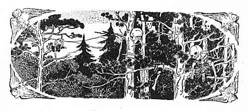
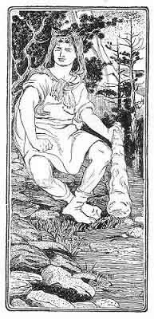
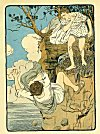
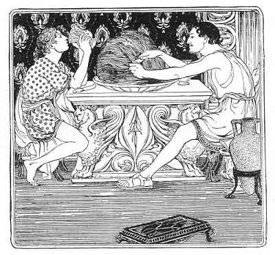
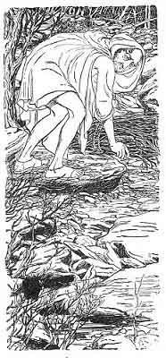
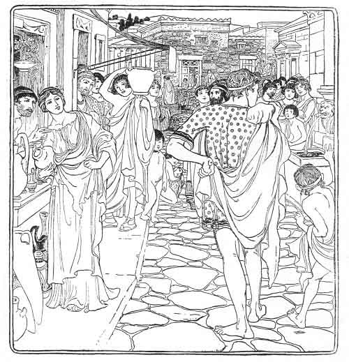
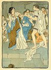
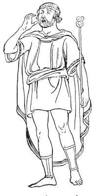
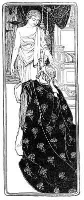
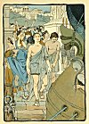

  
[Intangible Textual Heritage](../../index)  [Classics](../index.md) 
[Index](index)  [Previous](gft15)  [Next](gft17.md) 

------------------------------------------------------------------------

p. 146

 

### PART TWO

### How Theseus Slew the Devourers of Men

SO Theseus stood there alone, with his mind full of many hopes. And
first, he thought of going down to the harbour and hiring a swift ship,
and sailing across the bay to Athens; but even that seemed too slow for
him, and he longed for wings to fly across the sea, and find his father.
But after a while his heart began to fail him; and he sighed, and said
within himself:--

"What if my father have other sons about him, whom he loves? What if he
will not receive me? And what have I done that he should receive me? He
has forgotten me ever since I was born: why should he welcome me now?"

Then he thought a long while sadly; and at the last he cried aloud,
"Yes! I will make him love me; for I will prove myself worthy of his
love. I will win honour and renown, and do such deeds that Ægeus shall
be proud of me, though he had fifty other sons! Did not Heracles win
himself honour, though he was oppressed, and the slave of Eurystheus?
Did he not kill

p. 147

all robbers and evil beasts, and drain great lakes and marshes, breaking
the hills through with his club? Therefore it was that all men honoured
him, because he rid them of their miseries, and made life pleasant to
them and their children after them. Where can I go, to do as Heracles
has done? Where can I find strange adventures, robbers, and monsters,
and the children of hell, the enemies of men? I will go by land, and
into the mountains, and round by the way of the Isthmus. Perhaps there I
may hear of brave adventures, and do something which shall win my
father's love."

So he went by land, and away into the mountains, with his father's sword
upon his thigh, till he came to the Spider mountains, which hang over
Epidaurus and the sea, where the glens run downward from one peak in the
midst, as the rays spread in the spider's web.

And he went up into the gloomy glens, between the furrowed marble walls,
till the lowland grew blue beneath his feet, and the clouds drove damp
about his head.

But he went up and up forever, through the spider's web of glens, till
he could see the narrow gulfs spread below him, north and south, and
east and west; black cracks half-choked with mists, and above all a
dreary down.

But over that down he must go, for there was no road right or left; so
he toiled on through bog and brake, till he came to a pile of stones.

And on the stones a man was sitting, wrapt in a bear-skin cloak. The
head of the bear served him for a cap, and its teeth grinned

p. 148

white around his brows; and the feet were tied about his throat, and
their claws shone white upon his chest. And when he saw 

|                    |
|--------------------|
|  |

Theseus he rose, and laughed till the glens rattled.

"And who art thou, fair fly, who hast walked into the spider's web?" But
Theseus walked on steadily, and made no answer: but he thought, "Is this
some robber? and has an adventure come already to me?" But the strange
man laughed louder than ever, and said,--

"Bold fly, know you not that these glens are the web from which no fly
ever finds his way out again, and this down the spider's house, and I
the spider who sucks the flies? Come hither, and let me feast upon you;
for it is of no use to run away, so cunning a web has my father
Hephaistos spread for me, when he made these clefts in the mountains,
through which no man finds his way home."

p. 149

But Theseus came on steadily, and asked,--

"And what is your name among men, bold spider? and where are your
spider's fangs?"

Then the strange man laughed again,--

"My name is Periphetes, the son of Hephaistos and Anticleia the mountain
nymph. But men call me Corynetes the club-bearer; and here is my
spider's fang."

And he lifted from off the stones at his side a mighty club of bronze.

"This my father gave me, and forged it himself in the roots of the
mountain; and with it I pound all proud flies till they give out their
fatness and their sweetness. So give me up that gay sword of yours, and
your mantle, and your golden sandals, lest I pound you, and by ill luck
you die."

But Theseus wrapt his mantle round his left arm quickly, in hard folds,
from his shoulder to his hand, and drew his sword, and rushed upon the
club-bearer, and the club-bearer rushed on him.

Thrice he struck at Theseus, and made him bend under the blows like a
sapling; but Theseus guarded his head with his left arm, and the mantle
which was wrapped around it.

And thrice Theseus sprang upright after the blow, like a sapling when
the storm is past; and he stabbed at the club-bearer with his sword, but
the loose folds of the bear-skin saved him.

Then Theseus grew mad, and closed with him, and caught him by the
throat, and they fell and rolled over together; but when Theseus rose up
from the ground the club-bearer lay still at his feet.

p. 150

Then Theseus took his club and his bear-skin, and left him to the kites
and crows, and went upon his journey down the glens on the farther
slope, till he came to a broad green valley, and saw flocks and herds
sleeping beneath the trees.

And by the side of a pleasant fountain, under the shade of rocks and
trees, were nymphs and shepherds dancing; but no one piped to them while
they danced.

And when they saw Theseus they shrieked; and the shepherds ran off, and
drove away their flocks; while the nymphs dived into the fountain like
coots, and vanished.

Theseus wondered and laughed: "What strange fancies have folks here who
run away from strangers, and have no music when they dance!" But he was
tired, and dusty, and thirsty; so he thought no more of them, but drank
and bathed in the clear pool, and then lay down in the shade under a
plane-tree, while the water sang him to sleep, as it tinkled down from
stone to stone.

And when he woke he heard a whispering, and saw the nymphs peeping at
him across the fountain from the dark mouth of a cave, where they sat on
green cushions of moss. And one said, "Surely he is not Periphetes;" and
another, "He looks like no robber, but a fair and gentle youth."

Then Theseus smiled, and called them, "Fair nymphs, I am not Periphetes.
He sleeps among the kites and crows: but I have brought away his
bear-skin and his club."

Then they leapt across the pool, and came to him, and called the
shepherds back. And he told them how he had slain the club-bearer: and
the shepherds kissed his feet and sang, "Now

 

[  
Click to enlarge](img/15000.jpg.md)  
When they saw Theseus they shrieked; and the shepherds ran off.  

 

p. 151

we shall feed our flocks in peace, and not be afraid to have music when
we dance; for the cruel club-bearer has met his match, and he will
listen for our pipes no more."

Then they brought him kid's flesh and wine, and the nymphs brought him
honey from the rocks; and he ate, and drank, and slept again, while the
nymphs and shepherds danced and sang. And when he woke, they begged him
to stay; but he would not. "I have a great work to do," he said; "I must
be away toward the Isthmus, that I may go to Athens."

But the shepherds said, "Will you go alone toward Athens? None travel
that way now, except in armed troops."

"As for arms, I have enough, as you see. And as for troops, an honest
man is good enough company for himself. Why should I not go alone toward
Athens?"

"If you do, you must look warily about you on the Isthmus, lest you meet
Sinis the robber, whom men call Pituocamptes the pine-bender; for he
bends down two pine-trees, and binds all travellers hand and foot
between them; and when he lets the trees go again their bodies are torn
in sunder."

"And after that," said another, "you must go inland, and not dare to
pass over the cliffs of Sciron; for on the left hand are the mountains,
and on the right the sea, so that you have no escape, but must needs
meet Sciron the robber, who will make you wash his feet; and while you
are washing them he will kick you over the cliff, to the tortoise who
lives below, and feeds upon the bodies of the dead."

And before Theseus could answer, another cried, "And after

p. 152

that is a worse danger still, unless you go inland always, and leave
Eleusis far on your right. For in Eleusis rules Kerkuon the cruel king,
the terror of all mortals, who killed his own daughter Alope in prison.
But she was changed into a fair fountain; and her child he cast out upon
the mountains; but the wild mares gave it milk. And now he challenges
all comers to wrestle with him; for he is the best wrestler in all
Attica, and overthrows all who come; and those whom he overthrows he
murders miserably, and his palace-court is full of their bones."

Then Theseus frowned, and said, "This seems indeed an ill- ruled land,
and adventures enough in it to be tried. But if I am the heir of it, I
will rule it and right it, and here is my royal sceptre." And he shook
his club of bronze, while the nymphs and shepherds clung round him, and
entreated him not to go.

But on he went, nevertheless, till he could see both the seas and the
citadel of Corinth towering high above all the land. And he past swiftly
along the Isthmus, for his heart burned to meet that cruel Sinis; and in
a pine-wood at last he met him, where the Isthmus was narrowest and the
road ran between high rocks. There he sat upon a stone by the wayside,
with a young fir-tree for a club across his knees, and a cord laid ready
by his side; and over his head, upon the fir-tops, hung the bones of
murdered men.

Then Theseus shouted to him, "Holla, thou valiant pine-bender, hast thou
two fir-trees left for me?"

And Sinis leapt to his feet, and answered, pointing to the bones above
his head, "My larder has grown empty lately, so I have

p. 153

two fir-trees ready for thee." And he rushed on Theseus, lifting his
club, and Theseus rushed upon him.

Then they hammered together till the greenwoods rang: but the metal was
tougher than the pine, and Sinis' club broke right across, as the bronze
came down upon it. Then Theseus heaved up another mighty stroke, and
smote Sinis down upon his face; and knelt upon his back, and bound him
with his own cord, and said, "As thou hast done to others, so shall it
be done to thee." Then he bent down two young fir-trees, and bound Sinis
between them, for all his struggling and his prayers; and let them go,
and ended Sinis, and went on, leaving him to the hawks and crows.

Then he went over the hills toward Megara, keeping close along the
Saronic Sea, till he came to the cliffs of Sciron, and the narrow path
between the mountain and the sea.

And there he saw Sciron sitting by a fountain, at the edge of the cliff.
On his knees was a mighty club; and he had barred the path with stones,
so that every one must stop who came up.

Then Theseus shouted to him, and said, "Holla, thou tortoise-feeder, do
thy feet need washing to-day?"

And Sciron leapt to his feet, and answered,--

"My tortoise is empty and hungry, and my feet need washing to-day." And
he stood before his barrier, and lifted up his club in both hands.

Then Theseus rushed upon him; and sore was the battle upon the cliff;
for when Sciron felt the weight of the bronze club, he dropt his own,
and closed with Theseus, and tried to hurl him by main force over the
cliff. But Theseus was a wary wrestler,

p. 154

and dropt his own club, and caught him by the throat and by the knee,
and forced him back against the wall of stones, and crushed him up
against them, till his breath was almost gone. And Sciron cried panting,
"Loose me, and I will let thee pass." But Theseus answered, "I must not
pass till I have made the rough way smooth;" and he forced him back
against the wall till it fell, and Sciron rolled head over heels.

Then Theseus lifted him up all bruised, and said, "Come hither and wash
my feet." And he drew his sword, and sat down by the well, and said,
"Wash my feet, or I cut you piecemeal."

And Sciron washed his feet trembling; and when it was done, Theseus
rose, and cried, "As thou hast done to others, so shall it be done to
thee. Go feed thy tortoise thyself;" and he kicked him over the cliff
into the sea.

And whether the tortoise ate him, I know not; for some say that earth
and sea both disdained to take his body, so foul it was with sin. So the
sea cast it out upon the shore, and the shore cast it back into the sea,
and at last the waves hurled it high into the air in anger; and it hung
there long without a grave, till it was changed into a desolate rock,
which stands there in the surge until this day.

This at least is true, which Pausanias tells, that in the royal porch at
Athens he saw the figure of Theseus modelled in clay, and by him Sciron
the robber, falling headlong into the sea.

Then he went a long day's journey, past Megara, into the Attic land, and
high before him rose the snow-peaks of Cithæron,

 

[  
Click to enlarge](img/15400.jpg.md)  
Go feed thy tortoise yourself.  

 

p. 155

all cold above the black pine-woods, where haunt the Furies, and the
raving Bacchæ, and the nymphs who drive men wild, far aloft upon the
dreary mountains, where the storms howl all day long. And on his right
hand was the sea always, and Salamis, with its island cliffs, and the
sacred strait of the sea-fight, where afterwards the Persians fled
before the Greeks. So he went all day until the evening, till he saw the
Thriasian plain, and the sacred city of Eleusis, where the
Earth-mother's temple stands. For there she met Triptolemus, when all
the land lay waste, Demeter the kind Earth-mother, and in her hands a
sheaf of corn. And she taught him to plough the fallows, and to yoke the
lazy kine; and she taught him to sow the seed-fields, and to reap the
golden grain; and sent him forth to teach all nations, and give corn to
labouring men. So at Eleusis all men honour her, whosoever tills the
land; her and Triptolemus her beloved, who gave corn to labouring men.

And he went along the plain into Eleusis, and stood in the market-place,
and cried,--

"Where is Kerkuon, the king of the city? I must wrestle a fall with him
to-day."

Then all the people crowded round him, and cried, "Fair youth, why will
you die? Hasten out of the city, before the cruel king hears that a
stranger is here."

But Theseus went up through the town, while the people wept and prayed,
and through the gates of the palace yard, and through the piles of bones
and skulls, till he came to the door of Kerkuon's hall, the terror of
all mortal men.

p. 156

And there he saw Kerkuon sitting at the table in the hall alone; and
before him was a whole sheep roasted, and beside

 

him a whole jar of wine. And Theseus stood and called him, "Holla, thou
valiant wrestler, wilt thou wrestle a fall to-day?"

And Kerkuon looked up and laughed, and answered, "I will wrestle a fall
to-day; but come in, for I am lonely and thou weary, and eat and drink
before thou die."

p. 157

Then Theseus went up boldly, and sat down before Kerkuon at the board;
and he ate his fill of the sheep's flesh, and drank his fill of the
wine; and Theseus ate enough for three men, but Kerkuon ate enough for
seven.

But neither spoke a word to the other, though they looked across the
table by stealth; and each said in his heart, "He has broad shoulders;
but I trust mine are as broad as his."

At last, when the sheep was eaten and the jar of wine drained dry, King
Kerkuon rose, and cried, "Let us wrestle a fall before we sleep."

So they tossed off all their garments, and went forth in the
palace-yard; and Kerkuon bade strew fresh sand in an open space between
the bones. And there the heroes stood face to face, while their eyes
glared like wild bulls'; and all the people crowded at the gates to see
what would befall.

And there they stood and wrestled, till the stars shone out above their
heads; up and down and round, till the sand was stamped hard beneath
their feet. And their eyes flashed like stars in the darkness, and their
breath went up like smoke in the night air; but neither took nor gave a
footstep, and the people watched silent at the gates.

But at last Kerkuon grew angry, and caught Theseus round the neck, and
shook him as a mastiff shakes a rat; but he could not shake him off his
feet.

But Theseus was quick and wary, and clasped Kerkuon round the waist, and
slipped his loin quickly underneath him, while he caught him by the
wrist; and then he hove a mighty heave,

p. 158

a heave which would have stirred an oak, and lifted Kerkuon, and pitched
him, right over his shoulder on the ground.

Then he leapt on him, and called, "Yield, or I kill thee!" but Kerkuon
said no word; for his heart was burst within him, with the fall, and the
meat, and the wine.

Then Theseus opened the gates, and called in all the people; and they
cried, "You have slain our evil king; be you now our king, and rule us
well."

"I will be your king in Eleusis, and I will rule you right and well; for
this cause I have slain all evil-doers--Sinis, and Sciron, and this man
last of all."

Then an aged man stepped forth, and said, "Young hero, hast thou slain
Sinis? Beware then of Ægeus, king of Athens, to whom thou goest, for he
is near of kin to Sinis."

"Then I have slain my own kinsman," said Theseus, "though well he
deserved to die. Who will purge me from his death, for rightfully I slew
him, unrighteous and accursed as he was?"

And the old man answered,--

"That will the heroes do, the sons of Phytalus, who dwell beneath the
elm-tree in Aphidnai, by the bank of silver Cephisus; for they know the
mysteries of the Gods. Thither you shall go and be purified, and after
you shall be our king."

So he took an oath of the people of Eleusis, that they would serve him
as their king, and went away next morning across the Thriasian plain,
and over the hills toward Aphidnai, that he might find the sons of
Phytalus.

 

[  
Click to enlarge](img/15800.jpg.md)  
At last Kerkuon grew angry and caught Theseus around the neck.  

 

p. 159

And as he was skirting the Vale of Cephisus, along the foot of lofty
Parnes, a very tall and strong man came down to meet him, dressed in
rich garments. On his arms were golden bracelets, and round his neck a
collar of jewels; and he came forward, bowing courteously, and held out
both his hands, and spoke,--

"Welcome, fair youth, to these mountains; happy am I to have met you!
For what greater pleasure to a good man, than to entertain strangers?
But I see that you are weary. Come up to my castle, and rest yourself
awhile."

"I give you thanks," said Theseus; "but I am in haste to go up the
valley, and to reach Aphidnai in the Vale of Cephisus."

"Alas! you have wandered far from the right way, and you cannot reach
Aphidnai to-night, for there are many miles of mountain between you and
it, and steep passes, and cliffs dangerous after nightfall. It is well
for you that I met you; for my whole joy is to find strangers, and to
feast them at my castle, and hear tales from them of foreign lands. Come
up with me, and eat the best of venison, and drink the rich red wine;
and sleep upon my famous bed, of which all travellers say that they
never saw the like. For whatsoever the stature of my guest, however tall
or short, that bed fits him to a hair, and he sleeps on it as he never
slept before." And he laid hold on Theseus' hands, and would not let him
go.

Theseus wished to go forwards: but he was ashamed to seem churlish to so
hospitable a man; and he was curious to see that wondrous bed; and
beside, he was hungry and weary: yet he shrank from the man, he knew not
why: for, though his voice

p. 160

was gentle and fawning, it was dry and husky like a toad's; and though
his eyes were gentle, they were dull and cold like stones. But he
consented, and went with the man up a glen which led from the road
toward the peaks of Parnes, under the dark shadow of the cliffs.

And as they went up, the glen grew narrower, and the cliffs higher and
darker, and beneath them a torrent roared, half seen between bare
limestone crags. And around there was neither tree nor bush, while from
the white peaks of Parnes the snow-blasts swept down the glen, cutting
and chilling, till a horror fell on Theseus, as he looked round at that
doleful place. And he asked at last, "Your castle stands, it seems, in a
dreary region."

"Yes, but once within it, hospitality makes all things cheerful. But who
are these?" and he looked back, and Theseus also; and far below, along
the road which they had left, came a string of laden asses, and
merchants walking by them, watching their ware.

"Ah, poor souls!" said the stranger. "Well for them that I looked back
and saw them! And well for me too, for I shall have the more guests at
my feast. Wait awhile till I go down and call them, and we will eat and
drink together the livelong night. Happy am I, to whom Heaven sends so
many guests at once!"

And he ran back down the hill, waving his hand and shouting to the
merchants, while Theseus went slowly up the steep pass.

But as he went up he met an aged man, who had been gathering driftwood
in the torrent-bed. He had laid down his faggot

p. 161

in the road, and was trying to lift it again to his shoulder. And when
he saw Theseus, he called to him, and said,--

"O fair youth, help me up 

|                    |
|--------------------|
|  |

with my burden; for my limbs are stiff and weak with years."

Then Theseus lifted the burden on his back. And the old man blest him,
and then looked earnestly upon him, and said,--

"Who are you, fair youth, and wherefore travel you this doleful road?"

"Who I am my parents know: but I travel this doleful road because I have
been invited by a hospitable man, who promises to feast me, and to make
me sleep upon I know not what wondrous bed."

Then the old man clapped his hands together and cried,--

"O house of Hades, man-devouring; will thy maw never be full? Know, fair
youth, that you are going to torment and to death; for he who met you (I
will requite your kindness by another) is a robber and a murderer of
men. Whatsoever stranger

p. 162

he meets he entices him hither to death; and as for this bed of which he
speaks, truly it fits all comers, yet none ever rose alive off it save
me."

"Why?" asked Theseus, astonished.

"Because, if a man be too tall for it, he lops his limbs till they be
short enough, and if he be too short, he stretches his limbs till they
be long enough: but me only he spared, seven weary years agone; for I
alone of all fitted his bed exactly, so he spared me, and made me his
slave. And once I was a wealthy merchant, and dwelt in brazen-gated
Thebes; but now I hew wood and draw water for him, the torment of all
mortal men."

Then Theseus said nothing; but he ground his teeth together.

"Escape, then," said the old man, "for he will have no pity on thy
youth. But yesterday he brought up hither a young man and a maiden, and
fitted them upon his bed: and the young man's hands and feet he cut off;
but the maiden's limbs he stretched until she died, and so both perished
miserably--but I am tired of weeping over the slain. And therefore he is
called Procrustes the stretcher, though his father called him Damastes.
Flee from him: yet whither will you flee? The cliffs are steep, and who
can climb them? and there is no other road."

But Theseus laid his hand upon the old man's month, and said, "There is
no need to flee;" and he turned to go down the pass.

"Do not tell him that I have warned you, or he will kill me by some evil
death;" and the old man screamed after him down the glen; but Theseus
strode on in his wrath.

 

[  
Click to enlarge](img/16200.jpg.md)  
Theseus flung him from him, and lifted up his dreadful club.  

 

p. 163

And he said to himself, "This is an ill-ruled land; when shall I have
done ridding it of monsters?" And as he spoke, Procrustes came up the
hill, and all the merchants with him, smiling and talking gaily. And
when he saw Theseus, he cried, "Ah, fair young guest, have I kept you
too long waiting?"

But Theseus answered, "The man who stretches his guests upon a bed and
hews off their hands and feet, what shall be done to him, when right is
done throughout the land?"

Then Procrustes' countenance changed, and his cheeks grew as green as a
lizard, and he felt for his sword in haste; but Theseus leapt on him,
and cried,--

"Is this true, my host, or is it false?" and he clasped Procrustes'
round waist and elbow, so that he could not draw his sword.

"Is this true, my host, or is it false?" But Procrustes answered never a
word.

Then Theseus flung him from him, and lifted up his dreadful club; and
before Procrustes could strike him he had struck, and felled him to the
ground.

And once again he struck him; and his evil soul fled forth, and went
down to Hades squeaking, like a bat into the darkness of a cave.

Then Theseus stript him of his gold ornaments, and went up to his house,
and found there great wealth and treasure, which he had stolen from the
passers by. And he called the people of the country, whom Procrustes had
spoiled a long time, and parted the spoil among them, and went down the
mountains, and away.

p. 164

And he went down the glens of Parnes, through mist, and cloud, and rain,
down the slopes of oak, and lentisk, and arbutus,

 

and fragrant bay, till he came to the Vale of Cephisus, and the pleasant
town of Aphidnai, and the home of the Phytalid heroes, where they dwelt
beneath a mighty elm.

p. 165

And there they built an altar, and bade him bathe in Cephisus, and offer
a yearling ram, and purified him from the blood of Sinis, and sent him
away in peace.

And he went down the valley by Acharnai, and by the silver- swirling
stream, while all the people blessed him, for the fame of his prowess
had spread wide, till he saw the plain of Athens, and the hill where
Athené dwells.

So Theseus went up through Athens, and all the people ran out to see
him; for his fame had gone before him and every one knew of his mighty
deeds. And all cried, "Here comes the hero who slew Sinis, and Phaia the
wild sow of Crommyon, and conquered Kerkuon in wrestling, and slew
Procrustes the pitiless." But Theseus went on sadly and steadfastly; for
his heart yearned after his father; and he said, "How shall I deliver
him from these leeches who suck his blood?"

So he went up the holy stairs, and into the Acropolis, where Ægeus'
palace stood; and he went straight into Ægeus' hall, and stood upon the
threshold, and looked round.

And there he saw his cousins sitting about the table, at the wine; many
a son of Pallas, but no Ægeus among them. There they sat and feasted,
and laughed, and passed the wine-cup round; while harpers harped, and
slave-girls sang, and the tumblers showed their tricks.

Loud laughed the sons of Pallas, and fast went the wine-cup round; but
Theseus frowned, and said under his breath, "No wonder that the land is
full of robbers, while such as these bear rule."

p. 166

Then the Pallantids saw him, and called to him, half-drunk with wine,
"Holla, tall stranger at the door, what is your will to-day?"

"I come hither to ask for hospitality."

"Then take it, and welcome. You look like a hero and a bold warrior; and
we like such to drink with us."

"I ask no hospitality of you; I ask it of Ægeus the king, the master of
this house."

At that some growled, and some laughed, and shouted, "Heyday! we are all
masters here."

"Then I am master as much as the rest of you," said Theseus, and he
strode past the table up the hall, and looked around for Ægeus; but he
was nowhere to be seen.

The Pallantids looked at him, and then at each other, and each whispered
to the man next him, "This is a forward fellow; he ought to be thrust
out at the door." But each man's neighbour whispered in return, "His
shoulders are broad; will you rise and put him out?" So they all sat
still where they were.

Then Theseus called to the servants, and said, "Go tell King Ægeus, your
master, that Theseus of Trœzene is here, and asks to be his guest
awhile."

A servant ran and told Ægeus, where he sat in his chamber within, by
Medeia the dark witch-woman, watching her eye and hand. And when Ægeus
heard of Trœzene he turned pale and red again; and rose from his seat
trembling, while Medeia watched him like a snake.

p. 167

"What is Trœzene to you?" she asked.

But he said hastily, "Do you not know who this Theseus is? The hero who
has cleared the country from all monsters; but that he came from
Trœzene, I never heard before. I must go out and welcome him."

So Ægeus came out into the hall; and when Theseus saw him, his heart
leapt into his mouth, and he longed to fall on his neck and welcome him;
but he controlled himself, and said, "My father may not wish for me,
after all. I will try him before I discover myself;" and he bowed low
before Ægeus, and said, "I have delivered the king's realm from many
monsters; therefore I am come to ask a reward of the king."

And old Ægeus looked on him, and loved him, as what fond heart would not
have done? But he only sighed, and said,--

"It is little that I can give you, noble lad, and nothing that is worthy
of you; for surely you are no mortal man, or at least no mortal's son."

"All I ask," said Theseus, "is to eat and drink at your table."

"That I can give you," said Ægeus, "if at least I am master in my own
hall."

Then he bade them put a seat for Theseus, and set before him the best of
the feast; and Theseus sat and ate so much, that all the company
wondered at him: but always he kept his club by his side.

But Medeia the dark witch-woman had been watching him all the while. She
saw how Ægeus turned red and pale, when the lad said that he came from
Trœzene. She saw, too, how his

p. 168

heart was opened toward Theseus; and how Theseus bore himself before all
the sons of Pallas, like a lion among a pack of curs. And she said to
herself, "This youth will be master here; perhaps he is nearer to Ægeus
already than mere fancy. At least the Pallantids will have no chance by
the side of such as he."

Then she went back into her chamber modestly, while Theseus ate and
drank; and all the servants whispered, "This, then, is the man who
killed the monsters! How noble are his looks, and how huge his size! Ah,
would that he were our master's son!"

But presently Medeia came forth, decked in all her jewels, and her rich
Eastern robes, and looking more beautiful than the day; so that all the
guests could look at nothing else. And in her right hand she held a
golden cup, and in her left a flask of gold; and she came up to Theseus,
and spoke in a sweet, soft, winning voice,--

"Hail to the hero, the conqueror, the unconquered, the destroyer of all
evil things! Drink, hero, of my charmed cup, which gives rest after
every toil, which heals all wounds, and pours new life into the veins.
Drink of my cup, for in it sparkles the wine of the East, and Nepenthe,
the comfort of the Immortals."

And as she spoke, she poured the flask into the cup; and the fragrance
of the wine spread through the hall, like the scent of thyme and roses.

And Theseus looked up in her fair face, and into her deep dark eyes. And
as he looked, he shrank and shuddered; for they were dry like the eyes
of a snake. And he rose, and said, "The wine

 

[  
Click to enlarge](img/16800.jpg.md)  
Media shrieked and dashed the cup to the ground.  

 

p. 169

is rich and fragrant, and the wine-bearer as fair as the Immortals; but
let her pledge me first herself in the cup, that the wine may be the
sweeter from her lips."

Then Medeia turned pale, and stammered, "Forgive me, fair hero; but I am
ill, and dare drink no wine."

And Theseus looked again into her eyes, and cried, "Thou shalt pledge me
in that cup, or die." And he lifted up his brazen club, while all the
guests looked on aghast.

Medeia shrieked a fearful shriek, and dashed the cup to the ground, and
fled; and where the wine flowed over the marble pavement, the stone
bubbled, and crumbled, and hissed, under the fierce venom of the
draught.

But Medeia called her dragon chariot, and sprang into it and fled aloft,
away over land and sea, and no man saw her more.

And Ægeus cried, "What hast thou done?"

But Theseus pointed to the stone. "I have rid the land of an
enchantment: now I will rid it of one more."

And he came close to Ægeus, and drew from his bosom the sword and the
sandals, and said the words which his mother bade him.

And Ægeus stepped back a pace, and looked at the lad till his eyes grew
dim; and then he cast himself on his neck and wept, and Theseus wept on
his neck, till they had no strength left to weep more.

Then Ægeus turned to all the people, and cried, "Behold my son, children
of Cecrops, a better man than his father was before him."

p. 170

Who, then, were mad but the Pallantids, though they had been mad enough
before? And one shouted, "Shall we make room for an upstart, a
pretender, who comes from we know not where?" And another, "If he be
one, we are more than one; and the stronger can hold his own." And one
shouted one thing, and one another; for they were hot and wild with
wine: but all caught swords and lances off the wall, where the weapons
hung around, and sprang forward to Theseus, and Theseus sprang forward
to them.

And he cried, "Go in peace, if you will, my cousins; but if not, your
blood be on your own heads." But they rushed at him; and then stopped
short and railed him, as curs stop and bark when they rouse a lion from
his lair.

But one hurled a lance from the rear rank, which past close by Theseus'
head; and at that Theseus rushed forward, and the fight began indeed.
Twenty against one they fought, and yet Theseus beat them all; and those
who were left fled down into the town, where the people set on them, and
drove them out, till Theseus was left alone in the palace, with Ægeus
his new-found father. But before nightfall all the town came up, with
victims, and dances, and songs; and they offered sacrifices to Athené,
and rejoiced all the night long, because their king had found a noble
son, and an heir to his royal house.

So Theseus stayed with his father all the winter; and when the spring
equinox drew near, all the Athenians grew sad and silent, and Theseus
saw it, and asked the reason; but no one would answer him a word.

p. 171

Then he went to his father, and asked him: but Ægeus turned away his
face and wept.

"Do not ask, my son, beforehand, about evils which must happen: it is
enough to have to face them when they come."

And when the spring equinox came, a herald came to Athens, and stood in
the market, and cried, "O 

|                    |
|--------------------|
|  |

people and King of Athens, where is your yearly tribute?" Then a great
lamentation arose throughout the city. But Theseus stood up to the
herald, and cried,--

"And who are you, dog-faced, who dare demand tribute here? If I did not
reverence your herald's staff, I would brain you with this club."

And the herald answered proudly, for he was a grave and ancient man,--

"Fair youth, I am not dog-faced or shameless; but I do my master's
bidding, Minos, the King of hundred-citied Crete, the wisest of all
kings on earth. And you must be surely a stranger here, or you would
know why I come, and that I come by right."

"I am a stranger here. Tell me, then, why you come?"

"To fetch the tribute which King Ægeus promised to Minos, and confirmed
his promise with an oath. For Minos conquered all this land, and Megara
which lies to the east, when he came

p. 172

hither with a great fleet of ships, enraged about the murder of his son.
For his son Androgeos came hither to the Panathenaic games, and overcame
all the Greeks in the sports, so that the people honoured him as a hero.
But when Ægeus saw his valour, he envied him, and feared lest he should
join the sons of Pallas, and take away the sceptre from him. So he
plotted against his life, and slew him basely, no man knows how or
where. Some say that he waylaid him by Oinoe, on the road which goes to
Thebes; and some that he sent him against the bull of Marathon, that the
beast might kill him. But Ægeus says that the young men killed him from
envy, because he had conquered them in the games. So Minos came hither
and avenged him, and would not depart till this land had promised him
tribute--seven youths and seven maidens every year, who go with me in a
black-sailed ship, till they come to hundred-citied Crete."

And Theseus ground his teeth together, and said, "Wert thou not a herald
I would kill thee, for saying such things of my father: but I will go to
him, and know the truth." So he went to his father, and asked him; but
he turned away his head and wept, and said, "Blood was shed in the land
unjustly, and by blood it is avenged. Break not my heart by questions;
it is enough to endure in silence."

Then Theseus groaned inwardly, and said, "I will go myself with these
youths and maidens, and kill Minos upon his royal throne."

And Ægeus shrieked, and cried, "You shall not go, my son, the light of
my old age, to whom alone I look to rule this people

p. 173

after I am dead and gone. 

|                    |
|--------------------|
|  |

You shall not go, to die horribly, as those youths and maidens die; for
Minos thrusts them into a labyrinth, which Daidalos made for him among
the rocks,--Daidalos the renegade, the accursed, the pest of this his
native land. From that labyrinth no one can escape, entangled in its
winding ways, before they meet the Minotaur, the monster who feeds upon
the flesh of men. There he devours them horribly, and they never see
this land again."

Then Theseus grew red, and his ears tingled, and his heart beat loud in
his bosom. And he stood awhile like a tall stone pillar, on the cliffs
above some hero's grave; and at last he spoke,--

"Therefore all the more I will go with them, and slay the accursed
beast. Have I

p. 174

not slain all evil-doers and monsters, that I might free this land?
Where are Periphetes, and Sinis, and Kerkuon, and Phaia the wild sow?
Where are the fifty sons of Pallas? And this Minotaur shall go the road
which they have gone, and Minos himself, if he dare stay me."

"But how will you slay him, my son? For you must leave your club and
your armour behind, and be cast to the monster, defenceless and naked
like the rest."

And Theseus said, "Are there no stones in that labyrinth; and have I not
fists and teeth? Did I need my club to kill Kerkuon, the terror of all
mortal men?"

Then Ægeus clung to his knees; but he would not hear; and at last he let
him go, weeping bitterly, and said only this one word,--

"Promise me but this, if you return in peace, though that may hardly be:
take down the black sail of the ship, (for I shall watch for it all day
upon the cliffs,) and hoist instead a white sail, that I may know afar
off that you are safe."

And Theseus promised, and went out, and to the market-place where the
herald stood, while they drew lots for the youths and maidens, who were
to sail in that doleful crew. And the people stood wailing and weeping,
as the lot fell on this one and on that: but Theseus strode into the
midst, and cried,--

"Here is a youth who needs no lot. I myself will be one of the seven."

And the herald asked in wonder, "Fair youth, know you whither you are
going?"

 

[  
Click to enlarge](img/17400.jpg.md)  
So they went down to the black-sailed ship  

 

p. 175

And Theseus said, "I know. Let us go down to the black-sailed ship."

So they went down to the black-sailed ship, seven maidens, and seven
youths, and Theseus before them all, and the people following them
lamenting. But Theseus whispered to his companions, "Have hope, for the
monster is not immortal. Where are Periphetes, and Sinis, and Sciron,
and all whom I have slain?" Then their hearts were comforted a little:
but they wept as they went on board, and the cliffs of Sunium rang, and
all the isles of the Ægean Sea, with the voice of their lamentation, as
they sailed on toward their deaths in Crete.

------------------------------------------------------------------------

[Next: Part Three: How Theseus Slew the Minotaur](gft17.md)
