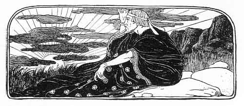
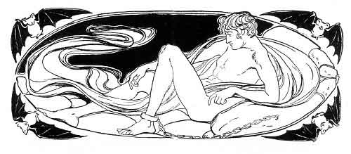

  
[Intangible Textual Heritage](../../index)  [Classics](../index.md) 
[Index](index)  [Previous](gft17.md) 

------------------------------------------------------------------------

p. 183

 

### PART FOUR

### How Theseus Fell By His Pride

BUT that fair Ariadne never came to Athens with her husband. Some say
that Theseus left her sleeping on Naxos among the Cyclades; and that
Dionusos the wine-king found her, and took her up into the sky, as you
shall see some day in a painting of old Titian's, one of the most
glorious pictures upon earth. And some say that Dionusos drove away
Theseus, and took Ariadne from him by force: but however that may be, in
his haste or in his grief, Theseus forgot to put up the white sail. Now
Ægeus his father sat and watched on Sunium day after day, and strained
his old eyes across the sea to see the ship afar. And when he saw the
black sail, and not the white one, he gave up Theseus for dead, and in
his grief he fell into the sea, and died; so it is called the Ægean to
this day.

And now Theseus was king of Athens, and he guarded it and ruled it well.

p. 184

For he killed the bull of Marathon, which had killed Androgeos, Minos'
son; and he drove back the famous Amazons, the warlike women of the
East, when they came from Asia, and conquered all Hellas, and broke into
Athens itself. But Theseus stopped them there, and conquered them, and
took Hippolute their queen to be his wife. Then he went out to fight
against the Lapithai, and Peirithoos their famous king: but when the two
heroes came face to face they loved each other, and embraced, and became
noble friends; so that the friendship of Theseus and Peirithoos is a
proverb even now. And he gathered (so the Athenians say) all the
boroughs of the land together, and knit them into one strong people,
while before they were all parted and weak: and many another wise thing
he did, so that his people honoured him after he was dead, for many a
hundred years, as the father of their freedom and their laws. And six
hundred years after his death, in the famous fight at Marathon, men said
that they saw the ghost of Theseus, with his mighty brazen club,
fighting in the van of battle against the invading Persians, for the
country which he loved. And twenty years after Marathon his bones (they
say) were found in Scuros, an isle beyond the sea; and they were bigger
than the bones of mortal man. So the Athenians brought them home in
triumph; and all the people came out to welcome them; and they built
over them a noble temple, and adorned it with sculptures and paintings
in which were told all the noble deeds of Theseus, and the Centaurs, and
the Lapithai, and the Amazons; and the ruins of it are standing still.

p. 185

But why did they find his bones in Scuros? Why did he not die in peace
at Athens, and sleep by his father's side? Because after his triumph he
grew proud, and broke the laws of God and man. And one thing worst of
all he did, which brought him to his grave with sorrow. For he went down
(they say beneath the earth) with that bold Peirithoos his friend, to
help him to carry off Persephone, the queen of the world below. But
Peirithoos was killed miserably, in the dark fire-kingdoms under ground;
and Theseus was chained to a rock in everlasting pain. And there he sat
for years, till Heracles the mighty came down to bring up the
three-headed dog who sits at Pluto's gate. So Heracles loosed him from
his chain, and brought him up to the light once more.

But when he came back his people had forgotten him, and Castor and
Polydeuces, the sons of the wondrous Swan, had invaded his land, and
carried off his mother Aithra for a slave, in revenge for a grievous
wrong.

So the fair land of Athens was wasted, and another king ruled it, who
drove out Theseus shamefully, and he fled across the sea to Scuros. And
there he lived in sadness, in the house of Lucomedes the king, till
Lucomedes killed him by treachery, and there was an end of all his
labours.

So it is still, my children, and so it will be to the end. In those old
Greeks, and in us also, all strength and virtue come from God. But if
men grow proud and self-willed, and misuse God's fair gifts, He lets
them go their own ways, and fall pitifully, that the glory may be His
alone. God help us all, and give us

p. 186

wisdom, and courage to do noble deeds! but God keep pride from us when
we have done them, lest we fall, and come to shame!

 

 
