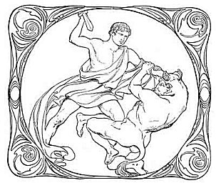

  
[Intangible Textual Heritage](../../index)  [Classics](../index) 

------------------------------------------------------------------------

<table width="50%">
<colgroup>
<col style="width: 50%" />
<col style="width: 50%" />
</colgroup>
<tbody>
<tr class="odd">
<td data-valign="CENTER" width="50%"></td>
<td data-valign="CENTER" width="50%"><h1 id="the-heroes" data-align="CENTER">The Heroes</h1>
<h4 id="or-greek-fairy-tales-for-my-children" data-align="CENTER">Or, Greek Fairy Tales for my Children</h4>
<h2 id="by-charles-kingsley" data-align="CENTER">by Charles Kingsley</h2>
<h4 id="section" data-align="CENTER">[1901]</h4></td>
</tr>
</tbody>
</table>

------------------------------------------------------------------------

This is Charles Kingsley's able retelling of the myths of Perseus, Jason
and the Argonauts, and Theseus for young adults, originally published
circa 1856. Kingsley is best known as the author of Water Babies.
Although this is not the first time this text has appeared on the
Internet, this is the only version with the complete set of Squire and
Mars black and white and four-color art-deco illustrations. This
includes two illustrations censored from later editions, probably
because of female nudity. This also includes the original Preface, which
was omitted from later editions. Otherwise the text, particularly the
punctuation, was proofed according to a 1901 edition.

------------------------------------------------------------------------

[Title Page](gft00)  
[Contents](gft01)  
[Illustrations](gft02)  
[Preface](gft03)  

### The First Story--Perseus

[Part One: How Perseus and His Mother Came to Seriphos](gft04)  
[Part Two: How Perseus Vowed a Rash Vow](gft05)  
[Part Three: How Perseus Slew the Gorgon](gft06)  
[Part Four: How Perseus Came to the Æthiops](gft07)  
[Part Five: How Perseus Came Home Again](gft08)  

### The Second Story--The Argonauts

[Part One: How the Centaur Trained the Heroes on Pelion](gft09)  
[Part Two: How Jason Lost His Sandal in Anauros](gft10)  
[Part Three: How They Built the Ship Argo in Iolcos](gft11)  
[Part Four: How the Argonauts Sailed to Colchis](gft12)  
[Part Five: How the Argonauts Were Driven into the Unknown Sea](gft13)  
[Part Six: What was the end of the Heroes?](gft14)  

### The Third Story--Theseus

[Part One: How Theseus Lifted the Stone](gft15)  
[Part Two: How Theseus Slew the Devourers of Men](gft16)  
[Part Three: How Theseus Slew the Minotaur](gft17)  
[Part Four: How Theseus Fell By His Pride](gft18)  
