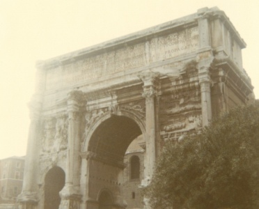

  
[Intangible Textual Heritage](../../../index)  [Classics](../../index.md) 
[Gibbon](../index.md) 

------------------------------------------------------------------------

[Buy this Book at
Amazon.com](https://www.amazon.com/exec/obidos/ASIN/B001VEIE66/internetsacredte.md)

------------------------------------------------------------------------

<table width="75%">
<colgroup>
<col style="width: 50%" />
<col style="width: 50%" />
</colgroup>
<tbody>
<tr class="odd">
<td width="50%" data-valign="TOP"> 
Roman Forum [Photograph (c) 2007 Copyright J. B. Hare, All Rights Reserved]</td>
<td width="50%" data-valign="CENTER"><h1 id="decline-and-fall-of-the-roman-empire-vol.-2" data-align="CENTER">Decline and Fall of the Roman Empire, Vol. 2</h1>
<h2 id="by-edward-gibbon" data-align="CENTER">by Edward Gibbon</h2>
<h4 id="section" data-align="CENTER">[1781]</h4></td>
</tr>
</tbody>
</table>

------------------------------------------------------------------------

[Contents](#contents)    [Start Reading](daf02000.md)

------------------------------------------------------------------------

[Volume 1](../01/index) \|  **Volume 2** \|  [Volume 3](../03/index.md) \| 
[Volume 4](../04/index) \|  [Volume 5](../05/index.md) \|  [Volume
6](../06/index.md)

------------------------------------------------------------------------

|                                                                                                                           |
|---------------------------------------------------------------------------------------------------------------------------|
|  |

------------------------------------------------------------------------

 [Title Page](daf02000.md)  
[Chapter XVI: Conduct Towards The Christians, From Nero To Constantine.
Part I.](daf02001.md)  
[Chapter XVI: Conduct Towards The Christians, From Nero To Constantine.
Part II.](daf02002.md)  
[Chapter XVI: Conduct Towards The Christians, From Nero To Constantine.
Part III.](daf02003.md)  
[Chapter XVI: Conduct Towards The Christians, From Nero To Constantine.
Part IV.](daf02004.md)  
[Chapter XVI: Conduct Towards The Christians, From Nero To Constantine.
Part V.](daf02005.md)  
[Chapter XVI: Conduct Towards The Christians, From Nero To Constantine.
Part VI.](daf02006.md)  
[Chapter XVI: Conduct Towards The Christians, From Nero To Constantine.
Part VII.](daf02007.md)  
[Chapter XVI: Conduct Towards The Christians, From Nero To Constantine.
Part VIII.](daf02008.md)  
[Chapter XVII: Foundation Of Constantinople. Part I.](daf02009.md)  
[Chapter XVII: Foundation Of Constantinople. Part II.](daf02010.md)  
[Chapter XVII: Foundation Of Constantinople. Part III.](daf02011.md)  
[Chapter XVII: Foundation Of Constantinople. Part IV.](daf02012.md)  
[Chapter XVII: Foundation Of Constantinople. Part V.](daf02013.md)  
[Chapter XVII: Foundation Of Constantinople. Part VI.](daf02014.md)  
[Chapter XVIII: Character Of Constantine And His Sons. Part
I.](daf02015.md)  
[Chapter XVIII: Character Of Constantine And His Sons. Part
II.](daf02016.md)  
[Chapter XVIII: Character Of Constantine And His Sons. Part
III.](daf02017.md)  
[Chapter XVIII: Character Of Constantine And His Sons. Part
IV.](daf02018.md)  
[Chapter XIX: Constantius Sole Emperor. Part I.](daf02019.md)  
[Chapter XIX: Constantius Sole Emperor. Part II.](daf02020.md)  
[Chapter XIX: Constantius Sole Emperor. Part III.](daf02021.md)  
[Chapter XIX: Constantius Sole Emperor. Part IV.](daf02022.md)  
[Chapter XX: Conversion Of Constantine. Part I.](daf02023.md)  
[Chapter XX: Conversion Of Constantine. Part II.](daf02024.md)  
[Chapter XX: Conversion Of Constantine. Part III.](daf02025.md)  
[Chapter XX: Conversion Of Constantine. Part IV.](daf02026.md)  
[Chapter XXI: Persecution Of Heresy, State Of The Church. Part
I.](daf02027.md)  
[Chapter XXI: Persecution Of Heresy, State Of The Church. Part
II.](daf02028.md)  
[Chapter XXI: Persecution Of Heresy, State Of The Church. Part
III.](daf02029.md)  
[Chapter XXI: Persecution Of Heresy, State Of The Church. Part
IV.](daf02030.md)  
[Chapter XXI: Persecution Of Heresy, State Of The Church. Part
V.](daf02031.md)  
[Chapter XXI: Persecution Of Heresy, State Of The Church. Part
VI.](daf02032.md)  
[Chapter XXI: Persecution Of Heresy, State Of The Church. Part
VII.](daf02033.md)  
[Chapter XXII: Julian Declared Emperor. Part I](daf02034.md)  
[Chapter XXII: Julian Declared Emperor. Part II.](daf02035.md)  
[Chapter XXII: Julian Declared Emperor. Part III.](daf02036.md)  
[Chapter XXII: Julian Declared Emperor. Part IV.](daf02037.md)  
[Chapter XXIII: Reign Of Julian. Part I.](daf02038.md)  
[Chapter XXIII: Reign Of Julian. Part II.](daf02039.md)  
[Chapter XXIII: Reign Of Julian. Part III.](daf02040.md)  
[Chapter XXIII: Reign Of Julian. Part IV.](daf02041.md)  
[Chapter XXIII: Reign Of Julian. Part V.](daf02042.md)  
[Chapter XXIV: The Retreat And Death Of Julian. Part I.](daf02043.md)  
[Chapter XXIV: The Retreat And Death Of Julian. Part II.](daf02044.md)  
[Chapter XXIV: The Retreat And Death Of Julian. Part III.](daf02045.md)  
[Chapter XXIV: The Retreat And Death Of Julian. Part IV.](daf02046.md)  
[Chapter XXIV: The Retreat And Death Of Julian. Part V.](daf02047.md)  
[Chapter XXV: Reigns Of Jovian And Valentinian, Division Of The Empire.
Part I.](daf02048.md)  
[Chapter XXV: Reigns Of Jovian And Valentinian, Division Of The Empire.
Part II.](daf02049.md)  
[Chapter XXV: Reigns Of Jovian And Valentinian, Division Of The Empire.
Part III.](daf02050.md)  
[Chapter XXV: Reigns Of Jovian And Valentinian, Division Of The Empire.
Part IV.](daf02051.md)  
[Chapter XXV: Reigns Of Jovian And Valentinian, Division Of The Empire.
Part V.](daf02052.md)  
[Chapter XXV: Reigns Of Jovian And Valentinian, Division Of The Empire.
Part VI.](daf02053.md)  
[Chapter XXV: Reigns Of Jovian And Valentinian, Division Of The Empire.
Part VII.](daf02054.md)  
[Chapter XXVI: Progress of The Huns. Part I.](daf02055.md)  
[Chapter XXVI: Progress of The Huns. Part II.](daf02056.md)  
[Chapter XXVI: Progress of The Huns. Part III.](daf02057.md)  
[Chapter XXVI: Progress of The Huns. Part IV.](daf02058.md)  
[Chapter XXVI: Progress of The Huns. Part V.](daf02059.md)  
