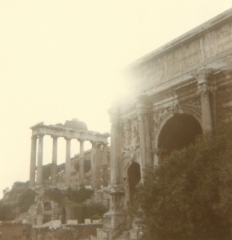

  
[Intangible Textual Heritage](../../../index)  [Classics](../../index.md) 
[Gibbon](../index.md) 

------------------------------------------------------------------------

[Buy this Book at
Amazon.com](https://www.amazon.com/exec/obidos/ASIN/B001VEIE98/internetsacredte.md)

------------------------------------------------------------------------

<table width="75%">
<colgroup>
<col style="width: 50%" />
<col style="width: 50%" />
</colgroup>
<tbody>
<tr class="odd">
<td width="50%" data-valign="TOP"> 
Roman Forum [Photograph (c) 2007 Copyright J. B. Hare, All Rights Reserved]</td>
<td width="50%" data-valign="CENTER"><h1 id="decline-and-fall-of-the-roman-empire-vol.-4" data-align="CENTER">Decline and Fall of the Roman Empire, Vol. 4</h1>
<h2 id="by-edward-gibbon" data-align="CENTER">by Edward Gibbon</h2>
<h4 id="section" data-align="CENTER">[1788]</h4></td>
</tr>
</tbody>
</table>

------------------------------------------------------------------------

[Contents](#contents)    [Start Reading](daf04000.md)

------------------------------------------------------------------------

[Volume 1](../01/index) \|  [Volume 2](../02/index.md) \|  [Volume
3](../03/index) \|  **Volume 4** \|  [Volume 5](../05/index.md) \|  [Volume
6](../06/index.md)

------------------------------------------------------------------------

|                                                                                                                           |
|---------------------------------------------------------------------------------------------------------------------------|
|  |

------------------------------------------------------------------------

 [Title Page](daf04000.md)  
[Chapter XXXIX: Gothic Kingdom Of Italy. Part I.](daf04001.md)  
[Chapter XXXIX: Gothic Kingdom Of Italy. Part II.](daf04002.md)  
[Chapter XXXIX: Gothic Kingdom Of Italy. Part III.](daf04003.md)  
[Chapter XL: Reign Of Justinian. Part I.](daf04004.md)  
[Chapter XL: Reign Of Justinian. Part II.](daf04005.md)  
[Chapter XL: Reign Of Justinian. Part III.](daf04006.md)  
[Chapter XL: Reign Of Justinian. Part IV.](daf04007.md)  
[Chapter XL: Reign Of Justinian. Part V.](daf04008.md)  
[Chapter XLI: Conquests Of Justinian, Charact Of Balisarius. Part
I.](daf04009.md)  
[Chapter XLI: Conquests Of Justinian, Charact Of Balisarius. Part
II.](daf04010.md)  
[Chapter XLI: Conquests Of Justinian, Charact Of Balisarius. Part
IV.](daf04011.md)  
[Chapter XLI: Conquests Of Justinian, Charact Of Balisarius. Part
V.](daf04012.md)  
[Chapter XLI: Conquests Of Justinian, Charact Of Balisarius. Part
VI.](daf04013.md)  
[Chapter XLII: State Of The Barbaric World. Part I.](daf04014.md)  
[Chapter XLII: State Of The Barbaric World. Part II.](daf04015.md)  
[Chapter XLII: State Of The Barbaric World. Part III.](daf04016.md)  
[Chapter XLII: State Of The Barbaric World. Part III.](daf04017.md)  
[Chapter XLIII: Last Victory And Death Of Belisarius, Death Of
Justinian. Part I.](daf04018.md)  
[Chapter XLIII: Last Victory And Death Of Belisarius, Death Of
Justinian. Part II.](daf04019.md)  
[Chapter XLIII: Last Victory And Death Of Belisarius, Death Of
Justinian. Part III.](daf04020.md)  
[Chapter XLIII: Last Victory And Death Of Belisarius, Death Of
Justinian. Part IV.](daf04021.md)  
[Chapter XLIV: Idea Of The Roman Jurisprudence. Part I.](daf04022.md)  
[Chapter XLIV: Idea Of The Roman Jurisprudence. Part II.](daf04023.md)  
[Chapter XLIV: Idea Of The Roman Jurisprudence. Part III.](daf04024.md)  
[Chapter XLIV: Idea Of The Roman Jurisprudence. Part IV.](daf04025.md)  
[Chapter XLIV: Idea Of The Roman Jurisprudence. Part IV.](daf04026.md)  
[Chapter XLIV: Idea Of The Roman Jurisprudence. Part V.](daf04027.md)  
[Chapter XLIV: Idea Of The Roman Jurisprudence. Part VI.](daf04028.md)  
[Chapter XLIV: Idea Of The Roman Jurisprudence. Part VII.](daf04029.md)  
[Chapter XLV: State Of Italy Under The Lombards. Part I.](daf04030.md)  
[Chapter XLV: State Of Italy Under The Lombards. Part II.](daf04031.md)  
[Chapter XLV: State Of Italy Under The Lombards. Part III.](daf04032.md)  
[Chapter XLVI: Troubles In Persia. Part I.](daf04033.md)  
[Chapter XLVI: Troubles In Persia. Part II.](daf04034.md)  
[Chapter XLVI: Troubles In Persia. Part III.](daf04035.md)  
[Chapter XLVI: Troubles In Persia. Part IV.](daf04036.md)  
[Chapter XLVII: Ecclesiastical Discord. Part I.](daf04037.md)  
[Chapter XLVII: Ecclesiastical Discord. Part II.](daf04038.md)  
[Chapter XLVII: Ecclesiastical Discord. Part III.](daf04039.md)  
[Chapter XLVII: Ecclesiastical Discord. Part III.](daf04040.md)  
[Chapter XLVII: Ecclesiastical Discord. Part III.](daf04041.md)  
[Chapter XLVII: Ecclesiastical Discord. Part V.](daf04042.md)  
[Chapter XLVIII: Succession And Characters Of The Greek Emperors. Part
I.](daf04043.md)  
[Chapter XLVIII: Succession And Characters Of The Greek Emperors. Part
II.](daf04044.md)  
[Chapter XLVIII: Succession And Characters Of The Greek Emperors. Part
III.](daf04045.md)  
[Chapter XLVIII: Succession And Characters Of The Greek Emperors. Part
IV.](daf04046.md)  
[Chapter XLVIII: Succession And Characters Of The Greek Emperors. Part
VI.](daf04047.md)  
