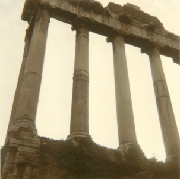

  
[Intangible Textual Heritage](../../../index)  [Classics](../../index.md) 
[Gibbon](../index.md) 

------------------------------------------------------------------------

[Buy this Book at
Amazon.com](https://www.amazon.com/exec/obidos/ASIN/B001VEIFCE/internetsacredte.md)

------------------------------------------------------------------------

<table width="75%">
<colgroup>
<col style="width: 50%" />
<col style="width: 50%" />
</colgroup>
<tbody>
<tr class="odd">
<td width="50%" data-valign="TOP"> 
Roman Forum [Photograph (c) 2007 Copyright J. Lelievre, All Rights Reserved]</td>
<td width="50%" data-valign="CENTER"><h1 id="decline-and-fall-of-the-roman-empire-vol.-6" data-align="CENTER">Decline and Fall of the Roman Empire, Vol. 6</h1>
<h2 id="by-edward-gibbon" data-align="CENTER">by Edward Gibbon</h2>
<h4 id="section" data-align="CENTER">[1788]</h4></td>
</tr>
</tbody>
</table>

------------------------------------------------------------------------

[Contents](#contents)    [Start Reading](daf06000.md)

------------------------------------------------------------------------

[Volume 1](../01/index) \|  [Volume 2](../02/index.md) \|  [Volume
3](../03/index) \|  [Volume 4](../04/index.md) \|  [Volume
5](../05/index.md) \|  **Volume 6**

------------------------------------------------------------------------

|                                                                                                                           |
|---------------------------------------------------------------------------------------------------------------------------|
|  |

------------------------------------------------------------------------

 [Title Page](daf06000.md)  
[The Crusades. Part I.](daf06001.md)  
[Chapter LIX: The Crusades. Part II.](daf06002.md)  
[Chapter LIX: The Crusades. Part III.](daf06003.md)  
[Chapter LX: The Fourth Crusade. Part I.](daf06004.md)  
[Chapter LX: The Fourth Crusade. Part II.](daf06005.md)  
[Chapter LX: The Fourth Crusade. Part III.](daf06006.md)  
[Chapter LXI: Partition Of The Empire By The French And Venetians. Part
I.](daf06007.md)  
[Chapter LXI: Partition Of The Empire By The French And Venetians. Part
II.](daf06008.md)  
[Chapter LXI: Partition Of The Empire By The French And Venetians. Part
III.](daf06009.md)  
[Chapter LXI: Partition Of The Empire By The French And Venetians. Part
III.](daf06010.md)  
[Chapter LXII: Greek Emperors Of Nice And Constantinople. Part
I.](daf06011.md)  
[Chapter LXII: Greek Emperors Of Nice And Constantinople. Part
II.](daf06012.md)  
[Chapter LXII: Greek Emperors Of Nice And Constantinople. Part
III.](daf06013.md)  
[Chapter LXIII: Civil Wars And The Ruin Of The Greek Empire. Part
I.](daf06014.md)  
[Chapter LXIII: Civil Wars And The Ruin Of The Greek Empire. Part
II.](daf06015.md)  
[Chapter LXIV: Moguls, Ottoman Turks. Part I.](daf06016.md)  
[Chapter LXIV: Moguls, Ottoman Turks. Part II.](daf06017.md)  
[Chapter LXIV: Moguls, Ottoman Turks. Part III.](daf06018.md)  
[Chapter LXIV: Moguls, Ottoman Turks. Part IV.](daf06019.md)  
[Chapter LXV: Elevation Of Timour Or Tamerlane, And His Death. Part
I.](daf06020.md)  
[Chapter LXV: Elevation Of Timour Or Tamerlane, And His Death. Part
II.](daf06021.md)  
[Chapter LXV: Elevation Of Timour Or Tamerlane, And His Death. Part
III.](daf06022.md)  
[Chapter LXVI: Union Of The Greek And Latin Churches. Part
I.](daf06023.md)  
[Chapter LXVI: Union Of The Greek And Latin Churches. Part
II.](daf06024.md)  
[Chapter LXVI: Union Of The Greek And Latin Churches. Part
III.](daf06025.md)  
[Chapter LXVI: Union Of The Greek And Latin Churches. Part
IV.](daf06026.md)  
[Chapter LXVII: Schism Of The Greeks And Latins. Part I.](daf06027.md)  
[Chapter LXVII: Schism Of The Greeks And Latins. Part II.](daf06028.md)  
[Chapter LXVIII: Reign Of Mahomet The Second, Extinction Of Eastern
Empire. Part I.](daf06029.md)  
[Chapter LXVIII: Reign Of Mahomet The Second, Extinction Of Eastern
Empire. Part II.](daf06030.md)  
[Chapter LXVIII: Reign Of Mahomet The Second, Extinction Of Eastern
Empire. Part III.](daf06031.md)  
[Chapter LXIX: State Of Rome From The Twelfth Century.](daf06032.md)  
[Chapter LXIX: State Of Rome From The Twelfth Century. Part
II.](daf06033.md)  
[Chapter LXIX: State Of Rome From The Twelfth Century. Part
III.](daf06034.md)  
[Chapter LXIX: State Of Rome From The Twelfth Century. Part
IV.](daf06035.md)  
[Chapter LXX: Final Settlement Of The Ecclesiastical State. Part
I.](daf06036.md)  
[Chapter LXX: Final Settlement Of The Ecclesiastical State. Part
II.](daf06037.md)  
[Chapter LXX: Final Settlement Of The Ecclesiastical State. Part
III.](daf06038.md)  
[Chapter LXX: Final Settlement Of The Ecclesiastical State. Part
IV.](daf06039.md)  
[Chapter LXXI: Prospect Of The Ruins Of Rome In The Fifteenth Century.
Part I.](daf06040.md)  
[Chapter LXXI: Prospect Of The Ruins Of Rome In The Fifteenth Century.
Part II.](daf06041.md)  
