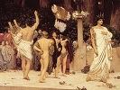

  
[Intangible Textual Heritage](../../index)  [Classics](../index) 
[Index](index)  [Previous](gpr16)  [Next](gpr18) 

------------------------------------------------------------------------

  
*Greek Popular Religion*, by Martin P. Nilsson, \[1940\], at Intangible
Textual Heritage

------------------------------------------------------------------------

p. 148

  [  
Click to enlarge](img/fig15.jpg)  
15. INITIATION RITES  

  [  
Click to enlarge](img/fig16.jpg)  
16. GODS OF ELEUSIS  

------------------------------------------------------------------------

[Next: Illustrations 17-18](gpr18)
