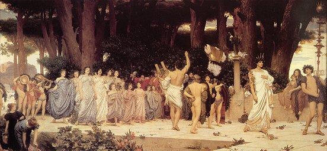

  
[Intangible Textual Heritage](../../index)  [Classics](../index.md) 

------------------------------------------------------------------------

<table width="75%">
<colgroup>
<col style="width: 50%" />
<col style="width: 50%" />
</colgroup>
<tbody>
<tr class="odd">
<td width="50%" data-valign="TOP"> 
Lord Frederick Leighton, The Daphnephoria (1874-6), public domain image</td>
<td width="50%" data-valign="CENTER"><h1 id="greek-popular-religion" data-align="CENTER">Greek Popular Religion</h1>
<h2 id="by-martin-p.-nilsson" data-align="CENTER">by Martin P. Nilsson</h2>
<h4 id="section" data-align="CENTER">[1940]</h4></td>
</tr>
</tbody>
</table>

------------------------------------------------------------------------

[Contents](#contents)    [Start Reading](gpr00.md)    [Page
Index](pageidx)    [Text \[Zipped\]](gpr.txt.gz.md)

------------------------------------------------------------------------

This is a short survey of Greek religious practice and beliefs from
ground level. The texts of Homer, Hesiod, and the Greek dramatists and
philosophers, who defined Greek beliefs, have long been known and
understood. There is a conventional view of Greek mythology which is
taught by rote to school children (at least until recently), which
relies on a neat set of 'myths and legends.' It was not until the
pioneering efforts of Jane Harrison and other scholars in the 19th
century that a picture emerged of what actually constituted Greek
religion, and how it evolved. This monograph covers what was known by
the middle of the 20th century. It gives a fascinating look at the very
earthy popular side of Greek religion, with its noisy (and often messy)
festivals, initiations, secret societies, oracles, and a practical but
very superstitious belief system. He also discusses how some of these
beliefs and festivals, under the guise of Christianity, have persisted
to this day.

--John B. Hare, November 8th, 2005

------------------------------------------------------------------------

 [Title Page](gpr00.md)  
[Foreword](gpr01.md)  
[Acknowledgements](gpr02.md)  
[Contents](gpr03.md)  
[Illustrations](gpr04.md)  
[The Countryside](gpr05.md)  
[Rural Customs and Festivals](gpr06.md)  
[The Religion of Eleusis](gpr07.md)  
[The House and the Family](gpr08.md)  
[The Cities; the Panegyreis](gpr09.md)  
[Legalism and Superstition; Hell](gpr10.md)  
[Seers and Oracles](gpr11.md)  

### Illustrations

[Illustrations 1-3](gpr12.md)  
[Illustrations 4-7](gpr13.md)  
[Illustrations 8-10](gpr14.md)  
[Illustrations 11-12](gpr15.md)  
[Illustrations 13-14](gpr16.md)  
[Illustrations 15-16](gpr17.md)  
[Illustrations 17-18](gpr18.md)  
[Illustrations 19-20](gpr19.md)  
[Illustrations 21-23](gpr20.md)  
[Illustrations 24-25](gpr21.md)  
[Illustrations 26-28](gpr22.md)  
[Illustrations 29-33](gpr23.md)  
[Illustrations 34-36](gpr24.md)  
[Illustrations 37-39](gpr25.md)  

 

[Index](gpr26.md)  
