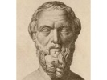

  
[Intangible Textual Heritage](../../index)  [Classics](../index) 
[Index](index)  [Previous](hh3150)  [Next](hh4000) 

------------------------------------------------------------------------

[Buy this Book at
Amazon.com](https://www.amazon.com/exec/obidos/ASIN/0140449086/internetsacredte)

------------------------------------------------------------------------

[Buy this Book on
Kindle](https://www.amazon.com/exec/obidos/ASIN/B002GU5X0Y/internetsacredte)

------------------------------------------------------------------------

  
*The History of Herodotus*, parallel English/Greek, tr. G. C. Macaulay,
\[1890\], at Intangible Textual Heritage

------------------------------------------------------------------------

### Herodotus Book 3: Thaleia \[160\]

|                                                                                                                                                                                                                                                                                                                                                                                                                                                                                                                                                                                                                                                                                                                                                                                                                                                                                                                                                                                 |     |                                                                                                                                                                                                                                                                                                                                                                                                                                                                                                                                                                                                                                                                                                                                               |
|---------------------------------------------------------------------------------------------------------------------------------------------------------------------------------------------------------------------------------------------------------------------------------------------------------------------------------------------------------------------------------------------------------------------------------------------------------------------------------------------------------------------------------------------------------------------------------------------------------------------------------------------------------------------------------------------------------------------------------------------------------------------------------------------------------------------------------------------------------------------------------------------------------------------------------------------------------------------------------|-----|-----------------------------------------------------------------------------------------------------------------------------------------------------------------------------------------------------------------------------------------------------------------------------------------------------------------------------------------------------------------------------------------------------------------------------------------------------------------------------------------------------------------------------------------------------------------------------------------------------------------------------------------------------------------------------------------------------------------------------------------------|
| 160\. As for Zopyros, in the judgment of Dareios no one of the Persians surpassed him in good service, either of those who came after or of those who had gone before, excepting Cyrus alone; for to Cyrus no man of the Persians ever yet ventured to compare himself: and Dareios is said to have declared often that he would rather that Zopyros were free from the injury than that he should have twenty Babylons added to his possession in addition to that one which he had. Moreover he gave him great honours; for not only did he give him every year those things which by the Persians are accounted the most honourable, but also he granted him Babylon to rule free from tribute, so long as he should live; and he added many other gifts. The son of this Zopyros was Megabyzos, who was made commander in Egypt against the Athenians and their allies; and the son of this Megabyzos was Zopyros, who went over to Athens as a deserter from the Persians. |     | 160\. \[1\] Ζωπύρου δὲ οὐδεὶς ἀγαθοεργίην Περσέων ὑπερεβάλετο παρὰ Δαρείῳ κριτῇ οὔτε τῶν ὕστερον γενομένων οὔτε τῶν πρότερον, ὅτι μὴ Κῦρος μοῦνος· τούτῳ γὰρ οὐδεὶς Περσέων ἠξίωσέ κω ἑωυτὸν συμβαλεῖν. πολλάκις δὲ Δαρεῖον λέγεται γνώμην τήνδε ἀποδέξασθαι, ὡς βούλοιτο ἂν Ζώπυρον εἶναι ἀπαθέα τῆς ἀεικείης μᾶλλον ἢ Βαβυλῶνάς οἱ εἴκοσι πρὸς τῇ ἐούσῃ προσγενέσθαι. \[2\] ἐτίμησε δέ μιν μεγάλως· καὶ γὰρ δῶρά οἱ ἀνὰ πᾶν ἔτος ἐδίδου ταῦτα τὰ Πέρσῃσι ἐστὶ τιμιώτατα, καὶ τὴν Βαβυλῶνά οἱ ἔδωκε ἀτελέα νέμεσθαι μέχρι τῆς ἐκείνου ζόης, καὶ ἄλλα πολλὰ ἐπέδωκε. Ζωπύρου δὲ τούτου γίνεται Μεγάβυζος, ὃς ἐν Αἰγύπτῳ ἀντία Ἀθηναίων καὶ τῶν συμμάχων ἐστρατήγησε· Μεγαβύζου δὲ τούτου γίνεται Ζώπυρος, ὃς ἐς Ἀθήνας ηὐτομόλησε ἐκ Περσέων. |

------------------------------------------------------------------------

[Next: 1](hh4000)
