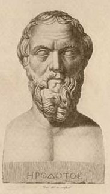

  
[Intangible Textual Heritage](../../index)  [Classics](../index) 

------------------------------------------------------------------------

[Buy this Book at
Amazon.com](https://www.amazon.com/exec/obidos/ASIN/0140449086/internetsacredte)

------------------------------------------------------------------------

[Buy this Book on
Kindle](https://www.amazon.com/exec/obidos/ASIN/B002GU5X0Y/internetsacredte)

------------------------------------------------------------------------

<table width="75%">
<colgroup>
<col style="width: 50%" />
<col style="width: 50%" />
</colgroup>
<tbody>
<tr class="odd">
<td width="50%" data-valign="TOP"></td>
<td width="50%" data-valign="CENTER"><h1 id="the-history-of-herodotus" data-align="CENTER">The History of Herodotus</h1>
<h2 id="parallel-englishgreek" data-align="CENTER">parallel English/Greek</h2>
<h4 id="english-translation-g.-c.-macaulay-pub.-macmillan-london-and-ny-1890" data-align="CENTER">English translation: G. C. Macaulay, (pub. Macmillan, London and NY) [1890]</h4></td>
</tr>
</tbody>
</table>

------------------------------------------------------------------------

[Contents](#contents)    [Start Reading](hh1000)    [Text
\[Zipped\]](hh.txt.gz)

------------------------------------------------------------------------

|                                                                                                                           |
|---------------------------------------------------------------------------------------------------------------------------|
|  |

Herodotus (484-ca. 425 BCE), the 'Father of History,' wrote this account
of the ephocal conflict between the Greeks and Persians between 430 and
424 BCE. The title of the work, 'Historie' means 'Inquiry.' Subsequently
it became the name of the science of history, and via Latin passed into
other languages including English.

Divided by later editors into nine books named after the Muses, the
History traces the growth of the Persian empire, starting with Croesus
of Lydia, though Cyrus and Xerxes. The pivotal event of the History is
the Battle of Marathon (490 BCE), where the Persians were defeated by
the Greeks. A decade later the Persians, led by Xerxes, returned but
were decisively defeated at the Battle of Plataea in 479 BCE. One can
only wonder what the world would have been like if the nascent Greek
democracy and high classical culture had been nipped in the bud by
Persian despotism.

Beyond the historical narrative, Herodotus is one of the primary sources
for information on ancient lands and peoples, including anthropological,
geographical, and other information. There are extensive details in the
narrative relating to the spiritual practices and beliefs of the Greeks
and other peoples. Herodotus has been perennially controversial.
However, he was careful to qualify information which he found dubious
and evaluate variant theories on their merits. While specifics of his
account have been challenged, his preeminence as the inventor of the
methodology and philosophy of history are undisputed.

Note: To view the polytonic Greek text properly, you will need to
correctly set up your browser for Unicode: [click here for
instructions](../../unicode). *If you can't view the Greek or you see
'boxes' among the Greek text, the problem is with your browser; not this
site*.

------------------------------------------------------------------------

[Book 1: Clio](#section_000)   \|    [Book 2:
Euterpe](#section_001)   \|    [Book 3: Thaleia](#section_002)   \|   
[Book 4: Melpomene](#section_003)   \|    [Book 5:
Terpsichore](#section_004)   \|    [Book 6: Erato](#section_005)   \|   
[Book 7: Polymnia](#section_006)   \|    [Book 8:
Urania](#section_007)   \|    [Book 9: Calliope](#section_008)

------------------------------------------------------------------------

### Book 1: Clio

[1](hh1000)  
[10](hh1010)  
[20](hh1020)  
[30](hh1030)  
[40](hh1040)  
[50](hh1050)  
[60](hh1060)  
[70](hh1070)  
[80](hh1080)  
[90](hh1090)  
[100](hh1100)  
[110](hh1110)  
[120](hh1120)  
[130](hh1130)  
[140](hh1140)  
[150](hh1150)  
[160](hh1160)  
[170](hh1170)  
[180](hh1180)  
[190](hh1190)  
[200](hh1200)  
[210](hh1210)  

### Book 2: Euterpe

[1](hh2000)  
[10](hh2010)  
[20](hh2020)  
[30](hh2030)  
[40](hh2040)  
[50](hh2050)  
[60](hh2060)  
[70](hh2070)  
[80](hh2080)  
[90](hh2090)  
[100](hh2100)  
[110](hh2110)  
[120](hh2120)  
[130](hh2130)  
[140](hh2140)  
[150](hh2150)  
[160](hh2160)  
[170](hh2170)  
[180](hh2180)  

### Book 3: Thaleia

[1](hh3000)  
[10](hh3010)  
[20](hh3020)  
[30](hh3030)  
[40](hh3040)  
[50](hh3050)  
[60](hh3060)  
[70](hh3070)  
[80](hh3080)  
[90](hh3090)  
[100](hh3100)  
[110](hh3110)  
[120](hh3120)  
[130](hh3130)  
[140](hh3140)  
[150](hh3150)  
[160](hh3160)  

### Book 4: Melpomene

[1](hh4000)  
[10](hh4010)  
[20](hh4020)  
[30](hh4030)  
[40](hh4040)  
[50](hh4050)  
[60](hh4060)  
[70](hh4070)  
[80](hh4080)  
[90](hh4090)  
[100](hh4100)  
[110](hh4110)  
[120](hh4120)  
[130](hh4130)  
[140](hh4140)  
[150](hh4150)  
[160](hh4160)  
[170](hh4170)  
[180](hh4180)  
[190](hh4190)  
[200](hh4200)  

### Book 5: Terpsichore

[1](hh5000)  
[10](hh5010)  
[20](hh5020)  
[30](hh5030)  
[40](hh5040)  
[50](hh5050)  
[60](hh5060)  
[70](hh5070)  
[80](hh5080)  
[90](hh5090)  
[100](hh5100)  
[110](hh5110)  
[120](hh5120)  

### Book 6: Erato

[1](hh6000)  
[10](hh6010)  
[20](hh6020)  
[30](hh6030)  
[40](hh6040)  
[50](hh6050)  
[60](hh6060)  
[70](hh6070)  
[80](hh6080)  
[90](hh6090)  
[100](hh6100)  
[110](hh6110)  
[120](hh6120)  
[130](hh6130)  
[140](hh6140)  

### Book 7: Polymnia

[1](hh7000)  
[10](hh7010)  
[20](hh7020)  
[30](hh7030)  
[40](hh7040)  
[50](hh7050)  
[60](hh7060)  
[70](hh7070)  
[80](hh7080)  
[90](hh7090)  
[100](hh7100)  
[110](hh7110)  
[120](hh7120)  
[130](hh7130)  
[140](hh7140)  
[150](hh7150)  
[160](hh7160)  
[170](hh7170)  
[180](hh7180)  
[190](hh7190)  
[200](hh7200)  
[210](hh7210)  
[220](hh7220)  
[230](hh7230)  

### Book 8: Urania

[1](hh8000)  
[10](hh8010)  
[20](hh8020)  
[30](hh8030)  
[40](hh8040)  
[50](hh8050)  
[60](hh8060)  
[70](hh8070)  
[80](hh8080)  
[90](hh8090)  
[100](hh8100)  
[110](hh8110)  
[120](hh8120)  
[130](hh8130)  
[140](hh8140)  

### Book 9: Calliope

[1](hh9000)  
[10](hh9010)  
[20](hh9020)  
[30](hh9030)  
[40](hh9040)  
[50](hh9050)  
[60](hh9060)  
[70](hh9070)  
[80](hh9080)  
[90](hh9090)  
[100](hh9100)  
[110](hh9110)  
[120](hh9120)  
