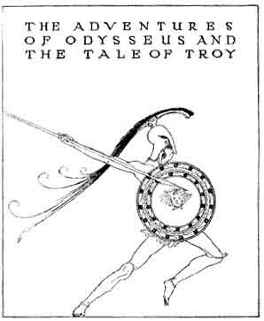

  
[Intangible Textual Heritage](../../../index)  [Classics](../../index.md) 
[Homer](../index)  [Index](index)  [Next](aoo01.md) 

------------------------------------------------------------------------

# THE ADVENTURES OF ODYSSEUS AND THE TALE OF TROY

## BY PADRAIC COLUM

### Illustrated by Willy Pogany

#### Macmillan Company; New York

#### \[1918\]

###### Scanned and proofed by Eliza Fegeley, sacredspiral.com, February, 2004. Additional formatting by John Bruno Hare, Intangible Textual Heritage. This text is in the public domain in the United States. These files may be used for any non-commercial purpose, provided this notice of attribution is left intact

 

------------------------------------------------------------------------

[Next: Chapter I](aoo01.md)
