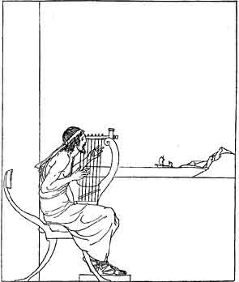

  
[Intangible Textual Heritage](../../../index)  [Classics](../../index.md) 
[Homer](../index)  [Index](index)  [Previous](aoo02)  [Next](aoo04.md) 

------------------------------------------------------------------------

### III

|                  |
|------------------|
|  |

WHEN Telemachus went back to the hall those who were feasting there had
put the wine-cups from them and were calling out for Phemius, the
minstrel, to come and sing some tale to delight them. And as he went
amongst them one of the wooers said to another, ‘The guest who was with
him has told Telemachus something that has changed his bearing. Never
before did I see him hold himself so proudly. Mayhap he has spoken to
him of the return of his father, the renowned Odysseus.’

Phemius came and the wooers called upon him to sing them a tale. And the
minstrel, in flowing verse, began the tale of the return of the Kings
and Princes from Troy, and of how some god or goddess put a trouble upon
them as they left the City they had taken. And as the minstrel began the
tale, Penelope, Telemachus’ lady-mother, was coming down the stairs with
two hand-maids beside her. She heard the words he sang, and she stood
still in her grief and drew her veil across her face. ‘O Phemius,’ she
cried, ‘cease from that story that ever wastes my heart--the story that
has brought me sorrow and that leaves me comfortless all my days! O
Phemius, do you not know other tales of men and gods that you might sing
in this hall for the delight of my noble wooers?’

The minstrel would have ceased when Penelope spoke thus to him, but
Telemachus went to the stairway where his lady-mother stood, and
addressed her.

‘My lady-mother,’ said he, ‘why should you not let the minstrel delight
the company with such songs as the spirit moves him to give us? It is no
blame to him if he sings of that which is sorrowful to us. As for you,
my mother, you must learn to endure that story, for long will it be sung
and far and wide. And you are not the only one who is bereaved--many
another man besides Odysseus lost the happy day of his home-coming in
the war of Troy.’

Penelope, his lady-mother, looked in surprise at the youth who spoke to
her so wisely. Was his indeed Telemachus who before had hardly lifted
his head? And as she looked at him again she saw that he carried his
head--that head of his that was so like Odysseus’--high and proudly. She
saw that her son was now indeed a man. Penelope spoke no word to him,
for a new thought had come into her mind. She turned round on the stairs
and went back with her hand-maids to the chamber where her loom and her
distaff were. And as she went up the stairway and away from them her
wooers muttered one to the other that she would soon have to choose one
of them for her husband.

Telemachus turned to those who were standing at the tables and addressed
them. ‘Wooers of my mother,’ he said, ‘I have a word to say to you.’

‘By the gods, youth,’ said one of the wooers, ‘you must tell us first
who he is who has made you so high and proud of speech.’

‘Surely,’ said another, ‘he who has done that is the stranger who was
with him. Who is he? Why did he come here, and of what land has he
declared himself to be?’

‘Why did he not stay so that we might look at him and speak to him?’
said another of the wooers.

‘These are the words I would say to you. Let us feast now in peace,
without any brawling amongst us, and listen to the tale that the
minstrel sings to us,’ said Telemachus. ‘But to-morrow let us have a
council made up of the chief men of this land of Ithaka. I shall go to
the council and speak there. I shall ask that you leave this house of
mine and feast on goods that you yourselves have gathered. Let the chief
men judge whether I speak in fairness to you or not. If you do not heed
what I will say openly at the council, before all the chief men of our
land, then let it be on your own heads what will befall you.’

All the wooers marvelled that Telemachus spoke so boldly. And one said,
‘Because his father, Odysseus, was king, this youth thinks he should be
king by inheritance. But may Zeus, the god, never grant that he be
king.’

Then said Telemachus, ‘If the god Zeus should grant that I be King, I am
ready to take up the Kingship of the land of Ithaka with all its toils
and all its dangers.’ And when Telemachus said that he looked like a
young king indeed.

But they sat in peace and listened to what the minstrel sang. And when
evening came the wooers left the hall and went each to his own house.
Telemachus rose and went to his chamber. Before him there went an
ancient woman who had nursed him as a child--Eurycleia was her name. She
carried burning torches to light his way. And when they were in his
chamber Telemachus took off his soft doublet and put it in Eurycleia’s
hands, and she smoothed it out and hung it on the pin at his bed-side.
Then she went out and she closed the door behind with its handle of
silver and she pulled the thong that bolted the door on the other side.
And all night long Telemachus lay wrapped in his fleece of wool and
thought on what he would say at the council next day, and on the goddess
Athene and what she had put into his heart to do, and on the journey
that was before him to Nestor in Pylos and to Menelaus and Helen in
Sparta.

------------------------------------------------------------------------

[Next: Chapter IV](aoo04.md)
