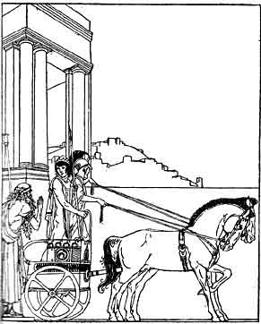

  
[Intangible Textual Heritage](../../../index)  [Classics](../../index.md) 
[Homer](../index)  [Index](index)  [Previous](aoo07)  [Next](aoo09.md) 

------------------------------------------------------------------------

### VIII

|                  |
|------------------|
|  |

THEY came to Sparta, to a country lying low amongst the hills, and they
stayed the chariot outside the gate of the King’s dwelling. Now upon
that day Menelaus was sending his daughter into Phthia, with horses and
chariots, as a bride for Achilles’ son. And for Megapenthes, his own
son, a bride was being brought into the house. Because of these two
marriages there was feasting in the palace and kinsmen and neighbours
were gathered there. A minstrel was singing to the guests and two
tumblers were whirling round the high hall to divert them.

To the King in his high hall came Eteoneus, the steward. ‘Renowned
Menelaus,’ said Eteoneus, ‘there are two strangers outside, men with the
looks of heroes. What would you have me do with them? Shall I have their
horses unyoked, bidding them enter the Palace, or shall I let them fare
on to another dwelling?’

‘Why do you ask such a question, Eteoneus?’ said Menelaus in anger.
‘Have we not eaten the bread of other men on our wanderings, and have we
not rested ourselves in other men’s houses? Knowing this you have no
right to ask whether you should bid strangers enter or let them go past
the gate of my dwelling. Go now and bid them enter and feast with us.’

Then Eteoneus went from the hall, and while he had servants unyoke the
horses from their chariot he led Telemachus and Peisistratus into the
palace. First they were brought to the bath, and when they had come from
the bath refreshed, they were given new cloaks and mantles. When they
had dressed themselves they were led into the King’s high hall. They
seated themselves there, and a maid brought water in a golden ewer and
poured it over their hands into a silver basin. Then a polished table
was put beside them, and the housedame placed bread and meat and wine
upon it so that they might eat.

Menelaus came to where they sat and said to Telemachus and Peisistratus,
‘By your looks I know you to be of the line of Kings. Eat now, and when
you have refreshed yourselves I will ask who you are and from what place
you come.’

But before they had finished their meal, and while yet Menelaus the king
was showing them the treasures that were near, the lady Helen came into
the high hall--Helen for whom the Kings and Princes of Greece had gone
to war. Her maids were with her, and they set a chair for her near where
Menelaus was and they put a rug of soft wool under her feet. Then one
brought to her a silver basket filled with colored yarn. And Helen sat
in her high chair and took the distaff in her hands and worked the yarn.
She questioned Menelaus about the things that had happened during the
day, and as she did she watched Telemachus.

Then the lady Helen left the distaff down and said, ‘Menelaus, I am
minded to tell you who one of these strangers is. No one was ever more
like another than this youth is like great-hearted Odysseus. I know that
he is no other than Telemachus, whom Odysseus left as a child, when, for
my sake, the Greeks began their war against Troy.’

Then said Menelaus, ‘I too mark his likeness to Odysseus. The shape of
his head, the glance of his eye, remind me of Odysseus. But can it
indeed be that Telemachus has come into my house?’

‘Renowned Menelaus,’ said Peisistratus, ‘this is indeed the son of
Odysseus. And I avow myself to be the son of another comrade of yours,
of Nestor, who was with you at the war of Troy. I have been sent with
Telemachus to be his guide to your house.’

Menelaus rose up and clasped the hand of Telemachus. ‘Never did there
come to my house,’ said he, ‘a youth more welcome. For my sake did
Odysseus endure much toil and many adventures. Had he come to my country
I would have given him a city to rule over, and I think that nothing
would have Parted us, one from the other. But Odysseus, I know, has not
returned to his own land of Ithaka.’

Then Telemachus, thinking upon his father, dead, or wandering through
the world, wept. Helen, too, shed tears, remembering things that had
happened. And Menelaus, thinking upon Odysseus and on all his toils, was
silent and sad; and sad and silent too was Peisistratus, thinking upon
Antilochos, his brother, who had perished in the war of Troy.

But Helen, wishing to turn their minds to other thoughts, cast into the
wine a drug that lulled pain and brought forgetfulness--a drug which had
been given to her in Egypt by Polydamna, the wife of King Theon. And
when they had drunk the wine their sorrowful memories went from them,
and they spoke to each other without regretfulness. Thereafter King
Menelaus told of his adventure with the Ancient One of the Sea--the
adventure that had brought to him the last tidings of Odysseus.

------------------------------------------------------------------------

[Next: Chapter IX](aoo09.md)
