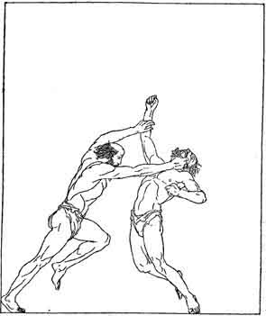
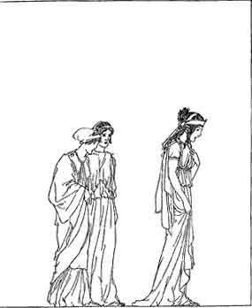

  
[Intangible Textual Heritage](../../../index)  [Classics](../../index) 
[Homer](../index)  [Index](index)  [Previous](aoo33)  [Next](aoo35) 

------------------------------------------------------------------------

### XI

THERE was in Ithaka a common beggar; he was a most greedy fellow, and he
was nicknamed Irus because he used to run errands for the servants of
Odysseus’ house. He came in the evening, and seeing a seeming beggar
seated on the threshold, he flew into a rage and shouted at him:

‘Get away from here, old fellow, lest you be dragged away by the hand or
foot. Look you! The lords within the house are giving me the wink to
turn you out. But I can’t demean myself by touching the like of you. Get
up now and go while I’m easy with you.’

Odysseus looked at the fellow and said, ‘I have not harmed you in deed
or word, and I do not grudge you anything of what you may get in this
house. The threshold I sit on is wide enough for two of us.’

‘What words this fellow has!’ said Irus the beggar. ‘He talks like an
old sit-by-the-fire. I’ll not waste more words on him. Get up now, heavy
paunch, and strip for the fight, for I’m going to show all the lords
that I can keep the door for them.’

‘Do not provoke me,’ said Odysseus. ‘Old as I seem, I may be able to
draw your blood.’

But Irus kept on shouting, ‘I’ll knock the teeth out of your jaws.’
‘I’ll trounce you.’ Antinous, the most insolent of the wooers, saw the
squabble, and he laughed to see the pair defying each other. ‘Friends,’
said he, ‘the gods are good to us, and don’t fail to send us amusement.
The strange beggar and our own Irus are threatening each other. Let us
see that they don’t draw back from the fight. Let us match one against
the other.’

ALL the wooers trooped to the threshold and stood round the ragged men.
Antinous thought of something to make the game more merry. ‘There are
two great puddings in the larder,’ he said. ‘Let us offer them for a
prize to these pugilists. Come, Irus. Come, stranger. A choice of
puddings for whichever of you wins the match. Aye, and more than that.
Whoever wins shall have leave to eat every day in this hall, and no
other beggar shall be let come near the house. Go to it now, ye mighty
men.’ All the wooers crowded round and clapped the men on to the fight.

|                  |
|------------------|
|  |

Odysseus said, ‘Friends, an old man like me cannot fight one who is
younger and abler.’

But they cried to him, ‘Go on, go on. Get into the fight or else take
stripes upon your body.’

Then said Odysseus, ‘Swear to me, all of you, that none of you will show
favour to Irus nor deal me a foul blow.’

All the wooers cried out that none would favour Irus or deal his
opponent a foul blow. And Telemachus, who was there, said, ‘The man who
strikes thee, stranger, will have to take reckoning from me.’

Straightway Odysseus girt up his rags. When his great arms and shoulders
and thighs were seen, the wooers were amazed and Irus was frightened. He
would have slipped away if Antinous had not caught him and said to him,
‘You lubber, you! If you do not stand up before this man I will have you
flung on my ship and sent over to King Echetus, who will cut off your
nose and ears and give your flesh to his dogs to eat.’ He took hold of
Irus and dragged him into the ring.

The fighters faced each other. But Odysseus with his hands upraised
stood for long without striking, for he was pondering whethering he
should strike Irus a hard or a light blow. It seemed to him better to
strike him lightly, so that his strength should not be made a matter for
the wooers to note and wonder at. Irus struck first. He struck Odysseus
on the shoulder. Then Odysseus aimed a blow at his neck, just below the
ear, and the beggar fell to the ground, with the blood gushing from his
mouth and nose.

The wooers were not sorry for Irus. They laughed until they were ready
to fall backwards. Then Odysseus seized Irus by the feet, and dragged
him out of the house, and to the gate of the courtyard. He lifted him up
and put him standing against the wall. Placing the staff in the beggar’s
hands, he said, ‘Sit there, and scarce off the dogs and swine, and do
not let such a one as you lord it over strangers. A worse thing might
have befallen you.’

Then back he went to the hall, with his beggar’s bag on his shoulder and
his clothes more ragged than ever. Back he went, and when the wooers saw
him they burst into peals of laughter and shouted out:

‘May Zeus, O stranger, give thee thy dearest wish and thy heart’s
desire. Thou only shalt be beggar in Ithaka.’ They laughed and laughed
again when Antinous brought out the great pudding that was the prize.
Odysseus took it from him. And another of the wooers pledged him in a
golden cup, saying, ‘May you come to your own, O beggar, and may
happiness be yours in time to come.’

While these things were happening, the wife of Odysseus, the lady
Penelope, called to Eurycleia, and said, ‘This evening I will go into
the hall of our house and speak to my son, Telemachus. Bid my two
handmaidens make ready to come with me, for I shrink from going amongst
the wooers alone.’

Eurycleia went to tell the handmaidens and Penelope washed off her
cheeks the traces of the tears that she had wept that day. Then she sat
down to wait for the handmaidens to come to her. As she waited she fell
into a deep sleep. And as she slept, the goddess Pallas Athene bathed
her face in the Water of Beauty and took all weariness away from her
body, and restored all her youthfulness to her. The sound of the
handmaidens’ voices as they came in awakened her, and Penelope rose up
to go into the hall.

Now when she came amongst them with her two handmaidens, one standing
each side of her, the wooers were amazed, for they had never seen one so
beautiful. The hearts of all were enchanted with love for her, and each
prayed that he might have her for his wife.

Penelope did not look on any of the wooers, but she went to her son,
Telemachus, and spoke to him.

‘Telemachus,’ she said, ‘I have heard that a stranger has been
ill-treated in this house. How, my child, didst thou permit such a thing
to happen?’

Telemachus said, ‘My lady mother, thou hast no right to be angered at
what took place in this hall.’

So they spoke to one another, mother and son. Now one of the wooers,
Eurymachus by name, spoke to Penelope, saying:

‘Lady, if any more than we beheld thee in the beauty thou hast now, by
so many more wouldst thou have wooers to-morrow.’

‘Speak not so to me, lord Eurymachus,’ said Penelope, ‘speak not of my
beauty, which departed in the grief I felt when my lord went to the wars
of Troy.’

Odysseus stood up, and gazed upon his wife who was standing amongst her
wooers. Eurymachus noted him and going to him, said, ‘Stranger, wouldst
thou be my hireling? If thou wouldst work on my upland farm, I should
give thee food and clothes. But I think thou art practised only in
shifts and dodges, and that 

|                  |
|------------------|
|  |

thou wouldst prefer to go begging thy way through the country.’

Odysseus, standing there, said to that proud wooer, ‘Lord Eurymachus, if
there might be a trial of labour between us two, I know which of us
would come out the better man. I would that we two stood together, a
scythe in the hands of each, and a good swath of meadow to be mown--then
would I match with thee, fasting from dawn until evening’s dark. Or
would that we were set ploughing together. Then thou shouldst see who
would plough the longest and the best furrow! Or would that we two were
in the ways of war! Then shouldst thou see who would be in the front
rank of battle. Thou dost think thyself a great man. But if Odysseus
should return, that door, wide as it is, would be too narrow for thy
flight.’

So angry was Eurymachus at this speech that he would have struck
Odysseus if Telemachus had not come amongst the wooers, saying, ‘That
man must not be struck again in this hall. Sirs, if you have finished
feasting, and if the time has come for you, go to your own homes, go in
peace I pray you.’

All were astonished that Telemachus should speak so boldly. No one
answered him back, for one said to the other, ‘What he has said is
proper. We have nothing to say against it. To misuse a stranger in the
house of Odysseus is a shame. Now let us pour out a libation of wine to
the gods, and then let each man go to his home.’

The wine was poured out and the wooers departed. Then Penelope and her
handmaidens went to her own chamber and Telemachus was left with his
father, Odysseus.

------------------------------------------------------------------------

[Next: Chapter XII](aoo35)
