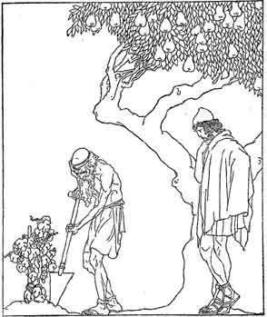
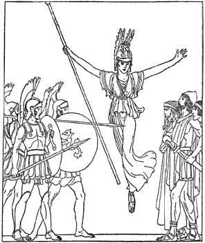

  
[Intangible Textual Heritage](../../../index)  [Classics](../../index) 
[Homer](../index)  [Index](index)  [Previous](aoo39) 

------------------------------------------------------------------------

### XVII

AND still many dangers had to be faced. The wooers whom Odysseus had
slain were the richest and the most powerful of the lords of Ithaka and
the Islands; all of them had fathers and brothers who would fain avenge
them upon their slayer.

Now before anyone in the City knew that he had returned, Odysseus went
forth to the farm that Laertes, his old father, stayed at. As he drew
near he saw an old man working in the vineyard, digging round a plant.
When he came to him he saw that this old man was not a slave nor a
servant, but Laertes, his own father.

When he saw him, 

|                  |
|------------------|
|  |

wasted with age and all uncared for, Odysseus stood still, leaning his
hand against a pear tree and sorrowing in his heart. Old Laertes kept
his head down as he stood digging at the plant, and he did not see
Odysseus until he stood before him and said:

‘Old man, thou dost care for this garden well and all things here are
flourishing--fig tree, and vine, and olive, and pear. But, if a stranger
may say it, thine own self is not cared for well.’

‘Who art thou that dost speak to me like this?’ old Laertes said,
lifting his head.

‘I am a stranger in Ithaka,’ said Odysseus. ‘I seek a man whom I once
kindly treated--a man whose name was Odysseus. A stranger, he came to
me, and he declared that he was of Ithaka, and that one day he would
give me entertainment for the entertainment I had given him. I know not
if this man be still alive.’

Old Laertes wept before Odysseus. ‘Ah,’ said he, ‘if thou hadst been
able to find him here, the gifts you gave him would not have been
bestowed in vain. True hospitality thou wouldst have received from
Odysseus, my son. But he has perished--far from his country’s soil he
has perished, the hapless man, and his mother wept not over him, nor his
wife, nor me, his father.’

So he spake and then with his hands he took up the dust of the ground,
and he strewed it over his head in his sorrow. The heart of Odysseus was
moved with grief. He sprang forward and fell on his father’s neck and he
kissed him, saying:

‘Behold I am here, even I, my father. I, Odysseus, have come back to
mine own country. Cease thy lamentation until I tell thee of the things
that have happened. I have slain the wooers in mine hall, and I have
avenged all their injuries and all their wrongful doings. Dost thou not
believe this, my father? Then look on what I will show thee. Behold on
my foot the mark of the boar’s tusk--there it is from the days of my
youth.’

Laertes looked down on the bare foot, and he saw the scar, but still his
mind was clouded by doubt. But then Odysseus took him through the
garden, and he told him of the fruit trees that Laertes had set for him
when he, Odysseus, was a little child, following his father about the
garden--thirteen pear trees, and ten apple trees, and forty fig trees.

When Odysseus showed him these Laertes knew that it was his son indeed
who stood before him--his son come back after twenty years’ wandering.
He cast his arms around his neck, and Odysseus caught him fainting to
his breast, and led him into the house.

Within the house were Telemachus, and Eumæus the swineherd and Philœtius
the cattle-herd. They all clasped the hand of Laertes and their words
raised his spirits. Then he was bathed, and, when he came from the bath,
rubbed with olive oil he looked hale and strong. Odysseus said to him,
‘Father, surely one of the gods has made thee goodlier and greater than
thou wert a while ago.’

Said the old hero Laertes: ‘Ah, my son, would that I had such might as
when, long before thou wert born, I took the Castle of Nericus there
upon the Foreland. Would that in such might, and with such mail upon my
shoulders, I stood with thee yesterday when thou didst fight with the
wooers.’

WHILE they were speaking in this way the rumour of the slaying of the
wooers went through the City. Then those who were related to the men
slain went into the courtyard of Odysseus’ house, and brought forth the
bodies. Those who belonged to Ithaka they buried, and those who belonged
to the Islands they put upon ships, and sent them with fisherfolk, each
to his own home. Many were wroth with Odysseus for the slaying of a
friend. He who was the most wroth was Eupeithes, the father of Antinous.

There was an assembly of the men of the country, and Eupeithes spake in
it, and all who were there pitied him. He told how Odysseus had led away
the best of the men of Ithaka, and how he had lost them in his ships.
And he told them how, when he returned, he slew the noblest of the men
of Ithaka and the Islands in his own hall. He called upon them to slay
Odysseus saying, ‘If we avenge not ourselves on the slayer of our kin we
will be scorned for all time as weak and cowardly men. As for me, life
will be no more sweet to me. I would rather die straightway and be with
the deParted. Up now, and let us attack Odysseus and his followers
before they take ship and escape across the sea.’

Many in that assembly put on their armour and went out with old
Eupeithes. And as they went through the town they met with Odysseus and
his following as they were coming from the house of Laertes.

Now as the two bands came close to each other--Odysseus with Telemachus
and Laertes; with the swineherd and the cattle-herd; with Dolius,
Laertes’ servant, and with the six sons of Dolius--and Eupeithes with
his friends--a great figure came between. It was the figure of a tall,
fair and splendid woman. Odysseus knew her for the goddess Pallas
Athene. 

|                  |
|------------------|
|  |

‘Hold your hands from fierce fighting, ye men of Ithaka,’ the goddess
called out in a terrible voice. ‘Hold your hands.’ Straightway the arms
fell from each man’s hands. Then the goddess called them together, and
she made them enter into a covenant that all bloodshed and wrong would
be forgotten, and that Odysseus would be left to rule Ithaka as a King,
in peace.

So ends the story of Odysseus who went with King Agamemnon to the wars
of Troy; who made the plan of the Wooden Horse by which Priam’s City was
taken at last; who missed the way of his return, and came to the Land of
the Lotus-eaters; who came to the Country of the dread Cyclopes, to the
Island of Æolus and to the house of Circe, the Enchantress; who heard
the song of the Sirens, and came to the Rocks Wandering, and to the
terrible Charybdis, and to Scylla, past whom no other man had won
scatheless; who landed on the Island where the Cattle of the Sun grazed,
and who stayed upon Ogygia, the home of the nymph Calypso; so ends the
story of Odysseus, who would have been made deathless and ageless by
Calypso if he had not yearned always to come back to his own hearth and
his own land. And spite of all his troubles and his toils he was
fortunate, for he found a constant wife and dutiful son and a father
still alive to weep over him.

THE END
