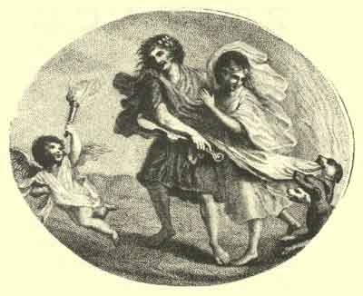

[Intangible Textual Heritage](../../index)  [Classics](../index.md) 
[Index](index)  [Next](hoo01.md) 

------------------------------------------------------------------------

p. i

The

HYMNS OF ORPHEUS,

Translated from the original Greek

With a Preliminary Dissertation on

THE LIFE AND THEOLOGY OF ORPHEUS.

 

London, printed for the Author,

And sold by T. Payne, at the Mews-gate; B. White and Son,  
Fleet-street; G. Nicol, Pall-Mall; R. Faulder, New  
Bond-street. 1792.

\[Price Five Shillings, Boards.\]

###### Scanned at Saced-texts.com, January 2003. J.B. Hare Redactor. This text is in the public domain. This file may be used for any non-commercial purpose provided this notice of attribution is left intact.

###### Note: The typography of the original, which prints '*s*' as '*f*', has changed to use '*s*' throughout. In doubtful cases, the original spelling is left intact and the word is bolded. Other than this, no spelling has been altered (including archaisms and British spellings) except for a few actual spelling errors which are documented in the errata file. --JBH.

------------------------------------------------------------------------

[Next: Preface](hoo01.md)
