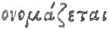

[Intangible Textual Heritage](../../index)  [Classics](../index) 
[Index](index)  [Previous](hoo09)  [Next](hoo11) 

------------------------------------------------------------------------

###### V.

### TO PROTOGONUS,

##### Or the FIRST-BORN.

###### The FUMIGATION from MYRRH.

O Mighty first-begotten, hear my pray'r,  [1](#fn_50)  
Two-fold, egg-born, and wand'ring thro' the air,

p. 119

Bull-roarer, glorying in thy golden wings,  [3](#fn_51)  
From whom the race of Gods and mortals springs.

p. 120

Ericapæus, celebrated pow'r, 5  
Ineffable, occult, all shining flow'r.  
From eyes obscure thou wip'st the gloom of night,  
All-spreading splendour, pure and holy light  
Hence Phanes call'd, the glory of the sky,  
On waving pinions thro' the world you fly. 10  
Priapus, dark-ey'd splendour, thee I sing,  
Genial, all-prudent, ever-blessed king,

p. 121

With joyful aspect on our rights divine  
And holy sacrifice propitious shine.

------------------------------------------------------------------------

### Footnotes

[118:1](hoo10.htm#fr_50) Ver. 1.\]
*First-begotten*, and v. ii. *Egg-born*. According to Orpheus, as
related by Syrianus in Metaph. Aristot. p. 114, the first principle; of
all things is Unity or the Good itself, and after this the Duad, or
Æther and Chaos, subsists, according to [Phythagoras](errata.htm#0). The
first of these, or Æther, approaches to a similitude of the one itself,
and is the representative of bound; the other, Chaos, comprehends in its
essence multitude and infinity. Afterwards (says Syrianus) the first and
secret genera of the Gods subsists, among which the first apparent is
the king and father of the universe, whom on this account they call
Phanes. Now this first and secret genera of the Gods, is no other than
all the demiurgical and intellectual ideas, considered as proceeding to
the production of the sensible World, from their occult subsistence in
Æther and Chaos, whose mutual connection Orpheus represents under the
symbol of an egg: upon the exclusion of which egg, by night considered
as a principle, the God Phanes came forth, who is hence denominated
Protogonus. Δὶο καὶ παῤ Ορφεῖ ἢ Φάνης περικαλλέος αἰθέρος ηἱος
ονομά\#εται ( ), καὶ ἃϐρὸς
Ἕρως, p. 119 Says Proclus in Tim. ii. p. 132,
i. e. "on this account Phanes is called by Orpheus, the son of beautiful
Æther, and tender Love." There is likewise another valuable passage on
this subject from Proclus, in Tim. p. 291. as follows. "Orpheus delivers
the kings of the Gods, who preside over the universe according to a
perfect number; Phanes, Night, Heaven, Saturn, Jupiter, Bacchus. For
Phanes is first adorned with a scepter, is the first king, and the
celebrated Ericapæus. But the second king is Night, who receives the
sceptre from the father Phanes. The third is Heaven, invested with
government from Night. The fourth Saturn, the oppressor as they say of
his father. The fifth is Jupiter, the ruler of his father. And the sixth
of these is Bacchus. But all these kings having a supernal origin from
the intelligible and intellectual Gods, are received into the middle
orders, and in the world, both which they adorn. For Phanes is not only
among the intelligible Gods, but also among the intellectual ones; in
the demiurgic order, and among the super-mundane and mundane Gods. And
Night and Heaven in a similar manner: for the peculiarities of these are
[received](errata.htm#1) through all the middle orders. But with respect
to the great Saturn himself, has he not an order prior to that of
Jupiter, and likewise posterior to the jovial king, distributing the
Dionysiacal administration (δημιυργία) together with the other Titans?
and this indeed in a different manner in the heavens and in things above
the moon. And differently in the inerratic stars and in the planets; and
in a similar manner Jupiter and Bacchus." Now on comparing the present
hymn, and the hymns to Night, Heaven, Saturn and Jupiter together, we
shall find them celebrated as the sources of all things; and Bacchus is
expressly called Protogonus.

[119:3](hoo10.htm#fr_51) Ver. 3.\]
*Bull-roarer*. Phanes, who, according to the preceding account, is the
author of the sensible world, is represented p.
120 by Orpheus (for the purpose of shadowing forth the causal,
not the temporal production of the universe) as adorned with the heads
of a ram, a bull, a serpent, and a lion. Now Mithras, according to the
Persian theology as related by Porphory de antro Nymph, is the father
and creator of all things, And he informs us that the ancient priests of
Ceres, called the Moon who is the queen of generation ταῦρος or a Bull
(p. 262.) and p. 265 ὡς καὶ ὁ ταῦρος δημιυργόσ ὣν ὁ Μίθρασ, καὶ γενεσέωσ
δεσπότησ. i e. "Mithras as well as the Bull is the demiurgus of the
universe, and the lord of generation" The reason therefore is obvious
why Phanes is called Bull-roarer. Hence too from the account of Phanes
given by Proclus, it follows that what that divinity is in the
intelligible, that Thetis must be in the sensible world. For Thetis
according to Proclus, lib. v. in Timæum is Πρετϐυτάτη Θεῶν, or the most
ancient and progenitor of the Gods: and Thetis [is](errata.htm#2) the
mother of Venus, and Protogonus the father of Night. Venus therefore in
the sensible world is the same as Night in the intelligible; and the
reason is evident why Night in these Hymns is called Venus. I cannot
conclude this note without observing how much it is to be lamented that
the Platonical writers are so little known and understood in the present
age. for surely if these valuable works had been consulted, it would
have appeared that Protogonus and Noah resembled each other as much as
the ancient and modern philosophy; or as much as an ancient commentator
on Plato, and a *modern Mythology*.

------------------------------------------------------------------------

[Next: VI: To The Stars](hoo11)
