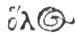

[Intangible Textual Heritage](../../index)  [Classics](../index.md) 
[Index](index)  [Previous](hoo13)  [Next](hoo15.md) 

------------------------------------------------------------------------

###### IX.

### TO NATURE. [\*](#fn_60.md)

###### The FUMIGATION from AROMATICS.

NATURE, all parent, ancient, and divine,  
O Much-mechanic mother, art is thine;

p. 127

Heav'nly, abundant, venerable queen,  
In ev'ry part of thy dominions seen.

p. 128

Untam'd, all-taming, ever splendid light, 5  
All ruling, honor'd, and supremly bright.  
Immortal, first-born, ever still the same,  
Nocturnal, starry, shining, glorious dame.  
Thy feet's still traces in a circling course,  
By thee are turn'd, with unremitting force. 10  
Pure ornament of all the pow'rs divine,  
Finite and infinite alike you shine;  [12](#fn_61.md)  
To all things common and in all things known,  
Yet incommunicable and alone.  
Without a father of thy wond'rous frame, 15  
Thyself the father whence thy essence came.  
All-flourishing, connecting, mingling soul,  
Leader and ruler of this mighty whole.  
Life-bearer, all-sustaining, various nam'd,  
And for commanding grace and beauty fam'd. 20  
Justice, supreme in might, whose general sway  
The waters of the restless deep obey.  
Ætherial, earthly, for the pious glad,  
Sweet to the good, but bitter to the bad.  
All-wife, all bounteous, provident, divine, 25  
A rich increase of nutriment is thine;

p. 129

Father of all, great nurse, and mother kind,  
Abundant, blessed, all-spermatic mind:  
Mature, impetuous, from whose fertile seeds  
And plastic hand, this changing scene proceeds. 30  
All-parent pow'r, to mortal eyes unseen,  
Eternal, moving, all-sagacious queen.  
By thee the world, whose parts in rapid flow,  [33](#fn_62.md)  
Like swift descending streams, no respite know,  
On an eternal hinge, with steady course 35  
Is whirl'd, with matchless, unremitting force.  
Thron'd on a circling car, thy mighty hand  
Holds and directs, the reins of wide command.  
Various thy essence, honor'd, and the best,  
Of judgement too, the general end and test. 40

p. 130

Intrepid, fatal, all-subduing dame,  
Life-everlasting, Parca, breathing flame.  
Immortal, Providence, the world is thine,  
And thou art all things, architect divine.  
O blessed Goddess, hear thy suppliant's pray'r, 45  
And make my future life, thy constant care;  
Give plenteous seasons, and sufficient wealth,  
And crown my days with lasting, peace and health.

------------------------------------------------------------------------

### Footnotes

[126:\*](hoo14.htm#fr_60.md) Nature, according to
the theologists, as related by Proclus, in Tim. p. iv. is the last of
the demiurgic causes of this sensible world, and the boundary of the
latitude of incorporeal essences: and is full of reasons and powers, by
which she governs the universe, every where connecting parts with their
wholes. Hence p. 127 Nature is represented in
this Hymn as turning the still traces of her feet with a swift whirling.
For since she is the last of the demiurgic causes, her operations aptly
symbolize with the traces of feet. Now the reason why the epithets of
much-mechanic, all-artist, connecting, all-wife, providence, &c. are
given to nature, which evince her agreement with Minerva, is because
that Goddess, according to the Orphic theology, fabricated the
variegated veil of nature, from that wisdom and virtue of which she is
the presiding divinity. And Proclus in forms us, that she connects all
the parts of the universe together: containing in herself intellectual
life, by which she illuminates the whole, and unifying powers by which
she superintends all the opposing natures of the world. Nature,
therefore, from her connecting, and unifying power, and from her
plenitude of seminal reasons, has an evident agreement with Minerva,
whose divine arts according to the Orphic theology, reduce whatever in
the universe is discordant and different, into union and consent.

Again, agreeable to this theology, primary natures impart their gifts to
such as are secondary by an abundant illumination, and effects are
established in the causes from which they proceed: so that in the
obscure language of Heraclitus, all things are one, and one all things.
Hence Nature though the last of the demiurgic causes, is with perfect
conformity to this symbolical Theology, said to be both communicable and
incommunicable; without a father and at the same time the father of her
own being. For considered as full of operative reasons, she is
communicable to every sensible nature: but considered as the
representative of divine unity, she is incommunicable. And in like
manner as symbolising with the first cause, she is both without any
origin, and at the same time the source of her own essence.

[128:12](hoo14.htm#fr_61.md) Ver. 12.\] Finite and
infinite, &c. Philolaus according to Demetrius (in Laert.) published a
discourse concerning Nature, of which this is the beginning φύσις δὲ ἐν
τῳ κόσμῳ αῤμόχθη ἑξ ἀϖειρηον τε καὶ ὅλ\# (
) κόσμοσ καὶ τὰ ἑν αυτῳ παντα. i. e. "Nature, and the
whole world, and whatever it contains. arc aptly connected together from
infinites and finites."

[129:33](hoo14.htm#fr_62.md) Ver. 33.\] *By thee
the world*, &c. Since the world has an extended and composite essence,
and is on this account continually separated from itself, it can alone
be connected by a certain indivisible virtue infused from the divine
unity. Again, since from a natural appetite, it is ever orderly moved
towards good, the nature of such an appetite and motion must originate
from a divine intellect and goodness. But since, from its material
imperfection, it cannot receive the whole of divine infinity at once,
but in a manner accommodated to its temporal nature: it can only derive
it gradually and partially, as it were by drops, in a momentary
succession. So that the corporeal world is in a continual state of
flowing and formation, but never possesses real being; and is like the
image of a lofty tree seen in a rapid torrent, which has the appearance
of a tree without the reality; and which seems to endure perpetually the
same, yet is continually renewed by the continual renovation of the
stream.

------------------------------------------------------------------------

[Next: X: To Pan](hoo15.md)
