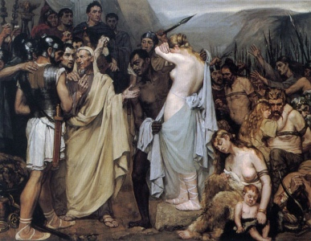

  
[Intangible Textual Heritage](../../index)  [Classics](../index.md) 

------------------------------------------------------------------------

[Buy this Book at
Amazon.com](https://www.amazon.com/exec/obidos/ASIN/0140444335/internetsacredte.md)

------------------------------------------------------------------------

<table width="75%">
<colgroup>
<col style="width: 50%" />
<col style="width: 50%" />
</colgroup>
<tbody>
<tr class="odd">
<td width="50%" data-valign="TOP"></td>
<td width="50%" data-valign="CENTER"><h1 id="the-works-of-julius-caesar" data-align="CENTER">The Works of Julius Caesar</h1>
<h5 id="parallel-latinenglish" data-align="CENTER">(Parallel Latin/English)</h5>
<h2 id="tr.-by-w.a.-mcdevitte-and-w.s.-bohn" data-align="CENTER">tr. by W.A. McDevitte and W.S. Bohn</h2>
<h4 id="section" data-align="CENTER">[1869]</h4></td>
</tr>
</tbody>
</table>

------------------------------------------------------------------------

[Contents](#contents)    [Start Reading](dbg1.md)

|                                                                                                                           |
|---------------------------------------------------------------------------------------------------------------------------|
|  |

This a parallel presentation of the works of Julius Caesar in Latin and
English translation. This includes his Gallic Wars and Civil Wars, plus
three shorter works which may have been written by Aulus Hirtius (who is
also credited with the 8th book of the Gallic Wars). Beyond its
importance as a source document for military and Roman history, Caesar's
clean prose style has long made his Gallic Wars the text of choice for
second-year Latin. It is also of interest because of his first-hand
observations of the Celtic tribes that he was waging war on. For
instance, refer to [Book 6](dbg6.md), which contains [a long passage about
Gaulish society](dbg6.htm#dbg_6_11), [the Druids](dbg6.htm#dbg_6_13.md),
and his famous description of the original [burning man
ritual](dbg6.htm#dbg_6_16.md).

------------------------------------------------------------------------

 [Gallic Wars Book 1 (58 B.C.E.)](dbg1.md)  
[Gallic Wars Book 2 (57 B.C.E.)](dbg2.md)  
[Gallic Wars Book 3 (56 B.C.E.)](dbg3.md)  
[Gallic Wars Book 4 (55 B.C.E.)](dbg4.md)  
[Gallic Wars Book 5 (54 B.C.E.)](dbg5.md)  
[Gallic Wars Book 6 (53 B.C.E.)](dbg6.md)  
[Gallic Wars Book 7 (52 B.C.E.)](dbg7.md)  
[Gallic Wars Book 8 (51-50 B.C.E.)](dbg8.md)  
[Civil Wars Book 1 (50 B.C.E.)](civ1.md)  
[Civil Wars Book 2 (49 B.C.E.)](civ2.md)  
[Civil Wars Book 3 (48-47 B.C.E.)](civ3.md)  
[Alexandrian War](alx.md)  
[African War](afr.md)  
[Spanish War](spa.md)  
