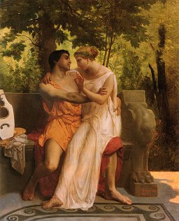

  
[Intangible Textual Heritage](../../../index)  [Classics](../../index.md) 
[Lucian](../index.md) 

------------------------------------------------------------------------

<table width="75%">
<colgroup>
<col style="width: 50%" />
<col style="width: 50%" />
</colgroup>
<tbody>
<tr class="odd">
<td width="50%" data-valign="TOP"></td>
<td width="50%" data-valign="CENTER"><h1 id="the-mimes-of-the-courtesans-lucian" data-align="CENTER">The Mimes of the Courtesans 
Lucian</h1>
<h2 id="translated-by-a.l.h." data-align="CENTER">translated by A.L.H.</h2>
<h4 id="section" data-align="CENTER">[1928]</h4></td>
</tr>
</tbody>
</table>

------------------------------------------------------------------------

[Contents](#contents)    [Start Reading](motc00.md)

------------------------------------------------------------------------

|                                        |                      |
|----------------------------------------|----------------------|
| Mimes                                  | Fowler               |
| [The Education of Corinna](motc03.md)     | ---                  |
| [Sweetheart](motc04)                   | [VII](../wl4/wl412.md)  |
| [The Pleasure of Being Beaten](motc05) | [VIII](../wl4/wl413.md) |
| [The Mistake](motc06)                  | [XII](../wl4/wl416.md)  |
| [The Incantation](motc07)              | [IV](../wl4/wl411.md)   |
| [The Terror of Marriage](motc08)       | [II](../wl4/wl409.md)   |
| [The Lesbians](motc09.md)                 | ---                  |
| [The Return of the Soldier](motc10)    | [IX](../wl4/wl414.md)   |
| [The Little Flute Player](motc11)      | [XV](../wl4/wl419.md)   |
| [There is a Time for Lying](motc12)    | [XIII](../wl4/wl417.md) |
| [At Night](motc13)                     | [XI](../wl4/wl415.md)   |
| [A Poor Sailor's Love](motc14)         | [XIV](../wl4/wl418.md)  |
| [A Mother's Advice](motc15)            | [III](../wl4/wl410.md)  |
| [Abandoned](motc16)                    | [II](../wl4/wl408.md)   |
| [The Philosopher](motc17.md)              | --                   |

Living at the height of the Roman Empire, the audience Lucian wrote for
was hardly shocked by these short dialogues of the Greek *hetaerae*.
However, two millenia of ensuing prudery made it impossible to
acknowledge this part of the Lucian corpus, a set of humorous vignettes
set in the context of the 'oldest profession,' let alone translate it
into a vernacular language. These comedic sketches are timeless: working
girls competing for clients, dishing gossip and candid tips of the
trade, men trying to keep their girls' attention with expensive gifts.
It also portrays the dark side of the *hetaera's* life: out-of-control
parties, blowhard men, and putting up with rough treatment by clients.

Notably lacking is one modern reality. The *hetaerae* of Lucian are not
constantly wondering whether their next client is going flash a badge
and haul them off to jail. Sex workers in antiquity were another just
legal occupation, like the butcher, the baker and the sandal maker. At
that time, pagan temples throughout the eastern Mediterranean had sacred
prostitutes, and patronizing them was considered a sanctified act. The
*hetearae* actually had a lot more freedom than other women in Greek
society, particularly the sequestered wives.

With the dawn of the 20th century, it finally became feasible to publish
English translations of the 'naughty bits' of Lucian. This one was
published during the roaring 1920s in a deluxe art-deco illustrated
version. The identity of the author is only known by the initials
'A.L.H.' on the Translator's Foreword page.

This translation includes three chapters not included in the Fowler and
Fowler translation, [The Education of Corinna](motc03.md), [The
Lesbians](motc09), and [The Philosopher](motc17.md). There are three gaps
in the numbering of Fowler: V, VI and X, so these are probably the
missing dialogues. The table on the left shows the correspondences
between Fowler and this version. At issue here is the obviously the
subject matter of these pieces: the first has a mother 'turning out' her
daughter, the other two depict female and male homosexual characters
respectively. However, they are far from explicit. It is an interesting
to note that these were considered untranslatable in an academic edition
in 1905, but could be published in a popular edition in 1928.

Bibliographic note: although the spine of this book says 'Dialogues of
the Courtesans,' the title page and running headers use the title 'Mimes
of the Courtesans.'

------------------------------------------------------------------------

 [Title Page](motc00.md)  
[Translator's Foreword](motc01.md)  
[Contents](motc02.md)  
[The Education of Corinna](motc03.md)  
[Sweetheart](motc04.md)  
[The Pleasure of Being Beaten](motc05.md)  
[The Mistake](motc06.md)  
[The Incantation](motc07.md)  
[The Terror of Marriage](motc08.md)  
[The Lesbians](motc09.md)  
[The Return of the Soldier](motc10.md)  
[The Little Flute Player](motc11.md)  
[There is a Time for Lying](motc12.md)  
[At Night](motc13.md)  
[A Poor Sailor's Love](motc14.md)  
[A Mother's Advice](motc15.md)  
[Abandoned](motc16.md)  
[The Philosopher](motc17.md)  
