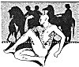
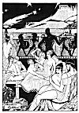
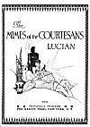

  
[Intangible Textual Heritage](../../../index)  [Classics](../../index.md) 
[Lucian](../index)  [Index](index)  [Next](motc01.md) 

------------------------------------------------------------------------

Mimes of the Courtesans, by Lucian \[1928\], at Intangible Textual
Heritage

------------------------------------------------------------------------

# The MIMES of the COURTESANS

## LUCIAN

### DECORATIONS AND ILLUSTRATIONS BY

### CHARLES CULLEN

#### \[1928\]

#### PRIVATELY PRINTED

#### FOR RARITY PRESS, NEW YORK, N. Y., 1931

#### COPYRIGHT 1928

#### THE PRESS OF CLASSIC LORE.

#### New YORK, N. Y.

#### Printed in the United States of America.

[  
Click to enlarge](img/00100.jpg.md)  
Page 1  

[  
Click to enlarge](img/00200.jpg.md)  
Page 2  

[  
Click to enlarge](img/front.jpg.md)  
Frontispiece  

[  
Click to enlarge](img/title.jpg.md)  
Title  

[  
Click to enlarge](img/verso.jpg.md)  
Verso  

Scanned at Intangible Textual Heritage, July 2006. This text is in the
public domain in the United States because it was not renewed at the US
Copyright Office in a timely fashion as required by law at the time.
These files may be used for any non-commercial purpose provided this
notice of attribution is left intact in all copies.

------------------------------------------------------------------------

[Next: Translator's Foreword](motc01.md)
