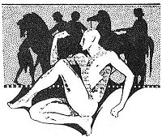

  
[Intangible Textual Heritage](../../../index)  [Classics](../../index) 
[Lucian](../index)  [Index](index)  [Previous](motc03)  [Next](motc05) 

------------------------------------------------------------------------

Mimes of the Courtesans, by Lucian \[1928\], at Intangible Textual
Heritage

------------------------------------------------------------------------

p. 19

<table data-align="RIGHT">
<colgroup>
<col style="width: 100%" />
</colgroup>
<tbody>
<tr class="odd">
<td data-valign="CENTER"><a href="img/00900.jpg"> 
Click to enlarge</a></td>
</tr>
</tbody>
</table>

<table data-align="LEFT">
<colgroup>
<col style="width: 100%" />
</colgroup>
<tbody>
<tr class="odd">
<td data-valign="CENTER"><a href="img/00901.jpg"> 
Click to enlarge</a></td>
</tr>
</tbody>
</table>

# SWEETHEART

 

 

p. 20

 

|                                      |
|--------------------------------------|
| MOUSARION, a courtesan, 18 years old |
| HER MOTHER                           |

 

p. 21 p. 22 p. 23

 

### SWEETHEART

MOTHER

If you ever find another lover like Chaireas, my dear Mousarion, we
shall have to sacrifice a white goat to the popular Aphrodite and a
heifer to the Uranian of the Gardens, and we shall crown with flowers
the kind Demeter, from whom all riches flow. For we shall be happy. Yes,
thrice happy!

You should understand by now how much we are ever likely to get from
that young man. He hasn't given us a single obole, or one piece of
clothing or a pair of slippers, and not a box of perfumes. His only
stock in trade seems to be pretexts, promises and fine hopes. He is
always mumbling:

"If my father ever and------I become master of the estate, everything,
everything will be yours." You say he has sworn to marry you legally?

MOUSARION

He did, mother. He swore by the two goddesses and by Athena Palleas.

p. 24

MOTHER

And you believe all that? Why, the other day, when he did not have
enough money to pay a debt, you handed him your ring; you said nothing
to me. And he traded it for a few drinks. Then followed both of your
Ionic necklaces, each of which weighs no less than two *darikes*. The
armorer Praxias of Chios had to send to Ephesus to get them for you.
Well, dear Chaireas had better start paying what he owes us. I won't say
anything about your linen and shirts. Every lover naturally gives those
things. But Chaireas isn't much of an asset as a lover.

MOUSARION

But he is so handsome. There isn't a sign of a hair on his chin. And he
tells me he loves me and often weeps while he is saying that he loves
me. Furthermore, he is the son of Dinomache and Lathes the Areopagite.
We shall get married as soon as the old man shuts his eyes for good.

MOTHER (*Ironically*)

Well, Mousarion. Whenever we are in need of shoes and the cobbler says,
"Two drachmas, please," we shall tell him, "Sorry, we have no money, but
won't you take a few fine hopes?" And when the flour merchant presents
his bill, we'll say, "Wait. The old

p. 25

\[paragraph continues\] Laches Collyetus
will soon be dead. We shall pay after the marriage ceremony." Aren't you
ashamed of yourself? You are the only one among courtesans without a
pair of earrings, without a necklace, or one Tarentine tunic?

MOUSARION

Why should I feel ashamed, mother? Are the other courtesans happier or
better looking?

MOTHER

But they are more intelligent. They understand their business. They
don't let their heads be turned by fine phrases and promises. You are
faithful; you love Chaireas like a husband, you don't let another soul
touch you. That is the trouble with you. The other day, when the
Acharnian farmer boy offered you two hundred drachmas, the full price of
the wine he had sold for his father in the city, and the Acharnian had
no hair on his chin, either, you laughed at the poor boy and lay down
instead with Chaireas, your Adonis.

MOUSARION

But, mother, you surely did not expect me to abandon Chaireas and
receive in his place that peasant with his smell of goats and cow-dung?
Chaireas's skin is so

p. 26

smooth and soft. It is just like the skin of a suckling pig from
Acharnai.

MOTHER

Fine. That was a rustic who smelled of goats and cow-dung. But what
about Antiphon, the son of Menecrates? Why didn't you receive Antiphon?
He offered you a hundred drachmas for the pleasure of one night? Isn't
he handsome? Isn't he a man of the world? Isn't he citified? Is Antiphon
a day older than your dear little Chaireas?

MOUSARION

But Chaireas says he will kill both of us if he ever finds him with me.

MOTHER

How those young fellows do threaten and boast! In that case, you will
remain without lovers, you will become an honest woman. Why don't you
forget that you are a courtesan and put on the dress of the priestesses
of the Thesmophorion goddess? But let us leave that. Today is the day of
Aloa, a feast of Demeter. What has your little darling given you for the
holiday?

MOUSARION

Always you think and speak only of what he will give me. He gives me
himself. Has any courtesan more? But--there mother, do not weep. His
father has promised him a fine gift of money. Chaireas promised

p. 27

to give whatever stipend he receives to me. He is generous. Have no
fear, dear mother.

MOTHER

Let us hope it isn't more lying. Don't you forget my words, Mousarion.
I'll have occasion to remind you of your folly.

 

------------------------------------------------------------------------

[Next: The Pleasure of Being Beaten](motc05)
