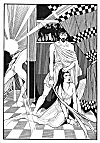

  
[Intangible Textual Heritage](../../../index)  [Classics](../../index.md) 
[Lucian](../index)  [Index](index)  [Previous](motc04)  [Next](motc06.md) 

------------------------------------------------------------------------

Mimes of the Courtesans, by Lucian \[1928\], at Intangible Textual
Heritage

------------------------------------------------------------------------

p. 28 p. 29

<table data-align="RIGHT">
<colgroup>
<col style="width: 100%" />
</colgroup>
<tbody>
<tr class="odd">
<td data-valign="CENTER"><a href="img/00900.jpg"> 
Click to enlarge</a></td>
</tr>
</tbody>
</table>

<table data-align="LEFT">
<colgroup>
<col style="width: 100%" />
</colgroup>
<tbody>
<tr class="odd">
<td data-valign="CENTER"><a href="img/00901.jpg"> 
Click to enlarge</a></td>
</tr>
</tbody>
</table>

# THE PLEASURE OF BEING BEATEN

 

p. 30

 

|                       |             |
|-----------------------|-------------|
| CHRYSIS, 17 years old | }Courtesans |
| AMPELIS, 35 years old |             |

 

 

p. 31 p. 32

[  
Click to enlarge](img/03200.jpg.md)

p. 33

 

### THE PLEASURE OF BEING BEATEN

AMPELIS

Why are you so sad, Chrysis? And your eyes are red with crying. I have
always known you as a cheerful girl. You, of all our friends, should be
happy. For it is common gossip that Gorgias loves you with a love that
is bestowed on few women.

CHRYSIS

Yes, that is just it. He loves me! But you would not have thought so had
you seen him last night, in that insane fury that overcomes him when I
but walk in the shadow of another man. No, had you seen him beating me
last night, would you but see the marks of his lash on my body now, you
would not think him such a lover. Lover indeed! He whips me with more
fury than the meanest slave.

AMPELIS

But this fury is only another proof of his great love. You should he
thankful, not complaining.

p. 34

CHRYSIS

What are you saying? Must he always be beating me?

AMPELIS

No. But may he always get angry when your attention wanders to some
other man! He must be crazy about you. If he weren't, he wouldn't have
gotten excited when he saw you with another lover.

CHRYSIS

But I have no other lover. He imagines that I am in love with a rich old
man just because I spoke to the fellow the other day.

AMPELIS

It is a very good thing that he thinks the rich are after you. The more
he will suffer on account of that, the more he will try to rival
them--you know how--so as not to be left behind.

CHRYSIS

Meanwhile, he raises Cain and whips me and gives me not an obole.

AMPELIS

He'll give. Jealous men are always liberal givers.

p. 35

CHRYSIS

But, dearie, I don't see why he should keep on beating me.

AMPELIS

I am not saying that. I do know, however, that men become bigger-hearted
and better lovers once they get the suspicion that their mistresses care
less about them. When a man believes himself to be the one and only
lover in a woman's life, he'll whistle and go his way.

I ought to know; I have followed this profession for the last twenty
years. If you want me to, I will tell you what happened to me a few
years ago.

At that time I had a steady lover, a certain Demophantos, a usurer
living near Poikile. He had never given me more than five drachmas and
he pretended to be my man. But his love was only superficial, Chrysis.
He never sighed, he never shed tears for me and he never spent the night
waiting at my door. One day he came to see me, knocked at my door, but I
did not open it. You see, I had the painter, Callides, in my room;
Callides had given me ten drachmas. Demophantos swore and beat his fists
on the door and left cursing me. Several days passed without my sending
for him; Callides was still in my house. Thereupon Demophantos, who was
already quite excited, went wild. He broke open my door, wept, pulled me
about, threatened to

p. 36

kill me, tore my tunic, and did everything, in fact, that a jealous man
would do, and finally presented me with six thousand drachmas. In
consideration of this sum, I was his for a period of eight months. His
wife used to say that I had bewitched him with some powder. That
bewitching powder, to be sure, was jealousy. That is why, Chrysis, I
advise you to act likewise with Gorgias. The boy will be rich if
anything happens to his father.

 

------------------------------------------------------------------------

[Next: The Mistake](motc06.md)
