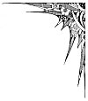
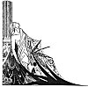
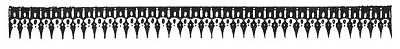
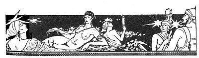
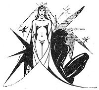

  
[Intangible Textual Heritage](../../../index)  [Classics](../../index) 
[Lucian](../index)  [Index](index)  [Previous](motc05)  [Next](motc07) 

------------------------------------------------------------------------

Mimes of the Courtesans, by Lucian \[1928\], at Intangible Textual
Heritage

------------------------------------------------------------------------

p. 37

<table data-align="RIGHT">
<colgroup>
<col style="width: 100%" />
</colgroup>
<tbody>
<tr class="odd">
<td data-valign="CENTER"><a href="img/00900.jpg"> 
Click to enlarge</a></td>
</tr>
</tbody>
</table>

<table data-align="LEFT">
<colgroup>
<col style="width: 100%" />
</colgroup>
<tbody>
<tr class="odd">
<td data-valign="CENTER"><a href="img/00901.jpg"> 
Click to enlarge</a></td>
</tr>
</tbody>
</table>

# THE MISTAKE

 

p. 38 p. 39

 

|                                               |
|-----------------------------------------------|
| JOESSA, a courtesan                           |
| PYTHIAS, her courtesan friend                 |
| LYSIAS, an Athenian youth in love with Joessa |

 

p. 40 p. 41

 

### THE MISTAKE

JOESSA

You forget how I have treated you, Lysias. Never have I asked you for
money. Never have I left you at my door, saying, "There is another man
inside." And I have never obliged you to exploit your father or to fool
your mother in order to procure clothing and gifts for me, as other
courtesans are always doing. You know what fine lovers I have slighted
for your sake. There was Etocles, who is now a prytanian, and Pasion,
the armorer, and your own comrade, Melissos, whose father is dead, so
that he can make full use of the entire family estate. You, only you,
have ever been my Phaon. I had eyes only for you. After the first day of
our acquaintance I did not let anybody but you enter my bed.

Ah, I was foolish enough to place faith in our vows; yes, as wise as
Penelope, though my mother shouted at me and complained to all my
friends. And you, Lysias, now that you know that I am entirely yours and
am

p. 42

dying for your love, you play with the body of Lykaine in my presence
and praise Magidion, the cithara player, when I embrace you at night in
bed. You hurt me. Your actions bring tears to my eyes. I feel outraged.
The other day you drank with Thrason and Diphilos. Kymbalion, the flute
player, and Pyrallis, who is my enemy, you know, were there too. I did
not mind the five kisses you gave Kymbalion. It was yourself you had
insulted when you kissed that woman. But what nasty signs you made to
Pyrallis! And when you drank wine, you sent her your cup, whispering to
the slave not to hand it to anybody else if Pyrallis did not wish to
drink. And later you bit an apple, and seeing Diphilos occupied
elsewhere, you threw the bitten apple into the lap of that Pyrallis. And
she kissed it and slipped the apple between her breasts.

Why do you do all these things? Have I ever been unkind to you? Do I
ever as much as glance at any other man? Do I not live for you alone?
(*She weeps*.) You are not just, Lysias. You torture a woman whose only
misfortune is to be in love with you. But there is a goddess, the kind
Adrasteia, who notices such things. Possibly you, yourself, will weep
very soon when you find out that I have strangled myself in my bed or
thrown myself down a well. You will feel as triumphant as if you had
managed some great feat.

p. 43

Why do you regard me with angry eyes and gnash your teeth? If you have
any reproaches to make, speak out, and Pythias will judge between us.
What is the matter? (*Lysias goes out*.) You leave me without a word.
You see, Pythias, how much I suffer on account of my Lysias

PYTHIAS

Oh, the boor! Her tears do not touch him. You are not a man: you are a
statue of stone. (*To Joessa*.) I must say that you are partly
responsible for this situation. You have spoilt him. He did not deserve
so much attention. Men despise women who love too much and unwisely. Do
not weep, dearie! Take my advice. Shut your door in his face. You will
see how enthusiastic he will become about his Joessa after passing the
night at your door in the street.

JOESSA

Ah, do not offer me such advice. I shall never be so cruel to Lysias.

LYSIAS (*Without having heard*)

I haven't returned because of your friend, Pythias. I refuse to look at
this woman again. I have turned back in order to speak to you. You have
no bad thoughts about me. You do not say that Lysias is a bad fellow.

p. 44

PYTHIAS

Indeed, I have just said something to that effect.

LYSIAS (*Loud*)

So you want me to remain silent and do nothing while this Joessa fools
me with other men? Yes, the other day I found her in bed with a young
man!

PYTHIAS (*Not surprised*)

After all, she is a courtesan, Lysias. Going to bed with young men is,
as I may put it, her occupation. However, when was it you found the
strange young man in Joessa's bed?

LYSIAS

About five days ago. Yes, by Dzeus, it was five days ago. Today is the
seventh day of the month and that was the second. Having discovered I
was the lover of this virtuous maiden, my father shut me up in the
house, ordering the porter not to let me out. But not being able to
endure separation from her, I ordered Dromon to let himself down the
court wall, which is quite low, and when he got over the court wall, I
lowered myself onto his shoulders and got out without more difficulty.
But why annoy you with so many words? I escaped; I came here; I found
the door carefully shut. It was about midnight when I reached the
street. I did not

p. 45

knock on the door, but lifted it quietly off its hinges; I had done this
once before. I entered without a sound. Groping my way along the wall, I
arrived at Joessa's bed.

JOESSA (*Aside*)

What is he saying, O Demeter? I am in agony.

LYSIAS

Well, once near her bed, I became aware of two breathing peacefully in
the dark of the night. At first, I thought Lyde was sleeping with
Joessa; but touching the other person lightly with my hand, I felt a
smooth face, not that of an aged woman. The face was without a hair. And
the head--hear, kind Pythias--the head was heavily perfumed and--shaven!
A man's head. The young man was comfortably couched. He reclined between
Joessa's legs, apparently she was to hold him in a long embrace the
entire night. Ah, if I had had a sword, I would have ended the play
there and then! Why do you laugh? Is there anything ludicrous about such
perfidy?

JOESSA

So it was no more than this that hurt your feelings, Lysias? Why, it was
Pythias who was in bed with me.

PYTHIAS (*Ashamed*)

Please, Joessa, don't tell him

p. 46

JOESSA

Why shouldn't I tell him? I assure you it was Pythias, my dear, I asked
her to sleep with me that night. I was sad and lonely without you.

LYSIAS

Oh, yes! Pythias was a young man with a shaved head. How thick and long
has her hair grown within the last six days!

JOESSA

No, Lysias. She has had her hair cut and her head shaved since a recent
sickness. Her hair started to fall out. Show him, Pythias. Show him,
Pythias Show him your head. (*Pythias takes off the wig*.) Here is the
adulterous ephebus who excited your jealousy.

LYSIAS

Shouldn't I have been jealous, Joessa? Do you blame me? I couldn't help
it. I was in love and I hac touched her shaven head.

JOESSA

But now you are fully convinced? It is my turn to be angry.

p. 47

LYSIAS

No, dear Joessa. Let us not be angry. We shall go out and find some
drink. Come with us, Pythias. It is fitting that you take part in our
peace libations.

JOESSA

She will come along. Oh, how much I have suffered on your account,
Pythias, you dearest of young lovers!

PYTHIAS

But everything is all right, now, isn't it? Therefore, bear no grudge
against your Pythias. And please, I beg you not to tell anybody about my
wig.

 

------------------------------------------------------------------------

[Next: The Incantation](motc07)
