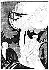

  
[Intangible Textual Heritage](../../../index)  [Classics](../../index.md) 
[Lucian](../index)  [Index](index)  [Previous](motc06)  [Next](motc08.md) 

------------------------------------------------------------------------

Mimes of the Courtesans, by Lucian \[1928\], at Intangible Textual
Heritage

------------------------------------------------------------------------

p. 48 p. 49

<table data-align="RIGHT">
<colgroup>
<col style="width: 100%" />
</colgroup>
<tbody>
<tr class="odd">
<td data-valign="CENTER"><a href="img/00900.jpg"> 
Click to enlarge</a></td>
</tr>
</tbody>
</table>

<table data-align="LEFT">
<colgroup>
<col style="width: 100%" />
</colgroup>
<tbody>
<tr class="odd">
<td data-valign="CENTER"><a href="img/00901.jpg"> 
Click to enlarge</a></td>
</tr>
</tbody>
</table>

# THE INCANTATION

 

p. 50 p. 51

 

|         |             |
|---------|-------------|
| BACCHIS | }Courtesans |
| MELITTA |             |

 

p. 52 p. 53

 

### THE INCANTATION

MELITTA

If you happen to know of a witch, I refer to those Thessalonian women
who practice incantations, by which they win love for the most
detestable of women, send her to me. I will give all my clothes, all my
gold, everything I own, to see Charinos hate Simiche and return to me.

BACCHIS

What is it you're saying? Is he no longer with you? Is it possible that
Charinos, is in love with Simiche? He has suffered so many quarrels with
his parents on account of you. He has thrown over that rich fiancée of
his and her dowry of five talents for Melitta.

MELITTA

Ah, all that belongs to the past. I haven't seen him for the last five
days. Charinos has deserted me. He and Simiche are drinking at the house
of his friend Ramænes.

p. 54

BACCHIS

That is terrible, Melitta. But how did you happen to fall out?
Undoubtedly it was not over a trifle.

MELITTA

I have nothing to say about that. The day before yesterday he returned
from the Piræus where he went to collect a debt for his father. I ran up
to him as he entered my house, but he refused to recognize me. I wanted
to embrace him but he repelled me, saying:

"Get away from me! Run along to your armorer Hermotimos! Or rather, see
what is written on the Keramic walls; you'll find there both of your
names inscribed with a stylus."

"Which Hermotimos?" I asked him in surprise.

But without answering and without tasting a morsel of food, he got into
bed and turned his back on me. I did everything I could think of to win
his attention. I took him in my arms, I lay on top of him, I kissed him
between the shoulders, on the lower section of his back, and put my hand
between his legs. It was all in vain. Nothing could soften him, and he
said:

"If you continue your maneuvers, I'll leave immediately, dark and late
as it is!"

BACCHIS

But you do know Hermotimos, don't you?

[  
Click to enlarge](img/05400.jpg.md)

p. 55

MELITTA

May I become even more miserable than I am at present if I know of an
armorer by the name of Hermotimos. Charinos rose at daybreak and left
without a word. I remembered what he had said about the Keramic wall and
I sent Akis to see what was written. She found nothing more than an
inscription, somewhere on the right, as you enter by the *dipylos*. It
went like this: "Melitta loves Hermotimos"; and a little lower: "The
armorer Hermotimos loves Melitta."

BACCHIS

What a dirty trick! I understand now. Somebody wrote the words on the
wall in order to get even with Charinos, knowing he is very jealous. He
believed what he read without asking a question. If I saw him, I'd tell
him about it.

MELITTA

But how can you see him? How can anybody see him? He has shut himself up
with Simiche. His parents came to my house to see if Charinos was with
me. Ah, if only I could find an old witch who would make the right kind
of incantation. She'd save my life.

BACCHIS

Don't worry, my dear. I happen to be acquainted with an experienced
witch. She is a Syrian, still in the

p. 56

prime of her career as a magician. You remember how Phanias left me for
no reason at all, just like Charinos now? Well, this Syrian witch worked
a reconciliation after four months' time. I was despairing of ever
getting him back, and she, by the means of her enchantments, made him
return to my bed.

MELITTA

What did the old woman do--if you do not fear telling me?

BACCHIS

Not at all. I'll tell you everything. You don't need to pay her very
much, Melitta, only one drachma and a loaf of bread. But you will have
to bring along some salt, seven oboles, sulfur and a torch. The witch
takes it all, and--oh, yes! You must bring some wine in a krater; the
old woman will drink the wine. And you'll need something of the man
himself as, for example, an article of clothing, a hair, or some such
thing.

MELITTA

I still have his shoes.

BACCHIS

Well, she will hang them on a nail, burn the sulfur underneath and strew
salt over the fire while she keeps repeating your name, your own and
your lover's. Then she draws a top from between her breasts and spins
it,

p. 57

reciting at the same time her secret charm. Oh, what secret, barbarian
words! It'll make you shudder.

That is what she did for me, and very soon Phanias--in spite of the
reproaches of his comrades and the pleading of the false Phoibis--came
back to my bed. It was the charm that made him return. It urged him on
toward me.

The same witch also taught me the way to make Phoibis perfectly hateful.
You watch the print of her feet as she passes by, and then you rub out
the footprints by putting your right foot where she has placed her left
foot and your left on her right. You do it and say at the same time: "I
have trampled on you; I am above you. I am above you. I have trampled on
you; I am above you."

I did exactly what she told me, and now Phanias is back in my bed. And
he passionately kisses me all over my body, something he always refused
to do before.

MELITTA

Not a moment's delay, Bacchis! Find me immediately the Syrian witch. And
you, Akis, prepare the bread and the sulfur and everything we shall need
for a proper incantation.

------------------------------------------------------------------------

[Next: The Terror of Marriage](motc08.md)
