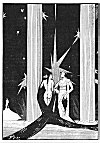

  
[Intangible Textual Heritage](../../../index)  [Classics](../../index.md) 
[Lucian](../index)  [Index](index)  [Previous](motc08)  [Next](motc10.md) 

------------------------------------------------------------------------

Mimes of the Courtesans, by Lucian \[1928\], at Intangible Textual
Heritage

------------------------------------------------------------------------

p. 68 p. 69

<table data-align="RIGHT">
<colgroup>
<col style="width: 100%" />
</colgroup>
<tbody>
<tr class="odd">
<td data-valign="CENTER"><a href="img/00900.jpg"> 
Click to enlarge</a></td>
</tr>
</tbody>
</table>

<table data-align="LEFT">
<colgroup>
<col style="width: 100%" />
</colgroup>
<tbody>
<tr class="odd">
<td data-valign="CENTER"><a href="img/00901.jpg"> 
Click to enlarge</a></td>
</tr>
</tbody>
</table>

# THE LESBIANS

 

p. 70 p. 71

 

|                                 |
|---------------------------------|
| LEAINA, a player of the cithara |
| CLONARION, a young man          |

 

p. 72 p. 73

 

### THE LESBIANS

CLONARION

I have heard a queer thing said about you, Leaina. People say Megilla,
the wealthy lady from Lesbos, is in love with you, as if she were a man,
and that she--I can't explain how------but------. I have heard it said
that the two of you couple up just like------

LEAINA (*Abashed silence*)

CLONARION

What's the matter? You are blushing. Is it true then?

LEAINA

It is true, Clonarion. I am ashamed. It is so strange------

CLONARION

By the great Adrasteia, you must tell me about it! What does that woman
require of you? Exactly what do you do when you get into bed together?

p. 74

LEAINA (*Abashed silence*)

CLONARION

Now I am sure you don't love me. If you did, you would not think of
hiding such things from me.

LEAINA

I do love you, Clonarion. I love you more than anybody else. But this is
such a strange matter. I am so ashamed. That woman is so terribly like a
male.

CLONARION

I don't understand. Do you mean to say she is one of those man-like
females of Lesbos who will not suffer in their beds the company of men,
but prefer to find pleasure, instead, with other women, as if they
themselves were men?

LEAINA

She is somewhat like that.

CLONARION (*With enthusiasm*)

In that case, Leaina, tell me everything, please! How did she seduce
you, in the first place? And how was it that you let Megilla have her
way with you? And what came after? Tell me everything, please!

LEAINA

You see, Megilla and Demonassa, the Corinthian, sweating and very hot,
pulled off her false hair--I had never suspected her of wearing a wig.
And I saw her

[  
Click to enlarge](img/07400.jpg.md)

p. 75

head was smooth-shaven as that of a young athlete. I was quite scared to
see this. But Megilla spoke up and said to me:

"Tell me, O Leaina, have you ever seen a better looking young man?"

"But I see no young man here, Megilla!" I told her.

"Now, now! Don't you effeminate me!" she reproved. "You must understand
my name is Megillos. Demonassa is my wife."

Her words seemed so funny to me, Clonarion. I started to giggle. And I
said:

"Can it be, Megillos, that you are a man and lived among us under the
disguise of a woman, just like Achilles, who stayed among the girls
hidden by his purple robe? And is it true that you possess a man's
organs, and that you do to Demonassa what any husband does to his wife?"

"That Leaina," she replied, "is not entirely so. You will soon see how
we shall couple up in a fashion that is much more voluptuous."

"In that case," I said, "you are not a hermaphrodite. They, I have been
told, have both a man's and woman's organs."

"No," she said, "I am quite like a man."

"Ismenodora, the Boietian flute player, has told me about a Theban woman
who was changed into a man. A certain good soothsayer by the name of
Teiresias------

p. 76

Did any accident like that happen to you by chance?"

"No, Leaina," she said. "I was born with a body entirely like that of
all women, but I have the tastes and desires of a man."

"And do those desires of yours suffice you?" I asked, smiling.

"Let me have my own way with you, Leaina, if you don't believe me," she
answered, "and you will soon see that I have nothing to envy men for. I
have something that resembles a man's estate. Come on, let me do what I
want to do and you will soon understand."

She pleaded so hard that I let her have her way. And you must understand
that she made me a gift of a splendid necklace and several tunics of the
finest linen. Then I embraced her and held her in my arms, as if she
wire a man. And she kissed me all over the body, and she set out to do
what she had promised, panting excitedly from the great pleasure and
desire that possessed her.

CLONARION

But exactly how did she manage it? What did she do? Tell me, Leaina!
Tell me especially that!

LEAINA

Please, don't ask me for details. These are shameful things. By the
Mistress of Heaven, I will never, never, tell you that!

------------------------------------------------------------------------

[Next: The Return of the Soldier](motc10.md)
