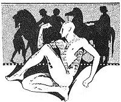

  
[Intangible Textual Heritage](../../../index)  [Classics](../../index.md) 
[Lucian](../index)  [Index](index)  [Previous](motc09)  [Next](motc11.md) 

------------------------------------------------------------------------

Mimes of the Courtesans, by Lucian \[1928\], at Intangible Textual
Heritage

------------------------------------------------------------------------

p. 77

<table data-align="RIGHT">
<colgroup>
<col style="width: 100%" />
</colgroup>
<tbody>
<tr class="odd">
<td data-valign="CENTER"><a href="img/00900.jpg"> 
Click to enlarge</a></td>
</tr>
</tbody>
</table>

<table data-align="LEFT">
<colgroup>
<col style="width: 100%" />
</colgroup>
<tbody>
<tr class="odd">
<td data-valign="CENTER"><a href="img/00901.jpg"> 
Click to enlarge</a></td>
</tr>
</tbody>
</table>

# THE RETURN OF THE SOLDIER

 

p. 78 p. 79

 

|                             |
|-----------------------------|
| PANNYCHIS, a courtesan      |
| POLEMON, her former lover   |
| PHILOSTRATOS, her new lover |
| DORCAS, her slave           |

 

p. 80 p. 81

 

### THE RETURN OF THE SOLDIER

DORCAS (*Runs in)*

Oh, mistress, we are lost! We are lost! Polemon is back from the war. He
was wearing a purple cloak and was surrounded by many slaves. I did not
get the opportunity to speak to him in person because, as soon as they
caught sight of him, his friends rushed up to greet him. But I noticed
at his side a person who had accompanied him abroad; you know whom I
mean. And I asked the latter person:

"Tell me, Parmenon, have you got something for us? Has your master
brought any worth-while gift from the war?"

PANNYCHIS

That was wrong. You shouldn't have used such words. You should have said
instead: "You are safe, praised be the gods, especially Dzeus Xenios and
Athena Stratia! The mistress has asked me to inquire how your master has
gotten along and if both of you

p. 82

are in good health." And it would have sounded even better if you had
added: "She hasn't ceased weeping for Polemon and thinking about him."
That would have been much better.

DORCAS

Indeed, I did tell something like what you say as soon as I opened my
mouth. But I didn't repeat my words, the exact words I used to Parmenon,
because I wanted to warn you immediately what I have learned. When I
came near Parmenon, I started this way:

"Is it possible, Parmenon, that your own and your master's ears did not
tingle all thru this war? For the mistress hasn't stopped talking about
both of you. She has shed tears every day since you left. And whenever
anybody returns from the battle area and there is news of a great fight
and many are killed, she tears her hair and beats her breasts. Indeed,
any kind of war news makes her lament."

PANNYCHIS

Very good, Dorcas. You have spoken the right words.

DORCAS

Then I asked about gifts and such matters, and he replied: "Dorcas, we
return in full magnificence."

p. 83

PANNYCHIS

He did not begin by saying that Polemon still remembers me and that he
hopes to find me alive and awaiting him?

DORCAS

In fact, Parmenon did mention several little things to that effect; but
I found much more agreeable his account of his master's and his own good
fortune. Parmenon spoke at length of great riches, of gold, fine
raiments and slaves and ivory. It appears that they have so much money
that they don't count it by pieces but by *medimnas*, and many are the
*medimnas* they have brought along. Parmenon himself carries on his
little finger a large polygonal ring in which is set a wonderful
tri-colored stone.

Before I left him, he tried to tell me how they had crossed the Halys
and killed a certain Tiridates, and how Polemon distinguished himself in
a fight against the Pisidians. I ran to you to announce their return so
that you may have time to decide what to do. Should Polemon arrive and
find Philostratos here, he will-----Can you imagine what he might do?

PANNYCHIS

We must find some remedy for this queer situation. It would not be wise
to desert Philostratos; he gave me

p. 84

six thousand drachmas the other day. And, besides, he is a merchant; he
may give me much more later. On the other hand, I can not refuse to
receive Polemon when he returns with so much money. One must respect old
loves. This Polemon is so jealous a man, it was hard to put up with him
when he was poor. I can imagine what he will be like after such a
successful war.

DORCAS

Here he comes!

PANNYCHIS

Oh, I am powerless! What shall I do? I can not think of a way out.
Invent something, please. Invent a story immediately! I tremble, Dorcas!
I tremble!

DORCAS

And there is Philostratos, too!

PANNYCHIS

Oh, what will become of me! May the earth open its mouth and swallow me

PHILOSTRATOS (*Coming near*)

I suggest we have a drink, dear Pannychis.

PANNYCHIS

(*Low*) Oh, miserable man, you have ruined me! (*Loudly*) Hail, Polemon!
Why didn't you return sooner?

p. 85

POLEMON

Who is the man who dares to ask Pannychis to drink with him?

PANNYCHIS (*Silent*)

POLEMON

You are silent. Very well. I have exerted myself to make the journey
from Thermopylae to this city in five days' time in order to see this
woman! Many thanks! I must have merited such a reception. From now on
you are free to sponge on somebody else.

PHILOSTRATOS

And you, friend, who are you?

POLEMON

What! You haven't heard of Polemon of Steirieus, the Pandionide who was
first a chiliarch and now commands his five thousand shields? Polemon,
stranger, was the lover of this Pannychis when he still credited her
with human feelings.

PHILOSTRATOS

All right, my captain of mercenaries! Learn that Pannychis is mine. She
has already received from me six thousand drachmas and will get more as
soon as I sell my cargo. Come along, Pannychis. Let our valiant
chiliarch disport himself with the Odrysians.

p. 86

DORCAS

My mistress is free. She will follow whomever she pleases

PANNYCHIS (*Low*)

What shall I do, Dorcas?

DORCAS

It is best to return inside. You can't remain near Polemon while he is
in such a dudgeon. He will become even more jealous.

PANNYCHIS

All right. Let us go in.

POLEMON

I warn you that this is the last time you will drink together. It is not
for play alone that I have survived so many a martial slaughter. I shall
kill. My Thracians, Parmenon! Let the phalanx cut off this street from
the rest of the metropolis! To the front, hoplites! Slingers and bowmen
on the flanks! The rest to the rear of the column!

PHILOSTRATOS

You think you are talking to children, mercenary. Do you believe you
frighten us? Ah, what grand words! Indeed, have you ever killed a
rooster? Where did you see war? You may have mounted guard over some
safe rampart; possibly not even that.

p. 87

POLEMON

You will learn very soon where I saw war. Wait till you see us in arms!

PHILOSTRATOS

Come on then! Bring on your phalanx! I and this faithful Tibios will
show you what can be done with stones and oyster shells. We'll make you
run so hard that you won't know the why or whither of your hurry.

 

------------------------------------------------------------------------

[Next: The Little Flute Player](motc11.md)
