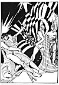

  
[Intangible Textual Heritage](../../../index)  [Classics](../../index.md) 
[Lucian](../index)  [Index](index)  [Previous](motc10)  [Next](motc12.md) 

------------------------------------------------------------------------

Mimes of the Courtesans, by Lucian \[1928\], at Intangible Textual
Heritage

------------------------------------------------------------------------

p. 88 p. 89

<table data-align="RIGHT">
<colgroup>
<col style="width: 100%" />
</colgroup>
<tbody>
<tr class="odd">
<td data-valign="CENTER"><a href="img/00900.jpg"> 
Click to enlarge</a></td>
</tr>
</tbody>
</table>

<table data-align="LEFT">
<colgroup>
<col style="width: 100%" />
</colgroup>
<tbody>
<tr class="odd">
<td data-valign="CENTER"><a href="img/00901.jpg"> 
Click to enlarge</a></td>
</tr>
</tbody>
</table>

# THE LITTLE FLUTE PLAYER

 

p. 90 p. 91

 

|                           |
|---------------------------|
| COCHLIS, a courtesan      |
| PARTHENIS, a flute player |

 

p. 92 p. 93

 

### THE LITTLE FLUTE PLAYER

COCHLIS

Why the tears, Parthenis? Where do you hail from with your flutes all
broken?

PARTHENIS

The soldier, the Aitolian, the big fellow, he beat me because he found
me playing in the house of that Crocale woman. I was paid by Gorgos.
Gorgos is his rival. And he broke my flutes and beat me and did all
kinds of nasty things. And he turned over the table and threw himself on
the *krater* and emptied it. And then he seized Gorgos, the farmer, by
his hair and dragged him out of the banquet hall. And the soldier--I
think Deinomachos is his name--and some of his comrades surrounded the
farmer and beat him so hard. I don't know, Cochlis, if he'll ever
recover. Blood flowed from his nostrils and his face was swollen and
blue.

p. 94

COCHLIS

Was the man insane or drunk? It sounds like the work of a drunkard.

PARTHENIS

I think it was jealousy, Cochlis, jealousy and too much love. Crocale
asked the soldier for twelve hundred drachmas if he wanted to have her
exclusively for himself. Deinomachos refused to give the sum, and she
shut the door in his face and received instead Gorgos of Oinoe, a rich
farmer who had been in love with her for some time. They drank together
and I came to play the flute.

The banquet was going along fine. I had just finished a Lydian melody
and the farmer had got up and danced, while the Crocale beat time with
her palms, and everything was joyful, when all of a sudden there was a
noise and a shout and the front door burst off its hinges and eight
young men rushed into the hall, the Megarian among them. Without
stopping to explain, they overturned the table; and Gorgos, as I have
said, was knocked down, kicked and beaten on his head. The Crocale woman
succeeded in saving herself by running away to the house of her
neighbor, the courtesan Thespias.

As for me, Deinomachos slapped me good and hard and called me "Ball of
Smut" and threw my flutes in my face. Then two of his soldier friends
tore my

[  
Click to enlarge](img/09400.jpg.md)

p. 95

robe and tunic off my body and played with me. They slapped and beat me
about my thighs till my nether part was burning red. Then they lifted
their own tunics and made me sink down in their laps so that I felt very
much ashamed. Then they obliged me to take . . . . . . between my lips,
saying: "Try a new melody, genial little flute player!"

Now I am bound for my master's house. I am going to tell him everything
that happened. The farmer went to find friends in the city to help him
bring the Megarian to justice.

COCHLIS

That is what you get out of those resplendent military love
affairs--blows and lawsuits. To hear them talk they are all chiliarchs
or hegemons. But when it comes to paying for services rendered--"Wait,"
they say, "Wait till I get paid. As soon as I receive my salary, you
will surely be made happy."

Let those boasters carry themselves off to their wars! May they all be
killed off! I believe I do best by not receiving any of that herd. All
others are welcome: fishermen, sailors, farmers, they are all welcome.
They don't know how to flatter, but they pay. Anyhow, those flaunters of
plumes and tellers of martial tales are never serious lovers. What do
they know about love!

------------------------------------------------------------------------

[Next: There is a Time for Lying](motc12.md)
