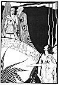

  
[Intangible Textual Heritage](../../../index)  [Classics](../../index.md) 
[Lucian](../index)  [Index](index)  [Previous](motc16.md) 

------------------------------------------------------------------------

Mimes of the Courtesans, by Lucian \[1928\], at Intangible Textual
Heritage

------------------------------------------------------------------------

p. 142 p. 143

<table data-align="RIGHT">
<colgroup>
<col style="width: 100%" />
</colgroup>
<tbody>
<tr class="odd">
<td data-valign="CENTER"><a href="img/00900.jpg"> 
Click to enlarge</a></td>
</tr>
</tbody>
</table>

<table data-align="LEFT">
<colgroup>
<col style="width: 100%" />
</colgroup>
<tbody>
<tr class="odd">
<td data-valign="CENTER"><a href="img/00901.jpg"> 
Click to enlarge</a></td>
</tr>
</tbody>
</table>

# THE PHILOSOPHER

 

p. 144 p. 145

 

|                              |
|------------------------------|
| CHELODONION, a courtesan     |
| DROSIS, her courtesan friend |
| NEBRIS, a slave              |

 

p. 146 p. 147

 

### THE PHILOSOPHER

CHELIDONION

So little Clinias has stopped visiting your house? I haven't seen him
for some time.

DROSIS

It is true, Chelidonion. His master has shut him up in their rooms. He
stops the boy from coming to see me.

CHELIDONION

Whom are you talking about? You don't mean Diotimos who is teaching at
the gymnasium? Diotimos is a good friend of mine.

DROSIS

No; I refer to the most debauched of philosophers, Aristainetos.

CHELIDONION

You mean the long-faced, funereal man with the shaggy whiskers? He takes
the little fellows for walks thru the Poikile.

p. 148

DROSIS

Yes, that is the faker. I wish he'd die in a hurry! May the executioner
drag him to his peace by his whiskers!

CHELIDONION

But how could a character like this false philosopher have seduced
Clinias?

DROSIS

I don't know, Chelidonion. The boy hasn't set his foot in my street for
the last three days; I am rather worried. It was I, you know, who taught
him what woman is; and he hasn't slept with another woman since his
first lesson. Having bad presentiments in regard to my Clinias, I sent
Nebris, my slave, to see if he was at the Agora or in the Poikile.
Nebris tells me she saw him walking with Aristainetos. She nodded to the
boy from a distance, and Clinias blushed and was discomfited but did not
look at her again. Then they reëntered the city. Nebris followed as far
as the Dipylon, but, since they did not come out again, she returned
without learning anything more.

You can imagine how worried I have been since then. I don't know what
will become of the boy. I have always treated him fairly. At first I was
afraid some other woman had got him and his love for me had

[  
Click to enlarge](img/14800.jpg.md)

p. 149

turned to hate. It also seemed possible that his father forbade him to
see his Drosis. This evening, however, Dromon, the boy's slave, came to
me with this letter. Take it and read, Chelidonion. You can read, can't
you?

CHELIDONION

Let us see now. The penmanship is not especially good. You can see this
letter was written in a hurry. He writes:

|                                                                                                                                                                                                                                                                                                                                                                                                                                                                                                                                                                  |
|------------------------------------------------------------------------------------------------------------------------------------------------------------------------------------------------------------------------------------------------------------------------------------------------------------------------------------------------------------------------------------------------------------------------------------------------------------------------------------------------------------------------------------------------------------------|
| Oh, how much I love you, my Drosis! The gods, every one of them, will vouch for the degree of my affection. Know, therefore, that it is not by reason of dislike but by necessity that I have come to be separated from you. My father has intrusted me to Aristainetos to study philosophy, and my master has found out everything about the two of us and has scolded me severely, saying it was not meet for the son of Architeles and Erasicleia to carry on with a courtesan. He says that he will convince me that virtue is preferable to voluptuousness. |

DROSIS

May the imbecile suffer an apoplectic fit! Think of teaching such
philosophy to a young man!

p. 150

CHELIDONION

<table data-border="0" width="75%">
<colgroup>
<col style="width: 100%" />
</colgroup>
<tbody>
<tr class="odd">
<td data-valign="top" width="655">
So that I am forced to obey my master. He follows me wherever I go and guards me carefully and lets no woman approach me. He promises me that if I learn his kind of wisdom and do what he requires of me, I shall, after some efforts, become a virtuous and happy man. I write this letter hurriedly. I hope no one is looking.

Be happy and think sometimes of your,

Lost forever,            

CLINIAS.
</td>
</tr>
</tbody>
</table>

DROSIS

What do you think of the letter, Chelidonion?

CHELIDONION

The words of an uncultivated Scythian, Drosis. However, the last two
lines suggest some possibilities. All in all, in my opinion, your
Clinias will never become a great poet.

DROSIS

That's what I think, too. But I am dying for the little fellow's love.
He is like a kitten. Dromon tells me that Aristainetos is reputed to
have a weakness for young boys. That is, under the pretext of teaching
them rhetoric and philosophy, the whiskered codger

p. 151

lives with the most handsome of his pupils. According to Dromon,
Aristainetos has already had an interesting conversation with Clinias on
the subject and promises to make the boy like to the gods. He reads to
him of the love affairs that the old philosophers had with their
disciples, and tells him that the gods don't interest themselves in
women, but prefer the company of good philosophers like himself.
However, Dromon threatens to complain to the boy's father.

CHELIDONION

Dromon is good. We ought to reward him, Drosis. DROSIS

I have already done it, though there is little need of a gift to win him
to my side. My Nebris, you know, rather tickles the slave's fancy.

CHELIDONION

In that case, do not worry, Drosis. Everything will turn out fine. In my
opinion you ought to leave an inscription on the part of the Keramic
wall where Architeles takes his daily walk. He will understand the
danger his son is in and will save him from his doom.

DROSIS

But shall we be able to write without being seen?

p. 152

CHELIDONION

It will be done at night, Drosis, with a piece of charcoal that we shall
pick up on the way.

DROSIS

Fine! Stand with me, Chelidonion, in my fight against the pedant. We
courtesans must not allow those whiskered philosophers to mislead the
young generation.

 

 
